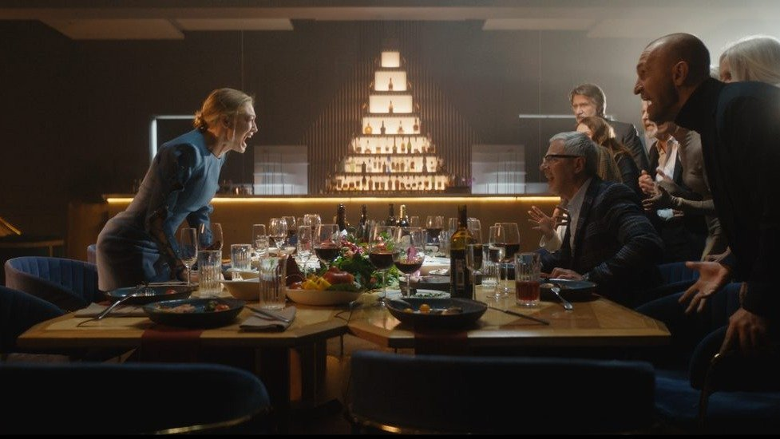

# Если доктор Хаус был бы женщиной-алкоголичкой. Сериал-призер фестиваля Original+ «Неверные» с Оксаной Акиньшиной выходит на Wink с 7 марта

- **URL:** https://novayagazeta.ru/articles/2024/03/04/esli-doktor-khaus-byl-by-zhenshchinoi-alkogolichkoi
- **Дата:** 2024-03-04
- **Автор:** Лариса Малюкова

## Если доктор Хаус был бы женщиной-алкоголичкой

## Сериал-призер фестиваля Original+ «Неверные» с Оксаной Акиньшиной выходит на Wink с 7 марта

Кадр из сериала «Неверные»

«Всем привет, я Ольга Шилковская, я — адвокат, и… я — алкоголичка», — заявляет героиня (Оксана Акиньшина) не столько соучастникам клуба анонимных алкоголиков, сколько нам.

Довольно редкий для российского игрового и сериального кино случай: история женщины с алкогольной зависимостью.

Ольга — некогда успешный и толковый адвокат, только сильно пьющая. После автокатастрофы ее лишают родительских прав. Бывший муж (Иван Добронравов) со своей новой возлюбленной на законных основаниях отбирают у нее ребенка. Теперь она не выползает из депрессии. Пьет только из бутылки или позолоченной фляжки. Судьба предоставляет ей шанс вернуться в профессию. Шанс — это аналогичный случай: известный футболист выкрал дочь у набедокурившей мамаши, которую он обвиняет в пристрастии к наркотикам. Шанс — это возможность вернуть репутацию, завести приличное жилье. Тогда Ольга заявит и свой иск о возврате родительских прав. И вернет нуждающегося в ней сына. Но это значит — окончательно завязать. А как завяжешь, когда все не ладится. К тому же новая мачеха сына ставит неприемлемые условия. И успокоение приносит лишь алкоголь. Такой вот замкнутый круг.

Она талантлива и амбициозна. А еще она нередко становится героиней скандальных видео. Противоречивая, в общем, личность.

Авторы постарались, чтобы героиня сериала не вызывала особой симпатии или сочувствия. Особенно когда она пьяная вдрабадан звонит своему ребенку. К тому же здесь, как и в новом сериале «Первый класс», взрослые воюют друг с другом, используя детей в качестве оружия. И адвокаты им в этом помогают. Говоря казенным языком, «наносят ребенку психологический вред». Дети чувствуют вину за проблемы взрослых — за все их проблемы. Даже когда родители безнаказанно их бьют.

Декорации, по задумке авторов, отражают состояние героини, например, сломанные линии лестниц, зеркальные полы — добавляют ощущение неустойчивости в раскачанной жизни Ольги. Режиссура при этом не слишком изобретательна. Много так называемых «костылей».

Если героиня в отчаянии садится на лавочку, там уже расстелена газетка со скандальным делом о похищении дочери футболистом, которое вытащит ее из депрессии. Если она решает взметнуться на подоконник… у подоконника вплотную стоит табуретка — чтобы ей было удобней.

И не врачам, а ей одной приходит в голову, что внезапная смерть от аневризмы жертвы ее клиента — была кем-то организована.

Читайте также

Лекарство от страха и интим — предлагать

Какие сериалы и проекты покажут российские онлайн-платформы: обзор программы фестиваля Original+

В начале первой серии Ольге протягивает соломинку ее бывший однокурсник (Роман Евдокимов), зовет на работу в свою фирму, и она берется за сложнейший бракоразводный процесс. Тут-то и выясняется, что Ольга — волкодав в своем деле. Умеет найти выход из безвыходной ситуации. Может отыскать иголку в стоге сена, предложить нетривиальные решения сложнейших юридических и психологических проблем своих не идеальных, прямо скажем, клиентов. Ловко корректирует показания жертв и свидетелей. По ходу дела ей приходится решать сложные этические вопросы. И даже в какой-то момент забыть о своей главной цели. Потому что она азартна. К тому же алкоголь — лучший друг девушки.

В «Неверных» авторы скручивают в один сюжет разные жанры: юридическую драму с криминальным привкусом и семейную. Ольга сама в детстве подвергалась домашнему насилию, и когда видит подобную ситуацию в очередном процессе, настолько воспринимает ее как личную, что даже готова отказаться от победы.

Поддержите нашу работу!

1000 500 300 Нажимая кнопку «Стать соучастником», я принимаю условия и подтверждаю свое гражданство РФ

Если у вас есть вопросы, пишите [email protected] или звоните:+7 (929) 612-03-68

Кадр из сериала «Неверные»

Главный магнит сериала — Оксана Акиньшина. Актриса со взрывным темпераментом и бунтарским характером играет российскую версию неудобного, с комплексами и зависимостями доктора Хауса от юриспруденции. Женщина — за гранью нервного срыва. Алкоголичка на пике употребления, потерявшая берега, орущая ребенку в трубку, как она его любит… Тем не менее актрисе удается создать сложный характер. Ее героиня умеет манипулировать людьми, например, ведущим телешоу, на которое уговорила пойти свою клиентку, чтобы доказать ее невиновность… Она разоблачает затейников идеального убийства, имитирующего несчастный случай. При этом может послать клиентку, не оправдавшую ее доверия. Да и сама с собой — не умеет справиться. Она вообще жжет мосты со скоростью… повышающегося градуса. При этом хитроумна и изощрена в профессиональных вопросах. Плюс не считается с методами. Вроде бы готова раскатать, смешать с грязью кого угодно ради клиента. Но расчет не ее сильная сторона, поэтому в состоянии аффекта она раздолбала машину бывшего мужа, чтобы окончательно потерять связь с ребенком, по которому скучает.

Прежде всего благодаря непредсказуемому существованию актрисы, при всех огрехах, за развитием истории пьяной адвокатши следить интересно.

Кадр из сериала «Неверные»

Еще в первых сериях мы начнем догадываться о причинах Ольгиной уязвимости, одиночества, зависимости. Это родительская нелюбовь. И только когда мы увидим выходящую из заключения ее мать, сухо и беспощадно сыгранную Евдокией Германовой, начнем проникаться сочувствием к героине, жертве домашнего насилия.

В отличие от популярной «Почки», здесь меньше язвительного юмора. Все как-то слишком всерьез. Включая горе горькое героини.

Понятно, что каждая серия расскажет о новом деле талантливой адвокатши, которая, как в песне, будет то завязывать, то развязывать узелки своего «основного заболевания».

По словам создателей — шоураннера Анастасии Корецкой и креативного продюсера Анны Колчиной, в основе сценария реальная история, которая закончилась отнюдь не хеппи-эндом. Ну, у сериалов свои законы. И свои финалы.

Лариса Малюкова ведет телеграм-канал о кино и не только. Подписывайтесь тут.

### Этот материал входит в подписки

Смотровая площадкаКино с Ларисой Малюковой

Культурные гидыЧто читать, что смотреть в кино и на сцене, что слушать

### Добавляйте в Конструктор свои источники: сайты, телеграм- и youtube-каналы

Войдите в профиль, чтобы не терять свои подписки на разных устройствах

Поддержите нашу работу!

1000 500 300 Нажимая кнопку «Стать соучастником», я принимаю условия и подтверждаю свое гражданство РФ

Если у вас есть вопросы, пишите [email protected] или звоните:+7 (929) 612-03-68
