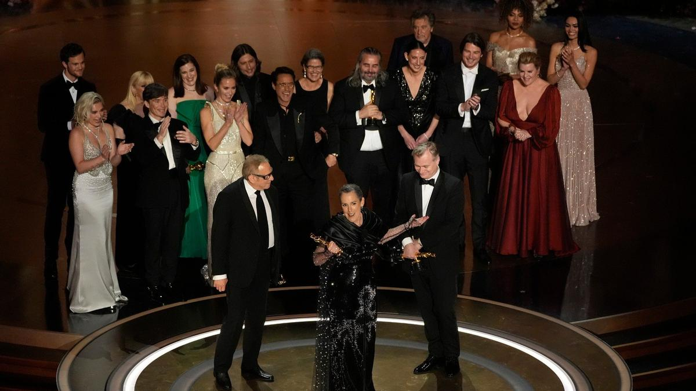

# А Скорсезе забыли…. «Оскар»-2024: новые правила, скандалы и один из самых сильных списков претендентов в истории главной кинопремии

- **URL:** https://novayagazeta.ru/articles/2024/03/11/a-skorseze-zabyli
- **Дата:** 2024-03-11
- **Автор:** Лариса Малюкова

## А Скорсезе забыли…

## «Оскар»-2024: новые правила, скандалы и один из самых сильных списков претендентов в истории главной кинопремии

Съемочная группа фильма «Оппенгеймер», получившего 7 «Оскаров». Фото: AP / TASS

Нынешнюю церемонию считали одной из самых предсказуемых. И наградные статуэтки в основном и летели как по нотам.

Хотя с тех пор, как Академия расширила количество номинантов в категории «Лучший фильм» до десяти, не припомню столь яркого и разнообразного списка работ. Здесь — величественный эпик неувядаемого Мартина Скорсезе; глянцевая кассовая бомба «Барби»; обладательница «Золотой пальмовой ветви» «Анатомия падения» с ее гендерными битвами; Золото Венеции — яростный праздник непослушания — «Бедные-несчастные»; приз Торонто, хлесткое сатирическое драмеди «Американское чтиво»; поэма об упущенных возможностях «Прошлые жизни»; история райской обители за стеной Аушвица «Зона интереса» (Гран-при Канн); обаятельнейшая трагикомедия о будничной возможности рождественского чуда «Оставленные»; байопик «Маэстро» хамелеона Брэдли Купера в образе гения композитора и дирижера Леонарда Бернстайна; и наконец, главный претендент — картина Кристофера Нолана «Оппенгеймер» как зеркало современного мира.

В иной год едва ли не каждый из этих фильмов легко обошел бы менее убедительных конкурентов. Создатели второй «Дюны» мысленно благодарят забастовку сценаристов и актеров, отодвинувшую их премьеру. В этом году «Дюне» о награде в главных номинациях и мечтать не стоило бы.

## Кого и почему наградили

Судя по первым номинациям, сразу стало ясно, что академики решили поддерживать классику, нежели чем удивлять. Поэтому отдали дань мастерству Миядзаки, выбрав полнометражный анимационный фильм «Мальчик и птица», а не зрелищного «Человека-Паука — Паутину Вселенных», как предсказывали букмекеры. Предыдущую статуэтку Миядзаки получил 20 лет назад. Можно счесть эту награду своего рода признанием гения мастера — призом за вклад.

Фрагмент из документального фильма «Навальный» перед блоком In Memoriam. Скриншот

А среди короткометражной анимации также ожидаемо отметили фильм «Война закончена! Вдохновлено музыкой Джона и Йоко».

Режиссер и сценарий — Дэйв Маллинз. Соавтор — Шон Оно Леннон.

По мотивам рождественской песни Джона Леннона и Йоко Оно с ее жарким антимилитаристским духом — о двух солдатах из противостоящих армий, играющих друг с другом в шахматы. О том, что в войне не бывает победителей.

«Оскар» — одна из самых политизированных кинопремий, поэтому перед традиционным блоком In Memoriam — в дань памяти ушедшим кинематографистам — показали фрагмент из документального фильма «Навальный» 2023 года. А лучшим документальным фильмом названа картина Мстислава Чернова «Двадцать дней в Мариуполе».

«Я бы хотел, чтобы мне никогда не пришлось снять эту ленту», — сказал режиссер. Это первый в истории «Оскар» украинских кинематографистов.

Украинский режиссер Мстислав Чернов (в центре), получивший награду в номинации «Лучший документальный фильм» за фильм «20 дней в Мариуполе». Фото: AP / TASS

Если бы не «Оппенгеймер» и если бы в главной номинации не было бы так тесно, как в нынешнем киносезоне, то у «Зоны интересов» Джонатана Глейзера был бы реальный шанс взять главный «Оскар». А так — лишь «Лучший международный фильм». Формально «Зона интереса» — экранизация романа классика Мартина Эмиса, опубликованного в 2014-м. Но визионер Глейзер не следует сюжету, а исследует невыносимую пластичность этических рамок, создает невиданной силы художественное пространство, в котором уживаются внешняя красота и леденящий сердце ужас. Аплодисменты Глейзеру и его долгая благодарственная речь по бумажке в трясущихся от волнения руках. Еще одна честная статуэтка «Зоне интересов» — «Лучший звук». На редкость справедливое решение. Партитура звука в фильме выстроена на границе тихого «милого рая» с пением птиц в саду коменданта концлагеря и «голосами смерти»: остервенелый лай собак, крики детей и взрослых за забором, автоматные очереди. Выдающаяся работа Тарна Уиллерса и Джонни Берна.

Призы за сценарии раздавали, словно награды взвешивали на гомеопатических весах, высматривая, кого бы еще отметить, кроме «Оппенгеймера». Выбрали две актуальные достойнейшие работы.

Особенно я рада за «Американское чтиво». «Лучший адаптированный сценарий» — Корду Джефферсону. Фильм о том, как Америка упивается «черной темой». Отчасти сюжет перекликается и с недавним сериалом «Другая черная девушка» по книге Закии Далилы Харрис: там — про токсичную корпоративную издательскую культуру, здесь — про токсичную «черную повестку», которую поднимает белый истеблишмент.

А самому модному фильму года — «Анатомии падения» — выдали премию за «Лучший оригинальный сценарий». Под видом судебной драмы Жюстин Трие снимает свои «сцены из супружеской жизни». Вопрос, убила ли успешная писательница Сандра Войтер своего мужа или тот сам случайно выпал из окна, уходит на второй план. Новых границ жанра «Анатомия падения» не открывает, зато предлагает весьма свежий и нестандартный взгляд на кризис института брака. Талант Сандры Хюллер, сыгравшей и здесь, и в «Зоне интересов», как блистательный отметили лишь одной номинацией.

Эмма Стоун получает награду за роль в фильме «Бедные-несчастные». Фото: AP / TASS

Единственная острая и непредсказуемая битва разгорелась в номинации «Лучшая женская роль». Эмма Стоун против Лили Гладстоун, сыгравшей главную роль в монументальных «Убийцах цветочной луны» Мартина Скорсезе. Гладстоун стала первой американкой индейского происхождения, получившей «Золотой глобус». В своей драматической роли обманутой жертвы нисколько не уступает своим потрясающим партнерам Ди Каприо и Де Ниро. И все же академики выбрали роль «за пределами возможного»: отважную и блестящая работу Эммы Стоун в «Бедных-несчастных». Это второй «Оскар» актрисы (первый был за «Ла-Ла Ленд»). Но ее ожившая «кукла Тутти» изумила даже видавших виды академиков, которые забыли о политкорректности, проигнорировав Гладстоун. На сцене Эмма расплакалась. Фильм также отмечен премией за «Лучший продакшн-дизайн и костюмы». Странно, что про «Барби» с ее эффектной картинкой словно совсем забыли.

«Оппенгеймер» предсказуемо стал триумфатором премии, получив 7 «Оскаров», в том числе в главных номинациях.

Поддержите нашу работу!

1000 500 300 Нажимая кнопку «Стать соучастником», я принимаю условия и подтверждаю свое гражданство РФ

Если у вас есть вопросы, пишите [email protected] или звоните:+7 (929) 612-03-68

Читайте также

Несчастные убийцы, их бедные жертвы и образцовые соседи

10 лучших зарубежных фильмов 2023 года по версии Ларисы Малюковой

Роберт Дауни-младший принес первую статуэтку главному фильму года за «Лучшую мужскую роль второго плана». Приз — за «Лучший монтаж». Оператором года назван Хойте Ван Хойтем, он раньше номинировался за нолановский «Дюнкерк». И он действительно — оператор года. А кадр со взрывом Тринити — кадр года. В эту же коллекцию — награда за «Лучший саундтрек». Людвиг Эмиль Тумас Йоранссон — прекрасный шведский композитор и ритм-энд-блюз продюсер, обладатель трех главных премий «Грэмми» 2019 года. Мы его помним и по «Доводу». В «Оппенгеймере» музыка — с ее симфоническим развитием, жуткой и прекрасной кульминацией — существует на равных с изображением, спорит с ним, при этом полностью подчинена воле режиссера.

А сам Кристофер Нолан наконец получил свою статуэтку как лучший режиссер. В одном из недавних интервью он заметил, что ему было просто необходимо рассказать эту историю. В этом он убедился, когда поделился идеей «Оппенгеймера» со своим 16-летним сыном. Тот ответил, что фильм не будет интересен его сверстникам, поскольку их уже не так беспокоит риск ядерной войны.

Киллиан Мерфи, получивший награду в номинации «Лучшая мужская роль» за фильм «Оппенгеймер». Фото: AP / TASS

Только ленивый не обещал победы «Оппенгеймеру» — самому важному фильму года. Кино — о гении, застрявшем в мире абсолютов, вдохновившем своими догадками идеи разрушения, возлюбленном патриоте нации, оказавшемся одним из первых «мучеников маккартизма». Кино — об открытиях, которые нас разрушают, об этическом выборе, заведомо проигрышном. Да, взрывной эпик посвящен отцу атомной бомбы. Но дело не только в актуальности картины, вышедшей на экраны в горящее войнами время. Кристофер Нолан строит фильм по законам квантового движения: вместо последовательно текущей истории — фрагменты. Герои как частицы могут перемещаться во временных и пространственных измерениях. Из малейших кирпичиков — диалогов, реакций, поступков, прозрений и ошибок — складываются и судьбы, и сюжет, и мироздание.

Читайте также

Последний прогон

«Золотой глобус» — 2024: триумф «Оппенгеймера» и все награды ожидаемы, словно призовой лист сыгран по заранее написанным нотам

## Про правила

Начиная с нынешнего года в оскаровский регламент введены в действие установленные еще в 2020-м требования для фильмов, претендующих на статуэтку в номинации «Лучший фильм». В списке правил 4 пункта, и чтобы попасть в номинацию «Лучший фильм», картина должна соответствовать хотя бы двум из них. Один из ведущих актеров (или значительный актер второго плана) должен принадлежать к недостаточно представленной расовой или этической группе. Не менее 30% второстепенных ролей следует отдать представителям ЛГБТ*, расовых или этнических групп, женщинам или людям с инвалидностью и тп.

Судя по результатам, академики хоть и учитывали эти правила, но руководствовались прежде всего своим профессиональным вкусом и опытом. Поэтому «Оскар» за «Лучшую женскую роль второго плана» — Давайн Джой Рэндольф, сыгравшая в «Оставленных» (18+), — была ожидаема не из-за цвета кожи актрисы: это в самом деле яркая, очень тонкая, душевная работа. И ее одинокая кухарка запоминается так же, как образ главного героя, сыгранного Полом Джаматти.

«Я начала свою карьеру как певица, но мама сказала, что я должна перейти на театральный факультет», — сказала актриса. Хорошо, когда мама столь прозорлива.

Актриса Давайн Джой Рэндольф, получившая «Оскар» в номинации «Лучшая женская роль второго плана» за фильм «Оставленные». Фото: AP / TASS

## Скандалы

Именно создателей фильма «Оставленные» с пятью номинациями на «Оскар» в самый канун премии обвинили в плагиате. Британский сценарист Саймон Стефенсон («Лука», «Приключения Паддингтона 2», «Кошачьи миры Луиса Уэйна») утверждает, что сюжет фильма «Оставленные», который номинирован в этом году в пяти категориях «Оскара», был «нагло» скопирован с его сценария к фильму «Фриско», написанного 11 лет назад. Ну, подобные истории и в Америке, и в России не редкость. Любопытно, что обиженные авторы вспоминают о нанесенном ущербе именно на волне «Оскара», что добавляет известности самой истории обиды. Да и «Оскар» не прочь разогреть интерес публики очередным скандалом.

За кого действительно обидно, так это за Мартина Скорсезе. Как жаль, что на обочине премии остались «Убийцы цветочной луны» — картины с 10 номинациями.

В том числе самой ожидаемой — за режиссуру. Но эпик Скорсезе уже вписан в историю мирового кино и без «Оскара». Американская трагедия как монументальный эпик, исторический портрет страны, индейской общины и людей, чья кровь отравлена жадностью. Величественное кино, которое мог снять только Мартин Скорсезе. Да и Ди Каприо сыграл просто выдающуюся роль, самый сложный в своей карьере характер. Просто не повезло фильму выйти в одном сезоне с «Оппенгеймером».

Лариса Малюкова ведет телеграм-канал о кино и не только. Подписывайтесь тут.

### Этот материал входит в подписки

Смотровая площадкаКино с Ларисой Малюковой

Культурные гидыЧто читать, что смотреть в кино и на сцене, что слушать

### Добавляйте в Конструктор свои источники: сайты, телеграм- и youtube-каналы

Войдите в профиль, чтобы не терять свои подписки на разных устройствах

Поддержите нашу работу!

1000 500 300 Нажимая кнопку «Стать соучастником», я принимаю условия и подтверждаю свое гражданство РФ

Если у вас есть вопросы, пишите [email protected] или звоните:+7 (929) 612-03-68
