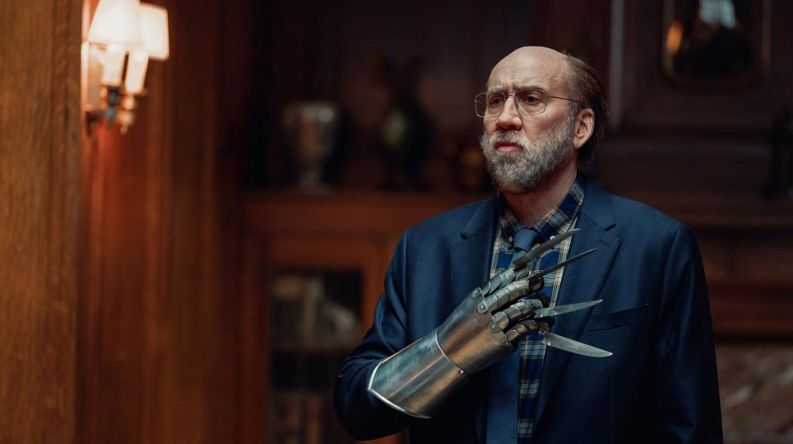

# О снах и кошмарах воочию. Ты снишься мне… тревожными ночами

- **URL:** https://novayagazeta.ru/articles/2024/03/20/o-snakh-i-koshmarakh-voochiiu
- **Дата:** 2024-03-20
- **Автор:** Лариса Малюкова

## О снах и кошмарах воочию

## Ты снишься мне… тревожными ночами

Кадр из фильма «Герой наших снов». Источник: Кино-Театр.Ру

Слова давней пугачевской песни вспомнятся во время просмотра фильма «Герой наших снов» Кристоффера Боргли не раз.

Потому что герой Николаса Кейджа — профессор, на лекциях которого студенты от скуки либо болтают, либо дремлют, — не по своей воле приходит во снах к близким и совершенно чужим людям.

Маленький, малоинтересный человек, посредственный во всем, мечтающий написать книгу об интеллекте муравьев, но так и написавший ни строчки, — становится суперпопулярным, как кинозвезда. С ним делают интервью, его приглашают на телешоу, его преследуют папарацци. И его студенты наконец-то устраивают ему овацию. Начинается повальная сонная эпидемия. В этих снах сотен и тысяч незнакомых людей в разных концах света он вроде бы ничего не делает, словно гость на вечеринке, — стоит себе в сторонке. Даже когда происходят жуткие катастрофы, насилие, нападают на его близких… лишь смотрит на дистанции.

Но постепенно сны превращаются в кошмары, а профессор — в брутального насильника и садиста. Ну да… только во снах. Но как это объяснить жертвам жутких кровавых ночных кошмаров?

Забавная поначалу история оборачивается антиутопией.

Кино о том, как обожание толпы вмиг сменяется страхом и ненавистью, а всеобщий любимец оказывается изгоем.

Но не только: еще о немых свидетелях «минут роковых», наблюдателей из безопасного «далека». И те, которые «никогда не вмешиваются», постепенно превращаются в душегубов.

Фильм Боргли, может, и не делает открытий в сомнологии, да и особых кинематографических прорывов в нем нет, но любопытно развивает тему «генерации снов», размышлений о том, что во снах мы нередко компенсируем наши недостатки, справляемся с комплексами (как в «Стертой реальности»). Помните, как во сны других проникал герой «Видения» Алекс, и из-за этого дара ему даже поручили особую миссию — проникнуть в сон президента. Сновидения и реальность трагически смешиваются в «Ванильном небе» Кроу.

Порой сон спокойнее и предсказуемее жутковатой безнадежной реальности; там мы справляемся. Там мы не только свидетели. А порой реальность настолько мимикрирует под бредовый кошмар, что хочется скорее проснуться.

Кадр из фильма «Герой наших снов». Источник: Кино-Театр.Ру

## Зачем нам спать?

Если у вас обнаружится свободный вечер — проведите его вместе с удивительным ученым, выдающимся экспериментатором профессором Иваном Николаевичем Пигаревым.

О нем Юлия Киселева сняла вдохновенное увлекательное документальное эссе «Как Иван Пигарев сон изучал». Это то редкое просветительское кино, в котором сплетены и удивительные исследования, и поэзия, и особенная судьба потомка Тютчева. Очень скромного большого ученого.

Фильм — продолжение цикла «Мозг. Вторая вселенная» и «Мозг. Эволюция». Продолжение огромной просветительской работы, которую ведет Юлия Киселева.

На протяжении десятилетий профессор Пигарев изучал физиологию сна, разрабатывая висцеральную теорию сна, объясняющую, почему мозг не отдыхает, как именно он переключается на анализ сигналов, приходящих из внутренних органов, а не сенсорных каналов внешних (как принято думать).

Отчего наш сон — главный «выручатель» нервной системы; как он неустанно «латает» наш организм; и почему бессонница может убить.

Вопросов, которыми занимается сомнология, множество. И ученые ищут на них ответы. И все же как здорово, что Юле удалось снять и познакомить нас с самим Иваном Николаевичем, внезапно погибшим 15 июля 2021-го.

Кадр из документального эссе «Как Иван Пигарев сон изучал». Источник: Кино-Театр.Ру

Поддержите нашу работу!

1000 500 300 Нажимая кнопку «Стать соучастником», я принимаю условия и подтверждаю свое гражданство РФ

Если у вас есть вопросы, пишите [email protected] или звоните:+7 (929) 612-03-68

## А если меня нет?

Когда-то на недели французского кино перед кинотеатрами собирались огромные толпы. Подчас люди не знали, на что именно достанется вожделенный билетик. Шли смотреть «жизнь в розовом цвете».

С 20 по 26 марта в кинотеатре «Художественный» — «Дни Франкофонии в России». Девять фильмов из Франции, Бельгии, Швейцарии, Канады и Люксембурга.

В программе и вызывающий споры фильм Сирила Шойблина «Колебания» — медитация о зарождении анархизма в… Швейцарии — символе стабильности, предсказуемости. Один из героев — русский картограф и революционер Петр Кропоткин: фильму предпосланы его слова о том, как он стал анархистом, проведя несколько недель со швейцарскими часовщиками. Также в программе комедия о бегстве от реальности «А если меня нет?» с Жереми Ренье в главной роли, он сыграл человека, которому надоело… примерно все. И он, верный заветам Руссо, бежал… в лес.

А откроет фестиваль картина Алис Винокур «Воспоминания о Париже» — трогательная драма переживания травматического опыта с Виржини Эфира и Бенуа Мажимелем в главных ролях. Об эмпатии как источнике любви. Удивительно храброе погружение в темноту посттравматического синдрома, и при этом — деятельный поиск надежды.

В основе — реальные события. 13 ноября 2015-го на Париж было совершено несколько атак — взрывы рядом со стадионом «Стат де Франс», бойня в концертном зале «Батаклан», расстрел посетителей нескольких ресторанов. 130 человек погибших, больше 350 раненых. Ответственность за теракты взяла на себя группировка «Исламское государство»*.

Миа (Виржини Эфира), переводчица с русского языка, пережидала дождь в одном из атакованных кафе. Ей повезло, она выжила. Но вернуться к привычной жизни — не получается. И обычный людный, заполненный влюбленными Париж кажется ей чужим. Кошмар прилип к ней изнутри. Ей зачем-то необходимо вспомнить подробно события той ночи.

Она возвращается снова и снова в то кафе. Каждый понедельник здесь встречаются жертвы теракта, чтобы «вспомнить все». Однажды в кафе приходит Тома (Бенуа Мажимель), в тот вечер он с сослуживцами праздновал там свой юбилей.

Кадр из фильма «Воспоминания о Париже»

Кино о том, как пережитое ощущение трагедии, беды нас разделяет… или соединяет. В фильме есть важная любовная сцена. Миа стесняется раздеваться. После трагедии у нее огромный шрам на животе. И тогда Тома показывает свои шрамы от осколков.

Они прикасаются к шрамам друг друга, к боли друг друга, пытаясь ее усмирить.

«Воспоминания о Париже» — во многом личный фильм для Алис Винокур, поскольку ее младший брат в день теракта находился в «Батаклане», он выжил, но долго выходил из состояния шока.

Виржини Эфира получила премию «Сезар» в номинации «лучшая женская роль».

Показ в кинотеатре «Художественный» на французском с русскими субтитрами.

Лариса Малюкова ведет телеграм-канал о кино и не только. Подписывайтесь тут.

### * Запрещённая в России террористическая организация.

### Этот материал входит в подписки

Смотровая площадкаКино с Ларисой Малюковой

Культурные гидыЧто читать, что смотреть в кино и на сцене, что слушать

### Добавляйте в Конструктор свои источники: сайты, телеграм- и youtube-каналы

Войдите в профиль, чтобы не терять свои подписки на разных устройствах

Поддержите нашу работу!

1000 500 300 Нажимая кнопку «Стать соучастником», я принимаю условия и подтверждаю свое гражданство РФ

Если у вас есть вопросы, пишите [email protected] или звоните:+7 (929) 612-03-68
