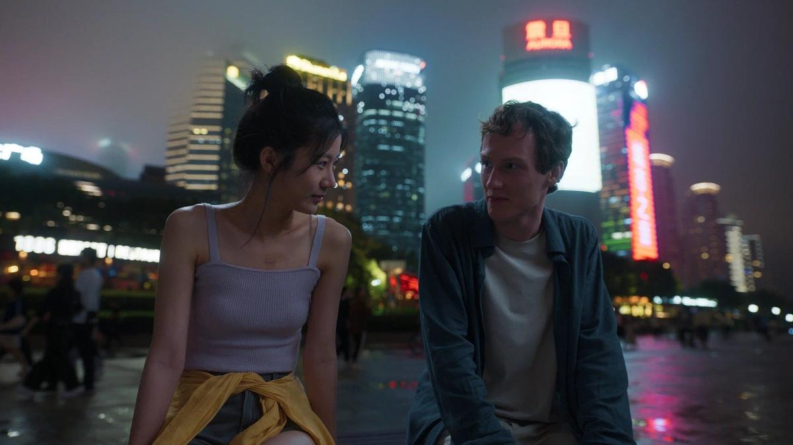

# Ненормальный угол наклона. С 23 по 26 марта в Ханты-Мансийске пройдет XXII Международный фестиваль кинодебютов «Дух огня»

- **URL:** https://novayagazeta.ru/articles/2024/03/25/nenormalnyi-ugol-naklona
- **Дата:** 2024-03-25
- **Автор:** Лариса Малюкова

## Ненормальный угол наклона

## С 23 по 26 марта в Ханты-Мансийске пройдет XXII Международный фестиваль кинодебютов «Дух огня»

Кадр из фильма «Ненормальный»

Честно говоря, вообще удивительно, что отборщикам удается при всех проблемах и препонах, которые сегодня преодолевают международные фестивали в России, собирать программу (давление цензуры, с одной стороны, и отказ от участия многих западных продюсеров и режиссеров). В международном конкурсе — фильмы из показов Берлинале, Сан-Себастьянского и Венецианского фестивалей.

- «По кругу» Майсам Хасанзаде (Иран), «Error 404» Тынчтыка Абылкасымова (Кыргызстан), «Бауырына салу» Асхата Кучинчирекова (Казахстан), «Похищение» Карана Теджпала (Индия), «Собственность» Даниэля Бандейра (Бразилия).
- Россию в международном конкурсе представляет фильм «Угол наклона» Анны Далингер и Станислава Фомичева. Героиня фильма филиппинка Эля работает няней и домработницей в состоятельной московской семье. На ней весь дом… до того, как жизнь ее даст опасный крен и покатится, словно с крутой горы.
- В конкурсе российских дебютов — «12 этажей спустя» Джефа Агаева, «Куба, Марина» Константина Богославского, «Лапин» Аси Олешкевич и Влада Краснослободцева, «Лиссабон» Светланы Филипповой, «Последняя цена» Наура Гармелия.

## Фильм открытия — драмеди «Ненормальный»

Герои летят в Шанхай на конкурс пианистов имени Чайковского. Отец и сын. Правда, фамилии у них разные.

Тут история и опрокидывается на 10 лет назад. Когда познакомились инженер по обшивкам кораблей Юрий (Александр Яценко) и Татьяна (Наталья Кудряшова), которая сразу пригласила незнакомца домой. Чего тянуть… чтобы сразу оценил размер бедствия. Оказывается, что у Татьяны 8-летний сын с тяжелейшим, практически неизлечимым заболеванием. Дорогие лекарства не помогают. Ему нужен постоянный уход. Не только близкие, но и врачи опустили руки. И неожиданно чудик и зануда Юрий загорается неуемным желанием поставить Колю на ноги с помощью своей уникальной, самолично изобретенной гимнастики и программы восстановления мелкой моторики, от которой зависит умственное развитие ребенка. Вскоре у Коли обнаруживается талант пианиста. Надо только придумать специальные перчатки-тренажеры для игры.

Кадр из фильма «Ненормальный»

Только на первый взгляд это обычная история про преодоление, достижимость мечты, веру в невозможное, скрытые резервы. Для авторов на первом плане — конфликт: между нормальным стремлением к свободе «ненормального» сына и авторитаризмом «нормального» отца.

Поддержите нашу работу!

1000 500 300 Нажимая кнопку «Стать соучастником», я принимаю условия и подтверждаю свое гражданство РФ

Если у вас есть вопросы, пишите [email protected] или звоните:+7 (929) 612-03-68

Когда-то Юрий и себя вытащил едва ли не с того света, теперь он столько сил и времени вкладывает в пасынка, что забывает о пределах его личного пространства.

Доброхоты, в том числе в музыкальной школе, называют Колю ненормальным. Но авторы справедливо задаются вопросом: а где она, эта «норма»?

У фильма долгая и мучительная история создания; возможно, поэтому остались серьезные сценарные прорехи и неточности. Например, совершенно непонятно, как инженер по обшивкам кораблей так выучил пасынка игре на фортепиано, что тот может занимать призовые места на международном конкурсе пианистов. Причем в основе сюжета — реальная история, о чем нам сообщают в титрах. Но драматургия в кино не терпит подобного рода пропусков и умолчаний, там путь подчас важнее самого удивительного финала: «И главное в движенье — суть: каким путем идем».

Ну ладно, неопытный режиссер. Но этой несложной задачей могли бы озаботиться прекрасный сценарист Роман Кантор, сочинявший сценарий «Мастера и Маргариты», опытный вдумчивый продюсер Петр Ануров, в фильмографии которого «Серебряные коньки» Михаила Локшина и много популярных сериалов. Тем более что в фильме заняты замечательные актеры Александр Яценко, Наталья Кудряшова, Надежда Маркина, сыгравшая бабушку Коли. Отметим и изобретательную работу оператора Василия Григолюнаса, снявшего «Топи», «Герду» и сериал «Внутри убийцы» Владимира Мирзоева. Видно, с каким удовольствием он снимает ночной Шанхай — город, в котором герой впервые почувствовал себя свободным.

Среди упражнений, которые входят в «авторскую систему» Юрия, входит такое: когда у Коли начинается паника, он не может двинуться с места и задыхается, он должен представить себя птицей с очень тяжелыми крыльями. Эти крылья надо потихоньку, не спеша раскачивать: вверх — вниз. Иначе не «взлететь». Собственно, эти странные движения на борту самолета и вызвали в прологе фильма испуг китайской стюардессы. Но зато после этого упражнения Юрий начинает нормально дышать и двигаться. Хороший рецепт, между прочим…

Лариса Малюкова ведет телеграм-канал о кино и не только. Подписывайтесь тут.

### Этот материал входит в подписку

Смотровая площадкаКино с Ларисой Малюковой

### Добавляйте в Конструктор свои источники: сайты, телеграм- и youtube-каналы

Войдите в профиль, чтобы не терять свои подписки на разных устройствах

Поддержите нашу работу!

1000 500 300 Нажимая кнопку «Стать соучастником», я принимаю условия и подтверждаю свое гражданство РФ

Если у вас есть вопросы, пишите [email protected] или звоните:+7 (929) 612-03-68
