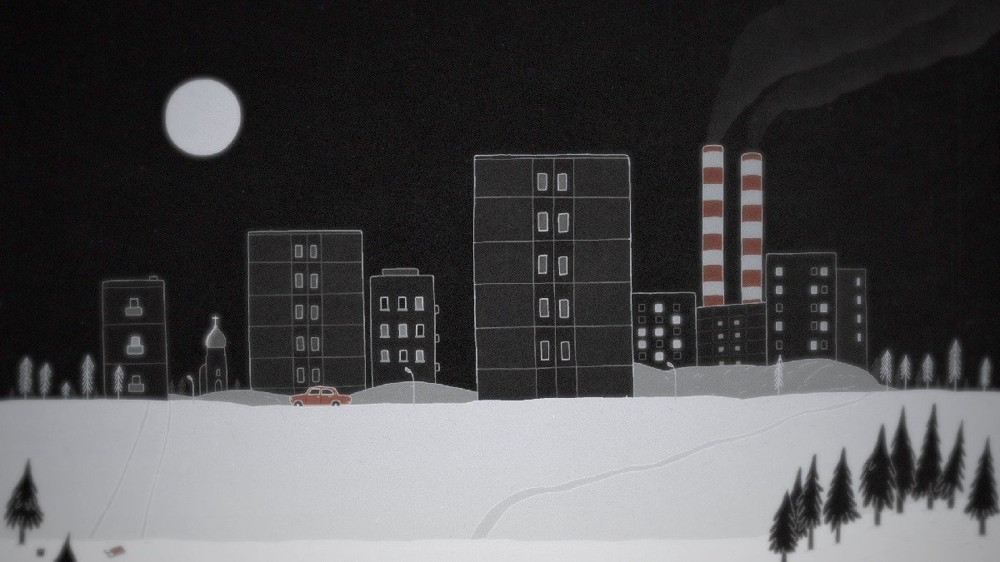

# Цвет надежды — серый? Завершился национальный смотр анимации в Суздале, который по настроению совпал с общим настроением в стране

- **URL:** https://novayagazeta.ru/articles/2024/03/26/tsvet-nadezhdy-seryi
- **Дата:** 2024-03-26
- **Автор:** Лариса Малюкова

## Цвет надежды — серый?

## Завершился национальный смотр анимации в Суздале, который по настроению совпал с общим настроением в стране

Кадр из анимационного фильма «Ведрити»

Судя по программе, в российской анимации год неурожайный. Дело не в том, что не было фильма-прорыва, просто общий фон: серое на сером. За исключением редких всплесков, почти не было запомнившихся фильмов с эстетическим или смысловым месседжем: фильмы сливались в одно мрачное полотно — запечатленное экраном свидетельство умонастроения нынешних молодых. Общая атмосфера — уныние, подавленность, отчаяние. И даже смех — язвительный, горький, оборванный.

Норштейн их корил на мастер-классе: «Как же так, в поисках магического кристалла режиссер не имеет права закрывать глаза, необходимо видеть, что рядом живут люди, кошки, собаки, расцветают деревья. Из каждой детали можно развить сюжет». Легко сказать.

Нужен особый дар, чтобы рассмотреть свет в темноте. Найти пусть и неправильный, но свой ракурс.

«Ее электрический свет» Анастасии Лисовец (гран-при) — наверное, одной из самых талантливых авторов нового поколения. Пришла ученица Леонида Шмелькова в анимацию с тончайшими призовыми исповедальными картинами «Собаки пахнут морем» и «У всех мужчин должны быть туфли».

Новый фильм — про девочку, заявившую родителям, что она святая. Эта «информация» сама «стукнула» камешком ей в окно. Может, проблемы пубертата? Дурной наследственности? Что делать, если исчезает чувство боли, а душа гуляет сама по себе? Причем не такая уж она светлая, эта душа, напротив, в снах и реальности тебя преследует довольно отвратительное твое альтер-эго… В поисках себя хорошей ты готова на самоотверженные поступки: отказаться от сладкого, перестать давить пальцами пузырьки на упаковке. «Так пойдет, — рассуждает в тревоге девочка, — душа моя окончательно покинет тело». Родители грызутся на нервной почве. И ребенок, предоставленный себе, гуляет в одиноких ночных снах в высоких травах. Случается такое раздвоение света и тьмы в душе отдирающего себя от родителей подростка.

Минимализм, зоркий глаз, черный юмор, цепкая, виртуозная графика. Не выдающийся, но действительно хороший фильм.

Кадр из анимационного фильма «Ее электрический свет»

На мой взгляд, лучший фильм конкурса — и он едва ли не единственный, подключенный к электрической розетке сегодняшнего дня, — «Ведрити» Никиты Мещерякова (спецприз). Со словенского языка означает «укрыться от дождя». Дождь — понятие метафорическое. Полосы черного ливня хлещут поколение молодых, под дождем дубинок кричат почти невидимые протестующие. Дождь из черных рыб — в страшных детских воспоминаниях героини, которая в своей одинокой квартире придумывает компьютерную игру. Часть событий и происходит внутри этой игры: в супрематического клоуна стреляет красноармеец, и Клоун тонет в черной воде. А вынырнет в аквариуме придумавшей его девушки. За окнами ее квартиры разгоняют демонстрацию — под низким располосованным небом. То ли разноцветные полосы Малевича, то ли проволока. В финале безысходной, соединившей реальность с компьютерной игрой истории, звучит «Русское поле экспериментов» Егора Летова: «география подлости, орфография ненависти».

Изысканный и при этом эмоционально разогретый фильм, в котором отсылки не только к Малевичу, супрематизму, но и к стрит-арту. «Ведрити» занял первую строчку в профессиональном рейтинге.

Кадр из анимационного фильма «Ведрити»

«Дичь» Сауле Матвиенко (студия «Шар»). Человека, сходящего с поезда в провинции в зимней шапке-ушанке встречают два кореша. Соображать на троих начинают еще на тряской дороге по пути в охотничью сторожку — и случайно сбивают зайца. Праздник продолжится в сторожке. Заяц оказывается живым. И вот уже по жребию один из горе-охотников, который должен прибить ожившую в кладовке добычу, занес над дрожащей тварью молоток… В финале по пустой дороге со страшной скоростью несется заяц в зимней шапке-ушанке под казачью раздольную «Любо, братцы, любо!».

Смесь дурости, абсурда, щедрости, безжалостности и великодушия — как черты национального характера. Лаконичный, стильный дизайн.

Кадр из анимационного фильма «Дичь»

«Мама Америка» Ани Швейгольц — анимадок. Черно-белое воспоминание о пропавшей в детстве пьющей матери… когда ребенок не очень-то понимает: что не так дома. Мама не похожа на принцессу: то поскользнется, то где-то побьется и с разбитой головой вернется. Сначала пропала кукла, подаренная мамой, потом сама мама Лена. Примерно в одно время уже взрослая дочь получит справку в загсе о маминой случайной смерти и найдет мамин «Дневник беременности», где написано: «У Ани все есть!».

Кадр из анимадока «Мама Америка»

«Серый — цвет надежды» — миниатюра Анны Олехнович (секция прикладной анимации). С черно-серой доски бегут фигурки-человечки. Едут в теплушках женщины в платках в ГУЛАГ, несется на север среди снежных полей поезд. За кадром репрессированные стихи репрессированной в 1983 году поэтессы Ирины Ратушинской: «А мы остаемся — / На клетках чудовищных шахмат — / Мы все арестанты. / Наш кофе / Сожженными письмами пахнет».

Кадр из анимационного фильма «Серый — цвет надежды»

«Ремора» Анны Булаховой. В изумрудно-салатовом мире с голубыми просветами живут аборигены. Рыбным промыслом занимаются: сети плетут, рыбу чистят. В желтом зареве танца под бубен шамана пляшут. Их танцы сложены автором как живые узоры. Но потоп разрушает этот пляшущий мир. От гибели «народ» спасает гигантская рыба. Они укроются на ее спине… пока не начнут ее пожирать.

К чему им ядерная катастрофа: сами себя сожрут.

Поддержите нашу работу!

1000 500 300 Нажимая кнопку «Стать соучастником», я принимаю условия и подтверждаю свое гражданство РФ

Если у вас есть вопросы, пишите [email protected] или звоните:+7 (929) 612-03-68

Кадр из анимационного фильма «Ремора»

«Аквариум» Даши Москвиной. Про регламентированную жизнь в городе: движение строго по стрелочкам. Девушка случайно вместе с кормом падает в аквариум, но и жизнь рыб оказывается подчинена своим «законам движения» — не вырваться. Можно, конечно, попытаться взлететь… Если конечно, все эти стрелочки-указатели не у нас в голове. Интересный дизайн. Мастера на разборе работу критиковали, мне она понравилась. Хотя и недостает, как и во многих картинах, более цепких акцентов, особенно в момент превращения героини в рыбу.

«Без головы» Дарьи Михайловой. Короткое и едкое эссе про безголовое общество. По залитому светом пространству под радостное стаккато Шостаковича скачут безголовые существа. Бездумно-весело-легко. Правда, что-то под ногами мешается… Видимо, голова. Один пытается приложить ее к разным местам. В момент соприкосновения с шеей, возникает короткое замыкание: мелькают/несутся образы Герники, Леонардо и прочие культурные страсти… Ну их. Голова мечом отлетает от точного удара ноги. И снова солнечные организмы пляшут на поляне.

«Мой Пушкин» Юрия Томилова (спецприз) — дежурный урок в школе, посвященный «солнцу русской поэзии». Строгая училка — начетница. Микс из вызубренных железобетонных догм и каракулей-фантазий, синей ручкой накаляканных в тетрадке в клеточку учениками. «Пушкин на Кавказе» — и звериные лица джигитов в курчавых шапках с шашлыками; «Гражданская лирика» — и ушастый поэт возмущается на трибуне, а толпа из крошечных лилипутов внимает «чувствам добрым»; «Южная ссылка» — и 33 богатыря встречают «пророка» у моря: в восхищении подбрасывают его в воздух. Пушкин с крылышками и лирой в руках влетает… подальше от казенной мертвечины. Рисунок + перекладка.

«178» всеобщего анимационного любимца Алексея Алексеева. У Леши — редкий вид юмора (у юмора в анимационном кино бывают самые разные формы «протекания»: есть гэговый, диалоговый, ситуационный, даже монтажный юмор). Алексеев — гений тайминга, ритмического юмора: умеет за счет ускорения, торможения движения, повторов, острой пластики, внезапных пауз рассмешить до колик. Не случайно он так любит в звуковую драматургию включать перкуссию, которая акцентирует, организует изображение.

Кадр из анимационного фильма «178»

Из конкурсной программы запомнилось щедрое живописное пиршество «Сверчка» Натальи Рысс по мотивам итальянской сказки, в которой сам Сверчок — то ли человек, то ли насекомое, то ли гротескный сновидческий образ. Или «Дед Мазай и солнечные зайцы» Кристины Щербаковой. Дед консервирует в банках облака, которые вырвутся и застят питерское небо, мешая пробиться солнцу. Поэтому дед на воздушном шаре с пылесосом за ними и охотится.

Вспоминается не вполне удавшаяся попытка Александры Семеновой превратить легендарное шпаликовское «По несчастью или к счастью…» в валяное из шерсти теплое ретро — слишком сахарное: с балалайкой, объятиями с выжившим отцом… Шпаликов, ненавидевший «сироп», сильно бы удивился. Или «Хор» Ангелины Гильдерман. Про то, как искусство возвышает. Едет в «культурный центр» на серых автобусах публика, и как только звучат первые созвучия средневековой мессы «O sacrum convivium», зрители срываются со своих кресел, воспаряют вместе с музыкой в выси.

Можно было бы обойтись и без «шагаловских» полетов. В искусстве открытие одного художника нередко оборачивается штампом для других.

Надо сказать, что внезапно образовалось невиданное число анимационных школ в стране. Возможно, это еще один показатель разрастающейся мульт-индустрии. Но найдется ли в этой большой мясорубке место автору — большой вопрос.

Одно из ключевых событий Суздальфеста — обсуждение студенческих работ режиссерами с мировыми именами и наградами едва ли не всех главных фестивалей — Игорем Ковалевым и Константином Бронзитом. Проще говоря, если есть в современной анимации звезды, то это они.

Коротко передать содержание этой дискуссии с молодыми режиссерами невозможно. Хотелось, чтобы обсуждение фильмов превратилось в мастер-класс, и это получилось. Говорили о существеннейших проблемах профессии — очень конкретно, иногда на пальцах с каждым конкурсантом, — о драматургии (даже если в фильме полоски и точки), финалах, тайминге, монтаже, смысловом или эмоциональном повороте, деталях. Необходимый, важный и адреналиновый разговор о профессии. Нужна ли вообще сегодня профессия, когда столько средств для эпатажа — от уже используемого ИИ до супер-популярных комиксов. Перерисовывай на экране — зал ржет и хлопает. Это счастье узнавания… знакомого? При всей деликатности мэтры были нелицеприятны, но, мне кажется, это был очень конструктивный разговор. После него (а это было уже два часа ночи) конкурсанты долго не расходились, подходили, чтобы… обняться

Обсуждение студенческих работ на Суздальфесте. Фото: соцсети

Собственно, для них, съехавшихся со всей страны сотен и сотен молодых авторов и художников, весь фестиваль был мастер-классом. Впрочем, как научиться не технике, но вниманию к жизни, как обнаружить «другой угол зрения»? Норштейн им говорил: «Не надо слушать поэта. Не стирайте «случайные черты». В них ключ познанья.

У Леонардо в записях о живописи есть: «Вглядывайтесь в следы плесени, вы там найдете то, что вам нужно».

В пространстве иррационального — все непредсказуемо». Трудно с ним спорить. Хотелось бы, чтобы реальность этим молодым досталась менее иррациональная, чтобы непредсказуемость осталась лишь в творчестве.

Лариса Малюкова ведет телеграм-канал о кино и не только. Подписывайтесь тут.

### Этот материал входит в подписки

Смотровая площадкаКино с Ларисой Малюковой

Культурные гидыЧто читать, что смотреть в кино и на сцене, что слушать

### Добавляйте в Конструктор свои источники: сайты, телеграм- и youtube-каналы

Войдите в профиль, чтобы не терять свои подписки на разных устройствах

Поддержите нашу работу!

1000 500 300 Нажимая кнопку «Стать соучастником», я принимаю условия и подтверждаю свое гражданство РФ

Если у вас есть вопросы, пишите [email protected] или звоните:+7 (929) 612-03-68
