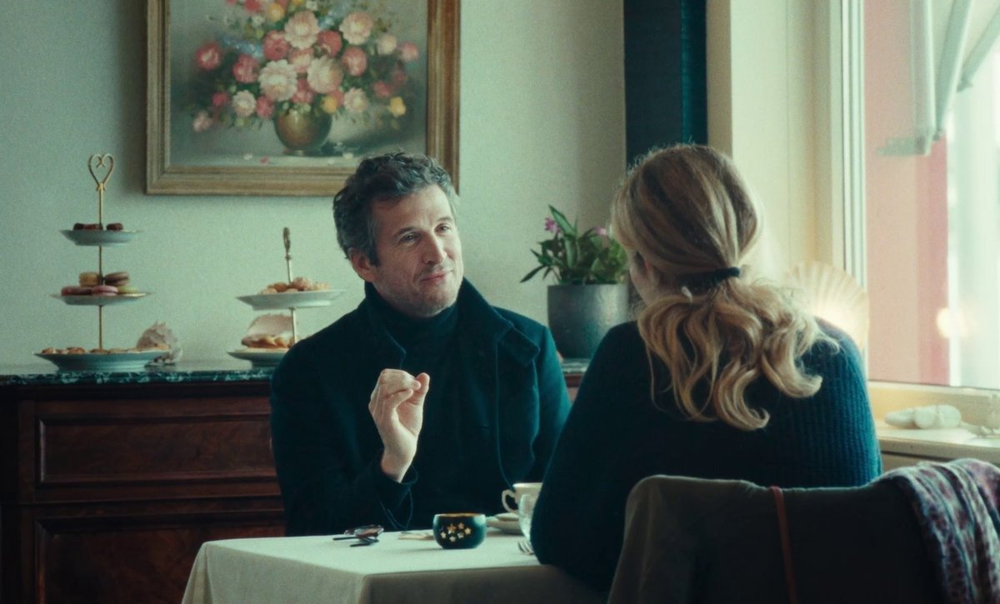

# Хрупкость и поиски соломинки. На российских экранах этой весной очень много французского кино. Рассказываем о новых картинах, обладающих терапевтическим эффектом

- **URL:** https://novayagazeta.ru/articles/2024/03/29/khrupkost-i-poiski-solominki
- **Дата:** 2024-03-29
- **Автор:** Лариса Малюкова

## Хрупкость и поиски соломинки

## На российских экранах этой весной очень много французского кино. Рассказываем о новых картинах, обладающих терапевтическим эффектом

## Вне сезона

- В прокат вышел фильм «(Не)бывшие» Стефана Бризе («Закон рынка», «На войне») из Венецианского конкурса — антиромком с феноменальным дуэтом Альбы Рорвахер и Гийома Кане

Кадр из фильма «(Не)бывшие»

Известный актер Матье (Гийом Кане) спасается от выгорания и депрессии в дальнем курортном городке вне сезона — в лакшери санатории, чтобы с помощью талассотерапии, морского воздуха, водорослевых обертываний и одиноких прогулок обрести потерянную гармонию. Там он встречает свою бывшую возлюбленную Алис (Альба Ровахер), которая работает учителем музыки и волонтерствует в доме престарелых. Там на холодном взморье с режущим ветром пытается разгореться вновь их бывший роман, тлеющие обиды. Эта встреча — возможность остановиться, оглянуться: увидеть и понять себя нынешних.

У него — не только новые роли, сценарии, поклонники, фотосессии… Но и самоповторы, бесперспективность, депрессия, авторитарная бизнес-жена. Страх не справиться с главной в карьере ролью. Поэтому он и бежит. От новой пьесы и от себя.

У нее — семья, дочь-подросток, помощь другим — и опустошенность. А сочиненная музыкальная тема — своя, ни на что не похожая — похоронена навсегда в телефоне. Как проглоченная обида — отчего 15 лет назад он ее бросил?

Кино про невыразимое. Невозможность вернуть упущенный шанс. Покинуть территорию комфорта, превратившегося в ежедневную рутину. Хотя вопреки всей понятной, железобетонной логике надеешься на трещину в этой невозможности. Про попытку быть честным с самим собой — при всех привычных компромиссах, разочарованиях. Про неоправданные надежды как способ дышать. Про нашу хрупкость и поиски соломинки, чтобы ухватиться за нее обеими руками. Кажется, Бризе и его соавтор сценария Мари Друкер писали сценарий между слов, с продуманными паузами, крупными планами — уклонениями и чистосердечными признаниями героев. С холодной серо-серебристой, без теплого солнца цветовой гаммой.

Режиссура — как живопись импрессионистов. Бризе растушевывает роман почти документальными сценами, праздником в доме престарелых, уроком музыки или забавным «диалогом» двух свистунов-пародистов, изображающих певчих птиц в вечернем клубе пенсионеров.

Кадр из фильма «(Не)бывшие»

Гийом Кане («Прекрасная эпоха», «Прошлой ночью в Нью-Йорке») и Альба Рорвахер существуют в документальной манере с «привычной камерой», словно весь фильм снят «цыганским дублем», когда режиссер забыл дать команду «стоп!».

И в этом сыгранном дуэте особенна хороша Рорвахер («Химера», «Моя гениальная подруга») со своей сокрушительной и приглушенной харизмой, обезоруживающим взглядом.

Их путешествие в прошлое — возможность не только услышать друг друга и себя самих, но быть честными в ответ на честность, нежными в ответ на нежность. Расстаться снова. Но так, чтобы не было больно. Задаться вопросом: что в твоей жизни не так? Ты же не болен, ты востребован. У тебя новый дом. И оказывается, невидимые внутренние царапины не менее травматичны, чем кричащие вокруг проблемы. «По сравнению с глобальным потеплением, — признается Матье, — все это не имеет большого значения».

Читайте также

Цвет надежды — серый?

Завершился национальный смотр анимации в Суздале, который по настроению совпал с общим настроением в стране

Поддержите нашу работу!

1000 500 300 Нажимая кнопку «Стать соучастником», я принимаю условия и подтверждаю свое гражданство РФ

Если у вас есть вопросы, пишите [email protected] или звоните:+7 (929) 612-03-68

Правда? Но почему же им так необходимо спрятаться хотя бы на пару недель на этом негостеприимном берегу с шумом пенящихся ледяных волн от привычного уютного мира, чтобы вновь завязать и развязать узел отношений?

Чтобы в «мертвый сезон» своей жизни почувствовать себя живыми. Чтобы бонусом к этому пронизываемому ледяным ветром настоящему обрести нежность нескольких минут, украденных у судьбы.

## Как Галатея художником стала

- На экраны вышел фильм с претенциозным названием «Обнаженная муза Пьера Боннара». В оригинале все просто: «Боннар. Пьер и Марта».

Кадр из фильма «Обнаженная муза Пьера Боннара»

Фильм Мартена Прово о тайной связи любви и живописи вызвал споры критиков. Это не привычный байопик из серии ЖЗЛ про замечательных художников в картинках. Мы следим за драмой отношений Боннара с Мартой де Мелиньи на протяжении полувека, с момента их случайной встречи. Их побега в «коммуну» — недалеко от Парижа, в кантри-домик на берегу Сены.

Автора интересует «сор», из которого растут, не ведая греха, картины одного из величайших колористов, который отыскивал красоту в будничных моментах жизни: обеденный стол, залитый солнцем, кафельный пол, рассыпанный в мозаике.

Но прежде всего — в неустанных наблюдениях за своей главной моделью Мартой. С которой они были связаны неразрывно до последних дней… даже когда художник ее оставлял. Из примерно 2000 картин, написанных Боннаром, треть изображает Марту.

Редкий случай, когда муза в фильме оказывается главной героиней, главной тайной, притягивающей художника. Ведь простая девушка, встреченная Боннаром на улице, скрыла не только свое происхождение, но и настоящее имя — Мария Бурсен — вплоть до их поздней свадьбы. И Сесиль де Франс не только воплощает стопроцентную женщину, которая мечтает о ребенке, жертвует собой, — она играет постепенное превращение в художника. Галатея становится творцом. Автором собственных полотен, которые выставляются в парижском салоне на персональной выставке. И известные художники, прежде смотревшие на нее сверху вниз, не очень понимая, что Пьер нашел в этой простушке, снимают шляпы перед ее картинами.

Кадр из фильма «Обнаженная муза Пьера Боннара»

Их общая жизнь трещит по швам под прессом драм ХХ века. Но Марта вновь и вновь склеивает эти осколки в целое. Не только ее собственные работы разного качества, но и их совместная жизнь стала результатом ее труда и творчества.

Фильм, разумеется, не лишен недостатков — прежде всего это чрезмерное любование природными красотами или купание обнаженных героев. Авторы вновь и вновь повторяет эти сцены «безгрешного рая», который сама жизнь вынудит Пьера и Марту покинуть. Ну да, мы уже поняли.

Но главным останется поиск сияющего света и цвета Боннаром, помешанным на искусстве художника, руки которого всегда в краске — словно изуродованы шрамами. Главным останется этот поразительный сеанс связи между художником и его моделью, живущей своей жизнью. Укладывающей овощи и вино в корзинку. Быстро собирающей на стол. Читающей книгу. Принимающей ванну. Задыхающейся от астматического кашля. И кисточка, и пальцы Пьера словно дотрагиваются до нее, перенося на холст ее жесты, взгляды, очертания, цвет и бархатистость кожи — превращая все это в символы, краски, в которые автор добавляет столь любимый им желтый цвет. Утверждая победу искусства над реальностью.

Лариса Малюкова ведет телеграм-канал о кино и не только. Подписывайтесь тут.

### Этот материал входит в подписки

Смотровая площадкаКино с Ларисой Малюковой

Культурные гидыЧто читать, что смотреть в кино и на сцене, что слушать

### Добавляйте в Конструктор свои источники: сайты, телеграм- и youtube-каналы

Войдите в профиль, чтобы не терять свои подписки на разных устройствах

Поддержите нашу работу!

1000 500 300 Нажимая кнопку «Стать соучастником», я принимаю условия и подтверждаю свое гражданство РФ

Если у вас есть вопросы, пишите [email protected] или звоните:+7 (929) 612-03-68
