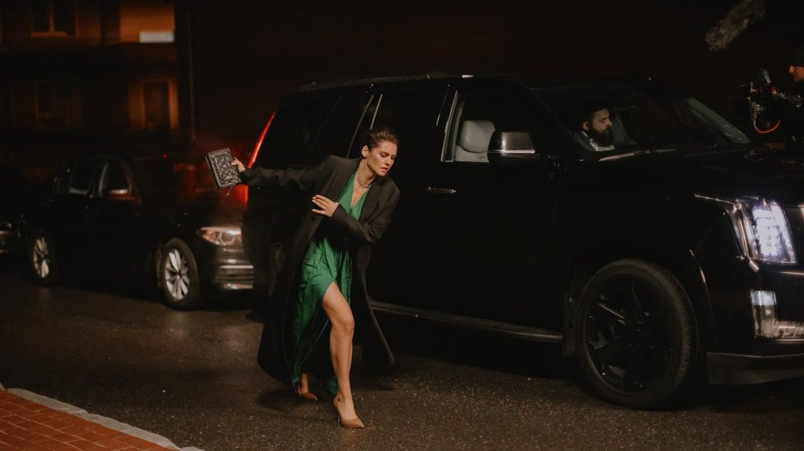

# Ну, кто тут монстр, выходи! 1 апреля KION выпускает «Обоюдное согласие» — второй сезон популярного сериала Гай-Германики

- **URL:** https://novayagazeta.ru/articles/2024/03/30/nu-kto-tut-monstr-vykhodi
- **Дата:** 2024-03-30
- **Автор:** Лариса Малюкова

## Ну, кто тут монстр, выходи!

## 1 апреля KION выпускает «Обоюдное согласие» — второй сезон популярного сериала Гай-Германики

Кадр из сериала «Обоюдное согласие»

Первый сезон «Обоюдного согласия» со Светланой Ивановой в главной роли вышел в марте 2022-го, стал хитом платформы, получил награду премии «Большая цифра». Честный разговор о изнасиловании и о том, как к этому преступлению относятся в патриархальном обществе, вызвал интерес.

Во многих странах отмечается низкий процент судимости по соответствующей статье. И уже очевидно, что корень проблемы не в правосудии, а в общественной реакции. В укорененном в массовом сознании мнении, что жертва сама провоцирует преступника.

В первом сезоне авторы показывали, как именно это общее мнение формируется, когда молодая учительница Анна (Светлана Иванова) посмела обвинить именитых горожан в преступлении.

Любопытный жанр второго сезона — семейная криминальная психодрама.

Про то, какие монстры водятся в наших домашних шкафах, спальнях и гардеробных. И как мы научаемся жить с этими скелетами.

Это вертикальная франшиза. Оба сезона объединяет тема сексуализированного насилия. Но и история, и герои, и актеры, и место действия — разные. Хотя если всмотреться, много общего.

Кадр из сериала «Обоюдное согласие»

Начинается с празднования в ресторане фарфоровой свадьбы одной из самых благополучных пар провинциального города Марины (Глафира Тарханова) и Григория (Максим Ползиков) Венишевых. Двадцать лет душа в душу, трое детей. Она — кардиолог в клинике, специалист по «сердечным делам». Он — бизнесмен, основатель психологического реабилитационного центра. Специалист по восстановлению душ.

Все шишки города, включая мэра, их славят, греясь теплом счастливого камелька завидной семьи. Правда, уже в машине, упакованной цветами и подарками, по пути домой разгорается непонятная ссора. А в следующем кадре Григорий с располосованным кухонным ножом животом лежит у подъезда своего дома. Марина окровавленными пальцами пытается набрать телефон скорой…

Понятно, что именно она и становится главной подозреваемой. Тем более что дело попадает к малоприятному и суровому следователю Анне, которой начальник велит «быстренько, аккуратненько» завершить дело. И так же все ясно. Но тут, судя по первым сериям, домашние скелеты и помогут. Потому что у следователя Анны они свои. И почему-то ей лично необходимо докопаться до правды.

Диана Арбенина в роли следователя. Кадр из сериала «Обоюдное согласие»

В роли следователя — Диана Арбенина, абсолютно естественная, ее героиня — одинокая волчица, живущая по собственным законам справедливости, хотя начальство ее и давит, и мучимая собственными кошмарами.

Может, поэтому в ней и просыпается в какой-то момент если не сочувствие, то особое внимание к обвиняемой, к обстоятельствам ее жизни.

В фильме наряду с актерами снимались «непрофессионалы с судьбой» и громкими именами. Помимо Арбениной, Елена Ханга — она играет приглашенного из Москвы известного адвоката и, судя по всему, еще и борца за права женщин. В роли мужа Марины, убиенного бизнесмена и коуча Григория, — бизнесмен, ресторатор Максим Ползиков, у которого, впрочем, есть театральное образование.

Кастинг, как всегда у Гай-Германики, неожиданный и снайперский. Но подобные проекты в первую голову зависят от главной героини. И если в первом сезоне это была хмурая, замкнутая учительница Светланы Ивановой, то здесь Марина пишется Глафирой Тархановой совсем другими — более жирными красками. Марина раздираема полярными страстями и чувствами: растерянность и находчивость, слабость и сила, верность и измена, любовь и ненависть.

Но и Анна, и Марина оказываются под огнем общественного осуждения, а в огне брода нет.

Елена Ханга в роли адвоката. Кадр из сериала «Обоюдное согласие»

Оба сезона помогают дестигматизации темы насилия, помогают если не решению, то хотя бы постановке важного для нашего общества вопроса проживания травмы.

Поддержите нашу работу!

1000 500 300 Нажимая кнопку «Стать соучастником», я принимаю условия и подтверждаю свое гражданство РФ

Если у вас есть вопросы, пишите [email protected] или звоните:+7 (929) 612-03-68

Диалогу с социумом, который во всех грехах склонен обвинить жертву, а потом уже посмотреть: а кто у нас там насильник? Но еще хуже обстоят дела с домашним насилием. Это просто табуированная тема. Так и не дали прокатного удостоверения отличному фильму Наталии Мещаниной «Один маленький ночной секрет». И в реальности пострадавшие предпочитают молчать о своем драматическом опыте.

Кадр из сериала «Обоюдное согласие»

Гай-Германика снимает сериал не столько про детективную историю с ключевым вопросом «кто же убил?». Ее скорее интересует атмосфера еще одного «маленького города», создающая и концентрирующая все предпосылки и для насилия, и для убийства. Это кино про то, как небольшой городок бьется бессильно в сетях большой лжи, темных махинаций, права сильных над слабыми. Кто тут виноват, а кто невинный, не разобраться никаким следователям. Тем более что и следователи небезгрешны.

Сама Гай-Германика — любопытный персонаж. Иной раз кажется, что между ней самой и ее кино — глухая, непроницаемая стена.

- С одной стороны стены — ее утверждения, что «любая власть от Бога», она признается, что искренне поддерживает правящую партию, воспитывает детей «в традиционной культуре, то есть в православии».
- С другой — в своих фильмах и сериалах отстаивает право человека на свободу от диктата и насилия. Более того, по ее словам, она фиксирует «негативную энергетику» общества.

И в битве ее героев со своими демонами, мысленными волками, нередко побеждают волки и скелеты в шкафах. Художник, если он художник, побеждает идеологию. Скорее всего, из-за документальных основ, на которых Германика окрепла, которые освоила в юности. Она продолжает фиксировать реальность во всех ее ужасных и прекрасных проявлениях — на животном уровне: без допусков и лессировок.

Кадр из сериала «Обоюдное согласие»

Потому она и не слишком правит готовые сценарии, которые получает от продюсеров, со всеми этими многочисленными любовниками и любовницами, дежурными диалогами. Но камера (Геннадий Успангалиев), работающая в унисон с режиссурой, и органичное существование актеров (неважно, профессиональных или нет) — в шкуре непредсказуемых персонажей — высвечивают основной конфликт времени между человеком и беспредельной властью. Когда не только отдельные семьи держатся на страхе, молчании и бесконечном терпении.

- Созданием сериала занимались продюсерская компания MEDIASLOVO и KION.

Лариса Малюкова ведет телеграм-канал о кино и не только. Подписывайтесь тут.

### Этот материал входит в подписки

Смотровая площадкаКино с Ларисой Малюковой

Культурные гидыЧто читать, что смотреть в кино и на сцене, что слушать

### Добавляйте в Конструктор свои источники: сайты, телеграм- и youtube-каналы

Войдите в профиль, чтобы не терять свои подписки на разных устройствах

Поддержите нашу работу!

1000 500 300 Нажимая кнопку «Стать соучастником», я принимаю условия и подтверждаю свое гражданство РФ

Если у вас есть вопросы, пишите [email protected] или звоните:+7 (929) 612-03-68
