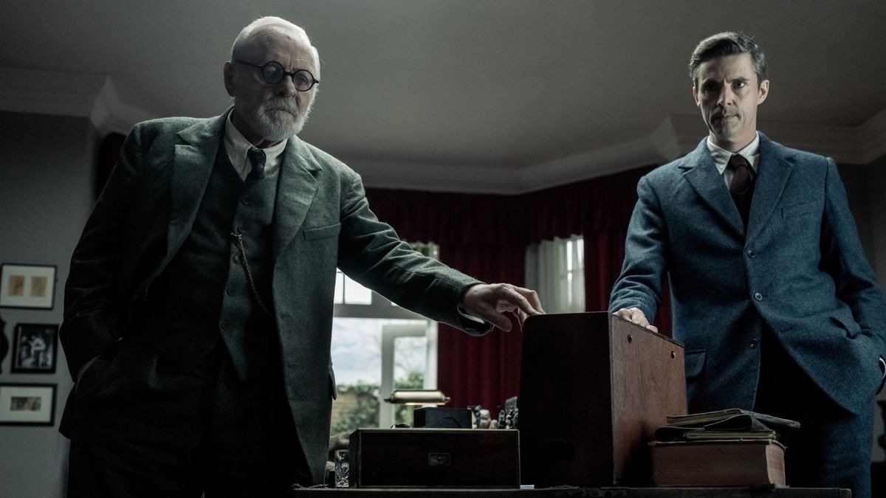

# Жить в гари сожженных книг. На экранах ретродрама «По Фрейду» с Энтони Хопкинсом и Мэттью Гудом в главных ролях

- **URL:** https://novayagazeta.ru/articles/2024/04/13/zhit-v-gari-sozhzhennykh-knig
- **Дата:** 2024-04-13
- **Автор:** Лариса Малюкова

## Жить в гари сожженных книг

## На экранах ретродрама «По Фрейду» с Энтони Хопкинсом и Мэттью Гудом в главных ролях

Кадр из фильма «По Фрейду»

Эпиграф к фильму — цитата Джона Беньяна из классики религиозной английской литературы «Путешествия пилигрима» — аллегории о поиске Бога, путешествии сквозь тесные Врата в Небесную страну.

3 сентября 1939 года, Лондон в ржавых цветах, с дирижаблями на сером небе. Два дня с начала войны. Британцы оглушены известием и истеричной речью Гитлера о том, что миром правит еврейский капитал. Оглушены восторженным криком толпы во славу фюрера, вторгнувшегося в Польшу. Эшелоны с детьми уже отправляют в эвакуацию. А над городом звучит воздушная тревога. В этот день в гости к всемирно известному психоаналитику Зигмунду Фрейду (Энотони Хопкинс) из Оксфорда приезжает профессор философии, будущий писатель, создатель «Хроник Нарнии» Клайв Льюис (Мэтью Гуд).

Мир вползает в разрушительную войну, а два мудреца спорят об основах мироздания, вере, существовании Бога.

Фильм Мэтта Брауна представляет собой экранизацию внебродвейской пьесы Марка Сен-Жермена, в основе которой — воображаемый диалог двух мыслителей. Если бы Браун ограничился этой дискуссией, решился бы на минималистичный фильм-диспут, это было бы убедительно с формальной и смысловой точек зрения.

Но ему показалось недостаточно интересным для зрителя ограничиться уютным домом с садиком, в котором создатель психоанализа вместе со своей дочерью укрылся от фашистской чумы, и даже выходами во время воздушной тревоги в убежище и соседнюю церковь.

И он щедро «украсил» историю флешбэками в детство и юность героев, размазав существо дискуссии, лишив стройности драматургии, тем более что и к жизни Фрейда и Льюса эти ненужные бесконечные вспоминания мало что добавляют.

Узнаем лишь, что у психоаналитика был безвольный отец. А Льюиса отец-вдовец отправил в интернат. Сам Льюис был в пехоте в Первую мировую, настрадался в окопах, потерял близкого друга. И теперь у него долгая странная связь с подругой погибшего друга, которая намного его старше. А еще панические атаки во время воздушной тревоги. Впрочем, все эти воспоминания висят тяжелым грузом на сквозном поединке идей.

Прежде ярый атеист, Льюис не так давно нашел утешение в вере. Он верит в загробный мир, в царство небесное. Сейчас Льюис — молодой профессор в Оксфорде, у него вся жизни впереди, в том числе книги, которые станут знаменитыми. Фрейд же ожесточенно отрицает существование Всевышнего. У него все в прошлом, он обречен и харкает кровью, у него рак челюсти, от нестерпимых болей спасает морфий… с виски.

Читайте также

Лимонов, Трамп и «Парфенопа»

Чем интересна объявленная программа Каннского кинофестиваля

Поддержите нашу работу!

1000 500 300 Нажимая кнопку «Стать соучастником», я принимаю условия и подтверждаю свое гражданство РФ

Если у вас есть вопросы, пишите [email protected] или звоните:+7 (929) 612-03-68

Он убежден, что есть только сегодня: на завтра никакой надежды. Он полагает, что религия — детство человечества, не желающего взрослеть, боящегося темноты в чаще жизни. И вряд ли полякам, на которых напал Гитлер, стоит советовать подставлять монстру вторую щеку. Нужна ответственность за себя и свою жизнь, чтобы шагнуть в эту чащу и увидеть лицо зверя. А Библия, по его мнению, чистый бестиарий, распространяющий вымышленные истории. Зачем верующим думать: у них на каждый случай, на каждый сложный вопрос припасены готовые сентенции. Вера, с его точки зрения, не способна закалить нас на страдания. Фрейд пытается раскачать веру Льюиса, который ищет в Боге потерянного в детстве отца.

Кадр из фильма «По Фрейду»

Когда-то разочаровавшегося в религии Льюиса в лоно церкви вернул его близкий друг Толкиен (они были в одном литературном кружке «Инклинги»). И убежденным христианином он стал на 33-м году жизни. Он считал, что теология — лишь карта, составленная на основании того, что пережили тысячи и тысячи людей. И без этой карты человечеству не выжить.

Они спорят, обнаруживая в этом разговоре свою боль, страхи, неврозы. Оба — чужестранцы в Англии: Фрейд вынужден оставить свою любимую Вену, свой дом, умереть на чужбине, Льюис — из Ирландии.

А за окнами этого уютного коттеджа со скульптурами всех богов на свете, старинными часами, любимыми книгами, семейными проблемами разгорается мировая катастрофа. За первые два дня войны — 20 тысяч погибших. По радио выступает Чемберлен о начале войны. В ней он, словно продолжая спор Фрейда и Льюиса, говорит о том, что сейчас все увидели «близко морду монстра». Что дьявол и бесы живут среди нас, потому что мы сами чума и Апокалипсис. Мы готовы жить в гари от сожженных книг. «К счастью, — говорит обреченный на скорую смерть Фрейд, — я не увижу рождения еще одного Гитлера». Повезло ему.

Кадр из фильма «По Фрейду»

В религиозной повести, которую все время цитирует Льюис, такие слова: «Посреди поля, спиною к своему жилищу в граде Гибель стоит человек, согбенный под тяжкою ношей грехов. В руках у него Книга. Из Книги этой человек, Христианин, узнал, что город будет пожжен небесным огнем и все жители его безвозвратно погибнут, если немедленно не выступят в путь, ведущий от смерти к Жизни Вечной. Но где он, этот желанный путь?»

### P.S.

В реальности этой встречи, скорее всего, не было. Браун вообразил ее. Но этот долгий разговор у кромки многолетней бойни, по сути, так и не ответил на вопрос: зачем человеку убивать другого человека?

Лариса Малюкова ведет телеграм-канал о кино и не только. Подписывайтесь тут.

### Этот материал входит в подписки

Смотровая площадкаКино с Ларисой Малюковой

Культурные гидыЧто читать, что смотреть в кино и на сцене, что слушать

### Добавляйте в Конструктор свои источники: сайты, телеграм- и youtube-каналы

Войдите в профиль, чтобы не терять свои подписки на разных устройствах

Поддержите нашу работу!

1000 500 300 Нажимая кнопку «Стать соучастником», я принимаю условия и подтверждаю свое гражданство РФ

Если у вас есть вопросы, пишите [email protected] или звоните:+7 (929) 612-03-68
