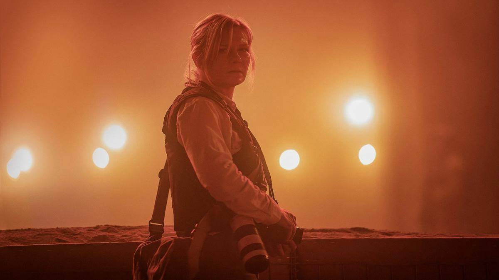

# Бойня номер…. На экранах актуальная антиутопия «Падение империи» Алекса Гарленда — созвучное реальности размышление о том, что происходит, когда политики ломают привычный ход вещей

- **URL:** https://novayagazeta.ru/articles/2024/04/15/boinia-nomer
- **Дата:** 2024-04-15
- **Автор:** Лариса Малюкова

## Бойня номер…

## На экранах актуальная антиутопия «Падение империи» Алекса Гарленда — созвучное реальности размышление о том, что происходит, когда политики ломают привычный ход вещей

Кадр из фильма «Падение империи»

Недалекое будущее. Объединенные военные силы Калифорнии и Техаса на подходе к Вашингтону. Группа журналистов пытается добраться до пылающей столицы, чтобы взять последнее интервью у президента США, который, поправ конституцию, занял кресло в третий раз, взбудоражив страну. Теперь из Белого дома он вещает по телевизору о величайшей из побед. И вот машина с журналистами едет сквозь страну — как сквозь бессмысленную войну всех со всеми, — чтобы взять у президента интервью. Может быть, последнее.

Какое еще кино может быть актуальней?

Фотокорреспондент, обласканная премиями за работу в горячих точках Ли (Кирстен Данст), и репортер Джоэл (Вагнер Моура), ветеран — обозреватель NYT, журналист-ветеран Сэмми (Стивен МакКинли Хендерсон) и увязавшаяся за ними юная фотожурналистка Джесси (Кейли Спэни).

Кажется, мы это уже видели многократно и в кино, и на хроникальных кадрах: лютое насилие, превосходство и враждебность людей с оружием, журналистские перекуры, внезапные перестрелки, охваченные огнем деревни. Только эта война жрет страну изнутри. А на роскошном гольфполе помимо предупреждения о летящих мячиках со всех сторон летит смерть, и юная Джесси под прицелом очередного веселого маньяка падает в яму с трупами.

История рассказывается с точки зрения вымирающей сегодня неангажированной, непредвзятой журналистики. И именно этот взгляд на происходящее рождает ужас от увиденного.

Кадр из фильма «Падение империи»

Они документируют историю, вершащуюся в этот момент, рискуя жизнью. Они ползут под обстрел, чтобы запечатлеть события, меняющие нацию в реальном времени.

Взбудораженный событиями Джоэл, как алкоголик, пьет эту чудовищную горящую реальность большими глотками и не может напиться. У Ли в глазах — серый пепел, усталость и разочарование. Она посвятила жизнь работе в зонах боевых действий, чтобы ее фотографии стали для человечества предупреждением: у насилия, выпущенного из клетки международных и внутренних законов, нет границ. Это зверь, пожирающий все живое. Имя героини, конечно, является отсылкой к легендарному военному фотографу Ли Миллер, которая освещала Вторую мировую войну для Vogue.

Читайте также

Жить в гари сожженных книг

На экранах ретродрама «По Фрейду» с Энтони Хопкинсом и Мэттью Гудом в главных ролях

Кто-то пытается убить нас, кого-то пытаемся убить мы; под звуки рождественских гимнов и гимна Америки.

А совсем еще девчонка Джесси на наших глазах меняется. В начале этого пути сквозь войну она смертельно напугана пытками и расстрелом пленных, затем, теряя чувствительность, превращается в адреналинового военкора-наркомана, ловца камерой эффектных страшных снимков.

Все живут по законам военного времени. Или почти все. Потому что большой магазин одежды работает, не замечая происходящего, по своему собственному закону: «Нас это не касается, и новостей мы не смотрим».

Поддержите нашу работу!

1000 500 300 Нажимая кнопку «Стать соучастником», я принимаю условия и подтверждаю свое гражданство РФ

Если у вас есть вопросы, пишите [email protected] или звоните:+7 (929) 612-03-68

Здесь даже можно купить платье — предмет роскоши.

Журналисты едут сквозь войну, погружая и нас в шок и кошмар. Это их «крестовый поход» или «бойня номер пять»: расстрелы «врагов», разбитый вертолет, лагерь беженцев на школьном поле, и моменты тишины, когда слышны лишь щелчки камеры. Их потери.

Кадр из фильма «Падение империи»

Оригинальное название фильма «Гражданская война» в российском прокате на всякий случай сменили на «Падение империи», чтобы не фиксировать связи рождающейся диктатуры с возможностями последующего хаоса или аллюзиями с Трампом. У нас это кино транслируется как образ разрушающейся Америки и ее гегемонии в мире.

Мне кажется, авторам удалось поймать основное ощущение внутри гражданской войны: рандомность выбора смерти. Ты под прицелом. Человек с ружьем может выстрелить… или не выстрелить. Спросить о чем-то постороннем. Например, откуда ты. И твой ответ ему не понравится. Или твой акцент ему не понравится. И тогда тебя прямо сейчас убьют. А если ты из Миссури, должен объяснить, почему штат так называют. А если у тебя китайский акцент, тебя точно убьют.

Гарленд превращает роуд-муви в политический триллер и военную драму, а военную драму — в хоррор, не забывая и об этических вопросах, в том числе главном для документалиста и военного фотографа: снимать или спасать.

В какой-то момент Ли заявляет: «Мы фиксируем, чтобы другие могли задавать вопросы». Остается только вопрос: останутся ли те, которые должны задавать вопросы?

Лариса Малюкова ведет телеграм-канал о кино и не только. Подписывайтесь тут.

### Этот материал входит в подписки

Смотровая площадкаКино с Ларисой Малюковой

Культурные гидыЧто читать, что смотреть в кино и на сцене, что слушать

### Добавляйте в Конструктор свои источники: сайты, телеграм- и youtube-каналы

Войдите в профиль, чтобы не терять свои подписки на разных устройствах

Поддержите нашу работу!

1000 500 300 Нажимая кнопку «Стать соучастником», я принимаю условия и подтверждаю свое гражданство РФ

Если у вас есть вопросы, пишите [email protected] или звоните:+7 (929) 612-03-68
