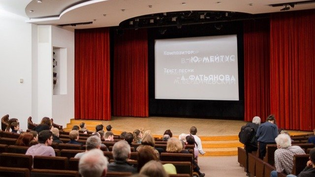

# Это вам не «чебурашки». Новое руководство закрыло отдел кинопрограмм Третьяковской галереи «в связи с убыточностью и непрофильностью»

- **URL:** https://novayagazeta.ru/articles/2024/04/19/eto-vam-ne-cheburashki
- **Дата:** 2024-04-19
- **Автор:** Лариса Малюкова

## Это вам не «чебурашки»

## Новое руководство закрыло отдел кинопрограмм Третьяковской галереи «в связи с убыточностью и непрофильностью»

«Кино в Третьяковке». Фото: соцсети

Вот как у нас получается? Стоит появиться чему-то действительно стоящему, ценному, как это сверхценное намереваются прихлопнуть.

Восемь лет плодотворной работы, диалога прямого и косвенного — киноискусства с экспозицией. Образовательных циклов. Гигантской просветительской работы.

Просто любопытно, «новое руководство» посетило хотя бы несколько программ, сформированных бывшими сотрудниками Музея кино Наума Клеймана?

В очередной раз совершается умерщвление талантливой культурной институции.

Сначала Музей кино, созданный Клейманом, превращенный сегодня в нарядный симулякр на ВДНХ. Потом закрыли Научный исследовательский институт киноискусства. Теперь вот «Кино в Третьяковке». Будут, наверное, ради рентабельности показывать «Чебурашку». Больше кинопоказов, сопровождаемых комментариями киноведов и историков, «шедевров кино в окружении шедевров изобразительного искусства» — не будет.

Этот материал был готов больше полутора месяцев назад. Но я не публиковала его, потому что куратор проекта «Кино в Третьяковке» Максим Павлов все еще надеялся, что победит «разумное, доброе, вечное». Не победит.

Поэтому хочу рассказать, чем же было для нас «Кино в Третьяковке», в чем беспрецедентная уникальность возникшего на наших глазах «Музейного кинотеатра». И почему его надо было беречь, а не разрушать.

«Кино в Третьяковке». Фото: Генриетта Перьян

## Третьяковка как Центр Помпиду

Кинопоказы в Третьяковской галерее на регулярной основе начались в 2016 году, хотя говорили об этом годы «до». Музейная реконструкция, которую в конце 80-х возглавил тогдашний директор Третьяковки Юрий Королев предполагала депозитарий, Инженерный корпус с выставочными залами, образовательным центром, лекционный зал с возможностью показа фильмов в разных форматах. В общем,

Кинопрограмма Третьяковской галереи

создавался аналог Центра Помпиду, когда в художественном музее аудиовизуальное искусство существует как неотъемлемая часть большой экспозиции.

Заглохшую идею возродили в 2016-м благодаря поддержке Министерства культуры, выделившим средства на оборудование, и энергии директора Зельфиры Трегуловой, а также ее зама Марины Эльзессер.

Следом за Инженерным открылся Малый зал в Новой Третьяковке. Третий зал — пространство в ЦДХ, и везде возобновили показы. Так возник первый музейный кинотеатр, а с учетом трех залов — можно сказать, хорошо оборудованная киносеть с системой синхронного перевода, субтитрированием, показом на пленке и в цифре.

## Что смотрели?

Классику и современное арт-кино, образовательные программы, архивные показы. Здесь не показывали блокбастеров и коммерческих хитов вроде «Холопа» или «По щучьему велению». Зато зеленый свет включали помимо игровых картин дефицитному документальному, анимационному кино, к которому прокатчики и дистрибьюторы остаются равнодушными. А еще арт-блокбастерам об именитых и малоизвестных художниках, фильмам, связанным с музыкальным театром, снятым на пленку известным оперным и балетным спектаклям.

В отличие от других кинотеатров у картин в Третьяковке мог быть долгий прокат. Например, двойные портреты Галины Евтушенко «Чехов и Левитан…», «Лев Толстой и Дзига Вертов» регулярно показывались. Почти полтора года в музейном кинотеатре шел польско-британский фильм «Ван Гог. С любовью Винсент» — первая анимационная картина, нарисованная маслом на досках. И зритель на нее шел.

Нередко показы непосредственным образом связывали с экспозициями. И параллельно с выставкой маринистов, развернутой в Инженерном корпусе, в кинозале смотрели фестивальный хит «Акварель» Виктора Косаковского, в которой вода — главный персонаж.

Фото: Генриетта Перьян

В разделе «Специальные показы» фильмы представляли авторы и потом обсуждали их со зрителями. Современный зритель действительно нуждается в диалоге.

Эксклюзив музейного кинотеатра — собственные ретроспективные программы. Самая любопытная из недавних — «In Memoriam. Остановленное время». Впервые выставлялись посмертные маски из коллекции Третьяковской галереи, а в «экранных экспозициях» обширной программы были запечатлены образы Гоголя, Маяковского, Пастернака и других. Кроме того, были показы редчайшей хроники с Лениным и Сталиным.

В музее сформировалась своя фильмотека. В ее основе — дар от Фонда Сокурова и киноведа Ирины Николаевны Гращенковой: почти все игровые фильмы Сокурова, начиная с его первого фильма и до картины «Мать и сын», несколько документальных лент. Получили в дар от Гёте-Института их коллекцию (примерно порядка 350 фильмов), коллекцию венгерского кино (более 100 фильмов от Венгерского культурного центра).

## Абдрашитов, Сабо и другие…

В кинозале Третьяковской галереи проходят встречи-показы-разговоры с крупнейшими режиссерами. Здесь состоялся последний творческий вечер Марлена Мартыновича Хуциева, а когда его не стало, именно здесь впервые показали его незавершенный фильм-завещание «Невечерняя». В этом зале любили бывать режиссеры Вадим Абдрашитов и Владимир Наумов, операторы Геннадий Карюк и Александр Антипенко, мастера анимации Юрий Норштейн и Андрей Хржановский. Норштейн не только в круглом зале свое кино показывал, но и лекции читал. Незабываемые. Из зарубежных гостей здесь бывали Иштван Сабо, Фанни Ардан, Маша Мериль, Войцех Пшоняк. Во время фестивалей — от ММКФ до Большого фестиваля мультфильмов — в музее непременно шли свои программы.

Поддержите нашу работу!

1000 500 300 Нажимая кнопку «Стать соучастником», я принимаю условия и подтверждаю свое гражданство РФ

Если у вас есть вопросы, пишите [email protected] или звоните:+7 (929) 612-03-68

Творческий вечер Марлена Хуциева. Фото: Генриетта Перьян

Раньше зарубежных ретроспектив было много, причем примечательных. Например, фильмов классиков японского кино, картин Вайды. В нынешние дни организовывать подобные ретроспективы стало сложнее. Но регулярно проходили показы картин из Южной Кореи. В ближайшем будущем должна была состояться кинопрограмма швейцарского кино, потом тайского. Придумали устраивать презентации книг вместе с демонстрацией фильмов.

В конце прошлого года я рассказывала об интереснейшем событии. В издательстве «Индивидуум» вышла книга «Волчье время», посвященная послевоенной Германии. И договорившись с правообладателями, кураторы показали три уникальных картины послевоенной Германии «Убийцы среди нас», «Фотография класса» о судьбе мальчишек 1930-х годов, экранизацию Бёлля «Непримирившиеся…».

К юбилею Вернера Херцога и выходу мемуаров на русском языке «Каждый за себя, а Бог против всех» смотрели и обсуждали фильм с тем же названием (из коллекции, подаренной Гёте-Институтом), удостоенного Гран-при Каннского кинофестиваля.

Читайте также

Прекрасное далеко, не будь ко мне жестоко

На экраны выходит отечественное фэнтези «Сто лет тому вперед» Александра Андрющенко

## Новости из прошлого

Где еще вы можете смотреть отечественное кино разных лет на кинопленке? Причем бесплатно? Немые фильмы демонстрировались, как положено, с сопровождением тапера или даже музыкального ансамбля. С 2018 года развивался один из самых интересных циклов, связанный со столетним юбилеем советского кино. Цикл «Столетний юбиляр», по сути, стал школой истории отечественного кино. Показывали последовательно все сохранившиеся в Госфильмофонде фильмы советского производства начиная с 1918 года. Уникальную образовательную программу по истории отечественного кино курировали Наум Клейман и киноисторик Артем Сопин.

Лекция Наума Клеймана в Третьяковке. Скриншот с видео

«Третьяковка-кино» занималась кропотливой подвижнической работой, открывая забытые имена и события российского кинематографа, напоминая о классиках, восстанавливая разорванный беспамятством кинопроцесс.

Когда в залах музея проводилась выставка «Русский модерн. На пути к синтезу искусств» — в кинозалах с помощью Госфильмофонда показали все сохранившиеся игровые фильмы Российской империи с 1908 по 1914 год. Более сотни фильмов! От «Понизовой вольницы» — и до лент, снятых перед самой Первой мировой войной.

Киноманы любили программу «Учитель и ученики», посвященную крупнейшим отечественным режиссерским школам. Начали ее с фильмов Кулешова и его учеников. Вертов, Эйзенштейн, Юткевич, Довженко, Козинцев. Из последних — прошли показы школы Сергея Герасимова, у него учеников — не сосчитать. Во время демонстраций фильмов «Школы Михаила Ильича» проходили встречи с его учениками — Андреем Смирновым, Александром Миттой, Игорем Ясуловичем, который показывал свои мало кем виденные режиссерские работы. Должны были состояться показы, посвященные Кире Муратовой…

«Кино в Третьяковке». Фото: Генриетта Перьян

### ***

Третьяковка расширяется: скоро откроются филиалы в Калининграде и Владивостоке, и там запланированы залы универсальной проекции. Судя по всему, в них будут показывать не артефакты, не фильмы, созданные по законам искусства, а коммерческие однодневки.

От кинотеатра, занимающегося просветительством популяризацией киноискусства, неправильно и неразумно требовать высоких кассовых сборов.

Самым плачевным развитием событий окажется даже не закрытие «Музейного кинотеатра», а его обезличивание, превращение в рядовой киноцентр, в котором, как и в других кинозалах будут показывать «Тещу», очередные «Елки» и очередного «Холопа».

«Если убрать из человеческих занятий все относящееся к извлечению прибыли, останется лишь искусство», — говорил Андрей Тарковский, в свое время жестоко травмированный, а по сути, и изгнанный со своей родины чиновниками. Нынешние чиновники любят его цитировать, хорошо бы, они действительно расслышали то, о чем он говорил, о чем снимал свое когда-то нерентабельное кино, которое смотрят до сих пор.

Лариса Малюкова ведет телеграм-канал о кино и не только. Подписывайтесь тут.

### Этот материал входит в подписки

Смотровая площадкаКино с Ларисой Малюковой

Культурные гидыЧто читать, что смотреть в кино и на сцене, что слушать

### Добавляйте в Конструктор свои источники: сайты, телеграм- и youtube-каналы

Войдите в профиль, чтобы не терять свои подписки на разных устройствах

Поддержите нашу работу!

1000 500 300 Нажимая кнопку «Стать соучастником», я принимаю условия и подтверждаю свое гражданство РФ

Если у вас есть вопросы, пишите [email protected] или звоните:+7 (929) 612-03-68
