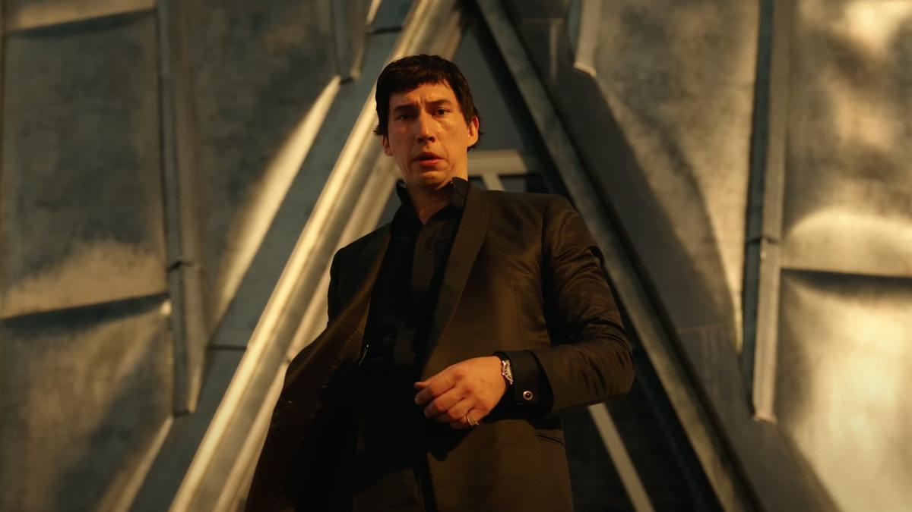

# Колосс на мегалоновых ногах. Главное событие Каннского кинофестиваля — «Мегалополис» — новый фантастический эпос Фрэнсиса Форда Копполы

- **URL:** https://novayagazeta.ru/articles/2024/05/17/kolos-na-megalonovykh-nogakh
- **Дата:** 2024-05-17
- **Автор:** Лариса Малюкова

## Колосс на мегалоновых ногах

## Главное событие Каннского кинофестиваля — «Мегалополис» — новый фантастический эпос Фрэнсиса Форда Копполы

Кадр из фильма «Мегалополис»

Фильм-миф, фильм из мегалона. Это такой синтетический материал из утопии. Вроде бы возможной. Но недостижимой. Как кино будущего. 85-летний создатель «Апокалипсиса сегодня» и «Крестного отца» рискнул его снять.

Моя учительница музыки любила повторять в случае несоответствия замысла и результата: «Гора родила мышь». В случае с «Мегалополисом» можно сказать: «Гора родила гору», а режиссер-мегаломан ввел зрителей в оторопь, возмущение, разочарование, восторг. Не припомню столь радикального разрыва реакций и оценок. От семиминутной овации на премьере до «бу» и аплодисментов критиков.

Свою картину мечты легендарный Коппола представлял в качестве work in progress еще в 2001-м здесь же в Каннах. А 400-страничный сценарий проекта он написал еще 1983 году.

40 лет размышлений, проб. Первые кадры сняты в 90-х. Сколько раз переписывал, запускался. Срывались контракты с уже снимающимися актерами, перепланировались объекты. Коппола снимал фильм на собственные средства — 120 миллионов долларов.

Режиссер поставил на карту все: деньги (правда, их не надо возвращать), амбиции. Создавал свое размашистое кино для Imax как муралист. Замешав на холсте цитаты и отсылки к Марку Аврелию, Сафо, Петрарке, Гете, Уэллсу и Ральфу Уолдо Эмерсону. Личную боль, связанную с потерей жены, которой он посвятил картину. В какой-то момент герой вместо публичной речи просто произносит монолог Гамлета. Кажется, что от имени автора: «Уснуть! И видеть сны, быть может? Вот оно! Какие сны в дремоте смертной снятся, Лишь тленную стряхнем мы оболочку, — вот что Удерживает нас…» А в другой момент автор вообще разрушает дистанцию между персонажем и зрителем, словно рвет экран…

И вот пред нами неровное кино с вагнеровским замахом, не слишком ловкая компьютерная графика, зашкаливающая романтика, любопытные философские размышления и банальные сентенции о шансе человечества, само существование которого чудо из чудес, — на будущее. Но человек вместо будущего предпочитает в обезьяньей шкуре убивать, захватывать, побеждать любой ценой. Поэтому смерть цивилизации неотвратимо надвигается. Любовь спасет мир? А мы и не знали.

Кадр из фильма «Мегалополис»

Актеры на своем месте, как Адам Драйвер в главной роли архитектора, зависшего над пропастью со своей отчаянной маниакальной идеей реконструкции мира. Или совершенно не знающие, что делать и зачем они здесь, как Дастин Хоффман (возможно, его роль просто не вошла в экранную версию, оставшись в 30-часовом материале, снятом для фильма?). Они все играют в разной манере: от чрезмерной театральности до выверенного психологизма.

При этом целая россыпь потрясающих деталей (вроде зависшей в воздухе розы — символа остановившегося времени…). Поучительные исторические параллели. Америка постмодерна, развращенная и амбициозная, как и Древний Рим — империя, которая не ощущает кризисного момента, запаха смерти… того самого, с которого начинается распад и разрушение.

Все империи слепы. Лишены обоняния. Все извращены алчностью, консьюмеризмом и коррупцией, жаждут крови и зрелищ, разрушаются изнутри.

Читайте также

Второй акт мы уже доиграли

Нынешний Каннский кинофестиваль оказался, как и весь мир, в зоне турбулентности

Поддержите нашу работу!

1000 500 300 Нажимая кнопку «Стать соучастником», я принимаю условия и подтверждаю свое гражданство РФ

Если у вас есть вопросы, пишите [email protected] или звоните:+7 (929) 612-03-68

В ретро-футуристическом Нью-Йорке гений, лауреат Нобелевской премии архитектор Цезарь Катилина изобрел чудесный строительный материал мегалон. Теперь он надеется построить «город золотой под небом голубым», город-мечту, сияющий рай. Благодаря открытию нового вещества Катилина может контролировать время и пространство. Он уже начал работу над проектами Нового Рима, снося целые кварталы. Но властный Цицерон пытается его остановить. И зачем строить утопию, вслед за которой непременно придет антиутопия?

А зачем в 85 лет снимать кино, которое стопроцентно будут упрекать в наивности, неловкости и неуклюжести, в хаосе вместо драматургии, детском романтизме. Зачем строить фильм как гигантский небоскреб, в котором странно соединятся все стили: от римского имперского композита до ар-деко и хайтека. Гигантский колосс на глиняных ногах? Но у Копполы в кармане на все случаи жизни цитаты из его любимого Марка Аврелия: «Не смерти должен бояться человек, он должен бояться никогда не начать жить».

Кадр из фильма «Мегалополис»

Сюжетные рифмы этого модернистского пеплума связаны со знаменитым заговором Катилины, разоблаченным публично красноречивым Цезарем. Как и римский политик, герой Драйвера обвинен мэром Нью-Йорка в убийстве жены. Но он не может расстаться с ней, продолжая — уже с невидимой — нежно общаться, покупать ей цветы. Стареющий мэр города, закостенелый консерватор Цицерон (Джанкарло Эспозито), держится за кресло, пуще смерти боится народных волнений. Дочь мэра Джулия (Натали Эммануэль) влюбляется в харизматика Катилину. Хитроумный Банкир Гамильтон Красс III (Джон Войт) с трамповскими интонациями и сверкающими глазами — помешан на сексе и власти, а под плащом у него припасены стрелы для «близких врагов». Из самых ярких персонажей его развращенный внук Клодио (Шайа ЛаБаф) — мажор и проныра, ненавидящий Цезаря, намеревающийся избавиться от устарелого деда любым способом и заделаться новым диктатором, поднимающий толпы на штурм нынешней ржавой власти. А над городом проплывает советская космическая станция, угрожая ядерными отходами.

Фрэнсис Форд Коппола на премьере фильма «Мегалополис». Фото: Анатолий Жданов / Коммерсантъ

Нет, Коппола не изобрел новое кино, он лишь попытался разворошить старые формы, и как подлинный романтик он верит в способность художника задавать сущностные вопросы. Хотя бы задавать.

«Пока есть вопросы и диалог… это утопия», — говорит Цезарь в финале, пока есть утопия, есть надежда. Пока есть всем рискующие режиссеры — джедаи, относящиеся к кино как способу воевать с мельницами «киноиндустрии», замешанной исключительно на деньгах, способны раздражать, ошибаться, пробуждать рьяные споры и диалоги — у кинематографа есть шанс на выживание. Как повторяет один из персонажей фильма: «Когда мы прыгаем в неизведанное, мы доказываем, что мы свободны».

И даже если это личное высказывание, фильм-автопортрет потерпит полное фиаско в прокате, вызовет гнев благородной аудитории — подобная неудача в миллион раз интересней выверенных, переписывающих друг друга по кальке блокбастеров.

Лариса Малюкова ведет телеграм-канал о кино и не только. Подписывайтесь тут.

### Этот материал входит в подписку

Смотровая площадкаКино с Ларисой Малюковой

### Добавляйте в Конструктор свои источники: сайты, телеграм- и youtube-каналы

Войдите в профиль, чтобы не терять свои подписки на разных устройствах

Поддержите нашу работу!

1000 500 300 Нажимая кнопку «Стать соучастником», я принимаю условия и подтверждаю свое гражданство РФ

Если у вас есть вопросы, пишите [email protected] или звоните:+7 (929) 612-03-68
