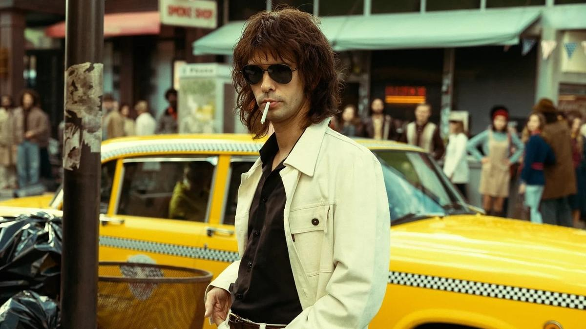

# Лимонов — как «лимонка». Канны увидели и оценили новую работу Кирилла Серебренникова

- **URL:** https://novayagazeta.ru/articles/2024/05/20/limonov-kak-limonka
- **Дата:** 2024-05-20
- **Автор:** Лариса Малюкова

## Лимонов — как «лимонка»

## Канны увидели и оценили новую работу Кирилла Серебренникова

Кадр из фильма «Лимонов. Баллада об Эдичке»

После мировой премьеры фильма «Лимонов. Баллада об Эдичке» — яркого и, как всегда, субъективного авторского высказывания Кирилла Серебренникова — ожидаемо посыпались полярные мнения, принципиальные расхождения в оценках. Сам бы Эдуард Вениаминович был доволен: картине о нем долго аплодирует гламурный каннский дворец. Впрочем, в основе расхождений не только кино, но и сама личность Серебренникова. Многие (заметим: особенно соотечественники) идут на показ уже с готовым вердиктом: «фальшак».

В основе фильма известная, увенчанная премией Ренодо книга Эмманюэля Каррера «Лимонов», кипящая смесь подлинных фактов и домыслов. Вслед за автором сюжет несется по американским горкам судьбы, зигзагов героя, проживающего много жизней. От харьковского андеграундного писательского подполья до попытки осесть и прославиться в Москве, от побега в США — до возвращения в горбачевский СССР, как он говорит — на развалины империи, чтобы услышать голос истории. На самом деле, чтобы самому стать историей. И внутри этого бега по кругу добра и зла, поэзии и провокаций множество перевоплощений: от рабочего на заводе и в шахте — до дворецкого миллионера на Манхеттене, от пошива джинсов ради выживания — до выступлений в «Бункере», от неприкаянности и нищеты — до фанфар громкой публикации в Париже скандального романа «Это я — Эдичка», а еще нацболы*, создание партии, заманчивые предложения КГБ, протесты, тюрьма… Этих сюжетов-жизней-масок хватит на сериал без конца и начала.

Помимо текста Каррера Серебренников использует мотивы романа-мифа «Это я — Эдичка», поразившего когда-то не только жаркой откровенностью и исповедальной интонацией, но и эстетической новизной.

Как говорит режиссер: «Наш герой не столько реальный Лимонов, сколько сотворенный Каррером сплав из многих персонажей его книг. Поэтому это не байопик, а баллада».

Большая часть фильма — нью-йоркский период жизни панк-поэта и хулигана с харьковских окраин. А харьковское и московское прошлое, возвращение в 90-е в Россию — возникают короткими наплывами. Или в прямой речи героя (порой ее многовато), обнаружившего вдруг преимущества СССР перед «Диким Западом», в котором голодают бедные, а до бомжей никому нет дела.

Кадр из фильма «Лимонов. Баллада об Эдичке»

Авторов притягивает молодой Лимонов — романтик (в этом смысле картина близка фильму «Лето» о рок-музыкантах). Им важно понять, как воинственность произрастает из романтизма, откуда возникает эта адреналиновая горячка, отчаяние и отчаянное желание испытать в жизни все разом, но прежде всего — гнев, злость, экстремизм, агрессия. Желание разломать старый мир. Или просто мир. И кажется, эти качества — не только индивидуальные особенности Эдички.

Молодой Лимонов Бена Уишоу (взрослый политик с ленинскими чертами, козлиной бородкой, мелкими жестами, Лимонов-воюющий — авторам менее интересен) — переменчивый ток: обаятельный и отвратительный, грубый, нежный, смешной, хамский, пропитан энергией панк-рока. Такой ускользающий, изменчивый персонаж плутовского романа.

Трудно было найти лучшего актера, чем Бен Уишоу, — актера-хамелеона, который меняется от эпизода к эпизоду.

Поначалу кажется, ну совершенно не похож… Постепенно за счет пластики, погружения в характер он действительно превращается в своего героя-хамелеона с сильной романтической доминантой. Молодой Эдичка не способен на приблизительность, получувства. Влюбляющийся навсегда, до одурения, до беспамятства в свою Елену Прекрасную (в миру Щапову). Из-за любви к ней готов резать вены и мазать кровью стены рядом с ее дверью. В исполнении Виктории Мирошниченко Елена такая же безумная, рисковая, готовая на любую авантюру и вместе с тем уязвимая. Их рок-н-рольный роман снят как танец. И после разрыва с ней Эдичка летит в депрессивный штопор, на самое дно беспорядочной, взрывоопасной жизни.

Кадр из фильма «Лимонов. Баллада об Эдичке»

Портрет Лимонова по определению чрезвычайно сложная и амбициозная задача. Слишком много сущностей у культового харизматика, поэта и смутьяна, позера и провидца, размахивающего ножом и швыряющего в дорогие витрины камни. Лимонова или Савенко. Гения или ублюдка, объявившего войну всем: капитализму и западному романтизму в отношении СССР, советской системе и «американской мечте». Оправдывающего репрессии и Сталина логикой истории. Но своими стихами и своей жизнью создавшего живой образ огнеопасного пестрой эпохи. Не только в СССР, но и в Америке, охваченной антивоенными демонстрациями. Которые поначалу вдохновляют новоприбывшего из СССР. Но быстро разочаровывают, он не понимает, зачем оппозиционные партии, если они лишь перекладывают бумажки: «Камень — вот наше оружие!» В этот момент вспоминается «Санькя» Кирилла Серебренникова — спектакль о воинствующей молодежи.

Поддержите нашу работу!

1000 500 300 Нажимая кнопку «Стать соучастником», я принимаю условия и подтверждаю свое гражданство РФ

Если у вас есть вопросы, пишите [email protected] или звоните:+7 (929) 612-03-68

Сюжет, как и сам герой, скачет-движется во времени и пространстве, описывая Лимонова, себя придумавшего. И уже не отыскать границу между реальным персонажем — и литературным.

Один из долгих эпизодов снят практически одним планом. Эдичка мечется, бродя из помещения в помещение, из кухни — в опустевший кинотеатр, из кинотеатра на странную сонную улицу… пока, наконец, не выходит за стены… гигантской декорации. По сути, его бег и есть поиск реальности, которая каждый раз оказывается декорацией. Поиск себя, ловящего мыльные пузыри очередных ядреных идей и рифм.

В самом начале фильме на интервью уже прославившегося Лимонова спрашивают, кем он себя считает — советским писателем или диссидентом, русским или эмигрантом? Журналисты и публика все время интересуется его идеями национал-большевизма, криптофашистских политических движений, террором, политическими амбициями. И кажется, не только спрашивающие, но и он сам, при всем напоре, влюбленности в позу бунтаря, не уверен — где он настоящий? Против чего он бунтует? Почему сам у себя выбивает из-под ног удобные подставки.

Американские журналисты просят неуправляемого бунтаря представиться: «Лимонов, как лимон?» «Нет, Лимонов, как «лимонка». Хорошо еще стаканом в голову не кинул. А! Кинул! Но это в другом интервью.

Читайте также

Главарь картеля в платье Saint Laurent

Объявился фаворит Каннского фестиваля, которому зал после премьеры аплодировал десять минут

Для режиссера это история про дикую метаморфозу: «Как поэт превращается в человека войны».

Все русские персонажи (включая Уишоу) говорят в фильме на английском с выраженным русским акцентом. Такова задача режиссера. Можно с этим решением спорить, но зарубежной аудитории определенно легче различать принадлежность героев. Во время сеанса поняла, что зрители — из России и Запада — смотрят совершенно разные картины о «Лимонове». В фильме тысяча деталей и нюансов, которые вряд ли считают далекие от нашей суровой истории. Плакат в квартире поэта «За вашу и нашу свободу», Ахмадулина и Евтушенко, читающие стихи на квартирниках. Много стихов Лимонова, странно звучащих по-английски. Есть даже реконструкция поэтического вечера, на котором поэты Лимонов и Андрей Родионов попеременно читают стихи в «Бункере». Родионов здесь камео — играет сам себя.

Цветовая гамма погружает в разные пространства: тусклое зеленоватое харьковское, экспрессивное нью-йоркское, пастельное благополучное — парижское, сероватые, словно выцветшие, 90-е в Москве. А может, это субъективный взгляд героя на эти пространства.

Серебренников снимает кино про людей, которые знают, как умирать, придумывают — за что, но не очень понимают, как жить.

«Ощущение, что мы сегодня живем в мире Лимонова, — говорит на пресс-конференции Кирилл Серебренников. — Все, о чем он писал, оказалось реальностью. Жутко токсичной реальностью».

### * Партия НБП, нацболы, признаны в России судом экстремистской организацией, деятельность партии запрещена.

### Этот материал входит в подписки

Смотровая площадкаКино с Ларисой Малюковой

Культурные гидыЧто читать, что смотреть в кино и на сцене, что слушать

### Добавляйте в Конструктор свои источники: сайты, телеграм- и youtube-каналы

Войдите в профиль, чтобы не терять свои подписки на разных устройствах

Поддержите нашу работу!

1000 500 300 Нажимая кнопку «Стать соучастником», я принимаю условия и подтверждаю свое гражданство РФ

Если у вас есть вопросы, пишите [email protected] или звоните:+7 (929) 612-03-68
