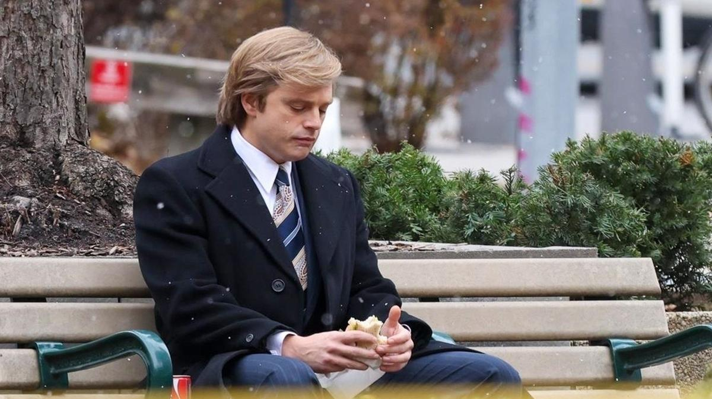

# Трамп-пам-пам. В Каннском конкурсе фильм «Ученик» шведского режиссера иранского происхождения Али Аббаси о тернистом пути к золотому трону Дональда Трампа

- **URL:** https://novayagazeta.ru/articles/2024/05/21/tramp-pam-pam
- **Дата:** 2024-05-21
- **Автор:** Лариса Малюкова

## Трамп-пам-пам

## В Каннском конкурсе фильм «Ученик» шведского режиссера иранского происхождения Али Аббаси о тернистом пути к золотому трону Дональда Трампа

Кадр из фильма «Ученик»

После молодого Лимонова нам показали молодого Трампа. После американских горок судьбы поэта-скитальца, превратившегося в человека войны, — прямолинейная, банально рассказанная история восхождения к власти 45-го президента США на рынке недвижимости Нью-Йорка в семидесятые-восьмидесятые.

И если желания и мечты Лимонова — причудливые зигзаги, за которыми не успеваешь проследить, то желания Трампа — концентрат американской мечты: разбогатеть, войти в элиту миллиардеров, прославиться. А по ходу — завоевать рынок недвижимости.

Мы встречаемся с Дональдом Трампом (Себастьян Стэн), когда он бродит от двери к двери по коридорам жилого комплекса своего папаши Фреда на Кони-Айленде Trump Village, колотит в эти двери, буквально выбивает плату за квартиры: его оскорбляют… посылают… обливают. Ничего, он еще вернется. В это время семейство Трампов находится под следствием правительства по обвинению в расовой дискриминации чернокожих арендаторов. «Я — ксенофоб? — возмущается старший Трамп. — Да у меня водитель черный!»

А вскоре еще неуверенный в себе скромняга Дональд встречает Роя Кона (Джереми Стронг), одного из самых известных адвокатов Нью-Йорка. Кон — личность примечательная. Политик и «большая белая акула», знаменитый консервативный юрист, один из лидеров и мотор «охоты на ведьм», получивший известность в антикоммунистической и гомофобской битве сенатора Маккарти.

Кадр из фильма «Ученик»

Кон Стронга — малоподвижный король закулисных решений — Трампа поначалу он почти не замечает. И тому ужасно хочется завоевать внимание влиятельнейшего адвоката-решалы. Трамп заискивающе просит совета, как его семье избежать преследований и обвинений в дискриминации чернокожих. «Я бы сказал, чтобы они катились ко всем чертям, — спокойно отвечает адвокат. — И устроил бы настоящую войну в суде». Так началась дружба наставника с молодым впечатлительным, амбициозным и решительным блондином. Кон знакомит Трампа с миллиардерами, политиками, сомнительными, но влиятельными людьми. Гонитель геев Кон, как это часто бывает, сам гомосексуал, приглашает Дональда на свои развратные вечеринки. Именно Кон вынуждает город отменить налоги на группу Hyatt, чтобы Трамп мог наконец построить свой первый роскошный отель. Дональд обретает крылья.

Его даже начинает уважать всех презирающий папаша. А сам он пытается завоевывать сердце и руку Иваны Зельничковой (Мария Бакалова), чешской модели, стремящейся стать дизайнером интерьеров. Отвергающей поначалу напористого наглеца. Но он уже не ведает слова «нет» и берет любую крепость приступом.

Довольно быстро пухнет и раздувается богатство Трампа, его недвижимость, разрастается его империя, а параллельно — эго и самоуверенность.

Он отсекает от себя старшего брата Фреда, который ради мечты — стать пилотом — ушел из семейного бизнеса, но так и не смог справиться с давлением отца, начал пить. С течением времени Трамп теряет интерес и к Иване, его привлекают более молодые тела. Что не мешает ему, униженному едкими замечания жены, ее изнасиловать на полу их необъятной квартиры в Трамп-Тауэр (потом они оба будут этот инцидент отрицать).

Ближе к финалу он рвет отношения с ослабевшим и умирающим от СПИДа Коном, разумеется, публично опровергающим, что у него ВИЧ.

Кадр из фильма «Ученик»

Ну а в коде — чисто трамповской жест: он демонстрирует ослабевшему наставнику свою волчью силу, богатство. А главное — свое превосходство. Он здоров, силен, весь мир перед его ногами. Он даже может позволить себе роскошный подарок учителю на день рождения — запонки с бриллиантами. Растроганный Кон почти поверил, пока Ивана не шепнула, что у Трампа таких побрякушек с цирконием — десяток. Это история превращения закомплексованного протеже адвоката дьявола в циничного нарциссического политика, альфа-магната, сносящего на своем пути любые преграды.

Поддержите нашу работу!

1000 500 300 Нажимая кнопку «Стать соучастником», я принимаю условия и подтверждаю свое гражданство РФ

Если у вас есть вопросы, пишите [email protected] или звоните:+7 (929) 612-03-68

Читайте также

Лимонов — как «лимонка»

Канны увидели и оценили новую работу Кирилла Серебренникова

Кино Аббаси, абсолютно очевидное с самого начала, — не удивляет ни разу. Лучшее в нем — игра бесподобного Джереми Стронга («Наследники») в роли Франкенштейна, создающего своего монстра. Поначалу почти неподвижный, словно сонный удав, демонический тайный властитель, дергающий за ниточки политиков, мэров, чиновников высшего ранга. В финале — в позолоченных трамповских хоромах — жалкий, смотрящий на свое «произведение» снизу вверх полуживой наставник. Ученик превзошел учителя в беспрецедентной бездушности, самодовольстве и воплощении в жизнь его трех правил победы любой ценой: все отрицать при обвинениях, пробиваться сквозь любые запреты, побеждать любой ценой

Увы, Трампу Стэна не хватает ни глубины, ни остроты, ни карикатурности, которой хоть отбавляй у реального экс-президента.

Одна из сильных сцен (отсылающая к эталонному пятиминутному эпизоду с параллельным монтажом в «Крестном отце», когда герой Аль Пачино в церкви крестит своего племянника-младенца, отказывается от дьявола, а его подручные в это время убивают конкурентов) — чередование кадров похорон Кона с пластической операцией Трампа (ему делают липосакцию и имплантацию волос). Гоблин должен быть всегда молод… даже когда стар и лыс.

Название фильма «Ученик» повторяет имя делового реалити-шоу, которое Трамп вел и был сопродюсером на протяжении 14 сезонов. Он как никто чувствует силу власти телевидения и использовал ее в своей президентской компании. И телероль удачливого олигарха, заслужившего право вести себя вызывающе, буквально прилипла к его придуманному в телике образу.

Читайте также

Главарь картеля в платье Saint Laurent

Объявился фаворит Каннского фестиваля, которому зал после премьеры аплодировал десять минут

Жаль, Али Аббаси («Шелли», «На границе миров») и его соавторы не придумали, как ярко и свежо рассказать о пути Трампа к его миллиарду и небоскребам власти. Как описать ненасытность любителя казино и конкурсов красоты. Фильму «Ученик» не хватает искрометной рок-н-рольной энергии, которая была, к примеру, в картине «Изумительный» Соррентино про Джулио Андреотти. Где итальянская политика балансировала между католической мессой и party с карликами и шлюхами.

После показа журналисты спрашивали, не помешает ли фильм Аббаси предвыборной гонке Трампа. Конечно нет, политикам подобного сорта — любая дополнительная реклама — с плюсом или минусом, не важно, — лишь добавит в копилку голосов. А какой пиар лучше экрана Каннского кинофестиваля?

### P.S.

Дональд Трамп планирует подать в суд на создателей байопика «Ученик» с Себастьяном Стэном.

Лариса Малюкова ведет телеграм-канал о кино и не только. Подписывайтесь тут.

Поддержите нашу работу!

1000 500 300 Нажимая кнопку «Стать соучастником», я принимаю условия и подтверждаю свое гражданство РФ

Если у вас есть вопросы, пишите [email protected] или звоните:+7 (929) 612-03-68
