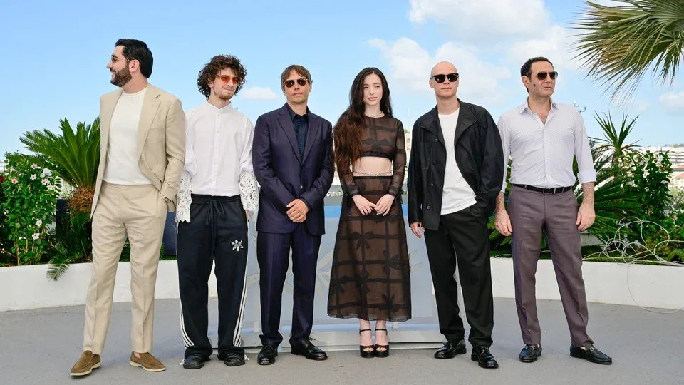

# «Золотую Пальмовую ветвь» Канн получил фильм «Анора» Шона Бейкера с двумя русскими актерами — Юрой Борисовым и Марком Эйдельштейном

- **URL:** https://novayagazeta.ru/articles/2024/05/25/zolotuiu-palmovuiu-vetv-kann-poluchil-film-anora-shona-beikera-s-dvumia-russkimi-akterami-iuroi-borisovym-i-markom-eidelshteinom-news
- **Дата:** 2024-05-25
- **Автор:** Лариса Малюкова

## «Золотую Пальмовую ветвь» Канн получил фильм «Анора» Шона Бейкера с двумя русскими актерами — Юрой Борисовым и Марком Эйдельштейном

Актерская группа фильма «Анора», победившего в Каннах

Другие победители списком:

- За лучший сценарий — награждена черная комедия и боди-хоррор «Вещества» Корали Фаржеа. Принимая приз, Фаржеа благодарит исполнившую главную роль Деми Мур и говорит о силе женщин, которые выступают против насилия.
- За лучшую женскую роль — приз получил тандем дерзкого музыкального фильма «Эмилия Перес» Жака Одиара: Зои Салдана и Карла София Гаскон. В России его не покажут.
- За лучшую мужскую роль — приз получает Джесси Племанс, сыгравший сразу несколько ролей в необычном фильме Лантимоса «Виды доброты», о котором «Новая» рассказывала тут.
- Спецприз жюри Канн — фильму «Семя священного инжира» Мохаммада Расулофа. Зал аплодирует стоя. Режиссер сожалеет, что его группа не может разделить с ним радость — актеры остаются пленниками тоталитарного режима в Иране, а Расулоф, напомним, сбежал из страны, где приговорен к тюрьме, побиванию плетьми и конфискации имущества.

Читайте также

Твой папа палач

Режиссера Расулофа, сбежавшего из Ирана от репрессий, и его фильм-высказывание «Семя священного инжира», снятый фактически в подполье, Канны встретили громадной овацией

- За лучшую режиссуру приз получает Мигель Гомеш, автор фильма «Большое путешествие» («Гранд тур»). Он вызывает на сцену съемочную группу, замечая: «Я всего лишь режиссер, что я без вас». Вручал приз Вим Вендерс.
- Спецприз жюри Канн Ксавье Долан вручает Жаку Одиару — снова за «Эмилию Перес».
- Гран-при жюри удостоен индийский фильм «Все, что мы представляем себе как свет» режиссера Паял Кападиа — нежное поэтическое кино о двух сестрах, работающих медсестрами в госпитале для пожилых.
- Канны почтили великого Джорджа Лукаса «Золотой Пальмовой ветвью». Вручал ее Фрэнсис Форд Коппола. «В чем главный секрет режиссуры?» — спросили Лукаса. Ответ мастера: «Настойчивость».
- «Золотую Пальмовую ветвь» — получила картина «Анора» Шона Бейкера — с Юрой Борисовым и Марком Эйдельштейном в главных ролях! Также в главной роли Майки Мэдисон. История о золушке-стриптизерше, инфантильном мажоре и охраннике-рыцаре.
