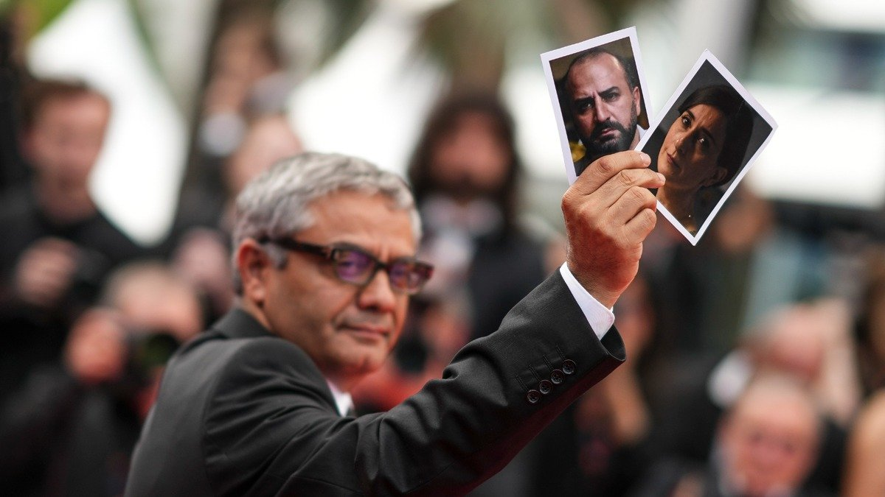

# Твой папа палач. Режиссера Расулофа, сбежавшего из Ирана от репрессий, и его фильм-высказывание «Семя священного инжира», снятый фактически в подполье, Канны встретили громадной овацией

- **URL:** https://novayagazeta.ru/articles/2024/05/25/tvoi-papa-palach
- **Дата:** 2024-05-25
- **Автор:** Лариса Малюкова

## Твой папа палач

## Режиссера Расулофа, сбежавшего из Ирана от репрессий, и его фильм-высказывание «Семя священного инжира», снятый фактически в подполье, Канны встретили громадной овацией

Режиссер Мохаммад Расулоф с фотографиями актеров Миссаха Заре и Сохейлы Голестани. Фото: AP / TASS

«Семя священного инжира», может, и несовершенный фильм, но бесспорная кульминация каннского показа, во многом оправдывающая существование фестиваля со всем его гламуром, тщеславием, битвой амбиций. Разумеется, есть картины тоньше, полифоничней, изящней сделанные. Есть эксперименты в пространстве киноязыка, неожиданные сплавы видов и жанров кинематографа. Но Мохаммад Расулоф в ограниченном пространстве притчи (и возможностей подпольной съемки) рассказал о главной боли Ирана и современного мира: авторитаризме и теократии, беспощадной мизогинии, жесточайшей борьбе с инакомыслием и инакомыслящими.

Редкий пример совпадения: мощи гражданского поступка и кинематографического высказывания. Да, «кино прямого действия», но такой силы и страсти, что способно не только описывать, но вмешиваться и даже воздействовать на реальность.

А само описание жестокой реальности автор превращает в миф о семье как сколе общества.

Прекрасный семьянин, старательный юрист Иман (актер Миссах Зарех, которому запрещен выезд из Ирана) возвращается с работы в свой прекрасный и уютный дом, признаваясь заботливой жене Наджме (Сохейле Голестани также запретили выезд из Ирана, два года назад во время протестов «Женщины, жизнь, свобода» она была заключена в тюрьму), что его повысили. Теперь он государственный расследователь, еще немного — и станет судьей. Но оказалось, что новая работа в революционном суде требует его подписей на приговорах, в том числе смертной казни. Доказательств не требуется, таков приказ начальства.

«Ну это же не от тебя зависит», — успокаивает его заботливая жена. Свою работу он скрывает и от друзей, и от дочерей.

Кадр из фильма «Семя священного инжира»

«Ты знаешь, что твой отец подписывает сотни смертных приговоров?» — кричит молодой человек девушкам в придорожном продуктовом магазине.

Страна между тем горит протестами. Протестуют студенты, протестуют женщины, требующие отмены хиджабов, равенства. Даже школьницы. И дочери Имана наблюдают в YouTube, как юношей и девушек волочат по асфальту, избивают, швыряют в микроавтобусы. Одна из схваченных протестанток пытается сопротивляться: «Кто вы такие? Вы пришли в мою страну! Долой диктатуру!» А еще одну из диссиденток тайно казнят по приказу правительства, выдав убийство за инсульт в тюрьме (это прямая отсылка к реальной гибели иранской активистки Махсы Амини в 2022 году).

Читайте также

«Золотую Пальмовую ветвь» Канн получил фильм «Анора» Шона Бейкера с двумя русскими актерами — Юрой Борисовым и Марком Эйдельштейном

Дочерям Имана, как и их сверстницам, не позволено выйти без хиджаба на улицу. Старшекласснице Сане шьют новую школьную форму так, чтобы максимально спрятать тело. 21-летней Резван запрещают дружбу с ее свободолюбивой подругой. А вскоре девочки приводят эту подругу в дом, лицо у нее ранено и иссечено дробью, залито кровью. Приходится жене Имана делать ей перевязку, пинцетом выковыривать дробинки из превратившейся в кусок мяса щеки.

В прекрасном семейном доме поселились недоверие и ложь: девочки не могут рассказать родителям о своих переживаниях, о своем отношении к происходящему в стране. Родители скрывают истинную работу отца.

Катализатором тотального кризиса становится пистолет, его выдают папе на новой работе. И он исчезает. Что грозит уже папе — юристу, согласующему приговоры, — реальным сроком. В какой-то момент камерная драма превращается в сумасшедший сюрреалистический триллер, который разворачивается в лабиринте древнего мертвого города. А оружие и его смертоносная сердцевина — в макгаффин — силу, движущую сюжет. С пуль, рассыпанных на столе отца, начинается вся история. «Ружье», как завещал Станиславский, «непременно должно выстрелить», но в какой-то момент пистолет даже отнимет у актеров главную роль.

Здесь у каждого персонажа — своя правда. Иман — защитник государства, патриархальности, режима, религии, семьи, в конце концов. Он говорит:

«20 лет мы живем в покое, что вам еще нужно? У вас есть квартира, машина, деньги! Как можно обращать внимание на пропаганду врагов страны?»

Но в логике развития событий любящий отец и муж превращается в главную угрозу для своих близких. Одна из самых страшных сцен, когда отец преображается в непримиримого, готового идти до конца дознавателя, а его семья — в подследственных.

Глава семейства, олицетворяющий старшее поколение, оказывается Кроносом, пожирающим своих детей… по законам шариата.

Поддержите нашу работу!

1000 500 300 Нажимая кнопку «Стать соучастником», я принимаю условия и подтверждаю свое гражданство РФ

Если у вас есть вопросы, пишите [email protected] или звоните:+7 (929) 612-03-68

Кадр из фильма «Семя священного инжира»

Здесь вообще много перевертышей. К примеру, активисты публикуют в соцсетях имя и адрес грозного дознавателя. И теперь уже он вынужден прятаться и прятать семью. И уже палача пожирает паранойя страха, ужас вызывает каждый шорох, каждая проезжающая близко машина, замерший у подъезда прохожий. Бумеранг насилия и страха возвращается.

Самый интересный персонаж фильма — жена Имана. Поначалу она полностью на стороне главы семьи, но постепенно в ней пробуждается доверие к своим выросшим дочерям, и она уже по-настоящему боится превращающегося в монстра любимого мужа.

Читайте также

Вещество молодости и смерти

Неожиданно боди-хоррор — в его различных киновоплощениях — вышел на первый план Каннского смотра

Расулоф разворачивает аллегорию о режиме-насильнике, для которого жестокость, произвол, убийство — способ существования. Но еще это кино о разрыве в ментальности разных поколений. Старшие готовы мириться и даже получать преференции за лояльность, молодые — идти до конца. И в фильме есть поразительная хроника иранских протестов из соцсетей.

Название отсылает к самому древнему сакральному во всех религиях дереву (инжир, смоковница), которое представляет собой круг жизни и смерти. Как семья. Как сам человек. В «Ат-Тин» («Смоковнице») — девяносто пятой суре Корана — Аллах клянется благословенными плодами, инжиром и оливой, что сотворил человека в совершенном прекрасном виде, наделив его разумом, волей и прочими достойнейшими качествами. Но почему-то человек не использует эти божественные способности и опускается до самого низкого уровня… Кроме тех, кто восприимчив к истине, «уверовал и совершал благие дела».

Кадр из фильма «Семя священного инжира»

Фильм снимался тайно, с риском для жизни актеров и всей группы. Когда адвокаты сообщили режиссеру о решении заключить его в тюрьму на восемь лет, он сумел сбежать из-под домашнего ареста, избежав пыток и публичной порки, пешком, без отнятого у него паспорта перейти границу.

Благо в Германии — где он когда-то монтировал кино — сохранились копии его документов.

Когда режиссер вошел в фестивальный дворец, зал встал и долго аплодировал. А уже на финальных титрах крики смешались с бесконечной овацией. В высоко поднятых руках Мохаммад Расулоф все время держал фото своих главных актеров — заложников режима Миссаха Зареха и Сохейлы Голестани.

Премьера ленты Мохаммада Расулофа «Прощай» состоялась в 2011-м в каннской секции «Особый взгляд» и получила приз за режиссуру. Фильм «Рукописи не горят» удостоен приза ФИПРЕССИ секции «Особый взгляд» в 2013-м. Картина «Неподкупный» удостоена главного приза «Особый взгляд» в 2017-м. Фильм «Здесь нет зла» получил «Золотого медведя» 70-го Берлинале.

Лариса Малюкова ведет телеграм-канал о кино и не только. Подписывайтесь тут.

### Этот материал входит в подписку

Смотровая площадкаКино с Ларисой Малюковой

### Добавляйте в Конструктор свои источники: сайты, телеграм- и youtube-каналы

Войдите в профиль, чтобы не терять свои подписки на разных устройствах

Поддержите нашу работу!

1000 500 300 Нажимая кнопку «Стать соучастником», я принимаю условия и подтверждаю свое гражданство РФ

Если у вас есть вопросы, пишите [email protected] или звоните:+7 (929) 612-03-68
