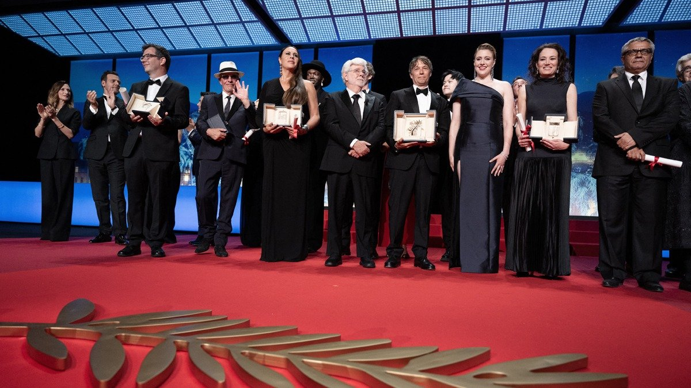

# Вектор на утешение. Завершился Каннский фестиваль: зрительское кино победило авторское

- **URL:** https://novayagazeta.ru/articles/2024/05/27/vektor-na-uteshenie
- **Дата:** 2024-05-27
- **Автор:** Лариса Малюкова

## Вектор на утешение

## Завершился Каннский фестиваль: зрительское кино победило авторское

Члены жюри и победители 77-го ежегодного Каннского кинофестиваля. Фото: Niviere David / ABACAPRESS.COM

Во всяком случае, жюри Греты Гервиг именно так решило.

«Золотая пальма» милейшей новогодней сказке «Анора» — картине про бедную золушку-стриптизершу Ани (Майки Мэдисон), вокруг которой водят хороводы неприятные, не уважающие законы русские и армяне, понравилась всем. Нам тоже, потому что наши соотечественники оказались на высоте. Марк Эйдельштейн в роли безбашенного загульного мажора, сынка олигарха, Дарья Екамасова и Алексей Серебряков — его родители, которые срочно несутся во враждебную Америку вырывать сынка из лап «шалавы» (папаше весело, мамаша лютует). Карен Карагулян и Ваче Товмасян — помощники олигарха в Америке. И, наконец, Юра Борисов, джокер в сюжетной колоде: молчаливый охранник превращается в рыцаря — единственного человека в веселом подвижном зоопарке. Фильм Шона Бейкера («Мандарин», 2015; «Проект Флорида», 2017; и «Красная ракета», 2021) — микс «Красотки» с комедиями Роя Хилла, Фрэнка Каапры и армянской свадьбой.

Шон Бейкер. Фото: AP / TASS

Бейкер из фильма в фильм исследует миропорядок секс-индустрии. Во время пресс-конференции он признался, что посвятил свой фильм всем секс-работникам, он сочувствует этим «невидимым обществу беззащитным людям, и кто их защитит, если не кино».

Трудно согласиться с увидевшими в этом приятном во всех отношениях и все же банальном фильме — феминистские нотки. У Бейкера, бесконечно любующегося секс-деятельностью героини, объективации хоть отбавляй. Хотя упрекали в этом, напротив, Паоло Соррентино, который в «Партенопе» по-прежнему ищет, находит, а потом нескончаемо любуется «великой красотой». Только вдохновляется не Римом, а Неаполем, с которым отождествляет прекрасную героиню.

Кадр из фильма «Анора»

Заметим, что довольно часто «Пальма» уходит не к самым сильным, с точки зрения кинематографического языка, прорывным картинам.

Забытая «Дружеская печать» обошла «Ночи Кабирии», «Канал» Вайды и «Седьмую печать» Бергмана. Слезливая «Комната сына» Моретти «превзошла» «Малхолланд Драйв», а заодно Годара, Риветта и Цай Минляна. Не лучший фильм Одиара «Дипан» обыграл мощнейшую фреску о Холокосте «Сын Саула».

За исключением этого недоразумения, наградной список вполне пристойный. И едва не все картины в нем могли быть выбраны жюри для роли триумфатора. Хотя очень жаль, что совершенно проигнорировали Копполу, Соррентино, Чжанке.

Фильм Мохаммада Расулофа «Семя священного инжира», которому пророчили «Пальму», получил утешительный спецприз жюри. В ограниченном пространстве притчи автор, совершивший 28-дневный побег из Ирана, рассказал о главной боли его родины и всего мира: авторитаризме и теократии, беспощадной мизогинии, жесточайшей борьбе с инакомыслием и инакомыслящими.

Кадр из фильма «Семя священного инжира»

Камерное поначалу, с телевизионной картинкой кино Расулоф разворачивает в аллегорию о режиме-насильнике, для которого жестокость, произвол — способ существования. Но еще это кино, снимаемое с риском для жизни, кино о разрыве в ментальности разных поколений. Смирившихся отцов и бунтующих детей. И в фильме есть поразительная хроника иранских протестов из соцсетей, снятая на телефоны.

Выбери жюри эту картину как пример совпадения гражданского поступка и кинематографического высказывания, это решение было бы и художественным, и политическим жестом, их решение во многом оправдывало бы существование фестиваля в нынешнем страшном мире.

Впрочем, и программа, и итог Каннского кинофестиваля указывает иной вектор развития современного авторского мирового кино. Оно старается быть ближе к народу, понятней. Если не развеселить, то успокоить.

## Матриархат

Главная сквозная тема и конкурса, и прилегающих секций — судьба женщины, время женщины, право женщины на власть, с которой не справляются мужчины. Ну правда, во что они превратили мир.

В боди-хорроре «Вещество» Коралли Фаржеа хлестко обличает male gaze в кино, взгляд на женщину как сексуализированный объект, которому запрещено… стариться. Деми Мур в этой веселой, залитой кровью фантастике бесстрашна и великолепна. Жаль, ей не досталась награда.

Читайте также

Вещество молодости и смерти

Неожиданно боди-хоррор — в его различных киновоплощениях — вышел на первый план Каннского смотра

Поддержите нашу работу!

1000 500 300 Нажимая кнопку «Стать соучастником», я принимаю условия и подтверждаю свое гражданство РФ

Если у вас есть вопросы, пишите [email protected] или звоните:+7 (929) 612-03-68

А досталась она всем актрисам «Эмилии Перес» Жака Одиара, провокационный, дерзкий фильм-мюзикл о том, как жуткий лидер картеля в благородную донну Розу… то есть благородную донну Эмилию Перес из Мексики — превратился. И теперь вся страна идет к ней за помощью: разыскивать пропавших без вести родных. Но пропали-то они из-за мафии. Так замыкается круг добра и зла, в центре которого донна Эмилия и ее доблестная адвокатша Рита (Зои Салдана).

Кадр из фильма «Эмилии Перес»

В иранском «Священном семени инжира» — просто яростный бунт вооруженных женщин: матери и двух взрослых дочек против тоталитарного отца, символа страны, закона и бога в патриархальной стране. Допекло.

Современный классик Цзя Чжанке в «Поколении романтиков», оставшемся без наград, через судьбу женщины исследует историю и судьбу страны. На наших глазах меняются обе: и страна и женщина, и в этих переменах каждая испытывает боль потерь.

В нежной меланхолической истории «Все, что мы представляем как свет» постановщица Паял Кападия рассказывает о трех современницах. Две сестры работают в госпитале. Их подруга — вдова, никак не может найти официальные документы о муже. Здесь женщины сами определяют свою судьбу, а мужчины лишь стараются к ним прислушиваться. Кападия не отворачивается от картин бедности, тяжкости жизни, но обнаруживает свет в трудной судьбе своих героинь. Фильм получил Гран-при фестиваля. И это большое событие для Индии, впервые за 30 лет оказавшейся в основном конкурсе — после «Судьбы» Шаджи Н. Каруна.

Кадр из фильма «Все, что мы представляем как свет»

Получая награду, Паял сказала, что хочет, чтобы в ее фильме прозвучало послание «солидарности» среди женщин: «Это ценность, к которой мы все должны стремиться».

В позабытой жюри «Птице» Андреа Арнольд двенадцатилетняя одинокая провинциальная девчонка Бейли (Никия Адам) встречает вроде бы взрослого, но инфантильного и странного Берда (Франц Роговски). И эта встреча не только дарит ощущение свободы, но позволяет набраться храбрости, чтобы взять ответственность за свою жизнь и жизнь взрослых детей: своего отвязанного отца (Барри Кеоган) и нового друга — Птицу. Здесь дети и взрослые меняются местами… прямо как в реальности.

Женщины на экране, в призовом списке, в жюри большинство женщин. Еще немного, и о своих ущемленных правах заголосят мужчины.

## Политика где?

Она была осознанно вытеснена за пределы красной дорожки. Почти никаких выступлений, транспарантов. Устроители фестиваля предложили сосредоточиться участникам форума на экране, там демонстрировать политические баталии, антивоенные призывы. И все же политика прорывалась в залы дворца. На пресс-конференции фильма «Лимонов. Баллада об Эдичке» режиссер Кирилл Серебренников демонстрировал фото Жени Беркович и Светланы Петрийчук. Рассказывал о суде над ними. Мохаммад Расулоф пришел на премьеру своего фильма с фотографиями своих главных актеров Миссах Зарех и Сохейле Голестани. Им запрещен выезд из Ирана. А актрисе Миссах Зарех грозит новый срок и жестокие репрессии после шумной премьеры в Каннах.

Читайте также

Лимонов — как «лимонка»

Канны увидели и оценили новую работу Кирилла Серебренникова

Чем всем сидящим под бомбежками и в тюрьмах, обездоленным и угнетенным может помочь современный кинематограф? По версии Канн-77, выраженном в окончательном решении жюри, — только утешать, радовать, успокаивать. Нужен релакс? Идите в кино.

Лариса Малюкова ведет телеграм-канал о кино и не только. Подписывайтесь тут.

### Этот материал входит в подписку

Смотровая площадкаКино с Ларисой Малюковой

### Добавляйте в Конструктор свои источники: сайты, телеграм- и youtube-каналы

Войдите в профиль, чтобы не терять свои подписки на разных устройствах

Поддержите нашу работу!

1000 500 300 Нажимая кнопку «Стать соучастником», я принимаю условия и подтверждаю свое гражданство РФ

Если у вас есть вопросы, пишите [email protected] или звоните:+7 (929) 612-03-68
