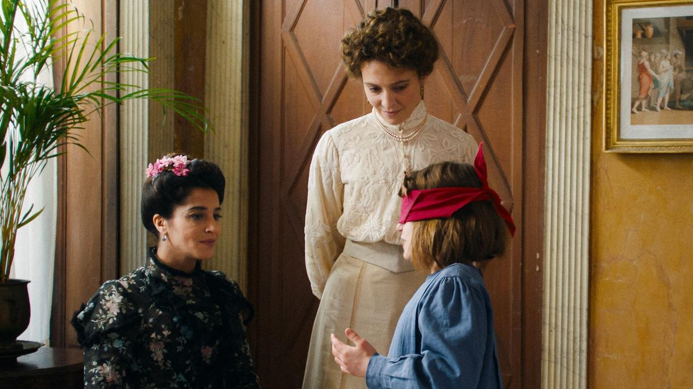

# Пансион благородных девиц. С 30 мая на экранах дебютный фильм «Монтессори: воспитание любовью» французского режиссера, актрисы и писательницы Леа Тодоров

- **URL:** https://novayagazeta.ru/articles/2024/05/30/pansion-blagorodnykh-devits
- **Дата:** 2024-05-30
- **Автор:** Лариса Малюкова

## Пансион благородных девиц

## С 30 мая на экранах дебютный фильм «Монтессори: воспитание любовью» французского режиссера, актрисы и писательницы Леа Тодоров

Кадр из фильма «Монтессори: воспитание любовью»

Фильм о жизни итальянского врача и педагога Марии Монтессори, разработавшей уникальную систему преподавания, основанную на идеях человечности, свободного воспитания и уважения к личности, с акцентом на развитие органов чувств — в специально организованной среде.

Самой Марии Монтессори (Жазмин Тринка) с большим трудом удалось пробиться сквозь патриархальные заслонки, стать известным врачом и педагогом.

Ей приходится идти вопреки железобетонным устрашающим предрассудкам директоров учебных заведений и педагогов. «Сколько можно заниматься дегенератами, они — угроза национальному здоровью!»; «Этих полубезумных обезьян нельзя объединять с другими детьми!»; «И зачем тратить на них деньги!».

Монтессори доказывает на протяжении многих лет, что люди, которых называли «идиотами», «нейродивергентами», «детьми-инвалидами», могут интегрироваться в общество.

Кадр из фильма «Монтессори: воспитание любовью»

В основе принципов ее системы — самостоятельность ребенка; свобода в установленных границах; психологическое, физическое и социальное развитие. А еще любовь и внимание.

1900-й. Однажды в клинику Марии является Лили д'Аланжи (Лейла Бехти), парижская куртизанка, которая живет бурной светской жизнью. Внезапное (после смерти ее матери) появление в ее жизни дочери Тины (Рафаэль Сонневиль-Каби) кажется светской львице настоящей катастрофой. Это ее позор. Она вообще представить себе не может, как при ее образе жизни, бесчисленных поклонниках она может заботиться о своей дочери с задержкой в развитии. Честно говоря, она просто стесняется собственного ребенка.

Ребенку вроде бы 9 лет (в чем мамаша уверена), но она отстает в развитии и кажется совсем малышкой. Боясь слухов, Лили бежит в Рим с Тиной, которую представляет как «дочь моего кузена-идиота». В Риме она узнает о клинике, которая занимается «подобными случаями». Умоляет Марию Монтессори, которая управляет учреждением вместе со своим партнером Джузеппе ( Раффаэле Эспозито), забрать малышку. По сути, хочет любой ценой от нее избавиться. Но мест на полный пансион нет. Это образовательное учреждение, а не сиротский дом. Можно лишь каждый день приходить с ребенком и заниматься. К тому же Монтессори сразу говорит, что причина многих проблем Тины — дефицит внимания.

Кадр из фильма «Монтессори: воспитание любовью»

Поддержите нашу работу!

1000 500 300 Нажимая кнопку «Стать соучастником», я принимаю условия и подтверждаю свое гражданство РФ

Если у вас есть вопросы, пишите [email protected] или звоните:+7 (929) 612-03-68

Сама же Мария настолько увлечена работой, что отклоняет предложение руки и сердца Джузеппе, хотя у них есть внебрачный ребенок.

Постепенно две женщины, каждая из которых несет свою тайну и свое бремя, узнают друг друга, создают союз, который в каком-то смысле предвосхищает феминистскую революцию. Они пытаются убедить соотечественниц в том, что женщины имеют право сами выбирать свою судьбу, профессию, место учебы, а не быть рабынями материнства. К тому же, их дружба помогает каждой из них обрести полноту жизни. Удивительно, что

во многих ролях этой незамысловатой картины, в том числе главных, снимались дети и подростки с реальными двигательными или когнитивными задержками развития. Так сам процесс съемок стал инклюзивным проектом.

Лариса Малюкова ведет телеграм-канал о кино и не только. Подписывайтесь тут.

### Этот материал входит в подписки

Смотровая площадкаКино с Ларисой Малюковой

Культурные гидыЧто читать, что смотреть в кино и на сцене, что слушать

### Добавляйте в Конструктор свои источники: сайты, телеграм- и youtube-каналы

Войдите в профиль, чтобы не терять свои подписки на разных устройствах

Поддержите нашу работу!

1000 500 300 Нажимая кнопку «Стать соучастником», я принимаю условия и подтверждаю свое гражданство РФ

Если у вас есть вопросы, пишите [email protected] или звоните:+7 (929) 612-03-68
