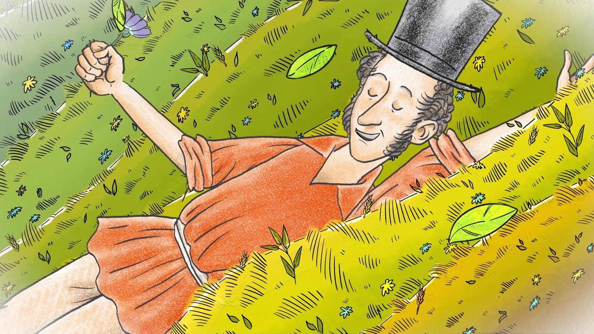

# Пушкин по пушкинской карте. К 225-летию солнца русской поэзии на экраны выходит полнометражный рисованный фильм-посвящение «Пушкин и… Михайловское. Начало»

- **URL:** https://novayagazeta.ru/articles/2024/06/04/pushkin-po-pushkinskoi-karte
- **Дата:** 2024-06-04
- **Автор:** Лариса Малюкова

## Пушкин по пушкинской карте

## К 225-летию солнца русской поэзии на экраны выходит полнометражный рисованный фильм-посвящение «Пушкин и… Михайловское. Начало»

Кадр из мультипликационного фильма «Пушкин и… Михайловское. Начало»

Листочки-строчки разлетаются в разноцветных карандашных набросках. Падают в руки самым разным читателям и читательницам. Рифмы, в том числе и крамольные, с радостью передаются из уст в уста. Но у власти, которой нашептали на ухо донос, длинные руки, схватит за шкирку, то есть за пелеринку, да и отбросит… в ссылку.

Рисованное в компьютере в мягких тонах с острой графикой кино делится на маленькие главки и больше похоже на сериал (кстати, на «Кинопоиске» проект существует в двух форматах).

«Пушкин и Русалка», «Пушкин и Чижик», «Пушкин и соседи», «Пушкин и аппетит». Байки, биографические детали, придуманные микро-сюжеты связаны сквозными персонажами: сосланным в глушь, в деревню поэтом, его няней Ариной Родионовной, Котом и Псом, проживающим в Михайловском с ними.

Картинка упрощенная, незамысловатая, фоны едва намечены. Знаменитый дом в Михайловском — скорее сиреневая тень того самого дома. Елки в лесу — карандашом рисованные.

Кадр из мультипликационного фильма «Пушкин и… Михайловское. Начало»

Сюжеты толпятся, монтируются рандомно. То расстроенного поэта Кот в бане попарит. А Няня накормит, приголубит, укроет. То гетевский Мефистофель попытается в азартную игру вовлечь. В девушке деревенской ему «мимолетное виденье» почудится.

А в реке темной и холодной Русалка глазами зелеными сверкнет. Но для успокоения душевного Пушкин семечки покупает… на пушкинскую карту. Местами все это даже мило. Но вдруг, как обухом по голове, среди неги милоты, громким хорошо поставленным чтецким голосом, словно со сцены Кремлевского дворца съездов, баритон читает «К морю»: «И долго, долго помнить буду в вечерние часы твои скалы!..»

Вот батюшка приехал, то-то радости. Хотя мы помним, что отец поэта, Сергей Львович, дублировал полицейский надзор собственным, так сказать, светским. И их двойной портрет на стене в знак ссоры раскалывается. Являются докучливые соседи с визитами, а хозяин дома с заднего двора на коня прыг… и скорее в Тригорское к любимым дамам сердца.

Кадр из мультипликационного фильма «Пушкин и… Михайловское. Начало»

Среди остроумных моментов — каверзы Кота с Псом, которые меняют в писанном от руки приглашении имя няни «Арина» — на «Алина», и вот уже у поэта головокруженье: сама Алина гостевать его зовет. Краснея и бледнея, он уготовляется, меняет парики, наряды (путая женские и мужские): «Алина, сжальтесь надо мною! — мысленно взывает он к падчерице помещицы из Тригорского Прасковьи Осиповой. — Ах, обмануть меня не трудно! Я сам обманываться рад!». Среди шаржированных персонажей, помимо Пушкина и Арины Родионовны, лицейские друзья Пущин и Дельвиг, хозяйка Тригорского Осипова-Вульф, ее падчерица Анна Осипова и племянница Анна Керн, министр Нессельроде, агент Бошняк.

Музыка Вячеслава Круглика, названная в пресс-релизе «чудесной», совершенно обезличена, компилятивна и кажется сочиненной компьютером.

В финале Пушкин помогает своему собрату по взглядам Дон Кихоту биться с местной ветряной мельницей. А потом… вместе задушевно чинить сокрушенные ими лопасти.

Поддержите нашу работу!

1000 500 300 Нажимая кнопку «Стать соучастником», я принимаю условия и подтверждаю свое гражданство РФ

Если у вас есть вопросы, пишите [email protected] или звоните:+7 (929) 612-03-68

Кадр из мультипликационного фильма «Пушкин и… Михайловское. Начало»

Впрочем, заканчивается фильм внезапно, словно авторам надоело рассказывать байки. Кодой прозвучит торжественно тем же баритоном произнесенный «Дар напрасный, дар случайный» — хотя это горчайшее стихотворение, сочиненное двадцатидевятилетним поэтом в момент острого жизненного кризиса, сразу по окончании следствия по стихотворению «Андрей Шенье», предательства, как ему казалось, друзей… Стихи как вызов, брошенный небесам.

Нарисовал фильм художник театра Игоря Шаймарданов. У него про Пушкина десятки произведений и целые серии: «Ситцевый Пушкин», «Михайловские царапки», «Александр Сергеевич и Арина Родионовна»…

Режиссер Екатерина Гаврюшкина.

А сняли фильм на студии «Муха», которая уже более 20 лет делает и анимированные клипы для отечественных исполнителей, и компьютерную графику для сериалов и игровых фильмов, и созданные собственными силами мультипликационные фильмы.

Вердикт:

кино не ужасное, но необязательное, очень неровное с точки зрения просвещения, мало что истолковывающее.

Возможно, авторы слишком спешили к юбилею, и эта торопливость многое объясняет.

«Пушкин и… Михайловское. Начало» можно посмотреть в кинотеатрах России с 6 июня, в том числе по Пушкинской карте.

Лариса Малюкова ведет телеграм-канал о кино и не только. Подписывайтесь тут.

### Этот материал входит в подписки

Смотровая площадкаКино с Ларисой Малюковой

Культурные гидыЧто читать, что смотреть в кино и на сцене, что слушать

### Добавляйте в Конструктор свои источники: сайты, телеграм- и youtube-каналы

Войдите в профиль, чтобы не терять свои подписки на разных устройствах

Поддержите нашу работу!

1000 500 300 Нажимая кнопку «Стать соучастником», я принимаю условия и подтверждаю свое гражданство РФ

Если у вас есть вопросы, пишите [email protected] или звоните:+7 (929) 612-03-68
