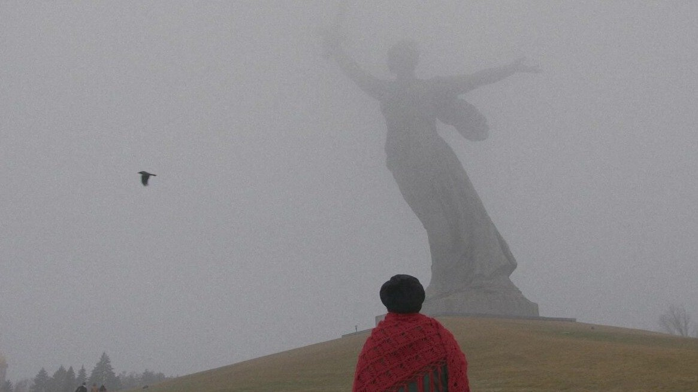

# «В России только три пути: вебкам, закладки или IT». Фильм Ильи Леутина «Мы жили счастливо» о конфликте поколений и беззащитности перед государством. Редкий пример хорошего кино про нашу реальность

- **URL:** https://novayagazeta.ru/articles/2024/06/06/v-rossii-tolko-tri-puti-vebkam-zakladki-ili-it
- **Дата:** 2024-06-06
- **Автор:** Лариса Малюкова

## «В России только три пути: вебкам, закладки или IT»

## Фильм Ильи Леутина «Мы жили счастливо» о конфликте поколений и беззащитности перед государством. Редкий пример хорошего кино про нашу реальность

Кадр из фильма «Мы жили счастливо»

Удивительное рядом. При тотальном эскапизме нового российского кино, не просто избегания проблем, болевых зон, но именно побега — в теплое, пушистое, семейное, чебурашковое… появился фильм, который с этой самой реальностью ведет острый диалог. Негромкую, камерную картину режиссера и писателя Ильи Леутина о нынешнем конфликте поколений показали на фестивале «Новое движение». И хотя фильм получил награду лишь за лучшую женскую роль (Валентина Грачева), именно эта лента, снятая, по словам ее автора, всего лишь за 4000 долларов, стала главным событием смотра.

Живет в маленьком уютном городке Волжский бабушка Людмила Ивановна с внуком Алешей. Отца у мальчика нет, мать — в психоневрологическом диспансере. Вот бабушка и опекает любимого шестнадцатилетнего Алешу со всей силой своей любви (временами навязчивой). Оладушки и каша, супчик и котлетки. Чаю друзьям предложить с шарлоткой.

У бабушки по телику беспрестанно орет Соловьев. Бабушке это вообще не мешает, ей под телик даже лучше дремлется.

Старшеклассник Алеша готовится на филфак в универ, его бесит телик, у него первая любовь, и он никак не выучит некрасовское «Кому на Руси жить хорошо?». А и правда, «кому живется весело, вольготно на Руси»?

Людмила Ивановна гуляет с двумя собаками-подобрышами, одна из них трехлапая. Еще бабушка ходит на курсы компьютерной грамотности для пенсионеров. Внучок дает ей читать полузапрещенного Сорокина, бабушка отмахивается: обложка хорошая, с Михаилом Жаровым, внутри гадость. Бабушка-то понимает. Она в прошлом учительница с тридцатилетним стажем. И говорит как учительница из тех советских времен, когда призывали к доброму светлому, воспевали Корчагина с его узкоколейкой и молодогвадрейцев. А еще вспоминает цветущий инжиром советский Баку, в котором была счастлива.

Кадр из фильма «Мы жили счастливо»

И вот в этот тихий счастливый семейный омут рано утром врывается ОМОН. Ищут материалы экстремистского содержания. Что? Это все из-за кружки с надписью «Мразь»? Из-за разноцветных шевронов? Из-за компьютера? Лешенька, объясни им, ведь компьютер у многих есть.

Собаки дрожат, запертые в ванной, Лешу уводят за «репосты»: какие-то там «националистические», кого-то там он своими шутейными картинками унизил или оскорбил.

Потерявшая дар своей гладкой учительской речи бабушка остается одна в центре развороченной малогабаритки. В центре своей развороченной жизни. И соседки во дворе смотрят с подозрением: воспитала хакера, «милиция просто так не приедет». И начинаются бабушкины хождения по мукам. Здесь и мутные забегаловки с восточным духом, в которых свои подпольные законы. И суд, где лощеный прокурор щеголяет словами и формулировками, требуя жесткого приговора для «представляющего опасность для общества» растерянного мальчишки. И судья, охотно идущая навстречу этим выглаженным, с иголочки формулировкам ради жесткого приговора (чтоб другим неповадно было). Кажется, все они разыгрывают спектакль, а роли выучены заранее, лишь имена подсудимых меняются. Кажется, все это вербатим, списанный с десятков подобных судебных заседаний.

Кадр из фильма «Мы жили счастливо»

И лишь одна Людмила Ивановна искренне, почти по-детски поражается происходящему.

Она бросает «высокому суду»: «Как вам не стыдно!» — и интересуется у прокурора, как ему спится. А спится ему отлично, он же просто свою работу хорошо делает. Не поэтому ли оправдательных приговоров, как объясняет бабушке смурной адвокат, которого им назначили, нет.

Поддержите нашу работу!

1000 500 300 Нажимая кнопку «Стать соучастником», я принимаю условия и подтверждаю свое гражданство РФ

Если у вас есть вопросы, пишите [email protected] или звоните:+7 (929) 612-03-68

Этот фильм хочется пересказывать, потому что все сюжетные повороты словно скачаны из запрещенных соцсетей. Или из жизни. Как подтолкнули умные люди пенсионерку ради огромной взятки судье стать закладчицей, как завела она Signal для тайных контактов. Как уговаривала она, представитель поротого поколения, строптивого внука признать вину и сдаться в «дурку». И натолкнулась на стену: те самые ценности, понятия о правде, честности и справедливости, которые превозносила и в школе, и дома. Как пришли одноклассницы Алеши и записывали вирусное видео с непокорной бабушкой с хештегом «Вместе мы сила». Как стала учить она новый язык, разбираясь в мудреных словах: «хештег», «мем», «репост». И как попала — и мы вместе с ней — на школьный спектакль. Алешины одноклассницы вместо объявленной инсценировки «Некрасовские русские женщины» рассказали в духе акции объявленного в розыск «иноагента» Оксимирона «Сядь за текст» — о репрессированных российских писателях и поэтах (от Достоевского до Цветаевой, от Мандельштама до Булгакова, от Есенина до Бродского). Школьницы называли и называли имена инженеров человеческих душ, складывая на сцене гору из книг приговоренных за свое творчество авторов из школьной программы. Большую, но очень хрупкую, неустойчивую гору. Вот-вот рассыплется, как жизнь Леши, мечтающего о филологии, и жизнь его бабушки, в прошлом учительницы русского языка и литературы.

Кадр из фильма «Мы жили счастливо»

В этом обманчиво простом, но продуманно сложенном кино много переплетенных мотивов и образов. В одной из сцен маленькая Лешина бабушка идет по ступенькам, словно к божеству, спрятанному в облаках, к гигантскому монументу Родины-матери, зовущей своих детей на бой с врагом. Даже у внезапного стука в дверь в фильме — своя партия. «Так судьба стучится в дверь», — сказал о главном мотиве рвущей сердце Пятой героической симфонии Бетховен. В фильме этот стук-грохот вовсе не музыкальный и не сулит героям ничего хорошего. Как объясняют Людмиле Ивановне, «в России только три пути: вебкам, закладки или IT». Вебкам — куда ей, уже поздно, айтишницей тоже не стать, остаются наркотики?

Кадр из фильма «Мы жили счастливо»

Никак не могли нащупать героя в новом российском кино. А вот в маленьком, скромном, временами наивном фильме, снятом за копейки, продолжающем традицию кино морального выбора Асановой и Приемыхова, кажется, нащупали. Это Людмила Ивановна Валентины Грачевой. Осколок прошлого, который оказался в сердцевине нового больного времени. Бабушка, как и миллионы ее сверстниц, разделенная с внуком дистанцией огромного размера. Но она на наших глазах преодолевает эту пропасть своей любовью. Верой не в систему, не в государство. А в человека. В человеческое. Ошибающаяся. Но научившаяся отличать ложь от правды.

Ее монолог в суде о прошлой счастливой жизни, которую у них с внуком отобрали, сродни лучшим монологам в отечественном кино — от Веры Марецкой в фильме «Член правительства» («Вот стою я перед вами, простая русская баба…») до Ирины Купченко в картине «Без свидетелей»

(«Ну как нас бросают наши мужья…»). И актриса Волжского драматического театра Валентина Грачева, шесть десятилетий отдавшая сцене, дебютантка в кино, играет так, как не сыграла бы и опытная киноактриса. На наших глазах ее театральный способ существования — как вышколенность учительницы со стажем с ее неумеренной, выспренной, котурновой романтикой — исчезает. И на экране остается человек с мукой непонимания жуткого, кафкианского абсурда, в который превращается реальность. Во время вручения награды взволнованная актриса призналась, что ужасно боялась сниматься, боялась провала. Зал аплодировал ей стоя.

Лариса Малюкова ведет телеграм-канал о кино и не только. Подписывайтесь тут.

### Этот материал входит в подписки

Смотровая площадкаКино с Ларисой Малюковой

Культурные гидыЧто читать, что смотреть в кино и на сцене, что слушать

### Добавляйте в Конструктор свои источники: сайты, телеграм- и youtube-каналы

Войдите в профиль, чтобы не терять свои подписки на разных устройствах

Поддержите нашу работу!

1000 500 300 Нажимая кнопку «Стать соучастником», я принимаю условия и подтверждаю свое гражданство РФ

Если у вас есть вопросы, пишите [email protected] или звоните:+7 (929) 612-03-68
