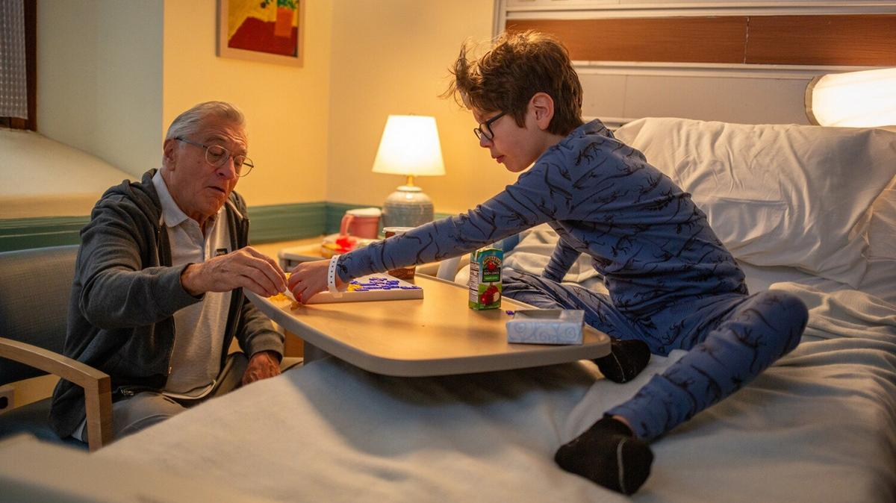

# Каждый голос важен. Как фильмы об аутистах описывают наше время

- **URL:** https://novayagazeta.ru/articles/2024/06/12/kazhdyi-golos-vazhen
- **Дата:** 2024-06-12
- **Автор:** Лариса Малюкова

## Каждый голос важен

## Как фильмы об аутистах описывают наше время

Кадр из фильма «Папа». Источник: Кино-Театр.РУ

Главная премьера месяца — драмеди «Папа» (оригинальное название «Эзра») Тони Голдуина о взаимоотношениях одного не самого дисциплинированного отца с сыном-аутистом. Кино про то, как дети учат нас понимать и принимать этот мир, придуманный не нами, а заодно и себя самих.

Начинается действие в обычном стендап-клубе. Очередной выступающей Макс (Бобби Каннавале) рассказывает случаи из своей жизни, в том числе о своем сыне-аутисте Эзре. Зрители узнают, что ребенок не говорил очень долго, а затем его стало трудно контролировать. Макс в своем выступлении фраппирует, смешивает фантазию и правду, сарказм (на грани цинизма) и нежность, забавное и драматическое. Завсегдатаи подобных концертов не совсем понимают, как реагировать на эту исповедь. Смеяться? Правда? А можно ли смеяться над расстройством психики? Да и папаша этот не производит впечатления ответственного взрослого, воспитывающего особенного ребенка.

Так с неудобных вопросов и начинает разматываться клубок этой истории.

Макс, экс-писатель, ставший стендапером, прямо скажем, не слишком успешным, живет в доме со своим отцом-занудой Стэном (Де Ниро), который точит его с утра до ночи. Он, как и его отец, в разводе. Вместе с бывшей женой воспитывает 11-летнего сына Эзру с синдромом аутизма. Любят Эзру без меры и без оглядки. Причем любят его по-разному. Мать Дженна (Роуз Бирн) согласует свои поступки с правилами общества. И когда их сынишка вылетает с треском из школы, она спешит оправдать учителей. Ну ведь он и правда вел себя не слишком адекватно, с ним же трудно. Может, стоит согласиться с педагогами и отдать подростка в специнтернат? Но с этим не хочет смириться Макс. Он вообще не хочет и не может смириться с болезнью. Его сын такой же, как другие обычные мальчишки, просто ему надо немного больше внимания.

И эта страстная, непедагогичная любовь дает ребенку чувство эмоциональной безопасности.

Когда после очередного инцидента мальчика решают все же отдать в специальное учебное заведение, Макс, сам как сорванец, поднимается по пожарной лестнице, хватает Эзру из постели и увозит с собой в дальнее путешествие. Ведь агент Макса Джейн (Вупи Голдберг) обещает ему выступления в комедийном подвале в Нью-Йорке — на шоу звезды стендапа Коэна. Вот они и едут. Это путешествие в чем-то напомнит черную комедию «Маленькая мисс счастье». Такой же сплав горя, смеха, сентиментальности и любви внутри одной неправильной семейки.

Кадр из фильма «Папа». Источник: Кино-Театр.РУ

«Папа» — роуд-муви с несколькими сентиментальными, но душераздирающими сценами — путь взаимопонимания, труд принятия, стремления найти правильный способ поддержать Эзру. Причем касается это не только Макса, готового за сына лезть в драку и воевать со всем миром. Но и мамы подростка, которая заявила о киднеппинге в полицию, а потом сожалела и бросилась за беглецами вслед вместе со своим неуживчивым экс-свекром, застегнутым на все пуговицы Стэном. Стэном, который один поднимал Макса, ради которого потерял и мечту своей жизни.

Все они учатся у Эзры его редкой способности всегда говорить (как минимум себе) правду и прощать взрослым их ошибки. Хотя и в заблуждениях Макса очень много ценной информации. Например, про то, что все дети особенные. Но лишь в этой трудной дороге он научится действительно верить в Эзру как в самостоятельную личность. А еще у них с сыном поразительный доверительный диалог, который они ведут цитатами из любимых фильмов. На дне этих цитат — готовность встать друг за друга, поддержать его в любой ситуации: «Ты упал на лед, я приму шайбу!»

За историей сложно устроенной неблагополучной семьи Макса маячат неразрешимые вопросы о том, что есть нормальность и как найти гармонию между социальными нормами и идеей воспитания уникальности.

Поддержите нашу работу!

1000 500 300 Нажимая кнопку «Стать соучастником», я принимаю условия и подтверждаю свое гражданство РФ

Если у вас есть вопросы, пишите [email protected] или звоните:+7 (929) 612-03-68

Сценарий написал драматург Тони Спиридакис («Бруклинская рокировка»), воспитывающий сына с расстройством аутического спектра. А режиссер Тони Голдуин — крестный отец этого мальчика. И в главной роли снялся одиннадцатилетний дебютант Уильям Фитцджеральд, невероятно похожий на сына Спиридакиса — с такой же беззащитностью и с такой же обостренной чувствительностью к окружающему миру. Их связь, непрекращающийся внутренний диалог с Максом Каннавале — какая-то необъяснимая, чудная химия.

Кадр из фильма «Папа». Источник: Кино-Театр.РУ

Лариса Малюкова ведет телеграм-канал о кино и не только. Подписывайтесь тут.

## от редакции

Мы считаем тему чрезвычайно важной. По данным ВОЗ, каждый 160-й ребенок в мире рождается с аутизмом. По данным Центра по контролю и профилактике заболеваний США в 2021 году — каждый 44-й.

Поэтому специально для нашего канала «НО. Медиа из России» режиссер Кирилл Верхозин снял картину о семьях с детьми-аутистами из Белгорода. Только представьте себе кошмар их сегодняшней жизни.

Это история нескольких семей, которых опекает благотворительный фонд «Каждый особенный». Его глава Наталья Злобина воспитывает сына Макара с расстройством аутического спектра. В 2024-м, когда начались «прилеты», воздушные тревоги, часть семей были вынуждены переехать из Белгорода в Орел. Часть семей остались. Но всем запредельно больно и тяжело.

Сирены, ракетная опасность, прилеты, обстрелы — тяжелая рутина для жителей Белгорода. Но некоторым новая реальность дается сложнее, чем остальным. Редакция «НО. Медиа из России» поехала в Белгород и Орел, чтобы поговорить с родителями детей с аутизмом. Как изменилась жизнь в Белгороде? Почему некоторые решились уехать? Почему другие остались? И чего больше всего хотят матери особенных детей? Во время ракетной опасности они с детьми днем и ночью идут в ванную. Там вода, и там хотя бы не полетят осколки. А рядом с дверями их квартир приготовлены сумки с документами и с самым необходимым. У них разные политические взгляды и разное отношение к происходящему. Не обо всем скажешь в камеру. Но всем им сегодня запредельно тяжело и больно. А изоляция, невозможность просто выйти на улицу погулять — ухудшает состояние при аутизме. И еще. Во время сирен совсем не слышно голосов, каждый их которых важен.

### Этот материал входит в подписки

Смотровая площадкаКино с Ларисой Малюковой

Культурные гидыЧто читать, что смотреть в кино и на сцене, что слушать

### Добавляйте в Конструктор свои источники: сайты, телеграм- и youtube-каналы

Войдите в профиль, чтобы не терять свои подписки на разных устройствах

Поддержите нашу работу!

1000 500 300 Нажимая кнопку «Стать соучастником», я принимаю условия и подтверждаю свое гражданство РФ

Если у вас есть вопросы, пишите [email protected] или звоните:+7 (929) 612-03-68
