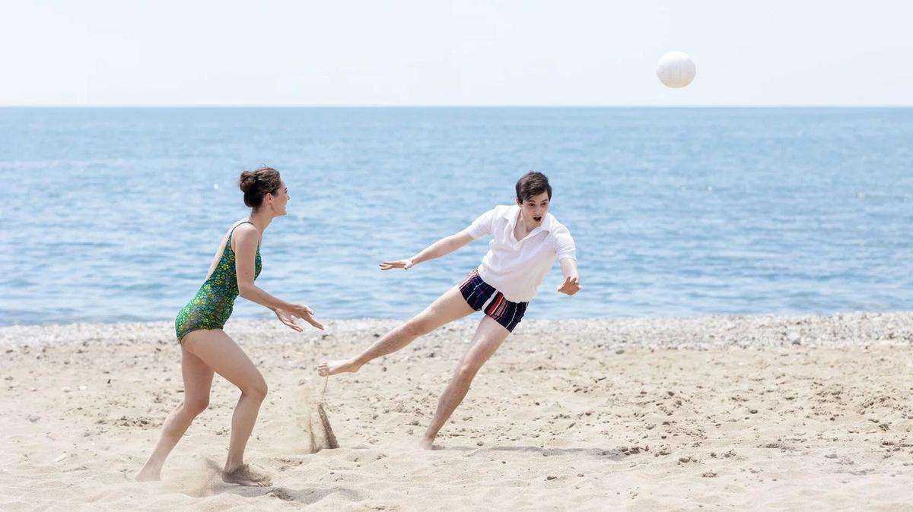

# Комедия для осторожных. Итоги фестиваля новых сериалов «Пилот», где громко смеются, шутят несмешно и царит вториджинал

- **URL:** https://novayagazeta.ru/articles/2024/06/24/komediia-dlia-ostorozhnykh
- **Дата:** 2024-06-24
- **Автор:** Лариса Малюкова

## Комедия для осторожных

## Итоги фестиваля новых сериалов «Пилот», где громко смеются, шутят несмешно и царит вториджинал

Кадр из сериала «Противостояние». Источник: «Фестиваль сериалов «Пилот»

В целом конкурс фестиваля сериалов «Пилот-2024» уступает показам предыдущих лет, хотя есть интересные работы. Но программа очень любопытная, потому что сканирует проблемы и темные пятна социума и индустрии. Что заметно?

Вроде бы много сериалов разного качества про «сегодня» («Хрущевский синдром», «Демис и Марина», «Теория большой лжи», «Черная бухгалтерия», «Убойный отпуск»), но при этом они космически далеки от современности. Согласна: жанровое кино. Однако жанр не является запретной зоной для проблем и вопросов времени. Одна из главных тенденций программы — очевидный и объяснимый эскапизм.

Самый популярный жанр у нас — комедия. Во-первых, это безопасно. Во-вторых, денег дадут. В-третьих, зритель хочет. Но комедия — сложнейший жанр, требующий не только прописанного сценария диалогов, но и режиссуры. Похоже, авторы «Демиса и Марины», «жЫЫЫзни», «Хрущевского синдрома» об этом не догадываются. Им кажется, можно разыгрывать «по ролям» анекдоты и скетчи, как в стендапе. Педалировать акценты и реакции, громко смеяться и несмешно шутить. Многим — в том числе членам жюри — нравится.

Читайте также

Операция «ЫЫЫ»!

Фестиваль новых сериалов «Пилот»: слишком много средних комедий. А что не они — то фильм-шансон, сделанный «для процветания родины». Обзор Ларисы Малюковой

Характерна вторичность. Зачем сочинять новые сюжеты? В моде не только советская идеология — вновь «носят» проверенное временем и испытаниями советское кино. Ладно бы показывали — переснимают. И не только гайдаевские и рязановские комедии под Новый год. Или «Чебурашку» с «Простоквашино». Теперь и сериалы. «Противостояние», например. Забывшие или не ведающие о многосерийном триллере Семена Арановича с Болтневым и Басилашвили будут смотреть не лучшую копию Первого канала. Вот и члены жюри «Пилота» восхитились, они даже дали Тимуру Алпатову приз за режиссуру.

У поразившего многих вердикта жюри, как будто специально высветившего на конкурсе, мягко говоря, спорные картины, могут быть свои обоснования. И не только вкусовые. Индустрия сплетена крепкими и запутанными узами. К тому же на смену «новых тихих», о которых сегодня зачем-то так бурно спорят, пришли «новые осторожные». Сегодня рекомендуется осмотрительность в каждом шаге: как говорить, кого и как снимать, как выбирать лучших. Вот и выходит, что лучший режиссер — Тимур Алпатов, лучший сценарист — Эмиль Никогосян («Беременный», «Мамы-3»)…

О некоторых сериалах подробнее.

## «Эль Русо»

- Компания «Новые люди» при поддержке «ИРИ» для Premier
- Режиссер Сергей Мокрицкий

Кадр из сериала «Эль Русо». Источник: «Фестиваль сериалов «Пилот»

Самый экзотический сериал конкурса. Вдова-староверка Марья (Светлана Иванова получила приз за лучшую женскую роль) растит сына, отказывается выходить замуж, просит главу общины (Борис Каморзин), которая уж какое поколение обитает в «аргентинской Венеции», проведать родителей, живущих в подобной общине в Уругвае. Так Марья с сыном и попадает на вокзал в Буэнос-Айресе. В туалете ее восьмилетний сынишка Илья (Нил Бугаев) оказывается свидетелем убийства полицейского из отдела по борьбе с наркотиками. Ребенку удается хитроумным образом спрятаться. Он единственный свидетель. Но главное — происходит встреча Марьи с полицейским Пабло, он же Павел, эмигрант из России, беспощадный к убийцам, готовый на крайние меры. Мы и знакомимся с ним, когда он почти забивает… убийцу. Не он плохой… работа такая. Интрига закручивается, когда мальчик узнает убийцу не среди членов картеля, а в Кортесе — одном из полицейских. И похоже, что он не один. А значит, опасность угрожает не только Марье, но и Павлу.

В криминальный сюжет вшит миф о ревностном Савле — жестоком гонителе христиан, изменившемся после встречи с Исусом. И после встречи с наивной, но крепкой в своей вере Марье Пабло, видимо, изменится.

## «Взрослые»

- Компания «Мармот» Валерия Тодоровского для Okko

Кадр из сериала «Взрослые». Источник: «Фестиваль сериалов «Пилот»

Поддержите нашу работу!

1000 500 300 Нажимая кнопку «Стать соучастником», я принимаю условия и подтверждаю свое гражданство РФ

Если у вас есть вопросы, пишите [email protected] или звоните:+7 (929) 612-03-68

Режиссерский и сценарный дебют старшей дочери Валерия Тодоровского, продолжательницы славной династии, про трех 25-летних подруг из одной песочницы, выросших на одной даче.

Первая серия похожа на застывшую экспозицию. Мы только знакомимся с героинями. Блогерша Яна (Анастасия Талызина) — самая легкомысленная. Готова изменить парню, с которым живет, увидев молодого продюсера Костю. В детстве Костя тоже жил в их дачном поселке. Убеждена, что любовь — это постель, а секс не любит ленивых.

Самая серьезная — Соня (Стася Милославская). Собирается замуж за парня, с которым живет шесть лет. Но ее первый мужчина слишком уж правильный, поэтому запланированная помолвка может расстроиться.

Культуролог Лиза (Маша Мацель) — странная. Зациклена на том, что забыла выключить плиту. Девственница, хотя давно встречается с парнем. Может, она такая странная из-за маминой послеродовой депрессии.

Рассказывают, что сериал дорогой, хотя снять подобное можно очень дешево. Российский аналог — «Краш-тест» Насти Борисовой, тоже про инфантильность, взросление. Но с драйвом и атмосферой.

## «Хрущевский синдром. Пора взрослеть»

- General Creation для Okko

Кадр из сериала «Хрущевский синдром. Пора взрослеть». Источник: «Фестиваль сериалов «Пилот»

Еще один 23-летний инфантил из обеспеченной столичной семьи. Макса отправляют на «взросление» в бабушкину квартиру в реутовской хрущобе.

Здесь все «особенные», в смысле — выдуманные. Пожившие родители выталкивают из дома сына, потому что… решили завести второго ребенка, а он — «первый кенгуренок все еще в маминой сумке». Даже если это чисто педагогический ход — глупо. Реутово, по мнению авторов, — глухая глубинка, в которой нет интернета, проблемы с водой. Зато люди здесь хорошие. Особенно главная по дому соседка в исполнении Марины Федункив из Comedy Woman (и это уже вторая в конкурсе ее роль подряд, она же играет в криминальной комедии «Черная бухгалтерия» про трех дамочек на розовой машинке, «случайно» миллион угнавших).

Скучно, из рук вон плохо снято и сыграно.

## «Противостояние»

- «ПМ Продакшн» и «Лунапарк» для Первого канала

Кадр из сериала «Противостояние». Источник: «Фестиваль сериалов «Пилот»

Новая экранизация романа Юлиана Семенова.

В середине 80-х многосерийный фильм Семена Арановича с Олегом Басилашвили в роли следователя и Андреем Болтневым в роли Крота буквально пригвоздил миллионы зрителей к экрану. Это был микс настоящего криминального кино с атмосферой, яркими правдоподобными характерами, с черно-белыми под хронику вставками, крепким сюжетом, узнаваемыми деталями. Болтнев был потрясающим Кротом, настоящим опасным затаившимся волком, выгрызающим свою ненаказуемость за преступления.

В роли следователя Костенко в новой версии — Владимир Вдовиченков, предателя и убийцу Кротова играет Алексей Гуськов.

Уже в первых кадрах очевидно, кто злодей. Герои Гуськова и Карины Андоленко совершают убийство пассажира такси под солнечное «Не надо печалиться, вся жизнь впереди». Полковник Вдовиченкова получает задание выяснить, чьи останки обнаружены. Значит, дальше будет, скорее всего, мрачный детектив. Но саспенс, который держал зрителя в первом «Противостоянии» почти до финала, из первой серии улетел и не обещал вернуться.

Сравнение с первой экранизацией явно не в пользу новой. Но зрителя, обожающего советское ретро вроде «Мосгаза» или «Бизона», и эта экранизация, вероятнее всего, удовлетворит.

Читайте также

Суд идет!

Шестой фестиваль российских сериалов «Пилот» открылся историческим детективом «Плевако» с Сергеем Безруковым в главной роли

Лариса Малюкова ведет телеграм-канал о кино и не только. Подписывайтесь тут.

### Этот материал входит в подписки

Смотровая площадкаКино с Ларисой Малюковой

Культурные гидыЧто читать, что смотреть в кино и на сцене, что слушать

### Добавляйте в Конструктор свои источники: сайты, телеграм- и youtube-каналы

Войдите в профиль, чтобы не терять свои подписки на разных устройствах

Поддержите нашу работу!

1000 500 300 Нажимая кнопку «Стать соучастником», я принимаю условия и подтверждаю свое гражданство РФ

Если у вас есть вопросы, пишите [email protected] или звоните:+7 (929) 612-03-68
