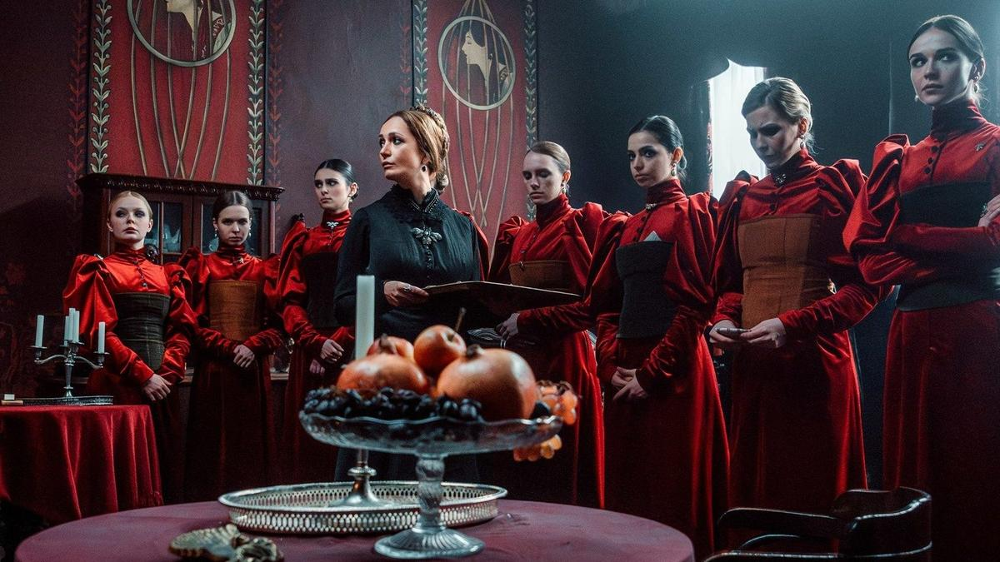

# Богемный Петербург. Элитный бордель. Начало XX века. Самый провокационный и спорный многосерийный фильм фестиваля «Пилот» добрался до зрителя

- **URL:** https://novayagazeta.ru/articles/2024/06/25/bogemnyi-peterburg-elitnyi-bordel-nachalo-xx-veka
- **Дата:** 2024-06-25
- **Автор:** Лариса Малюкова

## Богемный Петербург. Элитный бордель. Начало XX века

## Самый провокационный и спорный многосерийный фильм фестиваля «Пилот» добрался до зрителя

Кадр из сериала «Чистые»

Вышли первые серии многосерийного фильма «Чистые» режиссера Николая Хомерики. Признаюсь, они вызвали ужасно противоречивое впечатление. При этом в них есть определенная привлекательность.

Будем разбираться.

Сценарий Александра Родионова. Это важно, Родионов — это «Дневник убийцы», «Свободное плавание», «Все умрут, а я останусь», «Девятая». А еще это Театр.doc. Ценный, талантливый автор. Сразу было любопытно, как они с арт-режиссером Николаем Хомерики рассмотрят поднятую Куприным проблему проституции как сложного явления, не выпячивая социально-политических или экономических причин. Оставаясь в рамках нравственных норм своего времени. При этом исследуя корни и противоречия.

Богемный Петербург начала ХХ века. Дом княгини Анны Константиновны превращен в пансион для тайных проституток. Матушка-настоятельница элитного борделя Анна Константиновна (Виктория Исакова) с косой-короной на голове установила строгие законы в своем багровом бархатном с хрусталем и серебром королевстве. Когда-то она забрала 13 воспитанниц из приюта или у бездарных родителей. На поверках девушки в нарядной униформе — алые платья с корсетами поверх бархата — отдают ей подарки — заработанное неправедным трудом.

Кадр из сериала «Чистые»

У каждой из них своя роль-маска. Есть юная «дурочка чудесная», она работает около карусели, и покровители слетаются на ее юное лицо, как пчелы на мед. Бледнолицая Стеша (Диана Милютина) — роняет кружевной платок рядом с представительными господами на вокзале: она приехала с визитом в Петербург насладиться «видами». «Черная вдова» в трауре и скорби Софьи Синицыной горюет по мужу и ищет утешения у мужских сердец… и кошельков. В подпольном доме терпимости — строжайший контроль и дисциплина. Матушка может приласкать, а то и наказать до смерти. До первой и последней крови. Для этого у нее есть головорезы. Они и вернут беглянку, и будут пытать ее в специальной «парчовой комнате». Правда, сил у матушки все меньше, поэтому она и пьет «кокаиновую микстуру доктора Кузьмина»… разрушающую ее сердце.

На поверхности — сравнение с британскими «Куртизанками» или нашими «Содержанками». Но это все не точно.

Кадр из сериала «Чистые»

Здесь богатый антураж и насыщенные подробностями кадры соответствуют не повествовательному нарративу — напротив, чересчур концентрированной драматургии, в которой сгущение демонических страстей и эмоций, кипящих безостановочно, выходит на первый план, захлестывая, топя в парах страсти коварства саму историю. Подступаясь к пределам объективизации.

Это пограничье криминальной мелодрамы и треша. Или, если хотите, кича. Сознательного ли случайного — вот вопрос.

Поддержите нашу работу!

1000 500 300 Нажимая кнопку «Стать соучастником», я принимаю условия и подтверждаю свое гражданство РФ

Если у вас есть вопросы, пишите [email protected] или звоните:+7 (929) 612-03-68

У меня пока ответа нет, но следующие серии буду смотреть.

Актеры превосходные. Правда, Марк Эйдельштейн в роли «особенного», немного отстающего в развитии гимназиста, сына миллионера, показался мне впервые неубедительным, пережавшим в красках. Ну вроде бы стилистика кича допускает. Но в любом случае это испытание для молодого актера, которого сегодня вырывают друг у друга продюсеры. И просто нет времени погрузиться в характер, не педалируя красок, присвоить своего персонажа, сделать его объемным.

Кадр из сериала «Чистые»

Девушки продают мужчинам даже не столько тело, сколько иллюзию любви. Но сами страшно в ней нуждаются. А еще мечтают о побеге как глотке свободы.

В этом душном патриархальном обществе мужчины — потребители и покупатели женской красоты — сплошь негодяи, жмоты, твари, злобные импотенты (заметим, что автор сценария и режиссер — не женщины).

Но как им сладить с этим нарядным омутом в багряных тонах и кружевах? Ведь женщина, как подметил Достоевский, «это, брат, черт знает что такое…». Скажу больше, даже черт не знает…

Читайте также

Комедия для осторожных

Итоги фестиваля новых сериалов «Пилот», где громко смеются, шутят несмешно и царит вториджинал

Лариса Малюкова ведет телеграм-канал о кино и не только. Подписывайтесь тут.

### Этот материал входит в подписки

Смотровая площадкаКино с Ларисой Малюковой

Культурные гидыЧто читать, что смотреть в кино и на сцене, что слушать

### Добавляйте в Конструктор свои источники: сайты, телеграм- и youtube-каналы

Войдите в профиль, чтобы не терять свои подписки на разных устройствах

Поддержите нашу работу!

1000 500 300 Нажимая кнопку «Стать соучастником», я принимаю условия и подтверждаю свое гражданство РФ

Если у вас есть вопросы, пишите [email protected] или звоните:+7 (929) 612-03-68
