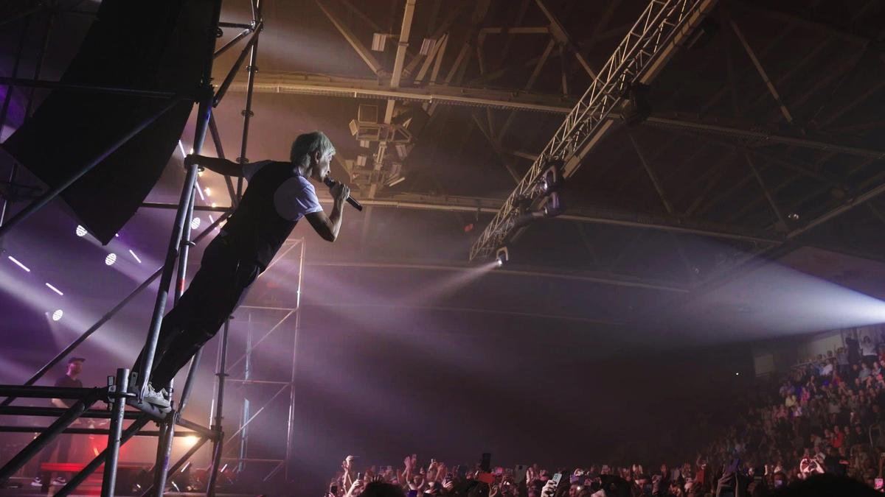

# Легко ли быть Арбениной. На платформе KION с 5 июля можно посмотреть документальный фильм «Арбенина», премьера которого на днях прошла в летнем кинотеатре Summer Cinema by KION

- **URL:** https://novayagazeta.ru/articles/2024/07/05/legko-li-byt-arbeninoi
- **Дата:** 2024-07-05
- **Автор:** Лариса Малюкова

## Легко ли быть Арбениной

## На платформе KION с 5 июля можно посмотреть документальный фильм «Арбенина», премьера которого на днях прошла в летнем кинотеатре Summer Cinema by KION

Кадр из фильма «Арбенина»

Режиссер фильма Ангелина Ашман, возглавляющая департамент документального кино на платформе, она автор известных картин (мне нравится ее портрет актера Георгия Жженова, сталинского сидельца со стажем), в том числе «Кресты» — о прошлом и настоящем легендарной петербургской тюрьмы, первая документальная российская картина, вышедшая на Netflix,

Арбенина сама выбрала режиссера. Она говорит, что не выносит всех этих документальных портретов «от люльки до могилы». Какое кино она бы сама про себя сняла? Немое. Чтобы просто жизнь.

Жизнь в разрезе времени, жизнь, сконцентрированная в одном дне. Предельная (в рамках УК) искренность.

Относительно недавно Арбенина написала на своей странице в запрещенной соцсети: «За этот жестокий год у меня было достаточно времени, чтобы подумать, что делать дальше. Не скрою: были мысли остановиться и замолчать. Открыть бойцовский клуб и получить авиаправа. Серфить и писать книгу. Сходить наконец в кругосветку… но нет. Эта осень сделала меня еще сильнее, и я буду петь. Вопреки тем, кто хочет, чтобы я замолчала, и благодаря тем, кто со мной сейчас и уже навсегда».

В фильме бодро нарезана хроника и фото, в том числе редкие кадры, на которых Диане 4 года, она с цветами бегает по поляне, первые выступления, дуэт со Светланой Сургановой, ставший основой «Ночных снайперов». С ней они расстались натурально в одночасье. Так бывает.

Кадр из фильма «Арбенина»

Один день жизни певицы. Один подробный день с погружением в одну удивительную жизнь. Ей всегда удавалось сочетать предельную искренность с закрытостью. Но в этот день она сделала исключение… для камеры. И этот тоже ее личный отважный выбор. Мы словно в исповедальне. Она рассказывает о былых проблемах с наркотиками и алкоголем в Сан-Франциско. Или как стояла на козырьке гостиницы «Украина», решая — прыгать или оставаться. «Без шанса второго уйду на рассвете».

О крещении в Иерусалиме. Татуировках, среди которых «Стыд» — прямо на кисти, чтобы постоянно видеть. О страсти к книгам. Без них тупеешь, теряешь слова. О намерении сжечь дневники, чтобы твоя внутренняя жизнь осталась с тобой. Без дневников она бы не вытянула, они спасали ее вместо психотерапевта. О своем уходе: как бы сделать так, чтобы не мучать близких, например, как Хэм.

«Я падаю с неба сгоревшей кометой, / Я лбом прижимаюсь к стеклу до рассвета».

О смерти очень близкого, ставшего родным, человека — Ларисы Пальцевой, директоре «Ночных снайперов». О катастрофической — по затратам — работе и муке написания песен. Хотя бывали и исключения-подарки. «Ты дарила мне розы»… Она просто подошла к пианино и как-то сам сложился хит. А когда читала Павича, увидела фразу «Где-то есть корабли», и замаячили очертания знаменитой песни «Катастрофически». Перед премьерой зал пел ее хором.

Кадр из фильма «Арбенина»

«Как вы думаете, мне легко быть с такой дочерью?» — спрашивает мама Галина Анисимовна. Родители развелись, мама ушла от отца. Но Диана его не потеряла. И когда он умирал, кормила его с ложечки «Агушей»… Тут непрошеные слезы катятся дорожкой по щеке: «Так… грим испортила, надо замазать».

Поддержите нашу работу!

1000 500 300 Нажимая кнопку «Стать соучастником», я принимаю условия и подтверждаю свое гражданство РФ

Если у вас есть вопросы, пишите [email protected] или звоните:+7 (929) 612-03-68

Почему столько прощаний, горести.

О смерти отца своих детей она говорить не хочет. Смешно рассказывает, как обнаружила, что беременна. Две полоски! Зовет мужа, тот прибегает, а тест упал в щель в полу. Никак не выковырять. Дети-двойняшки почти взрослые. У них совершенно классные, не елейные отношения. Как она орет, срывая голос, из-за вратарской сетки футбольной команде дочери Марты — «борзее!».

Влюблена ли она? Ну да. А как еще можно сочинять?

«Побойся бога — любви не бывает много». При этом всегда одна.

Она разная. Может быть жесткой. Увольняет решительно тех, кто не совпадает с ее бешеными темпами, стопроцентной отдачей профессии.

«Песни лучше, чем я. Они главное в жизни».

Премьера фильма «Арбенина». Фото: Лариса Малюкова / «Новая газета»

Она сделал себя сама. Вспоминает, как выскочила, словно пробка, из Магадана, хотя мама грозилась — «только через мой труп». Ну через труп, так через труп.

Раннее утро. Аппликатор. Кофе. Выезд на встречку… «Что делать? Так… Делаем лицо, Ангелина!», и уже почти со смехом: «Зато я, сука, забыла про все свои невзгоды».

Тренировка… Вот это неожиданно — бокс. Он помогает держать форму. Я была на ее концерте. Она ни секунды не стоит на месте. Прыгает, как мячик. Буквально скачет по сцене, заводя зал не только перкуссией, но своим собственным неостановимым ритмом, электричеством неиссякаемой батарейки. Высокоградусной эмоцией. Болью: «с каждым днем все меньше слов. все больше многоточий. / все серьезное теперь / не важно и не срочно. / незачем быстрее — / где дорога там траншея. / первый стал приманкой, / а второй упал мишенью».

День завершится вечером в 23.59, она закроет дверь перед камерой. Это единственный не точный кадр в фильме. Слишком сделанный в соответствии со сценарием, словно она закрывает дверь примерно пятым дублем.

Родители Дианы Арбениной на премьере фильма. Фото: Лариса Малюкова / «Новая газета»

Перед премьерой на Стрелке она зажгла зал своими хитами. И наверху на Патриаршем мосту собралась толпа ее слушать. И в какой-то момент она уже пела и для них: «Вы похожи на тех, кто пробрался в чужой сад. Как же можно уйти, не попробовав яблока?!» Потом вытащила на сцену всю съемочную группу. И родителей — отчима она называет отцом. Мама помогает ей в группе с мерчем. Мама долго и путано что-то говорила, доставая из сумки подарок — кинохлопушку. «Так, будем плакать? Мама, не плачь!»

Резюме: получилось драйвовое кино про сильного талантливого человека, который обладает редким качеством: не врать.

Лариса Малюкова ведет телеграм-канал о кино и не только. Подписывайтесь тут.

### Этот материал входит в подписки

Смотровая площадкаКино с Ларисой Малюковой

Культурные гидыЧто читать, что смотреть в кино и на сцене, что слушать

### Добавляйте в Конструктор свои источники: сайты, телеграм- и youtube-каналы

Войдите в профиль, чтобы не терять свои подписки на разных устройствах

Поддержите нашу работу!

1000 500 300 Нажимая кнопку «Стать соучастником», я принимаю условия и подтверждаю свое гражданство РФ

Если у вас есть вопросы, пишите [email protected] или звоните:+7 (929) 612-03-68
