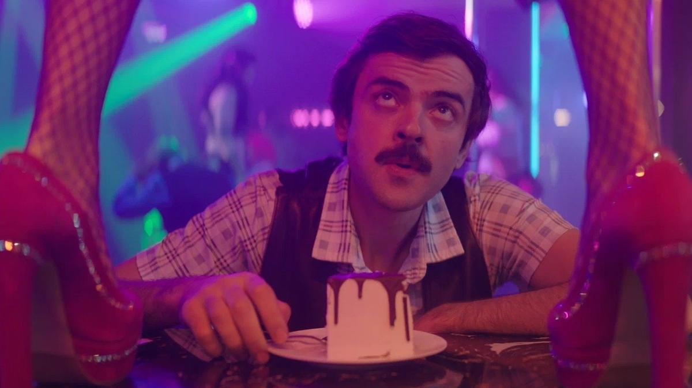

# Тополиный пух внутри ячейки общества. Новое российское кино на фестивале Горький fest

- **URL:** https://novayagazeta.ru/articles/2024/07/15/topolinyi-pukh-vnutri-iacheiki-obshchestva
- **Дата:** 2024-07-15
- **Автор:** Лариса Малюкова

## Тополиный пух внутри ячейки общества

## Новое российское кино на фестивале Горький fest

Кадр из фильма «Тополиный пух»

Фестиваль в Нижнем существует с 2017-го. В конкурсе 17 фильмов. Смотр нынешнего года посвящен сказке. И это правильно. Сказка заполонила экран. В то же время в истории кино (в том числе российского) пространство сказки было возможностью говорить о сокровенном, актуальном, наболевшем.

На Открытии приза за развитие современного кинематографа удостоена Анна Меликян. Я очень рада за Аню. Поздравляю и желаю всем посмотреть ее новый фильм «Чувства Анны». А еще в этот вечер звучала со сцены композиция Аллы Пугачевой «Мимоходом», и зал подпевал вокалистке Анастасии Садковской.

- Фильм открытия «Тополиный пух» Артема Лемперта. (ТНТ + Good Story Media)

Фильм Открытия «Горький fest», к сожалению, пример утерянных возможностей. Затевалась черная криминальная комедия положений. Про современного Епиходова (Антон Лапенко), у которого 22 несчастья, жизнь не в радость. Мечтал стать пилотом, летать как птица. Но вынужден работать охранником в обменнике, ютиться в коммуналке вместе с бывшей женой, глубоко беременной, ее мужем-полицейским (Антон Васильев). Поэтому один выход — уйти из жизни. Но хорошо бы сделать это с пользой.

Вся эта история упакована в три новеллы: про охранника, соцзависимую стриптизершу (Аглая Тарасова) и недавно вышедшего из тюрьмы бандита-пенсионера (Валерий Хаев) с досужим внуком. Их три точки зрения на происходящее по проверенному временем методу «Расемона», с интонацией черных «семейных» комедий Кирилла Соколова и мотивами сюжета «Вы умрете, или мы вернем деньги»

Авторы купили у «Иванушек International» аж четыре песни, поэтому сами не заметили, как превратили кино в фильм-концерт.

Музыка жмет и натирает, пух летит… пока его не подожгут, юмор в духе кооперативного кино 90-х. Главная проблема не только в душных диалогах, но в слабой режиссуре. Впрочем, зрителю понравилось.

Даже очень. Хлопали горячо и ритмично, тем более что «Тополиный пух, жара — июнь» — на титрах: «Только ты не веришь никому — ждешь ты только снега, снега, снега».

- «Ячейка общества». Премьера нового фильма Алены Званцовой

В «Ячейке общества» Званцова продолжает исследовать «простые истины», «частицы вселенной», «искусство легких касаний». Для нее и Оттепель — повод рассказать о кризисе среднего возраста. И космос — пространство, где обострены земные чувства героев, способ показать, как именно каждая несчастливая семья несчастна по-своему.

«Наш малыш», его кто-то полюбит, его будут лелеять?» — сообщает двадцатишестилетняя Саша (Анастасия Красовская) своему мужу Кириллу (Кузьма Котрилев). Они стоят у окна и смотрят на свой выброшенный на помойку телевизор. Саша шесть лет воспитывала ребенка, теперь Варю надо отдавать в сад — на «социализацию». Но как Саше теперь без Вари, кто бы ее саму — в прошлом дипломированного генетика — отдал на социализацию. Обычно психологи рассказывают, как помочь ребенку адаптироваться в новой коллективной среде: в школе, в саду.

Алена Званцова исследует другую сторону проблемы: что происходит с молодой женщиной, которая чувствует себя брошенной, у которой теперь дыра во времени, новые вызовы и новый выбор. Саша ищет, чем заняться: лошадь? Пикник? Пикник с лошадью? Уроки рисования? Игра в самодеятельном оркестре?

Генетическое типирование… с массажем ног? А может, правда — жизнь закончилась с беременностью? И теперь какая-то странная и никому не нужная «жизнь после жизни». Может, поэтому Саша и сходит с ума, как там ребенок? А ее ребенок Варя лежит на траве, смотрит в небо и чувствует себя рекой. Саша — тоже река, но с замороженным руслом. Чего-то ей не хватает в этом замершем течении жизни, может, остроты чувств? И ее прекрасный Кирилл, который тонет на работе в операционных системах, софтах вселенной символов и цифр, не может помочь, хотя готов обеспечить Саше ее необязательный выбор: пусть просто пьет смузи на лавочке, любуется закатами… Пусть просто будет. Что-то должно было случиться в этом тихом течении жизни. И что-то случается.

Кадр из фильма «Ячейка общества»

Поддержите нашу работу!

1000 500 300 Нажимая кнопку «Стать соучастником», я принимаю условия и подтверждаю свое гражданство РФ

Если у вас есть вопросы, пишите [email protected] или звоните:+7 (929) 612-03-68

В детсаду Саша встречает брутального одинокого отца Вариной сверстницы Глеба (Семен Шкаликов). Глеб угощает ее мятным латте, обещает помочь с работой. И даже возникнет монтажный стык под «Девушку и Нагасаки»: в детсаду детишки прячутся от проливного дождя, в кафе Саша и Глеб смотрят друг на друга. Субъективная внимательная камера Шандора Беркеши рассматривает лицо Саши очень крупно, близко, отдельными фрагментами, словно глазами Глеба, ощупывая это лицо.

Званцова, Шандор Беркеши и молодой композитор Владимир Такинов сочинили импрессионистскую картину. Не про измену или мытарства героини в духе «Анны Карениной» (по забавному совпадению, на фестивале в Нижнем Новгороде две премьеры показывали практически одновременно в разных кинотеатрах: «Ячейку общества» и док «Анна Каренина»).

Авторов волнуют другие темы. Например, инфантилизм молодой женщины, прожившей несколько лет внутри «семейного круга», неспособность взять ответственность за свою жизнь, желание переложить ее на другого.

Поэтому Саша — всегда жертва, даже когда виновата, все в ней кричит по-детски — «это не я!».

Или это кино про то, как самая маленькая ложь способна, будто грибок, разъедать мир и гармонию внутри отдельной «ячейки общества».

Кино Званцовой — нежное, неяркое, пастельное. Как трикотажные вязаные оверсайз свитера Саши, ее пальто с торчащими нитками (временами ее одежда кажется слишком дизайнерской, словно с подиума). Как мятный латте или рябь на воде канала, куда суровый Глеб привезет Сашу. Здесь правильной интонации актерские работы. Обманчиво спокойный и тихий муж Кузьмы Котрелева, который точно не жертва, не наблюдатель, скорее строитель семьи, рассыпающейся прямо сейчас. Или строитель коттеджных поселков Глеб Семена Шкаликова — более патриархальный, активный и агрессивный мужской тип, умеющий добиваться своего, но не умеющий прощать и оттого хронически одинокий. Или Саша Анастасии Красовской — то ли девушка, то ли виденье (в первой половине фильма смущает однообразие красок — застывшей неприкаянности Саши, хочется, чтобы уже кто-то поцеловал, растормошил эту спящую принцессу).

Читайте также

Откупори шампанского бутылку

Романтический байопик «Мадам Клико», мировая премьера которого состоялась на Международном кинофестивале в Торонто, добрался до России

Тихая драма «Ячейка общества» — не столько про любовный треугольник в духе Толстого, сколько про треугольник — семейный, про то, что их не двое, а трое. Варе не нужны жертвы ради нее, Варе нужна полная и безраздельная любовь. И внутри этого воздушного пузыря под названием «семья» она страдает и переживает со всей страстью своего шестилетнего сердца.

Лариса Малюкова ведет телеграм-канал о кино и не только. Подписывайтесь тут.

### Этот материал входит в подписки

Смотровая площадкаКино с Ларисой Малюковой

Культурные гидыЧто читать, что смотреть в кино и на сцене, что слушать

### Добавляйте в Конструктор свои источники: сайты, телеграм- и youtube-каналы

Войдите в профиль, чтобы не терять свои подписки на разных устройствах

Поддержите нашу работу!

1000 500 300 Нажимая кнопку «Стать соучастником», я принимаю условия и подтверждаю свое гражданство РФ

Если у вас есть вопросы, пишите [email protected] или звоните:+7 (929) 612-03-68
