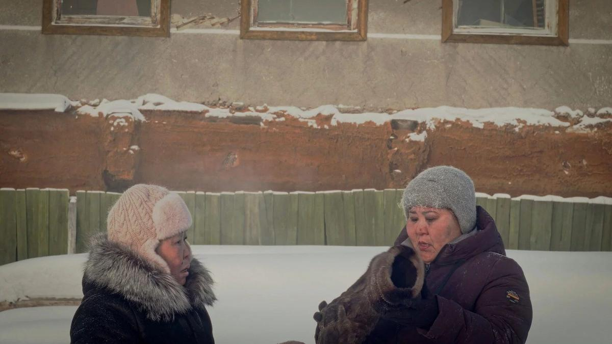

# Как мы с Королем Лиром рубили мясо. Каждый приличный фестиваль должен иметь якутскую картину в конкурсе. На Горьком-feste их две — рассказываем про обе

- **URL:** https://novayagazeta.ru/articles/2024/07/17/kak-my-s-korolem-lirom-rubili-miaso
- **Дата:** 2024-07-17
- **Автор:** Лариса Малюкова

## Как мы с Королем Лиром рубили мясо

## Каждый приличный фестиваль должен иметь якутскую картину в конкурсе. На Горьком-feste их две — рассказываем про обе

Кадр из фильма «Торбаса, или Как мы рубили мясо»

## «Торбаса, или Как мы рубили мясо»

«Торбаса…» — один из самых интересных фильмов фестиваля в коротком метре, автор — Никита Давыдов, а продюсер фильма — известный режиссер Дмитрий Давыдов, его брат. Редкий жанр — якутская черная комедия. Фильм можно прочесть как ерническую вариацию на тему запрещенной «Айты». Там запретителям показалось, что обижен русский человек, которого огульно обвиняют. Правда, к финалу ошибка обнаруживается, и все сидят за одним столом.

Фильм Давыдова тоже про то, как народная месть падает на головы невиновных. Начинается с анекдотичного диалога про унты двух теток на фоне замерзших елок. Мол, плохие унты купила односельчанка, надо срочно менять. Никуда не годятся.

Но когда они глянут в глазок бани горе-продавца, ужаснутся. Тот зверски рубит мясо. Неужели человечье? Тетки несутся сломя голову меж снежных холмов, призывать мужчин села на самосуд. Как раз у Семена жена пропала. Значит, убил и съел. Сжечь зверя!

Отличный ритм, точное физическое действие, круговорот глупости, нелепости хронического недоверия, порождающего чудовищный абсурд. Жаль, не слишком точный финал оставляет вопросы. Хотя, быть может, автор на то и рассчитывал.

## «Король Лир»

Кадр из фильма «Король Лир»

А среди полных метров лучший фильм — «Король Лир», который снял якутский режиссер Сергей Потапов. Известный в основном работами в театре. Их у него больше 60. И «Золотая маска» — среди наград.

Его новая картина по сценарию Людмилы Поповой — эксперимент в доме престарелых. Микс документального и игрового. В прологе пожилой беззубый человек рассказывает про смерть жены, как его три дочки, отобрав пятикомнатную квартиру, хитростью привезли сюда — в дом-тюрьму. Он немного не в себе. Плачет. Точно король Лир.

Итак, в доме престарелых молодой режиссер Дмитрий Мункуев (Альберт Алексеев) ставит с его обитателями ко дню пожилого человека «Короля Лира». Он проводит кастинг среди постояльцев Республиканского пансионата, в котором они рассказывают о себе на камеру: сколько лет они здесь, из какого улуса. Некоторые молчат. Так заключенные рассказывают о своей статье и сроке. И вот уже все роли распределены. Нет только главного героя — Короля Лира. Его режиссер находит случайно и с большим трудом уговаривает играть.

Старика недавно привезли в пансионат две внучки на высоких каблуках и в черных шляпах, мол, «береги себя», чисто Гонерилья с Реганой.

Поддержите нашу работу!

1000 500 300 Нажимая кнопку «Стать соучастником», я принимаю условия и подтверждаю свое гражданство РФ

Если у вас есть вопросы, пишите [email protected] или звоните:+7 (929) 612-03-68

Лир воюет с черными пластиковыми мешками с сухой травой, как Дон Кихот — с мельницами. И тоскует.

Кадр из фильма «Король Лир»

Репетиции идут в столовой (тарелки с едой — три части царства-государства), на массаже, в спортивном зале, в бане (грозные ливни изображают шайки с водой), в библиотеке. Изъеденная морщинами Корделия произносит свой монолог, поливая цветы на подоконнике. Великовозрастные Гонерилья и Регана медленно бредут по длинному коридору меж палат, сплетничая про раздражительность отца. Они все немного шуты и Лиры. Сцена кульминационного монолога и страшного безумного смеха Лира. Корделия поет убитому горем отцу якутскую песню. Глостера лишают глаз ложкой в столовой. Доктор в белом халате после сложной сцены измеряет «актерам» давление. Постепенно постояльцы вживаются в свои роли. Где они и где их герои — не разобрать.

Читайте также

Тополиный пух внутри ячейки общества

Новое российское кино на фестивале Горький fest

Кино черно-белое, хотя некоторые сцены сняты в странных синеватых, красноватых или зеленоватых тонах — в зависимости от освещения в пансионате. В какой-то момент возникает ощущение монотонности, словно сердечный ритм фильма замедляется. А великая пьеса, не спеша, движется к своему финалу у Шекспира… и в реальности.

Храбрая трагикомедия (в фильме много почти смешных моментов) про стариковское одиночество, ненужность как невидимый порог между жизнью и смертью. Среди референсов «Цезарь должен умереть» — полудок братьев Тавиани, получивший «золото» Берлинале.

В фильме снимались постояльцы дома-интерната для престарелых и инвалидов вместе с профессиональными актерами. В главной роли народный артист Республики Саха Михаил Семенов. Он снимался в балабановской «Реке», в фильмах Потапова, Ермолаева, Семенова.

…Недавно в Петербурге показывали спектакль Сергея Потапова «Мой бедный Марат», режиссера спросили, о чем он: «О том, кто мы и какими быть должны. А еще о том, что сила любви побеждает страх перед правдой». Собственно, об этом все фильмы и спектакли режиссера.

Лариса Малюкова ведет телеграм-канал о кино и не только. Подписывайтесь тут.

Поддержите нашу работу!

1000 500 300 Нажимая кнопку «Стать соучастником», я принимаю условия и подтверждаю свое гражданство РФ

Если у вас есть вопросы, пишите [email protected] или звоните:+7 (929) 612-03-68
