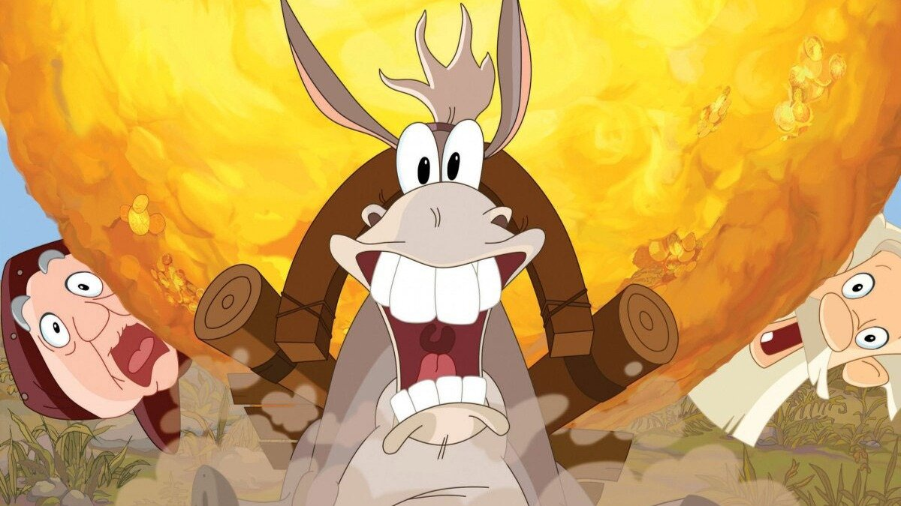

# Сказка мглою небо кроет. Жанр киносказки стал любимым у российских режиссеров. В «соцсоревновании» за право вызвать ностальгию у зрителя участвует до 70 проектов на разной стадии производства

- **URL:** https://novayagazeta.ru/articles/2024/07/26/skazka-mgloiu-nebo-kroet
- **Дата:** 2024-07-26
- **Автор:** Лариса Малюкова

## Сказка мглою небо кроет

## Жанр киносказки стал любимым у российских режиссеров. В «соцсоревновании» за право вызвать ностальгию у зрителя участвует до 70 проектов на разной стадии производства

Кадр из анимационного фильма «Алеша Попович и Тугарин Змей»

Сказки заполонили экран. Число снимаемых «волшебных» историй перевалило уже за семь десятков! Это похоже даже не на бум — это похоже на пандемию. Разбираемся в ее истоках и в том, отчего сказки превратились в ковер-самолет, на котором отечественная киноиндустрия мечтает улететь в счастливое будущее.

Каждую вещь следует называть ее настоящим именем, и если боятся это делать в действительной жизни, то пусть не боятся хоть в сказке!

Ганс Христиан Андерсен. «Сказочник»

Недавний фестиваль «Горький fest» был посвящен сказке и анонсировал сразу 15 новых проектов. Среди героев особым вниманием авторов и продюсеров пользуются богатыри (их собирается уже целый полк), Баба-яга, Иван-дурак (во всех реинкарнациях). Впрочем, чего мелочиться: «Союзмультфильм», онлайн-кинотеатр Okko и писатель Сергей Лукьяненко уже работают над медиафраншизой на основе оригинальной вселенной русских супергероев — нечто вроде Marvel. Рабочее название проекта — «Орден Алой звезды». «В этой вселенной не только фольклорные образы, но и знаменитые отечественные ученые, исследователи. Вселенная основана на героях русских писателей-фантастов, в том числе Александра Беляева и Алексея Толстого», — говорится в пресс-релизе.

Готовятся к выходу — «Василиса и хранители времени» Павла Лунгина, «Огниво» Войтинского, «Волшебник изумрудного города» и «Буратино» Волошина, «Финист. Первый богатырь» Дмитрия Дьяченко, «Золотой Петушок» Рената Давлетьярова.

Кадр из фильма «Василиса и хранители времени»

Кажется, продюсеры без задних ног бросились выискивать еще не затертые экраном сказки… Среди анонсируемых проектов: «Баба-яга спасает Новый год» Карена Захарова и Армена Ананикяна, «Стальное сердце» Карена Оганесяна, «Горыныч» Дмитрия Хонина, «Морозко» Эдуарда Бордукова, «Аленький цветочек» Юлии Трофимовой, «Руслан и Людмила» Егора Чичканова, «Снегурочка» Ольги Добромысловой.

У вас еще не закружилась голова? А это лишь малая часть. Тренд продолжает и продолжает набирать обороты…

Зрители не просили, но для них перелицуют истории про Хозяйку Медной горы, Доктора Айболита, Горыныча, Варвару-Красу, Домовенка Кузю, Зайца с Волком, Дядю Федора и даже Винни-Пуха.

Такое ощущение, что за каждым популярным персонажем выстроились очереди продюсеров, которые соревнуются, кто раньше или кто больше и быстрее заплатит наследникам Волкова, Заходера и пр.

К примеру, на «Сказку о царе Салтане» претендовали сразу две компании: Сергея Сельянова и Сарика Андреасяна. Ясно, что Андреасяны снимут супербыстро, недешево и сердито и… займут поляну. Тем более что Пушкина они уже застолбили своим «Онегиным» — в прозе. Приходится Сельянову с его серьезным подходом к развитию проекта и производству уступить.

Нельзя сказать, что киносказку изобрел Александр Роу, но именно его режиссерский дебют в 1938 году сделал жанр чемпионом по популярности. Зрители не верили своим глазам: самоходные ведра, автомобиль-печка (в котором чуть не погиб водитель в первый же день съемок), говорящая щука. Фильм массово смотрели и в Америке, где он обошел даже недешевого цветного «Багдадского вора». Сказки Роу пользуются особым спросом и у нынешних кинобизнесменов, предпочитающих «продукты», проверенные временем. «Марс Медиа» переснимает «Варвару-красу, длинную косу». Компания Сергея Сельянова (СТВ) тоже не обошла вниманием успех Роу: она пересняла сказку про Емелю и Щуку, заработав на ней 2,5 миллиарда.

Кадр из фильма «Варвара-краса». Режиссер Александр Роу

Именно Сельянов в 2003-м открыл сказочный ящик Пандоры. На свой страх и риск сняли полнометражную анимационную сказку «Карлик-нос», а уже через год появился первый фильм золотоносной богатырской франшизы. Тот первый фильм — «Алеша Попович и Тугарин Змей» — снял один из лучших анимационных режиссеров мира Константин Бронзит. Он вместе со сценаристами и задал тренд: смешно, немного осмотрительной сатиры, колоритно-национально, былинно и с непременными вкраплениями современных аллюзий (чтоб не только детям, но и родителям было нескучно).

С тех пор на студии СТВ сняли более четырех десятков сказок! Сельянов убежден,

что «сказки — прекрасный жанр, и для существенной части аудитории он слаще лимонада. Над их созданием приятно работать, и это полезно для кармы. Не думаю, что рынок перегреется от количества сказок. В целом их не так много».

Правда?

Следующий взлет популярности волшебных историй начался с выходом франшизы «Последний богатырь» (с 2017-го по 2021-й) — в общей сложности трилогия собрала более 89 миллионов долларов.

Кадр из фильма «Последний богатырь»

Поддержите нашу работу!

1000 500 300 Нажимая кнопку «Стать соучастником», я принимаю условия и подтверждаю свое гражданство РФ

Если у вас есть вопросы, пишите [email protected] или звоните:+7 (929) 612-03-68

Продюсеры объединили традиции Disney с мотивами русских сказок, сделали привычных злодеев — Бабу-ягу и Кощея главными героями с присущим злу обаянием. И вообще забыли о рамках, границах и берегах: поназвали в свой фэнтези-сериал персонажей совсем разных сказок: богатырей, Водяного, Колобка, Чудо-Юдо, Жар-Птицу, Кикимору. Да еще соединили их с персонажами из современной Москвы. Чем не Диснейленд в одной отдельной франшизе?

Пиком кассовых сборов в России стал «Чебурашка». Картина собрала в кинотеатрах более 7 млрд рублей. Тут даже продюсеры, никогда и не помышлявшие о сказках, бросились перечитывать Афанасьева с Бажовым.

Кадр из фильма «Чебурашка»

В киносказки вкладывают большие суммы в надежде, что будет «как с «Чебурашкой», который этот процесс сказочной мегаломании запустил с еще большей скоростью.

Все хотят урвать свой волшебный куш, и временами этот массовый забег в волшебство с ожиданием золотого дождя напоминает «пирамиду».

Вопрос в том, на сколько сказок хватит зрителя. Он уже путается в названиях, режиссерах, студиях, актерах. Одну Бабу-ягу успели сыграть Елена Яковлева, Юлия Пересильд, Людмила Артемьева, Татьяна Догилева, Елена Подкаминская, Алика Смехова. В каком-то заэкранном морфинге их лица склеиваются, перетекают одно в другое.

При этом продюсеров, в конце концов, можно понять. Но отчего сказка вдруг стала столь популярна у зрителя?

Как всегда в таких случаях, причин несколько:

- Киносказка — это три ностальгии в одном фильме: по детству, по советскому кино и мультфильмам, по истинно русскому.
- Это эксплуатация любимых персонажей, знакомых с детсада, раскрученных в «прежние времена»: от Чебурашки до Водяного, от Бременских музыкантов до Винни-Пуха и Емели.
- Это терапия, антитревожный препарат: грандаксин и персен с ксанаксом.
- Киносказка — эскапистская форма фэнтези, приключение, волшебная улучшенная реальность, возможность побега от страха и проблем. Тоска по идеалу.
- Волшебный мир безопасен и для авторов, позволяет избежать острых проблемных и запрещенных (вроде наркотиков) тем. При этом можно подпустить легкой сатиры («Типичные богатыри — сначала бьют, потом спрашивают», «Жить тебе до смерти на одну пенсию 6000 рублей», «Могильный голод чую. — Все его чуют»).
- Киносказка востребована семейной аудиторией. А с отъездом гигантского числа представителей активного молодого поколения именно семейная аудитория стала главной для российского кино. К тому же эксперты говорят об инфантилизации зрителя, резком сокращении аудитории, которая приучена смотреть фестивальное, сложное авторское кино, требующее соучастия, интеллектуальной и душевной работы.
- Став самым востребованным индустриальным видом отечественного кинематографа, сказка оказалась новой Меккой для режиссеров и авторского кино (сначала они бежали из авторского кино в сериалы, сегодня многие из них снимают сказочные блокбастеры). Это Александр Котт и Николай Хомерики, Павел Лунгин и Игорь Волошин. Повторяется ситуация холодных советских времен — тогда в союзмультфильмовской «песочнице» оказались первые перья страны: Эрдман, Катаев, Олеша, Кассиль.
- Благодаря развитию технологий киносказка превратилась в зрелищный блокбастер, универсальное высказывание для разных поколений. Еще несколько лет назад о возможностях Motion capture, светодиодных (LED) экранах можно было только мечтать.
- Когда не хватает веры в собственные силы и возможности, особую силу обретает надежда на чудо — во всех его вариациях и реинкарнациях. А в качестве спасателей и говорящая щука сойдет, и Чебурашка, и Баба-яга, и Хозяйка Медной горы, и Жар-птица, и богатыри… И черт в ступе. Хотя бы кто-то помог обрести уверенность в завтрашнем дне.

Читайте также

А ты куда?

Почему в фильмах молодых главным жанром стала антиутопия?

На круглом столе «Горький fest», посвященном засилью сказок в отечественном кино, продюсеры-спикеры в основном выглядели очень довольными.

Они действительно нащупали золотую жилу, поймали золотую рыбку, они гордятся «ярдами», которые им приносят сказки на блюдечке с голубой каемочкой. Они вновь и вновь закидывают невод — касса на выходе случается разная. Но число сказок упрямо растет.

В этом коммерческом раже совершенно забыта-заброшена суть: в подлинной сказке нет места цинизму, а жаждой обогащения, как правило, обуяны антагонисты. В преданьях старины глубокой спрятана извечная человеческая мечта о всеобщей справедливости, спасении слабого, о нравственном совершенстве. Как в «Сказке сказок» Норштейна, воспевающей верность идеалам — подсознательным или осознаваемым — таким, как дружба, товарищество, поэзия, любовь.

Кадр из мультипликационного фильма «Сказке сказок»

Сказочная хрестоматия помогает почувствовать почву под ногами, задуматься о верности — и близким, да и самой жизни! Как у Хикмета в том самом стихотворении «Сказка сказок», давшем название норштейновскому фильму. В самые драматические моменты истории надо лишь заметить этот описанный у него блеск воды, который «бьет в лица солнцу, кошке, чинаре, мне». И нашей судьбе. Сказка, по мнению больших художников, — таких как Андерсен и Шварц, Сокуров и Норштейн — в самых демократичных формах выражения способна говорить о смысле и существе жизни, не прячась от ее главных вопросов.

Лариса Малюкова ведет телеграм-канал о кино и не только. Подписывайтесь тут.

### Этот материал входит в подписку

Смотровая площадкаКино с Ларисой Малюковой

### Добавляйте в Конструктор свои источники: сайты, телеграм- и youtube-каналы

Войдите в профиль, чтобы не терять свои подписки на разных устройствах

Поддержите нашу работу!

1000 500 300 Нажимая кнопку «Стать соучастником», я принимаю условия и подтверждаю свое гражданство РФ

Если у вас есть вопросы, пишите [email protected] или звоните:+7 (929) 612-03-68
