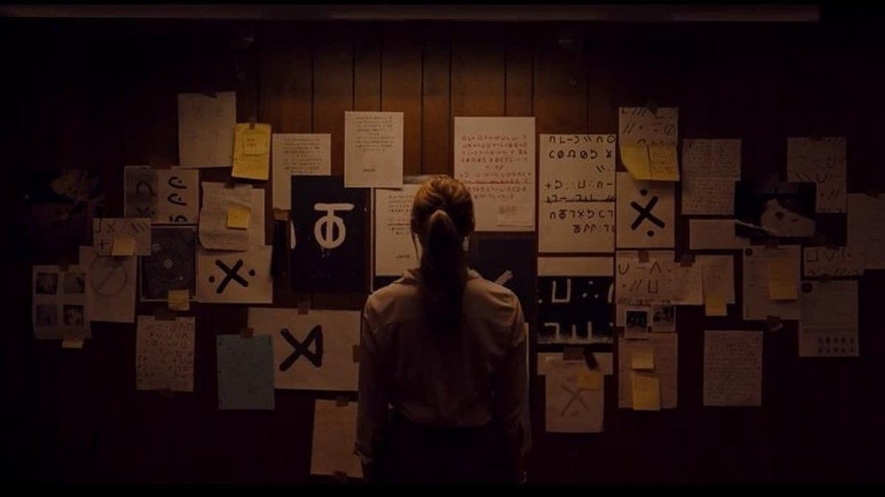

# Хоррор, комедия, Sci-Fi в каникулярном кино. О состоявшихся и грядущих премьерах

- **URL:** https://novayagazeta.ru/articles/2024/08/02/khorror-komediia-sci-fi-v-kanikuliarnom-kino
- **Дата:** 2024-08-02
- **Автор:** Лариса Малюкова

## Хоррор, комедия, Sci-Fi в каникулярном кино

## О состоявшихся и грядущих премьерах

Кадр из фильма «Собиратель душ»

- «Собиратель душ» с неузнаваемым Николасом Кейджем — отличный пример «собирания» на инди-хоррор широкой зрительской аудитории.

С первых кадров экран залит мутным красным, только потом в нем просвечивает белое изображение: по снегу девочка идет к машине, подъехавшей к дому. Быть беде. Это внутреннее зрение агента Ли Харкер (Майка Монро) — агентки ФБР. Мы в штате Орегон, в девяностых. Феноменальная интуиция агентки помогла как-то задержать опасного психопата и избежать собственной гибели. Начальство подключает ее к расследованию серии нескончаемых чудовищных убийств, связанных между собой. Тридцать лет федералы не могут обнаружить преступника, оставляющего на месте преступления зашифрованное послание. 10 семей за три десятилетия. Каждый раз мирный отец семейства жестоко убивал близких, а затем и себя. Среди жертв таинственного маньяка по прозвищу Собиратель душ (Longlegs/Длинноногий — в оригинале) — девочки в канун их дня рождения.

Убийства совершаются по прихотливому алгоритму, разгадать который федералам не удается. Времени совсем мало, новое убийство вот-вот произойдет. И Харкер погружается в море газетных текстов, сатанинских культовых символов, сравнивая их с посланиями Длинноногого, дабы вычислить его логику. Харкер сама кажется странной, аутичной, особенной. Слишком сосредоточенной на этом больном мире, закольцованном в дьявольские символы, который вот-вот поглотит и ее. И ее мать. Ей все время кажется, будто кто-то (убийца?) хлопает ее по плечу. Она его чувствует. Когда раскладывает пасьянс из фото и вырезок, когда слышит его голос, видит стены в крови. Пытается обнаружить его сообщников.

Криминальный хоррор Оза Перкинса силен атмосферой. Словно само действие погружается в сознание героини, идущей по следу маньяка, становящейся его зеркалом, впитывая в себя психопатологический синдром, в котором смерть и сатанинская игра в куклы притягивает жертвы. Это расследование само граничит с паническими атаками. И Майка Монро убедительна в замороженном ледяным ужасом состоянии (хотя порой ее замороженность кажется чем-то монотонным, как и громкое дыхание). А камера искажает изображение, значит, длинноногий «гость» совсем рядом.

Кадр из фильма «Собиратель душ»

Перкинс — исследователь темных сторон личности, создатель стильного хоррора «Гретель и Гензель», не самого удачного книжного триллера «Я прелесть, живущая в доме» и любопытного психологического хоррора об утрате «Февраль». Сын актера Энтони Перкинса (маньяка Нормана Бейтса из «Психо») снимает мрачные хорроры, подкладывая под ужасы и кровавые преступления соломку из семейных травм, тоски, одиночества и утрат. Для него жанр — поле для экспериментов.

Он и не скрывает долгого эха «Молчания ягнят» в своем кино, но прежде всего — в «Собирателе душ», который режиссер считает не ужастиком, а трагедией. Здесь и самый страшный убийца похож на Деда Мороза, который перепутал праздник с убийством.

Критики подробно расписывают особую рекламную кампанию, придуманную креативщиками студии Neon для продвижения детективного слоубернера «Собиратель душ», раскалившую ожидания зрителей. Они раскрутили конспирологическую кампанию в интернете. Загадочные ролики на YouTube, расшифровав которые можно выяснить дату выхода картины и ее название. Необычные тизеры и постеры, билборды с фрагментами тела Длинноногого на улицах Лос-Анджелеса. Номер с тремя шестерками, набрав который можно услышать голос маньяка и учащенное сердцебиение Лиз Харкер. Прибавьте к этому неузнаваемого в жутком гриме Николаса Кейджа — и вы получите ожидания самого любопытного хоррора года, сильно разогретые промо. Но если вам не хватит острых ощущений, можно набрать указанный телефонный номер с тремя шестерками. Вам ответит негромкий зловещий голос Кейджа и пообещает вам скорую смерть.

Фильм заработал в американском прокате 47 миллионов долларов, в международном — под 50 миллионов и собрал хорошую прессу. В России картина уже заработала 122 млн рублей и стала лидером прошлого уикенда, продемонстрировав самый высокий показатель для зарубежного кино в официальном российском прокате в 2024 году.

Вот еще одно доказательство роли креативной промокампании.

- С 1 августа в прокате комедия «Отпуск не по-детски» Клода Зиди-младшего (продолжение фильма «Дома престарелых» Тома Жилу)

Кадр из фильма «Отпуск не по-детски»

Французы беспощадны и ироничны, продемонстрировав это со всем размахом на Открытии Олимпиады. В очередном отпускном кино не то чтобы насмехаются над старостью. Но Зиди-младший не позволяет себе умиления: мол, и старые тоже любят, старые тоже люди.

Поддержите нашу работу!

1000 500 300 Нажимая кнопку «Стать соучастником», я принимаю условия и подтверждаю свое гражданство РФ

Если у вас есть вопросы, пишите [email protected] или звоните:+7 (929) 612-03-68

Дом-интернат для людей на пенсии и детей, оставшихся без попечения родителей, закрывают из-за нарушения санитарных норм. Дабы спасти «стариков и детей», предприимчивый управляющий Милан договаривается с домом отдыха «Бэль-Азур» на Лазурном берегу и перевозит своих подопечных на юг Франции. Вроде бы на «каникулы».

Правда, жильцы виллы не рады новым соседям. Так начинается бурное (временами идиотское) противостояние. А от ненависти… сами знаете до чего полшага.

Наконец, самым смышленым старикам удается провернуть интригу против ненасытных «новых французов»-коррупционеров.

Все это было бы мило и чудесно, если бы Зиди-младший обладал талантом и чувством юмора Дино Ризи, снявшего «Первую любовь» про страсти «и жизнь, и слезы, и любовь» в доме престарелых.

Зато в актерском корпусе новой картины — цвет французского кино: такие знаковые фигуры, как Жан Рено, Кев Адамс, Даниэль Прево, Жан-Люк Бидо, Лилиан Ровер и Фирмин Ришар.

- 1 августа премьера «Империи» Брюно Дюмона, получившей приз жюри Берлинского кинофестиваля.

Кадр из фильма «Империя»

Апокалиптический абсурдистский sci-fi радикального француза Дюмона, дважды лауреата Каннского кинофестиваля (за «Человечность» в 1999-м и «Фландрию» в 2006-м).

Большая копродукция Франции, Германии, Италии, Бельгии и Португалии.

Как космические пришельцы с землянами столкнулись… на тишайшем, любимом Дюмоном живописном Кот-д'Опале на севере Франции. По мнению авторов, это пародия на «Звездные войны». Во время просмотра этой дикой фарсовой комедии с элементами средневековой готики и социальной сатиры вспомним пародийный криминальный сериал Дюмона «Малыш Кенкен», десять лет назад представленный в Каннах.

Читайте также

Сказка мглою небо кроет

Жанр киносказки стал любимым у российских режиссеров. В «соцсоревновании» за право вызвать ностальгию у зрителя участвует до 70 проектов на разной стадии производства

В рыбацкой деревне происходят вещи, несовместимые с действительностью (которая, впрочем, сама удивляет почище любой апокалиптической фантастики). В теле местного мальчугана Фреди заперт мессия, который непременно подарит внеземной цивилизации Нулей светлое будущее. То есть, скорее всего, поработит единиц-землян. Правда, бабушка Фреди тому, кто ее внука тронет, голову оторвет. Зловещему космическому «балу Нулей», которым верховодит дьявольский балагур Вельзевул (Фабрис Лукини), доблестно противостоит наша Раса Единиц. Враги воюют и… флиртуют друг с другом.

Флагманский корабль сил Света представлен в виде известной парижской часовни Сент-Шапель, которая была построена в XIII веке.

Мы давно знали, что недобрые инопланетяне — среди нас, просто скрываются под видом землян. И приносят нам неисчислимые беды. Все это забавно, но скорее для домашнего просмотра.

Лариса Малюкова ведет телеграм-канал о кино и не только. Подписывайтесь тут.

### Этот материал входит в подписки

Смотровая площадкаКино с Ларисой Малюковой

Культурные гидыЧто читать, что смотреть в кино и на сцене, что слушать

### Добавляйте в Конструктор свои источники: сайты, телеграм- и youtube-каналы

Войдите в профиль, чтобы не терять свои подписки на разных устройствах

Поддержите нашу работу!

1000 500 300 Нажимая кнопку «Стать соучастником», я принимаю условия и подтверждаю свое гражданство РФ

Если у вас есть вопросы, пишите [email protected] или звоните:+7 (929) 612-03-68
