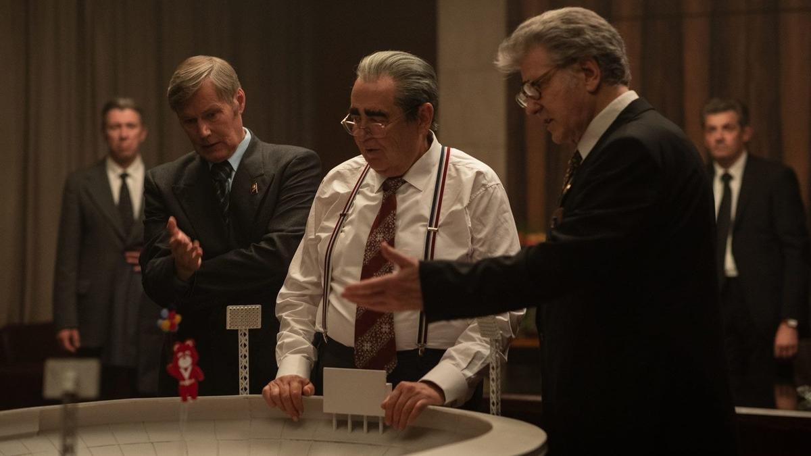

# Реет в вышине…. В разгар Олимпиады во Франции на «Кинопоиске» стартуют «Игры» — сериал о подготовке к Олимпийским играм 1980 года

- **URL:** https://novayagazeta.ru/articles/2024/08/03/reet-v-vyshine
- **Дата:** 2024-08-03
- **Автор:** Лариса Малюкова

## Реет в вышине…

## В разгар Олимпиады во Франции на «Кинопоиске» стартуют «Игры» — сериал о подготовке к Олимпийским играм 1980 года

Кадр из сериала «Игры»

Многое из показанного в сериале взято из реальной истории подготовки к Олимпиаде-80. Но почему-то при этом не покидает ощущение неправды на протяжении первых серий.

Итак, за год до старта тех самых Игр обнаруживается, что из 97 олимпийских объектов в эксплуатацию запустили лишь 48, среди несданных — и тонущий в болоте конноспортивный комплекс в Битце, потому что дренажные системы не работают. Скандал зреет, но, казалось бы, еще время есть. И если взятьcя «ну-ка все вместе» и устроить аврал, как мы умеем, битву не за урожай, за спорт — выдюжим.

Игорь Зорин (Григорий Верник) — типичный мажор, куражится в духе шахназаровского «Курьера», не жалея ни себя, ни близких. Все началось с валерьянки. Сынок директора продуктовой базы (Алексей Серебряков) скупил 50 флаконов и вылил пахучее содержимое на скульптуру Ленина, устроив оргию: «массовое собрание неорганизованных групп кошек, облизывающих тело вождя». Из обезьянника Зорина вызволяет могущественный, благодаря связям, отец. Он же устраивает оболтуса с тремя иностранными языками в оргкомитет Олимпиады. И юному нарциссу удается покорить сердца будущих сослуживцев… кроме сердца строгой молодой начальницы Ирины Светловой (Мария Карпова), а заодно нырнуть с головой в полный хаос подготовки Олимпиады-80.

Кадр из сериала «Игры»

Авторов (сценарий Михаила Покрасса при участии Александра Матвеева, Ольги Хенкиной и Кирилла Архарова), в отличие от других картин, интересует не столько сам большой спорт, сколько его закулисье: конкуренция ведомств, политические и чиновничьи подковерные игры и интриги. Они разворачивают галерею собирательных характеров. Помимо конкретного Леонида Ильича Брежнева, разумеется.

В исполнении Юрия Стоянова фарсовый генсек словно только что прибыл на экран из шоу «Городок» — шамкающий, уже неважно соображающий престарелый лидер любуется олимпийским Мишкой

(«А шо это болтается на палке?»), одолевшим в символической борьбе Лося, Петрушку и Матрешку. Со свитой силовиков и случайных гостей с удовольствием манкирует важное заседание и отправляется на охоту.

Два руководителя: бездушный партфункционер Бледнов Игоря Гордина (он категорически против Олимпиады и приезда в страну врагов со всего света) и более либеральный, человечный умник Ходаков (Игорь Костолевский) Он и руководит подготовительными работами, готовясь провернуть невозможное, но главное, убедить Леонида Ильича в необходимости проведения Олимпиады в Москве. Иначе финансирования не получить. Хороший начальник под подмосковные вечера будет объяснять Брежневу, что Игры экономически выгодны.

Кадр из сериала «Игры»

Британский журналист Энтони Плэйн (Евгений Стычкин) пытается приделать инвестициям в Олимпиаду коммерческую подкладку. Беспринципный оргсекретарь Тимошкин (Вячеслав Чепурченко) — модник из комсомольских вожаков, пекущийся о карьере, словно сошедший со страниц повести «ЧП районного масштаба» Полякова.

Несколько самостоятельных спортивных линий. Среди которых история штангиста Дмитрия Сибирцева (Станислав Демушин), которому трудно сосредоточиться на победе из-за проблем в семье.

Гимнастки Елены Травниной (ее играет чемпионка Олимпиады-2020 Ангелина Мельникова), которую «утюжит» суперстрогая тренерша.

Главная ставка авторов сериала — ностальгия по СССР. И тут щедрости их нет предела: зеленеющий «лучший город земли» с алыми полотнищами, солнечный Новый Арбат, автоматы — с газировкой и телефонные,

портрет артистки Галины Польских на стене оргкомитета и дефицитные билеты на Спивакова. Неостановимая музыка Пахмутовой, Тухманова и Таривердиева — с одной стороны, и Высоцкий с Shocking Blue — с другой.

Продуманная цветокоррекция — кажется, что снимали на «Свему», поэтому стыки с выцветшей хроникой тех времен почти незаметны.

Точно отмеренная и приправленная мягкой иронией доза критики: бюрократическая круговерть с разрешением печати на загадочной новой копировальной машине — ксероксе, докладные и согласования. Аппаратная неразбериха — правая рука не знает, что делает левая. А тут еще Афганистан. О необходимости помощи братскому народу сообщит по телевизору Бовин.

Поддержите нашу работу!

1000 500 300 Нажимая кнопку «Стать соучастником», я принимаю условия и подтверждаю свое гражданство РФ

Если у вас есть вопросы, пишите [email protected] или звоните:+7 (929) 612-03-68

Кадр из сериала «Игры»

Но при всем замахе амбиций, гигантских усилиях большой команды профессионалов и немаленьком бюджете мешает небрежность сценария. Словно в погоне за эффектными мелкими деталями, осознанно решили не слишком церемониться с исторической правдой.

Брежнев действительно предлагал отказаться от проведения Игр, которые грозят серьезными убытками и политическими скандалами, писал даже об этом записку в Политбюро, но задолго до 1979-го. Еще менее убедительна сцена в кинотеатре: сотрудники силовых органов проверяют документы зрителей «Пиратов ХХ века», дабы обнаружить тунеядцев. Постановление ЦК «О дополнительных мерах по укреплению трудовой дисциплины», после которого начались облавы в магазинах и кинотеатрах, было принято уже в 1983-м. В следующих сериях расскажут и о новых препонах на пути Олимпиады-80. И прежде всего — о бойкоте: после ввода советских войск в Афганистан многие страны Запада откажутся от участия в Играх.

Кадр из сериала «Игры»

Режиссер Евгений Стычкин — уже специалист по позднесоветской эпохе. Пару лет назад они с Сергеем Трофимовым сняли «Нулевого пациента» о вспышке ВИЧ-инфекции в детской больнице Элисты в конце 80-х. Там была скрупулезно воссозданная жизнь в ее сложности, драме и объеме. В новом проекте — в новые времена авторы будто бы сохраняют принцип воссоздания эпохи… но только ее облатки.

Избегая совсем уж жестких параллелей с современностью, они максимально облегчают сюжет, усиливая любовную интригу, подтрунивая над иностранными журналистами.

Здесь все выписано очень жирно, призывно, концентрированно, как на обложке журнала «Спорт в СССР».

Все циклично в российской истории. Даже взаимоотношения с Олимпийскими играми. И кажется, что создатели сериала с рабочим названием «Олимпиада» пытаются компенсировать отстранение и зияющее отсутствие России на Олимпийских играх — 2024. Одни болеют за своих спортсменов сегодня, в 2024-м, другие — все еще в ранних восьмидесятых — гордятся победами своих чемпионов и их «великой мечтой».

- На Кинопоиске с 3 августа

Лариса Малюкова ведет телеграм-канал о кино и не только. Подписывайтесь тут.

### Этот материал входит в подписки

Смотровая площадкаКино с Ларисой Малюковой

Культурные гидыЧто читать, что смотреть в кино и на сцене, что слушать

### Добавляйте в Конструктор свои источники: сайты, телеграм- и youtube-каналы

Войдите в профиль, чтобы не терять свои подписки на разных устройствах

Поддержите нашу работу!

1000 500 300 Нажимая кнопку «Стать соучастником», я принимаю условия и подтверждаю свое гражданство РФ

Если у вас есть вопросы, пишите [email protected] или звоните:+7 (929) 612-03-68
