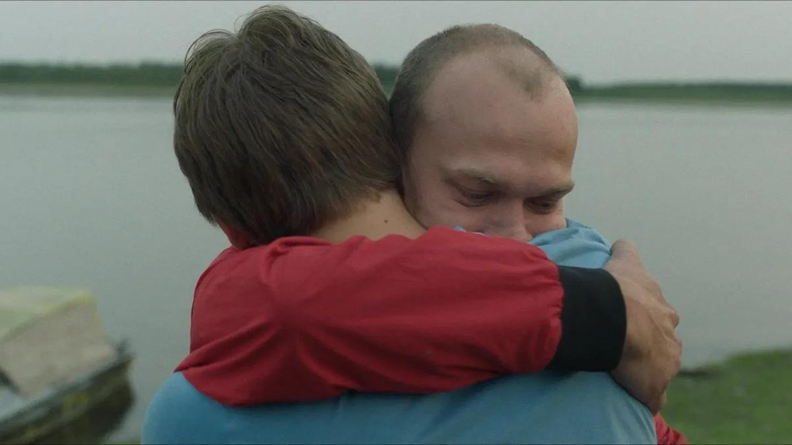

# Брат за брата. 15 августа на большие экраны выходит трогательная история выживания «Братья» от режиссера Оливье Касасоса

- **URL:** https://novayagazeta.ru/articles/2024/08/09/brat-za-brata
- **Дата:** 2024-08-09
- **Автор:** Лариса Малюкова

## Брат за брата

## 15 августа на большие экраны выходит трогательная история выживания «Братья» от режиссера Оливье Касасоса

Кадр из фильма «Братья»

Судя по синопсису, «Братья» — еще одна история выживания. Но если вы решите, что это триллер вроде «Выжившего», «127 часов», «Белого плена», «Затерянных во льдах» и или якутских «Черного снега» или «Карины», вы ошибетесь.

В основе этого кино — подлинная история двух братьев, пропавших в 1948 году и семь лет выживавших в изолированном лесу. И выжили они благодаря особой связи, которая соединяла их с рождения. А спустя десятилетия эта связь подвергается серьезному испытанию.

Известный архитектор Мишель де Обер (Иван Атталь) узнает об исчезновении брата Паскаля. Он бросает работу, ничего не объясняет жене и летит на край света в канадские леса, чтобы найти брата. Потому что Мишель — единственный в мире человек, который знает, где можно отыскать Паскаля.

Кадр из фильма «Братья»

Так начинает раскручиваться эта история. Далее мы узнаем, что семилетний Паскаль и пятилетний Мишель оставлены матерью в интернате. Красавица Шанталь, занятая исключительно собой, однажды просто их не забрала. Дети становятся свидетелями самоубийства смотрителя интерната, думают, что виноваты в его смерти, и убегают в лес, но никто их не хватается. Шанталь с ветерком уехала в новую жизнь, а жандармы даже не почесались.

Семь долгих лет дети проведут одни в дикой природе, рассчитывая только на собственные силы. Как такое вообще возможно?

Один из братьев — более практичный Мишель — подобно Орфею, находит огонь, устраивает из веток шалаши. Второй, Паскаль, — храбрый. Он достает для себя и Мишеля еду, порой нелегальным способом.

С какого-то момента братья могут выйти к людям, но странным образом лес стал казаться им более безопасным, чем людское общество. Лес хотя бы их не разлучал. Так два маленьких человека оказываются в одном гигантском чужом мире. И выжить им удается только благодаря особой связи.

Во взрослой жизни каждый из них вроде бы пойдет своей дорогой. Один станет архитектором, другой — врачом. Но навсегда останется ощущение, что в их жизни был один момент длиной в семь лет — наполненный таким электричеством драматизма, любви, страха, холода, отчаяния, счастья, такой силы эмоций, что вся последующая жизнь покажется им неполной. Или каждый из них будет в какой-то мере чувствовать себя половиной. Как будто часть тебя живет отдельно.

Кадр из фильма «Братья»

И авторов, и героев волнует вопрос: зачем мы пришли в эту жизнь? И, быть может, маленькому Паскалю легче, чем его брату, ведь он пришел, чтобы сберечь «свою вторую половину». Есть еще один немаловажный вопрос: не является ли эта особенная неразрывность двоих — пленом, который связывает и не отпускает. Когда без одного вроде бы нет и другого.

Поддержите нашу работу!

1000 500 300 Нажимая кнопку «Стать соучастником», я принимаю условия и подтверждаю свое гражданство РФ

Если у вас есть вопросы, пишите [email protected] или звоните:+7 (929) 612-03-68

Интимное повествование о травмах и зудящих шрамах детства, об исцелении и выживании, о тайне, которой ни с кем не поделишься… и останешься в ее плену до конца. О тайне, которая мучит. И лечит.

Эту поразительную историю режиссеру Оливье Касасу рассказал приятель — пожилой архитектор Мишель де Робер, с которым тот познакомился через общих друзей. Он и его брат Патрис всю жизнь скрывали от окружающих драматичные подробности своего детства — о годах, проведенных в лесу, не знали даже их жены и дети. Касас стал первым человеком, которому Мишель открыл свою тайну.

«Если не считать этих суровых зим, жизнь в лесу была не чем иным, как счастьем», — вспоминал Мишель.

Кадр из фильма «Братья»

Картина грешит чрезмерным мелодраматизмом и явно перебирает с братскими объятиями, брызгами воды и фортепианными руладами. Но сама история настолько трогает, что о режиссерских и сценарных огрехах хочется забыть.

Тем более что в памяти останутся сильные драматические роли Матье Кассовица («Амели», «Мюнхен») и Ивана Атталя («Моя собака Идиот», «Брижит Бардо: искусство жить», «Они поженились, и у них было много детей»).

В финале фильма из титров мы узнаем, что после Второй мировой войны более миллиона французских детей остались без крова. Им и посвящена эта картина.

Читайте также

Реет в вышине…

В разгар Олимпиады во Франции на «Кинопоиске» стартуют «Игры» — сериал о подготовке к Олимпийским играм 1980 года

Лариса Малюкова ведет телеграм-канал о кино и не только. Подписывайтесь тут.

### Этот материал входит в подписки

Смотровая площадкаКино с Ларисой Малюковой

Культурные гидыЧто читать, что смотреть в кино и на сцене, что слушать

### Добавляйте в Конструктор свои источники: сайты, телеграм- и youtube-каналы

Войдите в профиль, чтобы не терять свои подписки на разных устройствах

Поддержите нашу работу!

1000 500 300 Нажимая кнопку «Стать соучастником», я принимаю условия и подтверждаю свое гражданство РФ

Если у вас есть вопросы, пишите [email protected] или звоните:+7 (929) 612-03-68
