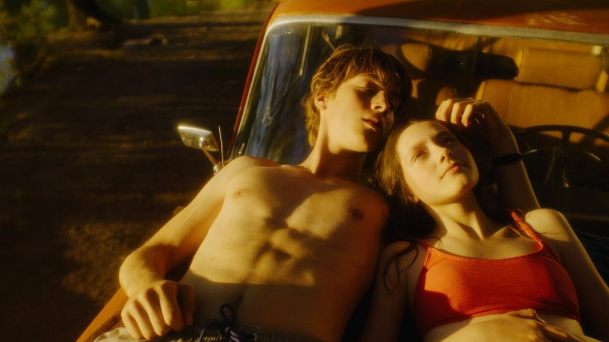

# Хранители зыбкой вечности. В Выборге стартовал кинофестиваль «Окно в Европу»

- **URL:** https://novayagazeta.ru/articles/2024/08/12/khraniteli-zybkoi-vechnosti
- **Дата:** 2024-08-12
- **Автор:** Лариса Малюкова

## Хранители зыбкой вечности

## В Выборге стартовал кинофестиваль «Окно в Европу»

Кадр из фильма «Подростки. Первая любовь»

Фестиваль начинается с традиционного шествия уже не первое десятилетие. По главной… набережной с оркестром идут участники, гости и зрители. В этот момент фестиваль и город соединяются в одно целое. И звезд не объявляют на дорожке, как космонавтов.

А первым на лестницу в кинотеатр поднимается фотограф Гена Авраменко. Ему еще работать. Всех снимать. После показов в переполненном зрительном зале — обсуждения. Аудитория максимально доброжелательная, приученная смотреть авторское кино. Даже когда в конкурсном фильме в первые 20 минут не включили русские субтитры. Смотрели на казахском. В полной тишине.

«Подростки. Первая любовь» Святослава Подгаевского, фильм Открытия фестиваля «Окно в Европу», на афише которого девиз: «Российское кино — прогноз на завтра».

Если говорить о «прогнозе на завтра» в нашем кинематографе, он должен звучать так: «Назад в 90-е!» или «Долой авторское кино, даешь зрительское!»

Кинематографистам в настоящем неуютно и опасно. Тем более один на один со зрителем. Они и релоцируются из «сегодня» — в эпоху хаоса и надежды.

Фото: oknofest.com

## Чужие губы тебя ласкают

Святослав Подгаевский известен своими необычными хоррорами «Пиковая дама…», «Невеста». Еще более популярен его сериал «Пищеблок», доказавший: нет ничего страшнее легенд, рассказанных на ночь в палате пионерлагеря.

И вот романтический мюзикл про первую подростковую любовь вроде бы в духе «Ветсайдской истории». Но сценарий, увы, состоит из заезженных сюжетных пластинок. Тут и поэтический старшеклассник Олег (Алексей Онежен), вынужденный промышлять с подельниками кражами (не мы такие — жизнь такая). И новенькая в классе, большеглазая Оля — дочь вечно пьяного военного-здоровенного, машущего револьвером. И хулиганы-бандиты разных калибров, которые как заведенные мешают влюбленным быть вместе. Каждый раз они Олега мутузят беспощадно. Но он не откажется от своей любви. У Ромео есть мечта — купить подержанный автомобиль. Впрочем, счастья машина вряд ли принесет. Потому что мечты мало, считает Джульетта-Оля, важней мечты — план жизни. А как планировать, если тебя все время бьют?

90-е демонстрируются клипами, затертыми сегодня сериалами и фильмами, в том числе музыкальными, — донельзя. Снова и снова: Верхом на звезде/Чужие губы тебя ласкают/Сука-любовь/Тополиный пух/Что же ты ищешь, мальчик-бродяга.

Кажется, молодым авторам нынешнего кино очень нужна опора, подушка безопасности: моментальный отклик аудитории, которая будет подпевать знакомым хитам прямо в зале.

В некоторых случаях, как в «Туре с Иванушками», фильм превращается в караоке… или клип с отдельными песнями и короткими драматургическими перебивками. От всего этого «музыкального» кино возникает ощущение «концерта по заявкам».

Кадр из фильма «Подростки. Первая любовь»

В «Подростках…» поют все: старушки на лавках, продавцы и покупатели на рынке, люди в очереди. Но то, что в «Лете» Серебренникова выглядело органично, здесь смотрится неловким. Жаль, что актеров (к ним вопросов нет) вынудили артикулировать (причем не в такт) все эти чужие их губам песни.

В кадре поездки-полеты на старом автомобиле. История не спешит двигаться. Есть странные сценарные ходы. Например, педагог Тимофея Трибунцева говорит одному из юных злобных бандитов, что знает про него нечто такое, что тот тщательно скрывает… И все. Мы не узнаем об этой страшной тайне ничего. Может быть, ее вырезали.

Изобретательная, с уместным контровым светом работа оператора Артема Емельянова («Фрау»). Есть поэтические, образные кадры. Например, в кульминации белый цвет застилает изображение, а мы вместе с «влюбленными» оказываемся выше облака. С цветокоррекцией, правда, сильно переборщили. Хотелось много закатного солнца, золотого, теплого цвета. Получилось, как в песне про оранжевое небо и верблюда.

А финал этой романтической истории мне показался убедительным и вполне реалистичным. Так мечталось улететь в светлое завтра, а оказались… в «сегодня».

## Выживут не все

Среди первых работ документального конкурса «Здесь выживут только сарлыки» Светланы Стасенко.

Изумительной красоты картина сегодняшнего мира особого района Тывы — Монгун-Тайги и окрестностей. Серебряная гора — самая высокая вершина Восточной Сибири. Авторы рассказывают, что в суровом климате Монгун-Тайгинского хребта выживают только яки… и люди.

Кадр из фильма «Здесь выживут только сарлыки»

Поддержите нашу работу!

1000 500 300 Нажимая кнопку «Стать соучастником», я принимаю условия и подтверждаю свое гражданство РФ

Если у вас есть вопросы, пишите [email protected] или звоните:+7 (929) 612-03-68

Кажется, что мы переносимся в какое-то инопланетное пространство: заснеженные вершины и желтая трава. Здесь яки не просто вписаны в суровую природу. Не просто часть ее. Кажется, что этих наполовину замерших гор без согревающего тепла черно-белых, с богатой шерстью яков — не будет. В первой части мама потеряла и ищет теленка. Ей помогают все, потому что в прошлый раз потерявшая ребенка мама крошечного яка ушла в горы и там погибла.

Так тема материнства становится сквозной в этом кино.

А чабаны тоже воспитывают своих детей, и у них свои планы. Но огромная часть времени уходит на уход за яками, в том числе маленькими, ведущими себя совершенно как дети. Они дерутся, малышей надо отучать от материнского молока. Надо усердно кормить рожениц. На этой земле свои катастрофические проблемы. Чабанов все меньше, их надо обеспечить рацией, потому что в нынешнем мире их работа весьма опасная.

Кадр из фильма «Здесь выживут только сарлыки»

Одна из глав рассказывает о старой шаманке. Она пыталась работать в разных сферах, но призвание ее настигло. К ней целая очередь посетителей. Малыш-сарлык провалился в люк, доктора послали к ней, ситуация запущенная: пусть поможет вылечить внутричерепную гематому. Она в халате и странном головном уборе бьет в бубен, кружит вокруг ребенка. А в коридоре — целая очередь страждущих.

Областное начальство устраивает праздники. Ни яководы, ни яки не любят шумиху, толпу, громкую музыку, глупые конкурсы. Но что делать, надо участвовать. Самый жестокий конкурс: наездники гоняют на яках наперегонки, для скорости дубасят животных плетками. Победителям выдают дипломы. А лучшим чабанам дают в награду телевизоры. Здесь среди скал и тишины проводят обряд очищения дыханием. Моление духам: просят, чтобы сыновья вернулись с СВО. А за кадром плачет саксофон Арнольда Гискина.

## Луч солнца золотого

Фильм «Правила Филиппа» Романа Косова.

В преамбуле легенда: «Как луч попросился погулять у солнца, и оно послало его к людям в виде солнечного зайчика». В зоомузее Филипп (Григорий Данишевский) похищает чучело лисенка, чтобы его здесь не обидели, чтобы лисенок не чувствовал себя одиноким.

Кадр из фильма «Правила Филиппа»

Дело передали в опеку, там холодная чиновница (Полина Кутепова) ставит ультиматум: либо няня, либо интернат. Надо доказать, что он дееспособен. В общем, без сиделки не обойтись.

Филипп помнит правила: не открывать чужим дверь и окна… Но у него столько энергии, что он не может сидеть дома. Раз уж сиделка необходима, он готов сам ее выбрать.

Он любит посещать магазин игрушек, но не может купить ракету, любит смотреть на кроны деревьев в окно машины и на звезды… на потолке своей комнаты. Делать с мамой зарядку. Тосты с яичницей. Они с мамой устраивают кастинг «на позицию сиделки». Отвергают дипломированных специалистов. И вот — Морхамат (Маша), филолог из Душанбе. У нее розовые пряди в волосах. И она не похожа на нормальных сиделок. В общем, Филипп доволен: «Берем!» Дел много: надо готовиться к сдаче дурацких тестов, чтобы пройти комиссию. И избегать злых трамваев. Но больше всего он хочет стать бариста. Чтобы делать людей счастливыми.

Читайте также

Брат за брата

15 августа на большие экраны выходит трогательная история выживания «Братья» от режиссера Оливье Касасоса

Вроде бы социально ответственное кино. Про здоровых инфантилов и мудрых, с чутким сердцем людей с синдромом Дауна… Получилась наивная, сентиментальная, инфантильная история про то, что все люди — равны: и солнечные, и приезжие из Душанбе. И даже некоторые москвичи. Сахара в кофе Филиппа нет, зато есть с перебором в фильме.

Лариса Малюкова ведет телеграм-канал о кино и не только. Подписывайтесь тут.

### Этот материал входит в подписку

Смотровая площадкаКино с Ларисой Малюковой

### Добавляйте в Конструктор свои источники: сайты, телеграм- и youtube-каналы

Войдите в профиль, чтобы не терять свои подписки на разных устройствах

Поддержите нашу работу!

1000 500 300 Нажимая кнопку «Стать соучастником», я принимаю условия и подтверждаю свое гражданство РФ

Если у вас есть вопросы, пишите [email protected] или звоните:+7 (929) 612-03-68
