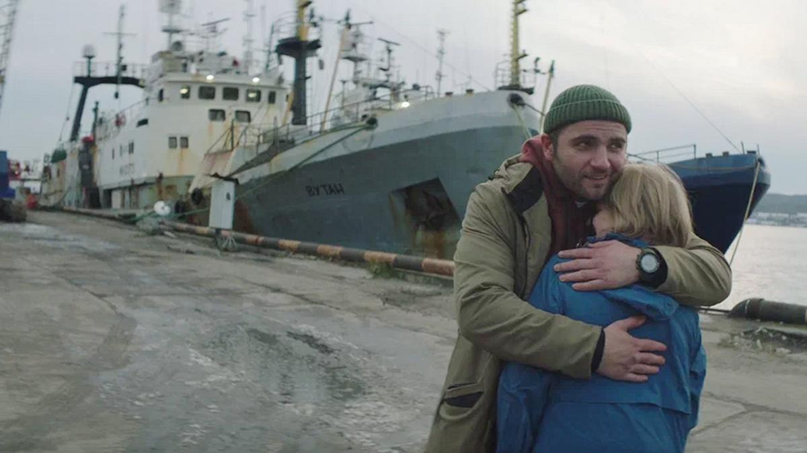

# Выжить в сумерках. Под финал выборгского конкурса показали фильмы, в которых авторский замысел нашел свою кинематографическую форму

- **URL:** https://novayagazeta.ru/articles/2024/08/15/vyzhit-v-sumerkakh
- **Дата:** 2024-08-15
- **Автор:** Лариса Малюкова

## Выжить в сумерках

## Под финал выборгского конкурса показали фильмы, в которых авторский замысел нашел свою кинематографическую форму

Кадр из фильма «Филателия»

## «Филателия» Натальи Назаровой

Сентиментальная, камерная, нежная мелодрама, даже трагикомедия. О несчастье нелюбимых. И преображении, спасении любовью.

Первые кадры: алхимия с марками, пинцет, пар, альбом. Каждой марке — свое окошко.

Яна живет в дальнем морском городе на севере. Там, где среди скудной растительности — яркие фиолетовые цветы. А вокруг — ледяное море с кораблями. Необыкновенные фиолетовые пятна цветов на блеклых замерзших берегах.

Хромоножке Яне, которую зовут калекой, хотя последствий ДЦП почти не видно (только речь странная), непросто работать на почте. Живет внутри женского коллектива — с Верой и Любой. И отношения у них непростые. Все они не очень счастливы. Особенно одинокая Яна. Поэтому и посетителям достается. То им ручку, то бумагу, ходят и ходят. Если б не руководитель почты Михалыч, убили бы друг друга. А еще Яна собирает марки. Посещает клуб филателистов.

Читайте также

Если наступит лето

Что покажет конкурсная программа фестиваля «Окно в Европу»

Священнодействует с пинцетом, путешествует по крошечным обрывкам мира, коллекционирует флору и фауну, и писателей, и политических деятелей. О ней даже сюжет для «Новостей культуры» сняли, в котором она про исчезнувшего в море папу рассказала. Правда, сюжет с ней вырезали. Потому что Яна — калека. У нее есть товарищ, электрик Коля, который ухаживает за работницей загса Машей. Не за Яной же. А однажды на почту заходит вальяжный морячок Петр, и жизнь Яны совершенно меняется. Она даже поет в караоке. Любимую песню «Светлячок». И вокруг нее зажигаются огоньки. Поверить, конечно, в любовь брутального красавца моряка (Максим Стоянов) в калеку нелегко. Просто очень хочется.

Кадр из фильма «Филателия»

А вокруг очень холодно, и ветер зонт выворачивает. Яна — местная Ася Клячина, хромоножка и чистая душа. В фильме много юмора. И боли. И тусклая красота.

В главной роли — потрясающая актриса Алина Ходжеванова. Ученица Каменьковича и Крымова. Она и работала с Крымовым в театре «Школа драматического искусства». Снималась много, в том числе у Натальи Назаровой, в сериалах. Но это, кажется, ее главная роль. Роль, сравнимая с ролью деревенской девушки Аси Клячиной, которая любила, да не вышла замуж. Может, временами с небольшим пережимом, но все равно отменная актерская работа.

А после показа — овация. Долгая. Впервые на фестивале. Приз фильму обеспечен. Есть ли в картине эмоциональный перебор? Безусловно. Наверное, все более жирно, чем хотелось бы.

Но мне кажется, сегодня у зрителей большой запрос на открытые сильные эмоции. Время громкое и страшное, и вместе с тем какое-то скорбно-бесчувственное, а для сочувствия героям требуется допинг — яркие экранные краски и эмоции.

После обсуждения зритель интересовался, нет ли спекуляции на болезни героини. Назарова объясняет: ей принципиально важно, что Яна — дэцэпэшница и ее никто не воспринимает всерьез: «Это колоссальная дискриминация, бестактность по отношению к этим людям, которые оказываются в резервации».

Поддержите нашу работу!

1000 500 300 Нажимая кнопку «Стать соучастником», я принимаю условия и подтверждаю свое гражданство РФ

Если у вас есть вопросы, пишите [email protected] или звоните:+7 (929) 612-03-68

## «Затерянные» Романа Каримова

Автор народных хитов «Неадекватные люди» и «Гуляй, Вася!» неожиданно снял трансцедентальное путешествие четырех друзей, похожее на оммаж «Параду планет» (хотя он еще «Город Зеро», и «Лалай-Балалай»).

Кадр из фильма «Затерянные»

Три бизнесмена, столичные офисные работники — накрахмаленные рубашки, галстуки — подписывают с китайцами долгожданный контракт. На обратном пути машина глохнет. А они пропадают, исчезают в тумане провинции. На шоссе в никуда.

Где и узнают, что они — вечные скитальцы, не знающие, что такое родина. Кто они. Где. Такой круговой квест «в сумерках» по направлению к себе. К своему детству с костром у реки и великом (флешбэки по вкусу слишком лубочные, на грани китча).

А здесь, в русском Сайлент Хилле, своя жизнь. Воздух. На уличном туалете — лепнина. И папик с нотацией про «чужих в своей стране». И очень густые сумерки. И смерть. И день города опять же. С парадом.

Что было на самом деле, узнаем в финале, и этот финал, к сожалению, слишком распрямит историю. Фильм неровный, много нравоучений, но действительно интересная работа. Судя по всему, про личный кризис, не только выгорания, но вообще бессмысленности всех потуг изображать жизнь вместо самой жизни. Великолепная работа оператора Ивана Бурлакова. А Роман Каримов — автор сценария, режиссер, композитор фильма. Я же говорю, очень личная картина.

Кадр из фильма «Затерянные»

Лариса Малюкова ведет телеграм-канал о кино и не только. Подписывайтесь тут.

### Этот материал входит в подписку

Смотровая площадкаКино с Ларисой Малюковой

### Добавляйте в Конструктор свои источники: сайты, телеграм- и youtube-каналы

Войдите в профиль, чтобы не терять свои подписки на разных устройствах

Поддержите нашу работу!

1000 500 300 Нажимая кнопку «Стать соучастником», я принимаю условия и подтверждаю свое гражданство РФ

Если у вас есть вопросы, пишите [email protected] или звоните:+7 (929) 612-03-68
