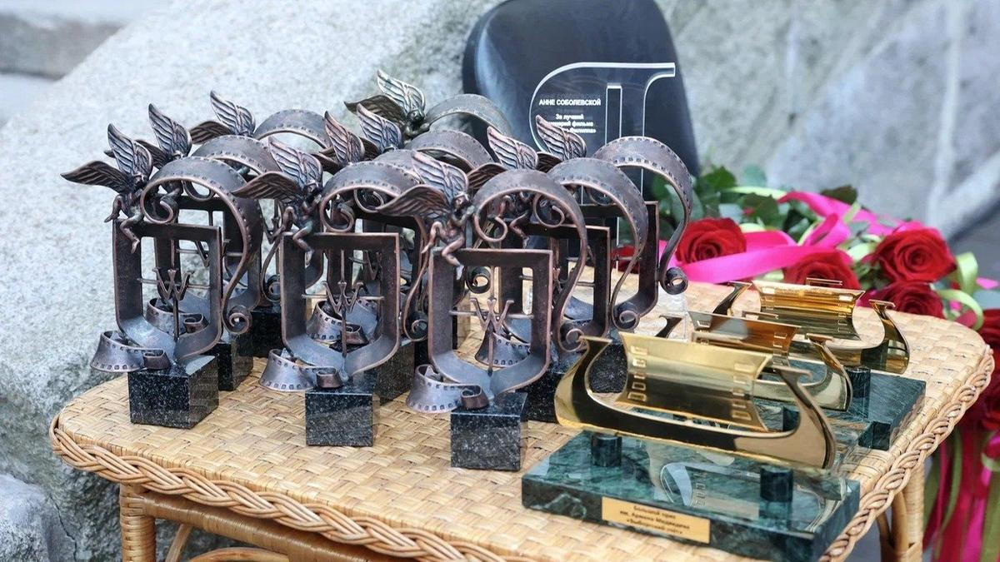

# У них нет сил «подрезать» своих «ласточек». Итоги выборгского фестиваля «Окно в Европу» подвело жюри и зрители, которые посмотрели фильмы советских мэтров и дебютные работы молодых режиссеров

- **URL:** https://novayagazeta.ru/articles/2024/08/17/u-nikh-net-sil-podrezat-svoikh-lastochek
- **Дата:** 2024-08-17
- **Автор:** Лариса Малюкова

## У них нет сил «подрезать» своих «ласточек»

## Итоги выборгского фестиваля «Окно в Европу» подвело жюри и зрители, которые посмотрели фильмы советских мэтров и дебютные работы молодых режиссеров

Фото: oknofest.com

Завершился 32-й фестиваль «Окно в Европу». В средневековом выборгском замке вручили награды. Как всегда, отдельно — в игровом кино, анимации и доке. И, как всегда, «лауреатский лист» выявляет тенденции кинопроцесса, которые были угаданы конкурсом.

Фильмы в призовом списке расположились интересным образом.

Разумеется, не преднамеренно — сложился баланс между традиционным кино авторов старшего поколения — и поисковыми, экспериментальными фильмами совсем молодых дебютантов, только входящих в профессию.

Жюри, состоящее из опытных кинематографистов, постаралось отметить все более-менее интересные картины, но предпочтение все же отдали традиции.

Алина Ходжеванова в роли Яны. Кадр из фильма Филателия

Фильм «Филателия» Натальи Назаровой о нежданно-негаданной любви филателистки хромоножки Яны, нечаянно нагрянувшей вместе с прибытием к северным берегам вальяжного морячка Пети, получил и Гран-при, и награду за великолепный актерский дуэт — Алина Ходжеванова и Максим Стоянов.

Зрители, понятное дело, голосуют за привычное, олдскульное.

- 1-е место в зрительском рейтинг (Большой приз им. Армена Медведева) — у «Особенностей национальной больницы». Фильм Станислава Светлова по сценарию Александра Рогожкина, написанного в нулевых и сильно уступающего в драйве фильмам самого Александра Рогожкина. Но за неимением гербовой пишут на простой.
- 2-е место у картины «Бери да помни» Байбулат Батуллы — обаятельная картина, показанная впервые на фестивале «Короче». Про жизнь, смерть и любовь к близким в одной татарской деревне.
- 3-е место — у картины «Правила Филиппа» Романа Косова про особенного человека Филиппа (прекрасный и чуткий Григорий Данишевский в главной роли), который, который, несмотря на синдром Дауна, мечтает жить объемной взрослой жизнью и даже работать баристой в кафе.

Кадр из фильма «Бери да помни»

Среди призеров, награжденных разнообразными организациями и руководством фестиваля, — также «Правила Филиппа», мистическая история на основе якутского фольклора «Легенды вечных снегов» Алексея Романова и «Затерянные» Романа Каримова — про личный кризис и путешествие по метафизической провинции.

Самые неожиданные, дерзкие работы молодых были тоже замечены и отмечены. Дебютанты Малика Мухамеджан и ее оператор Артем Исаев за создание поэтического пространства и уникальный визуальный язык получили награду за изображение. В их фильме «Ласточка» казахская степь — едва ли не главная героиня, ее изменчивость вторит метаниям Карлыгаш (в переводе с казахского — «ласточка»), тоскующей по другим местам, пытающейся убежать от себя.

Режиссер фильма «Ласточка» Малика Мухамеджан и продюсер Федор Попов. Фото: oknofest.com

Приз за лучший дебют для трагикомедии «Ровесник» был самым уместным и ожидаемым. Как и точная формулировка: «За путешествие в прошлое с надеждой на будущее». Прошлое, в этом ярком, провокационном мокьюментари, как будто зафиксированное на осыпающиеся VHS-кассеты, явно переиграло настоящее. На сцене при награждении парни-актеры вели себя точно так же, как в кино: дурашливо, иронично и провокационно. Искренне изумлялись: «Почему же дали только приз за дебют? Ждали, мол, они Гран-при, дрались за него» (накануне действительно была драка с местными, и у одного из участников фильма поврежден нос). Серьезные взрослые кинематографисты иронии не считали, и «наглецов» со сцены строго отчитали.

Меньше всего «пряников» досталось картине «Наступит лето» Кирилла Султанова (спецприз «За актерский ансамбль завтрашнего дня»). За него и его группу (включая актера Микиту Воронова и талантливого оператора Дмитрия Зорина) мне больше всего обидно: при всех шероховатостях, прежде всего драматургических, работа изобретательная, визуально придуманная, исследующая возможности нуара в современном кино. Но Кириллу всего 26 лет, Миките — 22, у них большое будущее.

Кадр из фильма «Наступит лето»

Любопытно, что молодые авторы с неуемным азартом заняты поиском киноязыка, безвозмездно влюблены в кино как искусство.

Поддержите нашу работу!

1000 500 300 Нажимая кнопку «Стать соучастником», я принимаю условия и подтверждаю свое гражданство РФ

Если у вас есть вопросы, пишите [email protected] или звоните:+7 (929) 612-03-68

Они словно пробуют на вкус язык кино, новые формы, мечтают о кино как искусстве (в отличие от многих старших товарищей, вслед за продюсерами мечтающими о сборах). Но в этом молодом кино есть ощущение внутренней выхолощенности. За редчайшим исключением, потеря сути (доминанты), боли, драмы.

И еще.

Пуще огня молодые боятся внятно рассказанной истории, увлекаясь яркой облаткой фильма, визуальными аттракционами.

Все помнят про скрупулезность режиссера Германа, зацикленного на деталях, на «пуговицах». Но вещная среда в его кино становится выразителем человеческих чувств, а раскладывая в кадре реальность на фрагменты, автор фильма собирает из них — мир.

О документальном конкурсе лучше всего сказал председатель жюри Алексей Федорченко:

«Оказалось, что большая часть фильмов не доделана. Хронометраж в среднем полтора часа, как будто у авторов не было сил или времени «подрезать». Неумеренное любование музыкой, ее вселяют в каждую паузу, не давая времени подумать, погрузиться в фильм. Не было картины, где бы все гармонично соединилось: история, монтаж, звук. Где свежие лица, герои? В основном декларация банальности. Герои говорят пустые вещи, выдавая их за философию».

Его поддержала председатель анимационного жюри Светлана Филиппова:

«Ощущение полной изолированности от того, что происходит в мире. От этого устаешь. Не хватает широкого взгляда. Молодые жалеют себя, не хотят выкладываться».

Читайте также

Выжить в сумерках

Под финал выборгского конкурса показали фильмы, в которых авторский замысел нашел свою кинематографическую форму

### ***

На обсуждении игровой программы кто-то из выступающих завел привычную пластинку о мрачности (хорошо еще не о «чернушности») авторского кино. На что программный директор Андрей Апостолов, собравший, на мой взгляд, интересный конкурс, парировал:

«Фестиваль сегодня — едва ли не единственная возможность высказаться картинам — параллельным тем, что идут в прокате», добавлю: залившим экран исключительно лучезарным чебурашковым светом.

Есть еще один итог 32-го Выборгского фестиваля, о котором маловато пишут и рассказывают. В этом году киносмотр окончательно превратился в просветительское событие. Пока в «Выборг-Паласе» смотрели премьеры, в других залах обсуждали и пересматривали «ленинградское кино», слушали лекции историков, режиссеров, киноведов. Каждый день в Библиотеке Аалто зал был полон. И в какой-то момент (например, во время лекции Михаила Трофименкова) казалось, что именно здесь место силы фестиваля. Не потому, что старое кино 70-х мощнее нынешнего (это очевидно). А потому, что в диалоге прошлого с настоящим многое объясняется про то, что с нами происходит.

Встреча с Владимиром Грамматиковым. Фото: oknofest.com

Кульминацией этого параллельного показа стал фильм «Начало» Глеба Панфилова с Инной Чуриковой — в роли простой девушки Паши Строгановой, самодеятельной актрисы, снявшейся в большой роли… и к себе самой вернувшейся. Фильм-счастье с великой актрисой на большом экране смотрели выборжцы и едва ли не все конкурсанты. Смеялись и плакали. А когда Паша, смотря в камеру, заявила: «Уж я, девочки, оставлю свой след в искусстве», — зал устроил овацию. Аплодировали Инне Чуриковой. И большому кино.

Лариса Малюкова ведет телеграм-канал о кино и не только. Подписывайтесь тут.

Поддержите нашу работу!

1000 500 300 Нажимая кнопку «Стать соучастником», я принимаю условия и подтверждаю свое гражданство РФ

Если у вас есть вопросы, пишите [email protected] или звоните:+7 (929) 612-03-68
