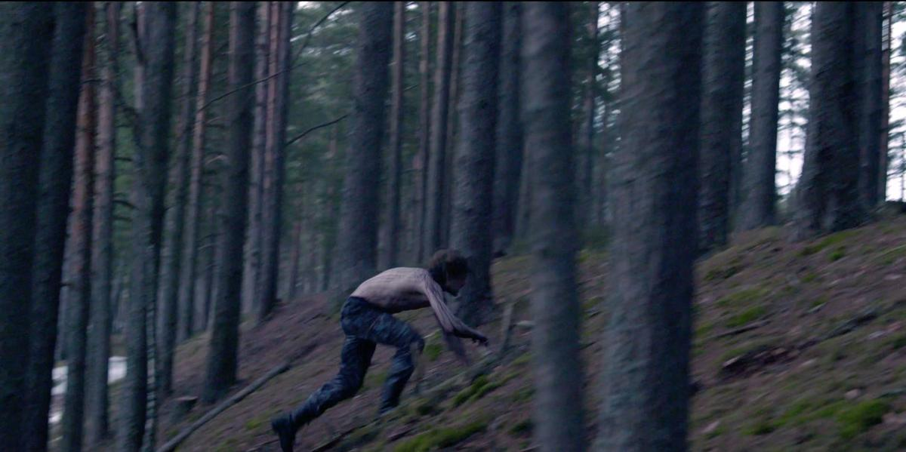

# Кто там вышел погулять? Премьеры и открытия фестиваля «Короче»

- **URL:** https://novayagazeta.ru/articles/2024/08/23/kto-tam-vyshel-poguliat
- **Дата:** 2024-08-23
- **Автор:** Лариса Малюкова

## Кто там вышел погулять?

## Премьеры и открытия фестиваля «Короче»

### «Весна»

Кадр из фильма «Весна»

- Режиссер Никита Лохматов

Туманные сюжетные (и изобразительные) завихрения про тревожность. В первых кадрах скрежет звуков как гул времени. И среди тусовки — мучающийся от этой какофонии парень.

Он напишет звуковое сообщение, что больше так не может и уезжает насовсем. В провинцию. Вроде на родину. Начнет раздеваться в автобусе, как будто снимать с себя старую жизнь. Дружки встретят его тумаками и объятиями. На снежном побережье пьют пиво под меланхолический рэп. Вспомнят пропавшего дядю Пашу. Пройдут с девушкой мимо ржавых гаражей и пятиэтажек. Папа приведет в дом и познакомит сына со своей Любой. Люба — курица, яйца — под подушкой. И сразу захочется бежать обратно.

Этот образ — манифестация, у героя на лбу, руках выступает кровь. Притча о времени — увы, слишком замороченная.

### «Вышел зайчик погулять»

Кадр из фильма «Вышел зайчик погулять»

- Режиссер Асель Багаутдинова (МШНК)

Микс дока и игрового кино. Монолог девушки о том, что ее не подготовили к жизни. Вспоминается Рената Литвинова с ее фирменнным «как страшно жить». Девушку бесит и пугает буквально все. Что родители стареют. И парень ее стареет. И к чему эта жизнь, где столько времени уходит на чистку зубов, на туалет и сон. Вот зачем это все. Про инфантилизм как новую искренность.

У Асель есть чувство киногении. И в сугубо условном пространстве — воздух. Игра в «Я никогда не…». Считалка про зайчика — пока горит спичка. Все красиво и условно (оператор Кирилл Верхозин). Даже слишком. Среди плюсов — документальное существование актрис в кадре.

### «Внимание!»

Кадр из фильма «Внимание!»

- Режиссер Семен Шомин

Про мытарства актера провинциального театра Диму (его играет сам Семен Шомин). Про творческий кризис. И возрастной.

Про взаимоотношения внутри театра. И с собой… Время уходит, а ты все еще — Червь в детском спектакле. Но когда завтруппы говорит ему: «Ты — червь!», услышится державинское «Я царь — я раб — я червь — я бог!». Вот и Дима об этом подумает.

Сюжет о творческих муках в забытом богом провинциальном театре, осложненных семейным конфликтом. Руководитель театра (Алена Бабенко) награждает пожившую ХХL-актрису за роль Дюймовочки от лица фестиваля «Подмосковные подмостки».

Жена неудачника Димы — перспективный режиссер (Светлана Иванова). Ставит новогодний спектакль по фильму «Чародеи». Мужу достанется роль… Коня. Одного из белой тройки, что уносит в «звенящую снежную даль».

Дима по собственному ощущению — недопонятый гений. Сильно пьющий из-за непонимания. Отличные актерские работы (особенно Шомин).

Фильм обаятельный, но больше похож на театральный анекдот. Автору хотелось рассказать про семейный кризис на фоне театра. Получилось смешно и обаятельно, хотя и вполне предсказуемо.

### «Остров»

Кадр из фильма «Остров»

- Режиссер Артем Верхоглядов

Еще одна притча о побеге, который невозможен.

Про офисного червя, вроде знаменитого анимационного Козявина, который «жил-был». Бумаги, бумаги. Горы бумаг. Телефон, степлер, папочки-папочки, старенький компьютер. Как в этом жить? Лучше выпасть из окна… и взлететь в небо где-то в другом месте с магритовским зонтиком. И приземлиться на безымянном острове. Приготовить в песке яичницу. Сочинить шалаш со скромной… люстрой. Обсыпаться светлячками. Но вскоре прилетит еще один сбежавший на зонтике. Другой. И вот уже обжились: снова телефон, хотя и деревянный. И бумажки… И все, как прежде. И круговорот скучной обыденности.

Интересная работа с пространством. Но я не люблю притчи. К ним трудно подключиться эмоционально.

### «Вода из света»

Кадр из фильма «Вода из света»

Поддержите нашу работу!

1000 500 300 Нажимая кнопку «Стать соучастником», я принимаю условия и подтверждаю свое гражданство РФ

Если у вас есть вопросы, пишите [email protected] или звоните:+7 (929) 612-03-68

- Режиссер Павел Королько — ученик Сергея Соловьева

Про случайную встречу. Из тех, что остаются зыбким воспоминанием. Словно полустанок, мимо которого идет поезд. Но это для одного. А другому эта встреча будет сниться.

Он и она знакомятся сумрачным днем на кораблике, следующем в Тамань. Он предлагает сойти у пристани в маленьком курортном городке. После ночи вдвоем — остаются на «вы». Бродят по пустынному пляжу. Смотрят на светящееся медузами море.

Отношения без будущего. «Почему все так, знаете?» Никто не знает. Просто все так…

Сюжет для небольшого рассказа с чеховским настроением. Гаснущим в тумане изображением. Жаль, в финале много лишних слов. Зато есть кадр, в котором, оставшись один, герой мажет руку ее кремом. Соловьевская интонация. Завораживающие изображение и ритм. Немного вторично.

### «Последний фильм о любви»

Кадр из фильма «Последний фильм о любви»

- Режиссер Сергей Малкин — ученик Сергея Соловьева

Одна из самых ярких работ конкурса.

Даша, Женя и Васса встречаются на дне рождения самой крупной из них — хохотушки Жени. К празднику вроде все готово. Но Васса — в слезах, ее бросил парень. И надо ее как-то утешить.

Квартира в шариках. Клоунские шапочки, платье с блестками не по размеру, зато с безразмерным вырезом. Слезы, хохот, дурость. Точный уместный юмор. Например, про Сарика Андреасяна, который «Ну так любит свою жену, что снимает в каждом своем фильме. Не каждому так повезет… встретить своего Сарика». Они говорят все вместе. И вдруг молчат.

Снято как док. История начинает «шевелиться» с приходом молодого мужчины. Будет неловкое свидание. И открытый финал. А так… просто сама жизнь. Как будто режиссер случайно заглянул в эту квартиру. К этим девчонкам.

## В полнометражном конкурсе

### «Чистый лист»

Кадр из фильма «Чистый лист»

- Дебют Полины Кондратьевой

Сверхэмоциональное кино, в котором инклюзия — не про помощь. Про любовь. Про большие чувства и страсти самых обычных людей.

У Риты Зориной (Полина Цыганова) — затянувшийся пубертатный кризис, который она запивает алкоголем и проживает в полукриминальных клубах. А еще она талантлива, пишет стихи, которые сразу складываются как песни. С папой (Дмитрий Куличков) отношения не складываются. И поговорить не получается. Особенно после смерти матери, сгоревшей от болезни. Ему она и не скажет ни про приводы в полицию, ни про отчисление из колледжа. И о том, что она ни за что не станет фармацевтом. Волею случая она находит работу. Этажом ниже живет ее учительница Татьяна Николаевна (Елена Лядова), которой нужна сиделка для дочери Саши с ДЦП в тяжелой форме (Зинаида Ястрежембская). Рита станет ее сиделкой. И подругой. Они будут — как умеют — спасать друг друга.

Стихи Марии Гончаровой и другие вписаны в сюжет. Отличные актерские работы: Полина Цыганова (в роли начинающей сонграйтерши Риты) и Зинаида Ястржембская в роли особенной девочки. Но скажу о самоотверженной работе Елены Лядовой в роли мамы Саши. Это не про силу духа — про любовь вперемежку с отчаянием. Правда здесь в осознании бесперспективности. Ее Татьяна не верит в светлое будущее для своего ребенка. И для себя. Она просто любит без меры и будет продолжать сворачивать горы. Которые не свернуть.

Если фильм «Правила Филиппа», только что показанный в Выборге, про солнечного человека Филиппа, мечтающего стать баристой, был обильно полит сиропом, то фильм Полины Кондратьевой не боится острых углов реальной жизни. Боли. И открытой сентиментальности. Серьеза, правда, многовато. И простодушия. Но это дебют, и по ощущению — вполне зрелая работа Полины Кондратьевой. Поздравляю всех авторов!

### «Точка опоры»

Кадр из фильма «Точка опоры»

- Режиссер Александр Андреев

Две новости. Хорошая и плохая. Хорошая заключается в том, что наши кинематографисты все чаще снимают социально ответственное кино о людях с ограниченными возможностями. Только в этом месяце мы посмотрели «Правила Филиппа», «Филателию», «Чистый лист» и вот теперь «Точку опоры». Новость плохая: важность темы не спасает от плохого, беспомощного кино. А крик актера — самый неудачный из способов докричаться до зрителя.

Александр Суворов. Фото: kinopoisk.ru

Притом что вся эта история написана художником Александром Суворовым на основе своей жизненной истории. На съемках он повредил позвоночник. Нашел в себе силы и мужество вернуться в профессию. И теперь ему хотелось бы помочь не только людям парализованным, но и всем, потерявшим «точку опоры». В общем, замысел хороший. Исполнение — из рук вон. Сюжет перекручен. Все переживания — через край. Повести о настоящем человеке (здесь поминают и Полевого) не получилось. Гела Месхи — в роли художника Максима, который в основном орет на близких и гонит-оскорбляет тех, кто его любит, — вызывает лишь раздражение. И когда эгоист и хам, по велению авторов, «исправляется», этому трудно поверить.

…Что никак не мешает восхищаться силой духа Александра Суворова.

Лариса Малюкова ведет телеграм-канал о кино и не только. Подписывайтесь тут.

### Этот материал входит в подписки

Смотровая площадкаКино с Ларисой Малюковой

Культурные гидыЧто читать, что смотреть в кино и на сцене, что слушать

### Добавляйте в Конструктор свои источники: сайты, телеграм- и youtube-каналы

Войдите в профиль, чтобы не терять свои подписки на разных устройствах

Поддержите нашу работу!

1000 500 300 Нажимая кнопку «Стать соучастником», я принимаю условия и подтверждаю свое гражданство РФ

Если у вас есть вопросы, пишите [email protected] или звоните:+7 (929) 612-03-68
