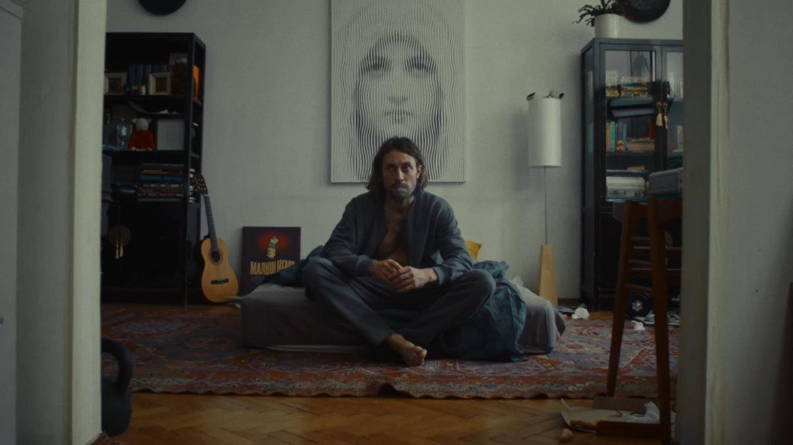

# Кнопка для кайфа и страх быть приторным. Третий обзор дебютов кинофестиваля «Короче» в Калининграде: что получилось, а что нет?

- **URL:** https://novayagazeta.ru/articles/2024/08/24/knopka-dlia-kaifa-i-strakh-byt-pritornym
- **Дата:** 2024-08-24
- **Автор:** Лариса Малюкова

## Кнопка для кайфа и страх быть приторным

## Третий обзор дебютов кинофестиваля «Короче» в Калининграде: что получилось, а что нет?

### «Кнопка»

Кадр из фильма «Кнопка»

- Черная комедия режиссера Сергея Филатова

Кнопка — это такой гаджет, стоит нажать, удовольствие гарантировано. Причем мгновенное. Зона удовольствия мозга начинает бешено работать. Похоже на оргазм, острое мгновенное счастье. На физическом, разумеется, уровне. И никакого секса не нужно. И отношений. И любимая девушка Таня — больше не нужна. Все и сразу. Саша почти счастлив. Или заболел?

Зависимость от кнопки очевидная. Как от наркотика. И физиология рулит. В том числе и мозгом. Опыты над крысами это доказывают. Кстати, отсутствие психологического компонента оргазма называется «импотенцией удовлетворения». Кульминация фильма — драка в стиле «Мистера и Миссис Смит». Потому что Тане «кнопка» тоже понравилась.

Актеры: Антон Филипенко, Анастасия Самбурская.

### «Девушка Роза»

Кадр из фильма «Девушка Роза»

- Режиссер Полина Капантина

Лес, березы, озеро — тихая идиллия, словно в сказке «Морозко».

На послушницу женского монастыря нападает насильник. Помимо невыносимой травмы, ее ждет новое испытание. Ее абьюзер Петр тоже является в монастырь послушником. И не сказать никому. И не пережить. Поможет ли Розе матушка Серафима, или очередная глава Священной книги об Иове, которая велит сокрушить нечистых на местах их… Вместе с их чреслами и железными костями.

И когда Петр топит печь, он кажется ей дьяволом, разжигающим адский огонь. Финал примиряющий. Будто с абьюзом можно сжиться-смириться.

### «Конкурс талантов»

Кадр из фильма «Конкурс талантов»

- Режиссер Антон Федосеев

Творческий конкурс в колонии для подростков-убийц. Победители поедут в колонию № 4, а потом на пикник у реки. Для Дани и Оли это возможность для побега. Два-три мячика в качестве реквизита, кабинка с занавеской — и номер-фокус с исчезновением готов. И если бы не Карманова Даша, дочь убитого ими человека… все бы у них получилось.

В фильме интересный монтаж. Но все какое-то условное, не настоящее. Прежде всего, не похожее на колонию пространство. И от этого ощущение искусственности, фальшака.

### «Куда ты уходишь?»

Кадр из фильма «Куда ты уходишь»

- Режиссер Мария Салюкова

Молодой баянист Артем в окружении раскрашенных теток с бусами в каком-то клубе. День за днем…

Ку-ку-ку, еще ку-ку И торопливо улятели.

Артема вот так с самого детства мучают… баяном. А у него же есть своя мечта. Съездить в город Артем, например, в Приморском крае. Или объясниться девушке малознакомой морозным вечером в любви. Или поснимать ее на камеру. Или совершить обряд с заговором, чтобы осуществить свою мечту. Или хотя бы вырваться из круга предначертанности.

Поддержите нашу работу!

1000 500 300 Нажимая кнопку «Стать соучастником», я принимаю условия и подтверждаю свое гражданство РФ

Если у вас есть вопросы, пишите [email protected] или звоните:+7 (929) 612-03-68

Кадр из фильма «Куда ты уходишь»

Смешанное пространство реального и фантазии, утлого обыденного и вымечтанного, надежды и смерти.

Искаженная картинка, интересное решение по цвету. И разлитая в воздухе меланхолия, как полная безнадега:

«Ку-ку-ку…»

### «Костя, не сейчас!»

Кадр из фильма «Костя, не сейчас!»

- Режиссер Олег Рытов

Что-то вроде комедийной фантастики.

Эксперимент номер 59. Даша — фанатичная исследовательница. Ее молодой муж Костя — любитель порядка, покоя. И чтобы зубная щетка была на месте. Но однажды эксперимент идет не плану. Открывается портал — светящееся зеркало. И они вместе с Костей оказываются в смещенном, съехавшем с катушек мире. Костю пробивает электрическими разрядами, у него даже пальцы не шевелятся. Даше — пофиг. Она вся — в эксперименте.

Много электрических разрядов. Много прыжков, скачков, мельтешения в кадре. Герои — чистые иллюстрации. Хотя авторы хотели рассказать как раз про отношения. Не получилось. И пародии на sci-fi тоже.

### «Весна желания»

Кадр из фильма «Весна желания»

- Режиссер Иван Гут

Классический сюжет. Почти сериальный. Помолвка девушки с наследником из обеспеченной семьи. Кольцо с бриллиантом. Счастливые папа с мамой. Секс в еще не обустроенной новой квартире. Все предопределено. И… какая-то маета. Возле своего дома она встретит «парня с нашего двора» Пашу. Они играют в футбол на дворовой площадке. Пьют пиво в старом авто. И им хорошо.

Легко. А потом надо объяснить словами жениху, что именно не так. Жених говорит, как манекен: про рот, который нужен, чтобы говорить. Про будущую жену, которая не украшенье. Поэтому так хочется ей забрать своих жуков и есть крошку-картошку на трибуне футбольной площадки. С Пашей. Под музыку «Сердцедёра». Похоже на экранизацию песни этой группы.

«Тебе приятно, очень хорошо». Все мило, вязко и предсказуемо. Как в сериале, уменьшенном до короткого метра.

### «Конец фильма»

Кадр из фильма «Конец фильма»

- Режиссер Даниил Пугаёв

Макросъемка мозоли, натертой туфлями. Провода. «Смотрите, Небо». «Отчего люди не летают как птицы». Это Слава и Катя на балконе. Они все время подкалывают друг друга. Камера скачет. И замрет только в лесу. Где пни с древесными грибами похожи на сталактиты.

Слава и Катя на пикнике. Плед и кагор. И живые диалоги. После слов «Иди в жопу» сразу… «Будь моей женой». В красной коробочке вместо кольца — батарейка. И чтобы хватило «на подольше».

Это такой понятный страх — быть приторно сладким. У автора и у его героев. Загасить пафос иронией… которой можно все испортить. Или спасти. А финал фантастический. Бесстрашно сентиментальный. Ломающий четвертую стену. Потому что это кино, которое снимает его герой: «Выключите музыку! Здесь не должно быть музыки». Он смотрит в кадр. Прямо на нас

Лариса Малюкова ведет телеграм-канал о кино и не только. Подписывайтесь тут.

### Этот материал входит в подписки

Смотровая площадкаКино с Ларисой Малюковой

Культурные гидыЧто читать, что смотреть в кино и на сцене, что слушать

### Добавляйте в Конструктор свои источники: сайты, телеграм- и youtube-каналы

Войдите в профиль, чтобы не терять свои подписки на разных устройствах

Поддержите нашу работу!

1000 500 300 Нажимая кнопку «Стать соучастником», я принимаю условия и подтверждаю свое гражданство РФ

Если у вас есть вопросы, пишите [email protected] или звоните:+7 (929) 612-03-68
