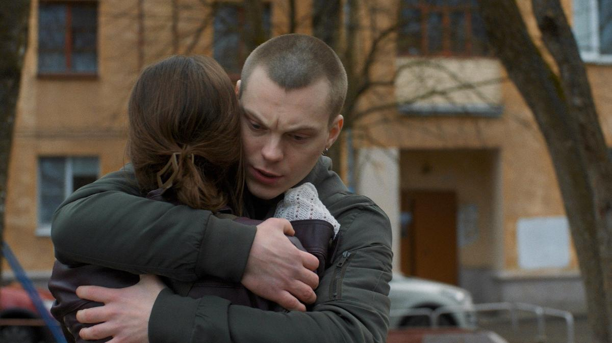

# Выученная беспомощность. Завершился фестиваль «Короче» с очевидным итогом: авторское кино в кризисе. О чем нам рассказали работы дебютантов

- **URL:** https://novayagazeta.ru/articles/2024/08/26/vyuchennaia-bespomoshchnost
- **Дата:** 2024-08-26
- **Автор:** Лариса Малюкова

## Выученная беспомощность

## Завершился фестиваль «Короче» с очевидным итогом: авторское кино в кризисе. О чем нам рассказали работы дебютантов

Кадр из фильма «Чистый лист». Предоставлен организатором кинофестиваля «Короче»

Судя по всему, фестивальные показы начинают испытывать нешуточный кризис. Отборщикам все сложнее отыскивать яркие смысловые работы. Во всяком случае, в полнометражном конкурсе. По сути, там была одна действительно смысловая, интересная и актуальная картина, которая и получила главный приз.

«Чистый лист» Полины Кондратьевой — нежное, поэтичное, женское, даже девичье кино о сложнейших проблемах и испытаниях. О больших страстях и чувствах самых обычных людей. Об инклюзии, которая не про помощь — про любовь.

Переживающая кризис переходного возраста сонграйтерша Рита (Полина Цыганова) в эмпатии и творчестве нащупывает путь к спасению себя и других.

Думаю, что начинающему режиссеру Полине Кондратьевой еще и повезло. В этом году полнометражный конкурс фестиваля «Короче» не обрадовал. И конкуренции «Чистому листу» практически не было при всей разножанровости представленных работ.

Кадр из фильма «Чистый лист». Предоставлен организатором кинофестиваля «Короче»

Фестивали этого года, и «Короче» — ярче других, свидетельствуют о кризисе авторского кино в России. Причин тому множество. Самобытным ярким работам все труднее пробиваться к экрану. Препоны начинаются с момента заявки. Продюсеры пытаются найти самые безопасные проходные темы, чтобы проскочить экспертное жюри Минкульта или Фонда кино. Редким птицам, долетевшим до съемок, могут обрубить крылья на выходе, не дав прокатки. Но и прокатное удостоверение — не спасение. Фильмы и сериалы, отобранные для конкурса, могут изъять в последний момент из опубликованного конкурса.

«СЛОН» Маруси Фоминой о Соловецком лагере особого назначения пропал из программы «Короче». Это история о последнем свидании офицера Георгия Осоргина с женой Линой перед его гибелью в лагере на Соловках. Фильм «За нашим домом сад» пропал из конкурса в Выборге. И список «пропавших с радаров» картин растет.

Кадр из фильма «СЛОН». Предоставлен организатором кинофестиваля «Короче»

Теперь уже и отборщики, желая избежать проблем, гроз и молний на головы устроителей фестивалей, выбирают безопасное кино. Беспроблемное. Еще лучше — комедии. А жюри, не имея альтернативы, даже награждает подобное кино призами. Как получивший спецприз жюри в полнометражном конкурсе «Говорит Земля!». Экологический фарс Евгения Корчагина.

Чудик и потомственный шахтер Стас (Антон Филипенко) в свободное время от серфинга по угольным горам должен провести экскурсию в для столичной журналистки Жени (Ирина Горбачева). Таков приказ начальника шахты (Гоша Куценко). Происходит обвал в одном из отводных участков аварийной шахты, после которого Стас начинает слышать голос Земли.

Бабуля ворчит, что вконец достало ее неблагодарное и неблагородное человечество. Она ему — и природу сказочную, и ресурсы, и живность. Но не хочет по-людски жить — все живое, все красоты уничтожает. Вот и началась у нее на людей аллергия. На дай бог, чихнет (чисто Гулливер), мало не покажется — не станет никого, кроме рыб и тараканов. Журналистка из Москвы оказывается экоактивисткой. Ей в помощь — товарищ по квартире Кеша (Степан Девонин). Так начинаются эксцентрические приключения фриков, пытающихся докричаться до мирового сообщества. То ли избранных, то ли юродивых — агентов сумасбродных передряг.

Кадр из фильма «Говорит Земля!» Предоставлен организатором кинофестиваля «Короче»

Так же, как работнице шоколадной фабрики Анне («Чувства Анны»), слышались голоса инопланетян, призывающих человечество остановиться, — не убивать себя, так и Стас Антона Филиппенко пытается донести всеми способами до мирового сообщества последнее предупреждение Земли. Считай, ультиматум. И в итоге он доносит. Надо всего лишь дотронуться до задницы секретаря ООН, а та — дотронется до задницы… допустим Байдена (выглядящего здесь полным идиотом, периодически засыпающим), а Байден… в общем, понятно — так по кругу. Как говорят авторы фильма: «У нас все через жопу», в том числе и благие намерения.

Планету надо беречь и любить. Желтые арбузы сажать. Ездить исключительно на маленьких электрокарах, не есть мяса. Слушать представителей России в ООН.

Читайте также

Кнопка для кайфа и страх быть приторным

Третий обзор дебютов кинофестиваля «Короче» в Калининграде: что получилось, а что нет?

Актеры стараются как могут. Гоше Куценко периодически приклеивают волосы, которые он не может состричь, — тут же отрастают заново. Земля вообще здесь чудит по полной — то за машиной Стаса с дождевым облаком гонится, то черные тучи разобьет, то торнадо устроит или сейсмический ударом треснет… Помогает, одним словом, Стасу как может.

Шутки авторов принимаются залом на ура: про «деморализацию ягоды» до «все через жопу», про «Юрию Лозу с плотом», про экоактивизм. Но больше всего зрительному залу нравятся шутки ниже пояса. И предчувствуя это, авторы жмут и усердствуют. А могла бы получиться актуальная комедия.

В короткометражном конкурсе картина выглядит оптимистичней. Хотя и молодые авторы избегают точек соприкосновения с токсичной реальностью.

Кадр из фильма «Говорит Земля!» Предоставлен организатором кинофестиваля «Короче»

Варе Маценовой удалось рассказать о своем ощущении времени, при этом снять яркую, абсурдистскую трагикомедию. Ее «Яблоки» по рассказу Романа Михайлова справедливо удостоены главного приза в коротком метре. У Вари — замечательное чувство юмора, выраженное визуально в мельчайших деталях и в снайперски смешных диалогах. История о любви, яблоках и полете «трех дураков» над гнездом психушки… к Богу, который, возможно, женщина. Поэтому к «ней» лучше с цветами.

Кадр из фильма «Яблоки». Предоставлен организатором кинофестиваля «Короче»

Поддержите нашу работу!

1000 500 300 Нажимая кнопку «Стать соучастником», я принимаю условия и подтверждаю свое гражданство РФ

Если у вас есть вопросы, пишите [email protected] или звоните:+7 (929) 612-03-68

Приз за лучшую режиссуру получил Никита Троценко за фильм «Мусор». Никита — из последней мастерской Сергея Соловьева, юбилей которого отметили на фестивале. Триллер выживания (на основе реальных событий)

У Насти, работающей в коллцентре Службы спасения, нежелательная беременность. Что делать дальше, она не знает. К ней обращается за помощью парень, застрявший в мусорной машине. ГАИ не реагирует. Друзья не реагируют. Да и Настя не знает, что делать.

Тарас из-под горы прессованного мусора пытается достучаться до водителя. Дозвониться. Выжить… Главное, чтобы они не нажали кнопку «Пресс». Но они нажимают.

Кадр из фильма «Мусор». Предоставлен организатором кинофестиваля «Короче»

А в это самое время руководитель мусорной бригады философ (Александр Баширов) обучает новичка: «Надобно вложить в работу всю душу. А если у парня нет души, ему помогут. Они же буквально ангелы — чистят город от грязи, могут объять необъятное…

А в жерле их мусоровоза прямо сейчас погибает человек… которого никто не слышит. В финале слышим в реальной записи голос человека, застрявшего в мусоровозе.

Читайте также

Кто там вышел погулять?

Премьеры и открытия фестиваля «Короче»

Лучший сценарий — «Последний фильм о любви» Сергея Малкина. Получая приз, режиссер сказал, что в их фильме сценария практически не было. Это одна из самых ярких работ конкурса (и дело вовсе не в сценарии).

Даша, Женя и Васса встречаются на дне рождения самой крупной из них — хохотушки Жени, у которой день рождения. К празднику вроде все готово. Но Васса — в слезах, ее бросил парень. И надо ее как-то утешить.

Квартира в шариках. Клоунские шапочки, платье в блестках не по размеру с безразмерным вырезом, слезы, хохот, дурость. Точный уместный юмор. Например, про Сарика Андреасяна, который «Ну так любит свою жену, что снимает в каждом своем фильме». Не каждой девушке повезет… встретить своего Сарика.

Они говорят все вместе. И молчат.

Кадр из фильма «Последний фильм о любви». Предоставлен организатором кинофестиваля «Короче»

Снято как док. История начинает шевелиться с приходом молодого мужчины. Будет неловкое свидание. И открытый финал.

А так… просто сама жизнь, кипящая витальность молодых девчонок. Будто режиссер случайно заглянул в их квартиру.

Фильм, действительно связанный с реальностью, жюри не заметило. «ЕСЛИ МНЕ БУДЕТ ХОРОШО, ТО ПОТОМУ ЧТО…» Гау Хар (Гаухар Тулегенова). Она тоже из последней мастерской Сергея Соловьева

Федю забирают в армию. И юная Фро сама бреет голову жениху. В доме отца не замолкает радио. Отец не понимает тоски Фроси: «Как уехал, так и приедет». На вопрос, мог ли он убить человека, отец не отвечает. Подруга уезжает жить в солнечный Казахстан. А Фро надеется забыться на вечернике с серпантином и медляками. Но больше всего ей хочется вернуть Федора. Любыми средствами.

Кадр из фильма «ЕСЛИ МНЕ БУДЕТ ХОРОШО, ТО ПОТОМУ ЧТО…». Предоставлен организатором кинофестиваля «Короче»

Там есть такой сюжетный твист. Вроде бы от лица отца она пишет письмо Феде в армию о том, что ей так плохо, что она практически умирает. И его отпускают в короткий отпуск. Верится в это с трудом. И все же в картине есть ощущение времени как чувства истеричной беспомощности.

Может быть, это распространенное сегодня чувство в какой-то степени касается и фестивальных отборщиков.

Лариса Малюкова ведет телеграм-канал о кино и не только. Подписывайтесь тут.

### Этот материал входит в подписки

Смотровая площадкаКино с Ларисой Малюковой

Культурные гидыЧто читать, что смотреть в кино и на сцене, что слушать

### Добавляйте в Конструктор свои источники: сайты, телеграм- и youtube-каналы

Войдите в профиль, чтобы не терять свои подписки на разных устройствах

Поддержите нашу работу!

1000 500 300 Нажимая кнопку «Стать соучастником», я принимаю условия и подтверждаю свое гражданство РФ

Если у вас есть вопросы, пишите [email protected] или звоните:+7 (929) 612-03-68
