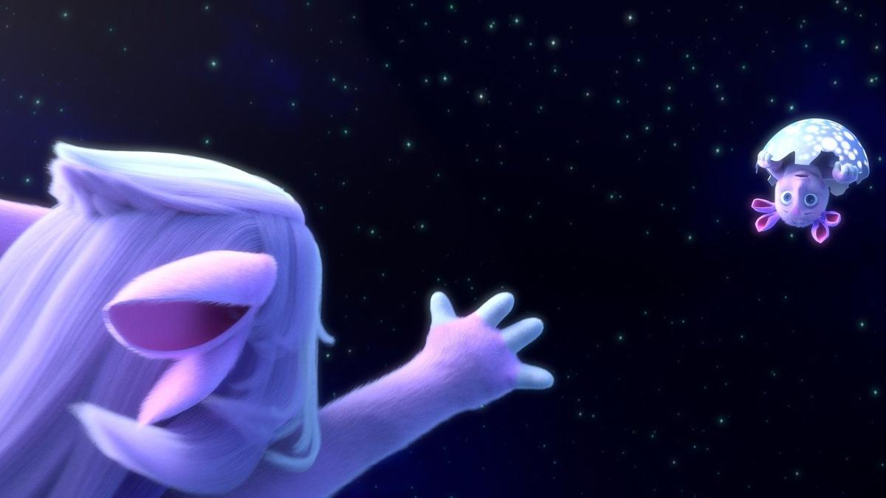

# С уровня глаз ребенка. Почему Константин Бронзит называет только что вышедший роуд-муви «Лунтик. Возвращение домой» своим лучшим фильмом?

- **URL:** https://novayagazeta.ru/articles/2024/08/30/s-urovnia-glaz-rebenka
- **Дата:** 2024-08-30
- **Автор:** Лариса Малюкова

## С уровня глаз ребенка

## Почему Константин Бронзит называет только что вышедший роуд-муви «Лунтик. Возвращение домой» своим лучшим фильмом?

Кадр из мультфильма «Лунтик. Возвращение домой»

С 29 августа на экраны вышел полнометражный анимационный фильм «Лунтик» Константина Бронзита, переосмыслившего многолетнюю сериальную франшизу.

Полные метры, на основе ставших популярными брендами сериалов, — уже привычная история. Кассу сорвали «Фиксики. Большой секрет» (2017; сборы — 418 млн руб.) и «Фиксики против кработов» (2019 г.; около 389 млн). «Финник» (2022 г.) заработал уже 442 млн. Полнометражная трилогия про смешариков («Смешарики. Начало», 2011 г.; «Смешарики. Легенда о золотом драконе», 2016 г.; «Смешарики. Дежавю», 2018 г.) развивает один из самых любимых сериалов. Картины про семейку Барбоскиных («Барбоскины на даче», 2020 г.; «Барбоскины Team», 2022 г.) соседствуют с фильмом про самых известных в мире трех котов — «Три кота и море приключений» (2022 г.).

Полный метр в анимации капитализирует успешный проект, подогревает продажи мерча, пробуждает затухающий интерес к сериалу.

Чем отличается реинкарнация «Лунтика»?

Снял фильм автор с большой буквы Константин Бронзит. Дважды оскаровский номинант, обладатель многих фестивальных Гран-при. Перфекционист, который создает фестивальные короткометражки, расширяя пространство авторской анимации («На краю земли», «Уборная история…», дилогия «Мы не можем жить без космоса»). И в то же время снимает зрительское кино («Алеша Попович и Тугарин Змей», «Три богатыря и наследница престола»), пользующееся успехом.

Кажется, что набивший руку на проектах любой сложности режиссер и очередной полный метр мог бы снять по накатанной…

И вот перед премьерой фильма «Лунтик. Возвращение домой» он звонит и говорит: «Ты не поверишь, но я снял свой лучший фильм…» Я не поверила. С авторами случается подобная аберрация в момент премьеры картины, в которую вложено столько времени, сил, нервов, — работа начинает казаться ключевой в биографии.

Смотрим фильм, который через 18 лет после выхода мультсериала — обобщает и вселенную фиолетового лунного пришельца.

Авторы сценария Константин Бронзит с Дмитрием Высоцким и Дариной сочинили историю о походе за большой мечтой блудного сына Луны. И его возвращении… только куда? Сюжет: друзья решили помочь Лунтику вернуться обратно на Луну и найти свою маму.

Надо сказать, что я при всем почтении к труду создателей сериала, выходящего с 2006 года и насчитывающего более 500 серий, исчисляемого миллиардными просмотрами… не слишком его люблю. Прежде всего, из-за диковатого кислотно-фиолетового дизайна.

Авторы фильма провели целый ряд незаметных беглому глазу изменений, которые отличают фильм от его «исходника».

Прежде всего, образ самого Лунтика. У него по-прежнему четыре уха, он так же покрыт сиреневой шерсткой. Но его немного хищный нос стал мягче, и сам облик — нежнее.

Драматургически этот малыш решен в духе Чебурашки или Мамонтенка. Это ребенок, скучающий по маме, которого хочется приласкать, защитить, спасти. Из кинематографических прародителей из всех многочисленных экранных пришельцев, ближе всего спилберговский «E.T.» из «Инопланетянина». Та же тема невинности детства. И тот же ход, когда режиссер рассказывает свою историю «с уровня глаз ребенка».

Кадр из мультфильма «Лунтик. Возвращение домой»

Лунтика окружает шумная ватага друзей. Вот гусеницы Вупсень и Пупсень — их линия решена ярче, изобретательней, чем в сериале. И временами не такие уж они неразлучные, как «двое из ларца». Изобретательная эксцентриада основана на непростых отношениях «близнецов», готовых задушить своей любовью. Дедушка Шер (Шершень) превратился в пожившего астронома Мотыля. Редкий пример в детском кино амбивалентного персонажа. И это здорово. На протяжении фильма зритель меняет к нему отношение, постепенно понимая его мотивы — препятствовать походу Лунтика и К°. Более остро решен Кузнечик Кузя, один из главных спутников и товарищей Лунтика, в котором борется преданность, обидчивость и ревность, он не желает делить «небесного друга» ни с кем, пытается присвоить Лунтика.

Поддержите нашу работу!

1000 500 300 Нажимая кнопку «Стать соучастником», я принимаю условия и подтверждаю свое гражданство РФ

Если у вас есть вопросы, пишите [email protected] или звоните:+7 (929) 612-03-68

Стал насыщенней, фантастичней гигантский объемный мир, в который прилетел Лунтик (художник Олег Маркелов). Вроде бы это земля, но какие же здесь райские цвета и соцветия. Сочные, высоченные (в сравнении с персонажами-малышами) травы и цветы, огромные грибы, похожие на камни, васильковые, одуванчиковые и клубничные поляны, таинственная пещера с изумрудным светом вроде светлячков и вспыхивающие жутковатым желтым семафором глаза Многоножки. Ну и, конечно, все оттенки сиреневого: от нежного, почти розового цвета детства — до темно-фиолетовой опасности.

Кадр из мультфильма «Лунтик. Возвращение домой»

Бронзит развивает поиски своего учителя Эдуарда Назарова, создавшего в «Путешествии муравья» — одушевленное пространство с сочувствием к живой жизни мира насекомых, погружением в этот мир с особой приметливостью, вниманием к деталям, из которых и вырастает образность.

По сути, и Лунтик хочет улететь из идеального мира детства… и не может туда не вернуться.

По режиссуре, монтажу это роуд-муви сделано практически безупречно. Константин Бронзит снял настоящий семейный триллер (в отличие от сериала, обращенного к аудитории от двух лет), 6+. Как минимум. Для малышей младше здесь много страшноватого. Прежде всего, возросшая степень опасности, исходящей от главной антагонистки фильма — монструозной темно-фиолетовой желтоглазой Многоножки. Да и некоторые моменты действия, нагнетающие саспенс… Когда, к примеру, вся компания зависает над пропастью… это потом мы увидим, что в роли пропасти был «маленький овражек».

Плюс огромное число гэгов, которые не просто украшают приключение, держат в напряжении, но работают на драматургию, образ, на развитие характеров, их личностный внутренний рост.

От сонной пыльцы до золотистой Летающей Рыбы, отраженной в глазах Лунтика, и головокружительного полета на Дикой Стрекозе.

Многофигурные гэги как трюки повышенной сложности, здесь нужна виртуозная пластика, почти хореография. Когда все герои пытаются «загрузиться» на маленькую лунную скорлупу — емкий образ любви: вроде бы она хрупкая, но разбить ее практически невозможно.

Кадр из мультфильма «Лунтик. Возвращение домой»

Среди минусов, на мой взгляд, простоватое озвучение (в этом смысле есть шедевральный образец — «Путешествие муравья»): и Лунтика (где найти такой детский хрустальный голос, как у Клары Румяновой?), и некоторых других героев. Вторая проблемная, как мне кажется, вещь — музыка и песенки, словно созданные искусственным интеллектом. Я понимаю, что хотелось создать что-то простое, вирусное, чтобы потом сверлом крутилось в голове. Но не это: «Я иду, / Я найду, / Никогда не уйду»…

Впрочем, придраться при желании можно к любой картине. «Лунтик. Возвращение домой» — на голову выше всей нашей полнометражной анимации последних лет. Это по-настоящему хорошее, заряженное эмоцией и светом семейное кино, способное обнять и согреть максимально широкую аудиторию.

### P.S.

И все же, если бы спросили у меня, то мой рейтинг картин Константина Бронзита по-прежнему неизменен: «На краю земли», драматическая дилогия «Мы не можем жить без космоса» и «Он не может жить без космоса». И вот теперь еще «Лунтик. Возвращение домой».

Лариса Малюкова ведет телеграм-канал о кино и не только. Подписывайтесь тут.

### Этот материал входит в подписку

Смотровая площадкаКино с Ларисой Малюковой

### Добавляйте в Конструктор свои источники: сайты, телеграм- и youtube-каналы

Войдите в профиль, чтобы не терять свои подписки на разных устройствах

Поддержите нашу работу!

1000 500 300 Нажимая кнопку «Стать соучастником», я принимаю условия и подтверждаю свое гражданство РФ

Если у вас есть вопросы, пишите [email protected] или звоните:+7 (929) 612-03-68
