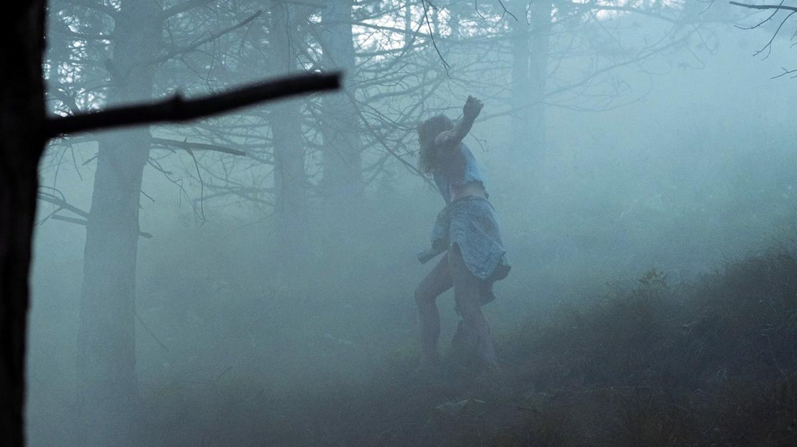

# «Трасса» — хрустальный путь в женский ад. 5 сентября в Москве — премьера нового психотриллера одного из лучших режиссеров сериального кино Душана Глигорова

- **URL:** https://novayagazeta.ru/articles/2024/09/03/trassa-khrustalnyi-put-v-zhenskii-ad
- **Дата:** 2024-09-03
- **Автор:** Лариса Малюкова

## «Трасса» — хрустальный путь в женский ад

## 5 сентября в Москве — премьера нового психотриллера одного из лучших режиссеров сериального кино Душана Глигорова

Кадр из сериала «Трасса». Источник: Кино-Театр.Ру

Все начнется в предрассветной дымке в маленьком сонном курортном городке. Тринадцатилетняя девочка расстреляет свою спящую семью — мать, отца в их постелях, потом попытается повеситься в сарае. Сосед едва успеет вытащить ее из петли. А в это самое время в культурной столице вполне себе благополучная судья Светлана Незнамова (Карина Разумовская) штампует приговоры, поздравляет дочь с днем рождения, занимается дежурным сексом с коллегой… пока и ее жизнь не обрушивается: исчезает ее дочь — Кира (Лиза Ищенко).

Так с двух аварий или семейных катастроф — начинается фильм со знаковым названием «Трасса». Словно две эти катастрофы мчатся навстречу друг другу. Снял многосерийный фильм талантливый режиссер Душан Глигоров («Хрустальный», «Химера»).

По интонации и даже некоторым мотивам «Трасса» ближе всего, пожалуй, к сериалу «Хрустальный», созданному той же командой: продюсерская компания «Среда», режиссер Глигоров, оператор Батыр Моргачев, сценарист Олег Маловичко.

Маловичко, сочинивший брутальную мужскую историю о детских травмах в «Хрустальном», теперь полностью сосредоточился на женской психологии, запутанных взаимоотношениях «дочки–матери», детском насилии. Мы видим удивительную, вполне себе жизненную картину: судья Незнамова — непререкаемый авторитет, ничтоже сумняшеся вершит судьбы других — и попадает под каток собственной биографии, которую она выстраивала долгие годы. В которой ложь давно растворилась и смешалась с правдой. Постепенно ее тщательно сконструированный стальной образ словно рассыпается, разрушается изнутри на наших глазах. Не сказанное вовремя слово, умолчание — причина ее нынешней трагедии — исчезновение дочери.

Кадр из сериала «Трасса». Источник: Кино-Театр.Ру

Эту пропавшую девочку ищет и следователь Эльвира Бараева (Анна Михалкова), тратит на поиски все свое время… лишая собственных детей общения с мамой. В этом смысле, вспоминается сериал «Фишер», история не столько о чудовищных преступлениях серийного убийцы, сколько о брошенных, преданных родителями детях. Как формулируют авторы «Трассы», в том, что происходит с нашими детьми, — виноваты родители.

И как во всех сериалах Глигорова/Маловичко социальный аспект истории не менее важен, чем криминальный. В «Трассе» разные сюжетные линии рифмуются друг с другом, соединяются и в итоге сплетаются в одну, как в «Магнолии».

Кадр из сериала «Трасса». Источник: Кино-Театр.Ру

Поддержите нашу работу!

1000 500 300 Нажимая кнопку «Стать соучастником», я принимаю условия и подтверждаю свое гражданство РФ

Если у вас есть вопросы, пишите [email protected] или звоните:+7 (929) 612-03-68

В «Трассе» образ дороги как равенства судьбы — ключевой. Но еще «трасса» — символ, как в «Шепоте дороги ужасов», непроговоренных страхов и умолчания (чтобы соседи не узнали), которые ведут в личный ад. И еще «трасса» здесь — «бермудский треугольник», где на протяжении многих лет пропадают девушки. Почему-то пропавших не ищут. Возможно, виной тому тоже злополучная трасса. Близкие думают, что исчезнувшие девушки просто уехали из этой «дыры» на попутках в поисках лучшей жизни.

В отличие от «Хрустального» «Трасса», несмотря на криминальный сюжет, эстетически визуально более изобретательна. Вроде бы действие происходит в тишайшем провинциальном курорте юга России. Но съемки проходили Минводах, Кисловодске. Поэтому в кадре — невероятные виды и зеленые просторы гор. Но самое удивительное — интерьеры. Лепнина, колоннады, дворцовая помпезность, высоченные окна и витражи. И в этом нарядном великолепии — утлые чиновничьи учреждения, полицейский участок, больница. Возникает внутренний конфликт между всем этим великолепием и уродством человеческих пороков, трусости, тяги к насилию.

Здесь стоит отметить продуманную художественную во всех отношениях работу оператора Батыра Моргачева, стиль которого меняется в зависимости от задачи сериала.

Кадр из сериала «Трасса». Источник: Кино-Театр.Ру

Кажется, для давно сработавшихся авторов психотриллер превратился в способ разобраться и с личными драмами, с моральными и социальными конфликтами.

Но прежде всего, «Трасса» — семейная драма. Исследование надорванных внутренних связей, которые подчас и оказываются причиной и мотором трагедии. Которые держат сюжетную пружину. И что же делать? По мнению авторов, прежде всего, не лгать себе. А залечивать травмы и шрамы можно только любовью. Если, конечно, держаться подальше от «трассы».

Лариса Малюкова ведет телеграм-канал о кино и не только. Подписывайтесь тут.

### Этот материал входит в подписки

Смотровая площадкаКино с Ларисой Малюковой

Культурные гидыЧто читать, что смотреть в кино и на сцене, что слушать

### Добавляйте в Конструктор свои источники: сайты, телеграм- и youtube-каналы

Войдите в профиль, чтобы не терять свои подписки на разных устройствах

Поддержите нашу работу!

1000 500 300 Нажимая кнопку «Стать соучастником», я принимаю условия и подтверждаю свое гражданство РФ

Если у вас есть вопросы, пишите [email protected] или звоните:+7 (929) 612-03-68
