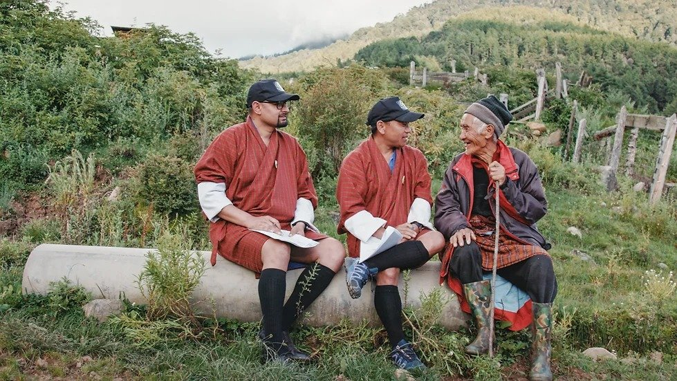

# Колесо обозрения. С 5 по 15 сентября при поддержке «КАРО.Арт» состоится Десятый Международный фестиваль документального кино «Докер»

- **URL:** https://novayagazeta.ru/articles/2024/09/04/koleso-obozreniia
- **Дата:** 2024-09-04
- **Автор:** Лариса Малюкова

## Колесо обозрения

## С 5 по 15 сентября при поддержке «КАРО.Арт» состоится Десятый Международный фестиваль документального кино «Докер»

Кадр из фильма «Агент счастья»

Интереснейшая программа (56 авторских фильмов из 30 стран), обсуждения с авторами, психологами и журналистами, секция «Док Терапия», секция отечественного кино.

Фильмы — призеры и участники престижных киносмотров, много премьер. Авторы, не отворачивающие глаз от реальности, но без публицистического пафоса постигающие сложный драматический мир с помощью киноискусства и внимательной камеры.

Фильм открытия — «Агент счастья» режиссеров Доротьи Зурбо из Венгрии и Аруна Бхаттараи из Бутана — фестивальный хит этого года.

Знаете ли вы, чем сегодня славен Бутан? Принятой на государственном уровне философией и программой развития «Валового национального счастья». В рамках этой программы правительственные агенты ездят по буддийской стране, опрашивают жителей, дабы измерить «счастливый индекс граждан».

Амбер путешествует по Гималаям, исследуя счастье людей. Агенту 40 лет. Индекс счастья включает 148 вопросов 9 категорий.

Герой фильма все еще живет со своей стареющей матерью. Стрижет ей ногти, готовит ей еду. Ищет счастье не только для других, но и для себя. И без всякого индекса хотел бы жену и детей. Да вот с личным счастьем у инспектора счастья не очень складывается.

В картине много забавного. В итоге задумываешься:

трудно поверить сегодня в то, что государственная политика движима не прибылью, не подавлением интересов своих граждан и граждан других стран, а коллективным благосостоянием людей.

Идея «валового национального счастья» была введена в Бутане в 1970-х годах и впоследствии стала основой идентичности страны.

Космические пейзажи, юмор, но это не National Geographic. Авторы фильма не избегают драматичных сторон жизни. Хотя многое зависит от взгляда. Вот женщина, оставшаяся одна с большой семьей, говорит об ушедшем от нее муже: если ему хорошо и он счастлив, она за него рада. Потому что если и есть в мире ценности, то их надо мерить индексом счастья.

Мировая премьера «Агента счастья» состоялась в конкурсе Сандэнса в 2024 году.

Из наиболее ярких работ — драматическая фреска Жюльен Эли «Белая гвардия» о потрясающей красоте гигантских районов Мексики, в которых идет настоящий геноцид природы. Исчезают маленькие поселения фермеров. Их запугивают и выдавливают со своей земли самым чудовищным образом.

Кадр из фильма «Белая гвардия»

Привычные глазу пейзажи исчезают. Лесные заросли, озера и реки уничтожаются или скрываются за заборами с колючей проволокой. Наемники частных компаний ведут беспощадную охоту на мирных жителей и защитников природы. Остаются одиночки — они принимают неравный бой, они и в «инстанциях» рассказывают чиновникам, насколько опасна война, которую ненасытный бизнес объявил природе.

Ослепительной красоты виды, которые ловит камера, кажутся особенно уязвимыми рядом с бездушными гигантскими ковшами техники. Сочные пейзажи бледнеют и исчезают в пепле и пыли, земля становится изуродованный и выжженной.

Герой фильма фермер Роберто ходит по тропам, покрытым минами-ловушками. Но все равно не уезжает со своей земли.

В Мексике самое большое количество убитых защитников земли.

Интимный автофикшен израильского режиссера Ефима Грабого «Текстура лжи» поражает степенью откровенности.

Кадр из фильма «Текстура лжи»

Молодой автор (я помню его документальную трагикомедию «Война Раи Синицыной») рассказывает о своей семье. Но прежде всего это труднейший диалог сына с отцом, который скрыл, что у него есть взрослая дочь. Он с ней не общался, начиная с ее двух лет. И вот Ефим отыскивает сестру, пишет ей. Приглашает в гости вместе с ее детьми. В каком-нибудь сериале подобный сюжет стал бы душещипательной мелодрамой про воссоединение семьи. Но в этой вполне себе традиционной еврейской семье все на грани трагедии. Хотя временами почти смешно. Просто камера Грабого так близко к глазам отца… того, кто молчал годами или врал себе и другим, самым близким… которых он так любит. Просто мать так убита известием, хотя и знала об изменах мужа… Просто во взгляде обретенной сестры столько боли… И для самого героя вся эта история становится поводом для кризиса личных отношений со своей девушкой. Отличная взрывоопасная психодрама с саспенсом живых сиюсекундных реакций и отношений.

В основном конкурсе — мелодрама Елены Ласкари «Можно я не буду умирать?».

Кадр из фильма «Можно я не буду умирать?»

Поддержите нашу работу!

1000 500 300 Нажимая кнопку «Стать соучастником», я принимаю условия и подтверждаю свое гражданство РФ

Если у вас есть вопросы, пишите [email protected] или звоните:+7 (929) 612-03-68

Кажется, нет страшнее слова «хоспис». Но юная Настя с этим не согласна. «Хоспис — это про жизнь», — утверждает она. Жизнь у Насти богатая, несмотря на смертельный диагноз. Нет, сразу два смертельных диагноза. Но смерть — это потом. А сейчас — настоящее продолженное. Настя живет на полную катушку: любит путешествовать, учит языки, рисует, играет на укулеле, ведет инстаграм, пишет рассказы. Рядом Наташа — молодая мама, которая отважно и последовательно борется за жизнь девочки. И даже непозоволительно (!) мечтает о личном счастье. Они обе все хорошо знают про диагнозы, про смерть. Но при правильном уходе есть надежда прожить годы. Полноценно и насыщенно. Камерная история взаимоотношений, созависимости и любви, которая и есть жизнь.

Турецкая драма «Колесо обозрения». Про людей, которые «смех и радость приносят людям».

Кадр из фильма «Колесо обозрения»

Каждый день — без выходных — трудятся в сверкающем огнями лунапарке, заводят и ремонтируют всю это машинерию. Идут спать после четырех утра. День и ночь живут в детском смехе, визге, мольбе — еще раз прокатиться… ну, самый последний! Вся команда «механиков радости» уже похожа на семью, они все досконально знают друг друга. Но внезапно, без объявления войны, приходит пандемия, которая накрывает сверкающее оживленное место мертвой тишиной и темнотой. Парк развлечений на грани банкротства. Работники лунапарка влачат нищенское существование.

Самые грустные сцены — неподвижный лунапарк, впавший в летаргический сон. Лишь иногда рабочие запускают пустые, без людей, аттракционы, и самолеты, лодки, лошадки в тряпочных чехлах едут по кругу, привидения.

На «Докере» есть уникальная конкурсная программа документальных кинокартин об информационных технологиях Let IT dok!. Пять IT-фильмов про бешенные перемены в нашей жизни благодаря информационным технологиям.

Полиэкранная лента о повседневной жизни китайцев «Это жизнь», итальянский диджитал-квест о коллекционере исторических карт «В поисках незнакомца», док-триллер из Канады о судьбе цифрового изобретателя «Сатоши: таинственное исчезновение создателя биткоина». «Мой друг Сега» Артема Гряника, драматическая история блогера-миллионника Сергея Кутового, в которой признание, зависимость и… потеря себя.

Россию в программе представляет «Народный герой» Владимира Головнева о том, как новые технологии меняют жизнь коренных народов России. Это документальный сборник об этноблогерах.

Кадр из фильма «Народный герой»

Самая яркая история — о Сергее Васильевиче Кечимове, последнем хранителе священного озера, коренном ханте, живущем на своей земле. Он рассказывает, как в оленьих угодьях нефтяную скважину поставили. Как буровая все уничтожает, пришлые люди режут землю зря. Живую землю. Лес рубят. На рыбалку пойдешь — рыбы нет, выпил воды из речки — чуть не умер.

Как бороться одному ханту со всем этим?

Нефтяники работают днем и ночью. Зверя травят, оленя травят. И человека. Сказать можно — никто не слышит. Он показывает речку, по которой и лодки ходили, и рыба была. Сейчас — мутная жижа. Он пересматривает свои видео с песнями стариков, разговаривавших с богами посредством песен. Он идет по лесу и говорит с оленями. И они выходят к нему, отвечают.

Читайте также

«Трасса» — хрустальный путь в женский ад

5 сентября в Москве — премьера нового психотриллера одного из лучших режиссеров сериального кино Душана Глигорова

Но тут проводят широкополосный интернет. Сергею Васильевичу нужен интернет. Теперь он блогер. В Сети пишет с ошибками, но выкладывает свидетельства гибели земли и всего живого. Нефтяники ему говорят: «Не нужна никому твоя рыба и пушнина — все это каменный век. Нужна нефть». Чиновники обвиняют его в том, что он вводит людей в заблуждение, скорее всего он шпион, аффилирован с зарубежной организацией. Сергей не понимает слова «аффилирован». Говорит: «Не хотят преступников ловить, меня хотят ловить».

И вот суд. Его речь простая: «Хант не врет, хант честно говорит». Фильм лишен публицистического пафоса. Это обаятельное драмеди про жизнь. Есть забавные сцены, связанные широкополосным интернетом в глухих дальних деревнях.

Киноисследователь Владимир Кочарян размышляет о феномене якутского кино в фильме «Якутия — между мирами».

Кадр из фильма «Якутия — между мирами»

Он путешествует по республике, пытаясь докопаться до истоков единственной в стране самостоятельной киноиндустрии, кинематографа со своим духом, киноязыком. Его спутники — собеседники: патриарх якутского кино Алексей Романов, режиссер Дмитрий Давыдов, антропролог Екатерина Романова, продюсеры Марианна Сиэгэн и Сардана Савина.

Но кульминацией фильма становится финал, когда автор, наполовину армянин, наполовину якут, докапывается до истоков своей большой семьи, идентичности и принадлежности этой земле.

Лариса Малюкова ведет телеграм-канал о кино и не только. Подписывайтесь тут.

### Этот материал входит в подписки

Смотровая площадкаКино с Ларисой Малюковой

Культурные гидыЧто читать, что смотреть в кино и на сцене, что слушать

### Добавляйте в Конструктор свои источники: сайты, телеграм- и youtube-каналы

Войдите в профиль, чтобы не терять свои подписки на разных устройствах

Поддержите нашу работу!

1000 500 300 Нажимая кнопку «Стать соучастником», я принимаю условия и подтверждаю свое гражданство РФ

Если у вас есть вопросы, пишите [email protected] или звоните:+7 (929) 612-03-68
