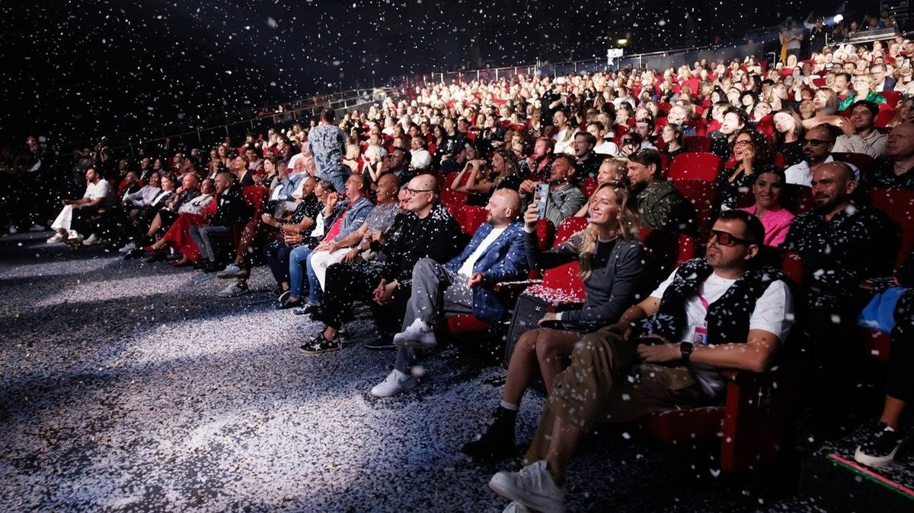

# Про любовь… на «Титанике». Третий фестиваль онлайн-кинотеатров «Новый сезон» открылся

- **URL:** https://novayagazeta.ru/articles/2024/09/10/pro-liubov-na-titanike
- **Дата:** 2024-09-10
- **Автор:** Лариса Малюкова

## Про любовь… на «Титанике»

## Третий фестиваль онлайн-кинотеатров «Новый сезон» открылся

Фото: соцсети

Это главный индустриальный смотр, который показывает самые интересные проекты — прежде всего сериальные — грядущего сезона. В прошлом году здесь прошла премьера «Слова пацана», «Лады Голд», «Кибердеревни» и других запомнившихся сериалов.

Обычно «Новый сезон» собирает потенциальные хиты осени и зимы, потому что проекты выдвигают сами платформы, между которыми существует сильная конкуренция.

Каждый год на фестивале выбирается стриминг-председатель. В 2022-м был Start, в 2023-м — Okko, в этом году — Wink.

Церемония открытия была немного путаной, но концептуальной.

Церемония открытия фестиваля. Фото: соцсети

Режиссер церемонии Андрей Вальдберг прямо с экрана рассказал, что ее сценарий — в духе времени — написала нейросеть. Так что получилось сразу три открытия в одном. Три главы. Три варианта, из которых сеть не смогла выбрать лучший.

- Артхаус. Рефлексия про видео. Двое актеров на экране и в зале размышляли о том, как ты взрослеешь, меняешься и жизнь вокруг меняется. Кроме одного. Ты смотришь… Ты постоянно что-то смотришь. Теперь это единственная константа твоей жизни.
- Версия «Блокбастер». Почему-то ИИ решил, что герой блокбастера — стендапер. Актер изображал не самого удачного стендапера, шутки которого не задались. Помогая ему, несуразному, часть реплик скандировал зал, читая суфлера на экране. Шутил парень про либералов и патриотов, и про Михалкова с Кончаловским, которые все равно… Михалковы.
- Надежда. Лирическая версия. «На что ты вообще надеешься?» — спрашивают ведущие друг друга. «На то, что мы сможем когда-нибудь танцевать, обниматься… без ощущения неуместности». Зал притих.

В финале все зрители должны были спеть живьем о любви лучше ИИ. И зал с воодушевлением подключился: «А не спеть ли нам песню…» Камера летала над зрителями. И было красиво.

Фильм открытия «Челюскин. Первые» режиссера Степана Коршунова (франшиза «Паутина», «Осторожно — любовь»). Art Pictures Vision по заказу «НМГ Студии» и при поддержке ИРИ.

Кадр из фильма «Челюскин. Первые»

Исторический сериал о памятной трагедии, происшедшей в Чукотском море.

1934-й, ледокол «Челюскин», идущий из Мурманска во Владивосток, дрейфует во льдах несколько месяцев. Цель — за одну навигацию преодолеть Северный морской путь. Но, судя по всему, надежды руководителей похода — легендарного исследователя космоса Отто Шмидта (Кирилл Кяро) и капитана Воронина (Дмитрий Куличков) — не оправдались. Погода портится, давление льдов усиливается. Метеоролог Оля Сомова (Стася Милославская) предупреждает о неминуемой опасности, но ее не слышат. Риск похоронить судно возрастает с каждым часом.

Надо ли об этом говорить людям, которые сейчас веселятся? Шмидт считает, что не стоит сеять панику.

На борту — жены и дети членов экспедиции. Дети читают стихи. Люди вечером отдыхают. Лед страшно трещит. Шаман бьет в бубен. Катастрофа приближается необратимо. Местные жители чувствуют, что злой дух принес большую беду.

13 февраля происходит катастрофа. В 140 км от побережья Чукотки «Челюскин» раздавлен льдами и за два часа погружен на дно. Один член экипажа погиб. А 104 человека успели эвакуироваться на ближайшие льдины, где и начали строить лагерь. Фильм о подвиге и о феноменальной для своего времени операции спасения.

Жанр — катастрофа. Первая серия похожа на странный монтаж из обрывочных фрагментов, которые вполне себе зрелищные. Много разнообразных и изобретательных съемок льда. Например, под водой. Пролеты камеры над крошащейся, трескающейся белой коркой.

Кадр из фильма «Челюскин. Первые»

Поддержите нашу работу!

1000 500 300 Нажимая кнопку «Стать соучастником», я принимаю условия и подтверждаю свое гражданство РФ

Если у вас есть вопросы, пишите [email protected] или звоните:+7 (929) 612-03-68

Лед рвет крепкую металлическую обшивку корабля, срывает трубы с водой, ледяные потоки хлещут через пробоины. Механик Юра Набатов, рискуя собой, спасает свою невесту Олю, запертую в каюте. И даже успевает выловить упавшее в воду обручальное кольцо, купленное для любимой.

Люди по колено в воде собирают провиант, вещи, топливо для эвакуации.

Но что-то понять про этих людей, про их связи пока невозможно. Поэтому и подключиться эмоционально к ним трудно. Даже к молодой паре влюбленных.

Самая странная фигура здесь — исследователь Шмидт. Он вроде бы понимает грядущую опасность. Но считает, что отрицательный результат — тоже результат. И значит, поход необходим. В духе эпохи герой готов рисковать собой и людьми ради высокой цели. Впрочем, все это догадки. Ведь понять что-то про этого бородатого человека с ярким румянцем, похожего на Карабаса Барабаса, решительно невозможно.

Кадр из фильма «Челюскин. Первые»

Визуальный ряд зрелищный, особенно в сцене самой катастрофы, смонтированной из кадров крушения ледокола, ледяного шторма свирепой стихии, битвы льдов с кораблем — и шаманского танца с огнем. Или кадры, снятые с вертолета: на огромной льдине — бегающие, пытающиеся выжить маленькие человеки.

Возможно, первая серия будет доделываться. Иначе трудно представить себе зрителя, который будет продолжать следить за мытарствами этих все еще совершенно чужих, незнакомых ему «маленьких человеков на большой льдине».

Бюллетень кинопрокатчика совместно с фестивалем онлайн-кинотеатров «Новый сезон» запустил спецпроект «Кратко», в котором несколько авторов ежедневно будут делиться короткими впечатлениями о проектах из программы смотра.

Вот мой суперкороткий отзыв о первом фильме.

«Титаник по-русски, или подвиг детей лейтенанта Шмидта».

Лариса Малюкова ведет телеграм-канал о кино и не только. Подписывайтесь тут.

### Этот материал входит в подписки

Смотровая площадкаКино с Ларисой Малюковой

Культурные гидыЧто читать, что смотреть в кино и на сцене, что слушать

### Добавляйте в Конструктор свои источники: сайты, телеграм- и youtube-каналы

Войдите в профиль, чтобы не терять свои подписки на разных устройствах

Поддержите нашу работу!

1000 500 300 Нажимая кнопку «Стать соучастником», я принимаю условия и подтверждаю свое гражданство РФ

Если у вас есть вопросы, пишите [email protected] или звоните:+7 (929) 612-03-68
