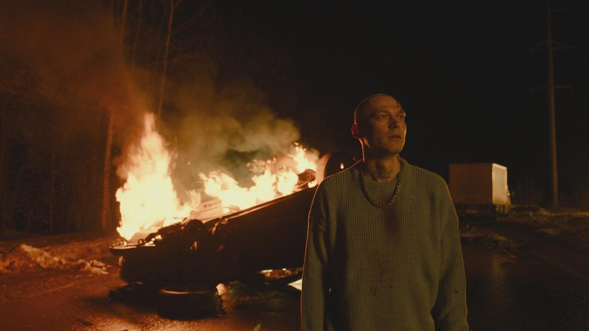

# Конец прекрасной и безысходной эпохи. Продолжаем рассказывать о самых заметных сериалах фестиваля «Новый сезон»

- **URL:** https://novayagazeta.ru/articles/2024/09/13/konets-prekrasnoi-i-bezyskhodnoi-epokhi
- **Дата:** 2024-09-13
- **Автор:** Лариса Малюкова

## Конец прекрасной и безысходной эпохи

## Продолжаем рассказывать о самых заметных сериалах фестиваля «Новый сезон»

Кадр из сериала «Урок»

## «Урок»

- Режиссер: Сергей Филатов
- OKKO

Пролог. Клипы и выступления рэпера Антона (Юра Борисов) в свете софитов, в угаре шумных клубов.

После автокатастрофы, в которой погибла его девушка Лиза, после года лечения в наркоклинике он готов уехать-путешествовать-забыть. Но продюсеры не хотят отпускать «товар», в который они вложились. Придется Антохе практически без денег бежать в свою родную Пермь — к брату Константину (Даниил Воробьев), заместителю директора школы. Брат предлагает и ему спасательный круг — учителем стать. Морозным солнечным днем являются они в школу. Директриса помнит Антона с детства. И позволяет столичной звезде вести внеклассную работу с подростками. Он должен найти с ними общий язык. Антон в шоке от такой перспективы. Ну как ему сеять разумное, доброе, вечное, он сам все еще бунтующий подросток.

Одиннадцатиклассники просят рассказать что-то веселое, какую-нибудь ржаку. Поделиться опытом — творческим. Его и с педагогическим коллективом знакомят… в неформальной обстановке. На просьбу спеть он поет матерные частушки.

Кадр из сериала «Урок»

У учеников забот полон рот. И бед. Мажор готовится к отъезду, на прощание устраивает вписку, заглатывает таблетки. Достает из папиного сейфа оружие… И говорит все самое ужасное, унизительное про каждого из одноклассников. А потом стреляет.

Успеют ли доехать по зимней дороге на велике новый учитель внеклассной работы Антон и учительница физкультуры? Одна из одноклассниц мажора оставляет дома одного брата-аутиста, и тот пропадает. А девочка идет на свидание… судя по всему, к взрослому мужчине… не к замечательному ли заместителю директора школы?

Дуэт Юры Борисова и Даниила Воробьева — чистая магия. Они играют людей, почему-то замерших в подростковом возрасте, возможно, травмированных в детстве.

Но школьная драма взросления одного учителя-рэпера — неторопливая и предсказуемая. Похоже, время «крутых перемен» нам и не снилось.

## «Дети перемен»

- Режиссеры: Сергей Тарамаев и Любовь Львова
- START, WINK

Середина 90-х. Последний троллейбус. Заводная водительница Флора (Виктория Исакова) шутки шутит про хороший вечер, сто грамм — семейный ужин, телевизор.

Было у Флоры трое мужей (все — бывшие пассажиры), от каждого по пацану.

Юра, Петр и Руслан (Макар Хлебников, Слава Копейкин, Хетаг Хинчагов). Они и есть дети 90-х, «дети перемен».

Кадр из сериала «Дети перемен»

Две первых серии большой семейной саги про эпоху «открытого перелома» задают стиль сериала как мозаики из очень многих главных и второстепенных, наметочных персонажей, судьбы которых вышивает время. И у некоторых вместо «вечности» линия судьбы будет короткой — обрыв нитки.

В одной из первых сцен члены ОПГ расстреливают в лесу без вины виноватого. Среди случайных свидетелей — рефлексирующий юный художник Юра, киноафиши рисующий. О Ван Гоге грезящий. Его брат Петя (Копейкин) едва ли не в тот же момент дома поет арию из «Пиковой дамы»: «Сегодня ты, а завтра я». Петя занимается вокалом с учительницей, у него баритон. В свободное время работает в жигалинской ОПГ, ответственно выполняет заказы главаря банды Сергея Михайловича Жигалина (Тимофей Трибунцев). А еще Петя любит «собачий кайф» — под пакетом задыхаться до дуриков. И в жизни ему не хватает острых ощущений.

Кадр из сериала «Дети перемен»

Пете поручают разобраться с Артистом (Александр Яценко), который с надрывом и слезой произносит перед ошалевшими бандитами монолог из «Дяди Вани» и ненароком обижает самого Сергея Михайловича.

В подпольном неоновом клубе «Лебедь» Юра влюбляется в загадочную, с грустным прошлым сутенершу Сашу Лебедь (Софья Лебедева), рыдающую в унисон с Булановой «Еще один лишь только раз». У Юры два друга — библиотекарь, фанат Лимонова (Лев Зульфикаров) и мент Виктор (Кузьма Котрелев), с которым они смотрят «Молчание ягнят». Но в финале кино на кассете обнаруживается запись очередной жестокой расправы банды Жигалина (доктор Лектор обзавидуется).

Сиплый Жигалин Юрия Трибунцева — смесь Горбатого из «Места встречи…» и Михалкова из «Жмурок». Но здесь это не только смешной сентиментальный бандюган, любитель караоке и массажных кресел, но и беспощадный беспредельщик. Его банда прессует и мочалит ребят — начинающих коммерсантов, которые пытаются договориться с бандитами, что-то объяснить… безуспешно.

Кадр из сериала «Дети перемен»

У каждого из трех братьев — свои отношения с их отцами. Каждый — в какой-то степени отражение (временами кривое или улучшенное) собственного отца. У Юры отец — неудачник и лузер, у Пети — из тюрьмы откинулся. У младшего — любвеобильный кавказец с рынка.

Флора (мать по своей природе) мечтает о гармонии в семье. Готовит котлетки, обихаживает сыновей. Чтобы не брат на брата, а брат за брата. И кажется, ей одной неведомо, что ее любимый Петя вместе со всеми ариями и любовью к маминым котлеткам по уши погряз в страшном и кровавом бандитском беспределе.

«Дети перемен» — большой кинороман со многими спутанными историями. Главный герой фильма — само соскочившее с рельсов эволюции время.

Поддержите нашу работу!

1000 500 300 Нажимая кнопку «Стать соучастником», я принимаю условия и подтверждаю свое гражданство РФ

Если у вас есть вопросы, пишите [email protected] или звоните:+7 (929) 612-03-68

Кадр из сериала «Дети перемен»

Время как концентрат неисполнимых возможностей, сжатое в кровавых разборках, вспышках-романах, подставах, рыночных перепродажах, отраженное в глазах десятков персонажей: ужасом, восторгом, страхом. И это не четкая линия «Слова пацана», с которым сериал будут сравнивать, — ведь и Жора Крыжовников здесь креативный продюсер, и снимались Копейкин с Зульфикаровым. В мрачном карнавале, сочиненном Сергеем Тарамаевым и Любовью Львовой, реальность рассыпается, разбивается на мелкие яркие осколки — жизни живых людей, которые могли бы повторить вслед за гонимым Артистом Александра Яценко, цитирующим Чехова: «И там за гробом мы скажем, что мы страдали, что мы плакали, что нам было горько, и бог сжалится над нами».

«Дети перемен» — черная весна с просыпающимися надеждами, расстрелянная коллективным пацанским Фишером, политая слезами Булановой. Об этой эпохе можно сказать словами трепетного художник Юры: «Прекрасно и безысходно».

## «Подростки в космосе»

- Режиссер: Митрий Семенов-Алейников
- Wink

Киберпанковый треш. Микс «Голодных игр», «Дивиргента» и «Игры в кальмара» с «Отроками во Вселенной».

2054 год. Москва превратилась в мусорную свалку. Воздуха здесь каждому человеку хватает лет на 30. Не больше.

Вся надежда на молодых. 12 студентов космического колледжа — претенденты на полет в космос за уникальным веществом для предотвращения катастрофы.

Кадр из сериала «Подростки в космосе»

Останутся шестеро, которых едва не загубят монстры из запретной зоны с наркотическими растениями. И если бы не нищий воришка Кирилл (Денис Косиков) из нежизнеспособного загаженного района «Шанхай», им бы не выжить. Новенького принимают в отряд, и понятно, что именно он оказывается самым стрессоустойчивым. А все потому, что борьба за жизнь в «Шанхае» парня закалила. У нас чем хуже, тем… сильнее.

Неоновый искусственный футуристический мир — нарисованный. И диалоги — неоновые. И эмоции. Как бы научная фантастика. Как бы про подростков. Но почему-то в голове во время показа крутится старое: «Если что-то я забуду, вряд ли звезды примут нас». Может, и не слишком навороченное технически было подростковое фантастическое кино в СССР, зато человечное.

## «Танго на осколках»

- Режиссер: Сергей Сенцов
- KION

Мелодрама с элементами мистики от продюсерской компании Валерия Тодоровского «Мармот-фильм».

Кино про способность почувствовать себя живой с помощью танго.

В главной роли Юлия Снигирь. Ее непроницаемая холодная Нора — бизнес-консалтинг-леди. Однажды она обнаружит мужа мертвым в квартире, которую он снимал для любовницы. А в шкафу среди его вещей — танцевальный костюм. Она приходит в танцевальный клуб и пытается с помощью танго что-то понять: про мужа, себя, детей. И там, в зале, среди танцующих… замечает своего мужа.

Кадр из сериала «Танго на осколках»

Наконец-то после его смерти они начинают разговаривать. Более того, они выясняют отношения, продолжают семейные разборки, даже в лифте. Но теперь они честны друг с другом. И какие же они разные. К примеру, он хочет выбрать зал для своих поминок с караоке и шашлыком. Он серьезно? Да он просто с ума сошел! И кто мог знать, что, оказывается, он любил караоке? Так постепенно происходит не самое приятное знакомство леди Норы с мужем, его любовницей, со своими детьми-подростками, которых она затерроризировала стремлением… к полной гармонии. Она полностью отдавала себя бизнесу, но и всех домашних держала под контролем, фашиствующим образом «причиняла добро» близким. И поэтому рядом с ней было душно. И узнав, что у отца была любовница, дочь восклицает: «Хотя бы кто-то его любил».

Танго позволяет ей немного отпустить себя, купить более чем откровенный наряд для танцев. Быть не столь совершенной, смешной, даже нелепой, напиться. Пытаться переспать с «учителем танцев», своим водителем, открыть тайну своей второй личности. И с помощью танго наконец-то почувствовать боль. И само танго здесь не просто танец, но способ дышать. Схватка души и плоти, жизни и смерти. И еще Нора узнает новое слово «кабасео» — это приглашение на танец взглядом, контакт глазами, в которых доверие, электричество, взаимный интерес.

Кадр из сериала «Танго на осколках»

Сериал не великий, но эмоционально заряженный. Можно вспомнить фильмы «Я люблю тебя» или «Вечность между нами» о связи с ушедшими близкими. Или «Давайте потанцуем», где герой Ричарда Гира идет в школу танцев, чтобы прорвать пелену рутинного существования. Но прежде всего, в «Танго на осколках» угадываются мотивы «Любовника» — замечательной картины Валерия Тодоровского. В ней похоронивший жену и убитый горем муж знакомился с ее любовником, словно открывая ее заново. Магия «Любовника» подпитывалась блистательным дуэтом Янковский–Гармаш. «Танго на осколках» полностью держится на игре Юлии Снигирь, пожалуй, это лучшая женская роль фестиваля.

Лариса Малюкова ведет телеграм-канал о кино и не только. Подписывайтесь тут.

### Этот материал входит в подписки

Смотровая площадкаКино с Ларисой Малюковой

Культурные гидыЧто читать, что смотреть в кино и на сцене, что слушать

### Добавляйте в Конструктор свои источники: сайты, телеграм- и youtube-каналы

Войдите в профиль, чтобы не терять свои подписки на разных устройствах

Поддержите нашу работу!

1000 500 300 Нажимая кнопку «Стать соучастником», я принимаю условия и подтверждаю свое гражданство РФ

Если у вас есть вопросы, пишите [email protected] или звоните:+7 (929) 612-03-68
