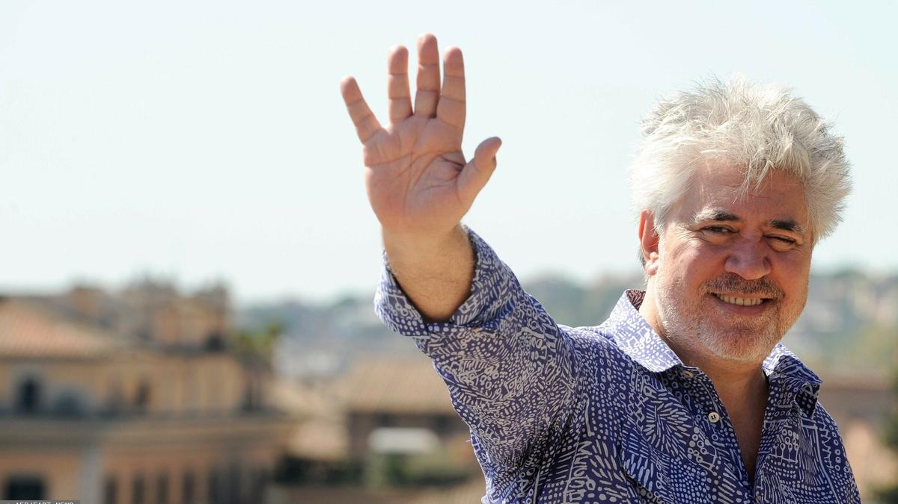

# Педро Альмодовар — чествования продолжаются. 26 сентября в Сан-Себастьяне прошло награждение режиссера почетным призом «Доностия» и испанская премьера «Соседней комнаты»

- **URL:** https://novayagazeta.ru/articles/2024/09/27/pedro-almodovar-chestvovaniia-prodolzhaiutsia
- **Дата:** 2024-09-27
- **Автор:** Лариса Малюкова

## Педро Альмодовар — чествования продолжаются

## 26 сентября в Сан-Себастьяне прошло награждение режиссера почетным призом «Доностия» и испанская премьера «Соседней комнаты»

Педро Альмодовар. Фото: AFP / EAST NEWS

Награду Альмодовар получил через 44 года после своего дебюта на фестивале в секции «Новые кинематографисты». Премию «Доностия» вручала Тильда Суинтон в аудитории Kursaal.

В своей речи Педро Альмодовар сказал, что «страсть к кино» дала направление его жизни и, вероятно, спасла его от всевозможных опасностей: «В моем возрасте такая награда, как «Доностия», может указывать на финал дороги — за то, что я прошел по ней. Но я так не вижу. Для меня кино — это благословение или проклятие. Я не могу представить себе другой жизни, кроме безостановочной работы над сценарием и режиссурой».

«Мое призвание было и остается сильнее меня самого и всего, что меня окружает. Эта профессия — лучшая в мире, она стоила того, чтобы отдаться ей всем сердцем. Более чем когда-либо кино — моя жизнь, и моя жизнь не имела бы смысла без кино».

«Жизнь, как в вымысле, — завершил свой спич Альмодовар, — так и в реальности, сложна и влечет за собой множество опасностей. Но без свободы жизнь не стоит того, чтобы жить… Давайте сделаем все возможное, чтобы великие трагедии, повседневная боль, непонимание, ложь, отсутствие сочувствия, социальная несправедливость, ненависть, все мыслимые негативные вещи стали вымыслом и позволили реальной жизни существовать справедливо, с миром и развлекаться высокими фантазиями».

Премия была вручена в связи с юбилеем, 75-летием режиссера, который он отметил 25 сентября.

Педро Альмодовар, удостоенный «Золотого льва» за фильм «Комната по соседству», на церемонии закрытия 81-го Венецианского кинофестиваля. Фото: AP / TASS

Маскарадный триумфатор лицедейства, певец «дурного воспитания», рыцарь «женщина на грани нервного срыва», путешественник по лабиринту страстей (в том числе запретных), художник, передавший экрану накал высоких драм Лорки, переведший за руку мелодраму через порог трагедии, мастер эклектики и создания поэзии из осколков кича и мыльной оперы.

Все это он.

Но начиная с «Цветка моей тайны», «Поговори с ней», режиссер все больше погружается в экзистенциальные размышления, в тонкие настройки человеческих связей, да и еще более тонких нитей, соединяющих миры.

Он всегда любил умерших или псевдоумерших возвращать к жизни. От прикосновений рук, как в «Кике». В «Цветке…» Лео возвращается из тьмы небытия, призываемая голосом матери.

Поддержите нашу работу!

1000 500 300 Нажимая кнопку «Стать соучастником», я принимаю условия и подтверждаю свое гражданство РФ

Если у вас есть вопросы, пишите [email protected] или звоните:+7 (929) 612-03-68

В «Возвращении» мать сама прибудет с того света под кровать, просто потому, что на самом деле не умирала. В «Поговори с ней» Алисия очнется после пяти лет комы, благодаря пробивающейся в ней новой жизни, но еще чудотворной нежности незнакомого ей медбрата Бениньо.

Но теперь, кажется, маэстро, как обычно нарушая правила и шаблоны, осмелился отдать дань уважения госпоже Смерти. На свидание с ней решает отправиться героиня Тильды Суинтон.

«Этот фильм выступает за эвтаназию, — сказал режиссер на пресс-конференции в Венеции, — это то, что нас восхищает в персонаже Тильды: она решает, что избавиться от рака можно, только приняв решение, которое она действительно принимает».

«Если я доберусь туда раньше, рак меня не победит», — говорит она. И поэтому она находит способ достичь своей цели с помощью своей подруги, но им приходится вести себя так, как будто они преступники».

Но, конечно, главное в его картине классическая тема memento mori, напоминание о смерти для всех алчных и ненасытных, живущих одним днем.

Он говорит, что делает кино для одиночек, чтобы экран стал для них убежищем. Он подвергает сомнению «нормальность», потому что выход за пределы принятого, дозволенного, устаканенного и есть жизнь. Или кинематограф Альмодовара — что есть синонимы.

Ура ему!

Лариса Малюкова ведет телеграм-канал о кино и не только. Подписывайтесь тут.

### Этот материал входит в подписки

Смотровая площадкаКино с Ларисой Малюковой

Культурные гидыЧто читать, что смотреть в кино и на сцене, что слушать

### Добавляйте в Конструктор свои источники: сайты, телеграм- и youtube-каналы

Войдите в профиль, чтобы не терять свои подписки на разных устройствах

Поддержите нашу работу!

1000 500 300 Нажимая кнопку «Стать соучастником», я принимаю условия и подтверждаю свое гражданство РФ

Если у вас есть вопросы, пишите [email protected] или звоните:+7 (929) 612-03-68
