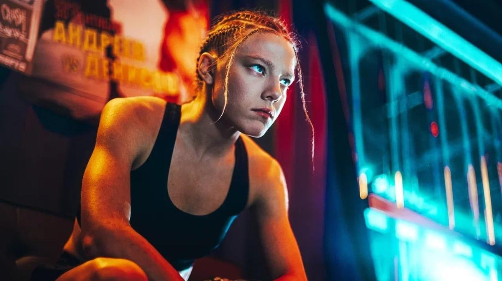

# Вы гангстеры? Нет, мы русские. Как Аня с Ермаком якудзу победили. На экраны выходит сериал «Амура» Андрея Джунковского и Ильи Овсенева

- **URL:** https://novayagazeta.ru/articles/2024/10/01/vy-gangstery-net-my-russkie-kak-ania-s-ermakom-iakudzu-pobedili
- **Дата:** 2024-10-01
- **Автор:** Лариса Малюкова

## Вы гангстеры? Нет, мы русские. Как Аня с Ермаком якудзу победили

## На экраны выходит сериал «Амура» Андрея Джунковского и Ильи Овсенева

Кадр из сериала «Амура»

Картина — экшн-драма — копродукция с анимационными вставками в стиле манга.

Сестры-близнецы Аня и Надя Вдовины (Алена Михайлова) из владивостокского детдома научились выживать, оберегая друг друга. Точнее, Аня с ее бойцовским характером оберегает более хрупкую Надю. Аня грузит ящики с рыбой, бьется насмерть в боях без правил (ММА) и проблемы решает «с одного удара» (неважно, ногой или головой).

Удар в бесправном мире — самое эффективное средство борьбы за справедливость.

Надя метнулась за лучшей жизнью в заветную Японию. Однажды от нее приходит тревожное сообщение, связь обрывается: она в беде.

И тогда Аня пробирается на японский катер, достигает Японии. Начинается ее «восточная одиссея» в поисках пропавшей сестры. Прежде всего она находит своего «бывшего» — Никиту Ермака (Юрий Колокольников). Опереточный фрик здесь прижился… В сине-малиновой шкуре Медведя он выступает в идиотском спортивном шоу — к радости местных школьниц. Тем и живет — до приезда (как снег на голову) боевитой и грубоватой провинциальной Ани. И как только они начинают свой поиск, за ними бросается в погоню якудза. Похоже, что сразу два клана, промышляющие наркотиками и торговлей людьми.

Кадр из сериала «Амура»

Первые серии не радуют изобретательностью сюжета, но колоритны и живописны. Восточный порт. Крабы в сетке. Женский лютый бой без правил до полного нокаута (хорошо, не до смерти). Плывущая к японскому берегу в холодном океане оторва Аня, едва не превратившаяся в кусок льда в рефрижераторе с рыбой. Пестрые краски города, неоновая живая реклама на высотках, кислотные цветы, рынок, ночные фонари, кварталы нищих и торчков, элитные квартиры. Медитирующие и жестоко расправляющиеся с неугодными (нерасторопными) якудза. В одной из первых сцен одна из таких жертв буквально висит на краю высотки… чтобы лететь потом в сверкающее огнями царство Аида. Театр кабуки. Бордель, из которого исчезла Надя и в котором едва не убили Ермака… кабы не фирменный удар с ноги Ани (готовясь к роли, Алена Михайлова брала уроки борьбы и силовые тренировки). Все похоже на картинки в комиксе с подписями. Эффектные желто-красные титры, поясняющие локации (русские буквы и иероглифы): клуб Дзэтай Ренки, где трудится Медведем Ермак, мафиозный офис Акиры, дом Надиной подруги Кейко, «храм» нищего мудреца Танаки на крыше борделя.

И на заставке — образ якудзы, осьминог (он же готовится на кухне дорогого ресторана под присмотром шефа): у осьминога много щупальцев, поэтому колоть надо между глаз, чтобы победить. Придется нашей Ане бить мафиозного Осьминога промеж глаз, и он еще не знает силу ее удара.

Кадр из сериала «Амура»

Комиксовая стилистика главенствует.

Моменты из прошлого Ани, Нади и Никиты — аниме-графика. Это воспоминания Нади, ее фантазия, ее восприятие мира, стилизованное под мангу. Мир вокруг Ани — яркий, чужой и опасный. Вот она и «держит оборону». Анимация изображает и наиболее жестокие моменты, смягчая «удар» для наиболее впечатлительных зрителей. По идее, две сестры — полярности. Одна — жертва, другая — антижертва, прогибающая враждебный мир под себя. Но мы видим только бойца Аню (в первых драфтах она была сложнее, противоречивее). А сам криминальный боевик похож (во всяком случае, в первых сериях) на бадди-муви, путешествие по задворкам условного восточного криминального мира.

Сюжет, многократно освоенный кинематографом: герой едет искать пропавшую (или пропавшего). От «Исчезнувшей» и «Поиска» до фильмов «Пять» или «Крепкого орешка». Или мытарств храбреца Джейсона Борна, в поисках исчезнувшей девушки в Москву отправившегося. Но главный неприкрытый референс, если не сказать прототип фильма, — «Брат 2». Данила превратился в Аню, которая в опасной и безнадежной Японии сестру разыскивает, и поберегись любой, кто ей попытается помешать. Кто против нас с Ермаком. В каком-то смысле

«Амура» продолжает «братскую» концепцию деления на своих и чужих. У Балабанова Америка оказывалась зачумленным пространством «неправды», потому что все там было не как у людей, «не по-нашему».

Поддержите нашу работу!

1000 500 300 Нажимая кнопку «Стать соучастником», я принимаю условия и подтверждаю свое гражданство РФ

Если у вас есть вопросы, пишите [email protected] или звоните:+7 (929) 612-03-68

Кадр из сериала «Амура»

Здесь похоже. И когда герои в противопоставлении себя чужим говорят Russian normalen, зал аплодирует, потому что слышит ставшее мемом: «Вы гангстеры? Нет, мы русские. Не обманываем друг друга». Здесь много цитат и прямых отсылок. Например, приехав в чужой мир, Аня стрижется наголо — точно так же, как лысая Даша-Мэрилин, вынужденная придорожная шлюха с университетским образованием («Мальчик, водочки принеси!»). Кстати, сюжет с близнецами тоже был в «Брате 2» (одного убили в Москве, другого — игрока хоккейной команды Pittsburgh Penguins — сыграл хоккейный агент Александр Дьяченко).

По первым сериям, в которых нередко только раскатывается сюжет, судить о сериале сложно. Возможно, история сестер начнет набирать обороты, характеры обретут объем. Пока визуальная составляющая превалирует и заметно превосходит содержательно-смысловую. Пока мало что понятно про главную героиню Аню Алены Михайловой («Чики», «Жена Чайковского»). Надеюсь, ее прошлое прояснится и мы поймем, кто же ее так гнобил в детстве, что она превратилась в волчонка, мышцы с кулаками. Перед показом я разговаривала со сценаристами фильма. Они рассказали, что в первых вариантах история была другой — более разноцветной, мистической. Например, в подростка Амуру (девочка жила у берегов большой реки Амур) вселялась душа тигрицы, которую она повстречала и которую убили охотники. Надеюсь, японские приключения бойца Ани из окончательной версии сериала не станут поводом для демонстрации противостояния или национального превосходства, а выявят сходство и контраст культур, представители которых при всех трудностях перевода сумеют найти общий язык.

### Этот материал входит в подписки

Смотровая площадкаКино с Ларисой Малюковой

Культурные гидыЧто читать, что смотреть в кино и на сцене, что слушать

### Добавляйте в Конструктор свои источники: сайты, телеграм- и youtube-каналы

Войдите в профиль, чтобы не терять свои подписки на разных устройствах

Поддержите нашу работу!

1000 500 300 Нажимая кнопку «Стать соучастником», я принимаю условия и подтверждаю свое гражданство РФ

Если у вас есть вопросы, пишите [email protected] или звоните:+7 (929) 612-03-68
