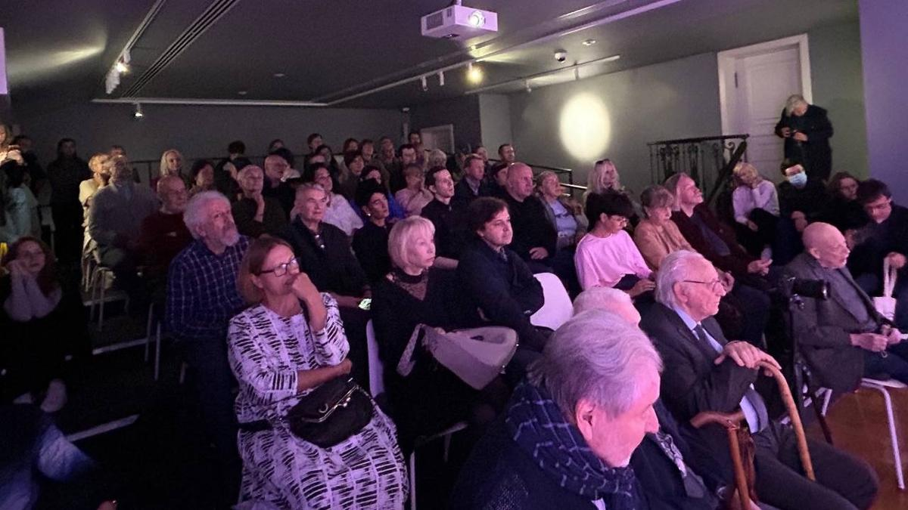

# Марлен в настоящем. Друзья и ученики Хуциева вспоминали мастера-кинорежиссера, который завораживал зрителей «счастьем высказанности» и «горечью узнавания»

- **URL:** https://novayagazeta.ru/articles/2024/10/02/marlen-v-nastoiashchem
- **Дата:** 2024-10-02
- **Автор:** Лариса Малюкова

## Марлен в настоящем

## Друзья и ученики Хуциева вспоминали мастера-кинорежиссера, который завораживал зрителей «счастьем высказанности» и «горечью узнавания»

Вечер, посвященный книге «Марлен. Собрание сочинений». Фото: Наталья Лисовская

В Центре Вознесенского был полный зал свидетелей — как же хорошо поговорили о новой книге «Марлен. Собрание сочинений», посвященной Мастеру на все времена — Марлену Хуциеву. Книга, как и кино, читается и смотрится с любого места. Составители и друзья режиссера вспоминали, как с ним работалось

Андрей Хржановский, придумавший и собравший книгу, говорил, что она только начало путешествия к планете Кино Хуциева. А в книге не только мозаика рассказов, историй коллег и друзей, но и голос самого режиссера, который направляет общее повествование.

Классик операторского искусства Геннадий Карюк (он снимал лучшие картины Киры Муратовой, последние фильмы Хуциева) вспоминал, как достигался эффект поэтического документализма мастера. Как трудно и интересно с ним работалось: никто не знал, что сегодня может произойти на съемочной площадке.

Лариса Малюкова, Геннадий Карюк и Максим Павлов. Фото: Наталья Лисовская

Наум Клейман размышлял о том, почему Хуциева (в отличие от Эйзенштейна и Тарковского) не понимают европейцы. Почему для нас так ценны в его фильмах «горечь узнавания» и «счастье высказанности». А еще мы вспомнили целую детективную операцию, которую провернули молодые киноведы, восторженные почитатели хуциевского гения Клейман и Демин, чтобы увезти в Белые столбы со студии и тем самым спасти позитивную копию фильма «Застава Ильича».

Павла Финна я расспрашивала о «Заставе Ильича», в которой его уговорил сниматься Шпаликов. Как создавалась знаменитая сцена вечеринки. Как Хуциев с Маргаритой Пилихиной двигались внутри этого хаоса, трепа «безумствующих индивидуальностей» — на операторской тележке, и какое задумчиво-хитрое лицо было у режиссера, уже придумавшего… как выстроить этот хаос.

Причем самым дисциплинированным актером был…Андрей Тарковский. Вначале очень радостный, в финале (после 12 дублей с пощечиной) практически плачущий.

Лариса Малюкова и Павел Финн. Фото: Наталья Лисовская

Вениамин Смехов не рассказал, как его рассматривали и даже пробовали на роль Фокина (его сыграл Губенко) в «Заставу…». Но его спич — прекрасный разбор темы «Хуциев театральный». От взаимоотношений с Таганкой и Любимовым до спектакля «Случай в Виши» по пьесе Миллера в «Современнике».

Поддержите нашу работу!

1000 500 300 Нажимая кнопку «Стать соучастником», я принимаю условия и подтверждаю свое гражданство РФ

Если у вас есть вопросы, пишите [email protected] или звоните:+7 (929) 612-03-68

Вениамин Смехов и Максим Павлов. Фото: Наталья Лисовская

Гентриетта Перьян вспоминала, как снимали «Вечер поэтов» в Политехническом. Какие взаимоотношения были у кумиров. И почему ей, тогда простой девушке из Сталинграда, не понравились герои «Заставы…»

Режиссер Александр Бруньковский, ученик и во многих делах помощник Марлена Мартыновича, говорил об особом хуциевском методе работы. Как из разных (многих) съемок складывались эпизоды и кадры. И как в останкинском телецентре мастер перед показом подправлял «Заставу». Как добивался легендарной документальности. Хуциев не менторствовал, не «обучал», но у него можно было учиться в каждый миг общения.

Станислав Дединский, редактор книги, сказал, что еще столько же материала осталось «за кадром». И как жаль не вошедшего. Но книга и так неподъемная.

И это значит, что к столетию мастера, которое грядет в следующем году, есть и будет еще столько материала для выставок, научных конференций и новых изданий.

А на экране был портрет Марлена Мартыновича. Он смотрел куда-то поверх наших голов. Казалось, он сейчас о чем-то думает, слушает своих товарищей и учеников… вот-вот ворвется в разговор и, как всегда, начнет спорить.

«Совсем не могу говорить о Марлене в прошедшем времени», — сказал Наум Клейман. И тут Хуциев бы точно с ним согласился.

Лариса Малюкова ведет телеграм-канал о кино и не только. Подписывайтесь тут.

### Этот материал входит в подписку

Смотровая площадкаКино с Ларисой Малюковой

### Добавляйте в Конструктор свои источники: сайты, телеграм- и youtube-каналы

Войдите в профиль, чтобы не терять свои подписки на разных устройствах

Поддержите нашу работу!

1000 500 300 Нажимая кнопку «Стать соучастником», я принимаю условия и подтверждаю свое гражданство РФ

Если у вас есть вопросы, пишите [email protected] или звоните:+7 (929) 612-03-68
