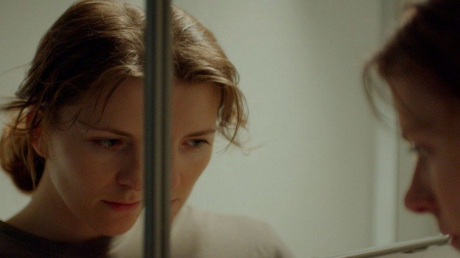

# Печь и бревно, пепел и доломит. Продолжаем рассказывать о новом авторском кино, представленном на фестивале «МАЯК»

- **URL:** https://novayagazeta.ru/articles/2024/10/08/pech-i-brevno-pepel-i-dolomit
- **Дата:** 2024-10-08
- **Автор:** Лариса Малюкова

## Печь и бревно, пепел и доломит

## Продолжаем рассказывать о новом авторском кино, представленном на фестивале «МАЯК»

Кадр из фильма «Агния»

«Агния» — современная ироническая сказка дебютантки Павлы Стратулат и продюсера Сабины Еремеевой с условным слоганом: «Не сгоришь, так замерзнешь».

У Агнии (Евгения Громова) длинные ресницы. Замерзшая с обмотанным шарфом лицом застыла у проруби, рядом с выловленной замерзшей рыбой. Сзади на снежной реке прыгают голые мужики — только что из бани. Рыбу будет жарить на рефлекторе ее восьмилетний сын Макс (Нил Бугаев из сериала «Эль Руссо»). Агния — печник. Парадокс в том, что живет печник в замерзшем аварийном доме с сосульками, похожем на дворец Снежной королевы. Дома холодно. Комиссия в лице чиновницы (Алина Ходжеванова) предлагает Агнии улучшить жилищные условия. Как?.. Да проще простого — родить второго ребенка.

Дома в городе замерзают, а будущий мэр Борис Анатольевич (Сергей Гилев) открывает бассейн. Печник Агния соглашается (не без труда) сложить печь в сторожке Бориса Анатольевича рядом с его стеклянной, хорошо утепленной виллой. По мере того, как складывается печь, меняется жизнь всех обитателей этого нарядного дома. Прежде всего дочки будущего мэра Василисы — юного Плюмбума. Она не расстается с винтовкой, стреляет в мишень с портретом отца, помогает Агнии возводить печь. По мере того, как растет печь, и сюжет все больше затягивает фантасмагория, освященная Лантимосом. Будет и убийство священного лося, и переходящая с головы на голову корона, чтобы птички лучше клевали. И высмотренные на потолке огурцы.

Будут мороз и пожар, баня на колесах и кутузка, выборы и флешмоб — против гипотетического мэра, секс в кровати и секс на печи.

Из плюсов — меланхоличный юмор, лаконичные, ироничные и абсурдные диалоги. И Евгения Громова в роли Снежной королевы/печника с примерзшим сердцем, к которому все тянутся… как к согревающему огню.

Кадр из фильма «Агния»

Павла Стратулат –—ученица Лунгина и Арабова — девушка, безусловно, способная. Но зигзагообразные отношения персонажей, на мой субъективный взгляд, запутаны-перепутаны. С какого-то момента ироничная метафизика пузырится из всех щелей, заполняя экран, бросая действие, то в жар, то в холод. Кажется, автор не всегда сама понимает, куда ее этот сновидческий абсурд — то ли морок, то ли виденья Агнии — выведет. Впрочем, приветствую скорее такой странный и поисковый дебют, нежели чем выверенную коммерческую поделку. На обсуждении актриса Евгения Громова, способная оправдывать режиссерские фантазии, заметила:

«Агния — это Россия, русская печь, и всё, чего она хочет, — это гореть, ведь гореть — значит жить». Правда?

«Агния» — тревожное кино-пророчество, и при всей призрачности сновидческого «бреда наяву» в духе Виго, это ощущение тревоги держит прерывистую сюжетную нить. Финал вроде благостный, как вымоленный сон: и печь дымит, и строительство блочных домов, и поголовная беременность, о которой мечтает руководство (в кино и в реальности). Но вся эта выморочная действительность концентрируется в большом телевизионном экране — единственной мебели в пустой с голыми стенами новой квартире Агнии и ее сына. Может, хотя бы она не сгорит и не замерзнет.

«Пепел и доломит» Томы Селивановой. Мировая премьера фильма состоялась на Роттердамском кинофестивале.

Кадр из фильма «Пепел и доломит»

Российский режиссер Дина с камерой (Тома Селиванова) и немецко-бельгийский музыкант и звукорежиссер Йохан (Антон Риваль, сыгравший главные роли в «Французе» Смирнова и «Медее» Зельдовича») отправляются в большое путешествие по местам захоронения жертв сталинских репрессий и военнопленных. От Коми и Магадана до Камчатки, от Карелии — до лесного урочища Сандармох. Каждый из них хочет восстановить историю своей семьи. У Йохана на территории России в годы войны бесследно исчез дед. Дине/Томе важно разобраться в себе, репрессии — трагедия ее семьи.

Кого бы они ни встретили в этих отдаленных, забытых богом и людьми местах, к ним относятся с подозрением. Задают одни и те же вопросы. Не журналисты ли они? Не иностранец ли — говорящий на ломаном русском красавчик?

Как важно и необходимо сегодня актуальное кино про историческую память — осознанную и бессознательную коллективную «забывчивость»? Тем более снятое молодыми авторами.

Почему к фильму Томы Селиваной не подключаешься эмоционально?

Это кино больше похоже на туристическое шоу с камерой по следам памяти и беспамятства. И дело не в том, что герои увидели в этом путешествии. А в способе рассказа, его устройстве.

Поддержите нашу работу!

1000 500 300 Нажимая кнопку «Стать соучастником», я принимаю условия и подтверждаю свое гражданство РФ

Если у вас есть вопросы, пишите [email protected] или звоните:+7 (929) 612-03-68

Места, куда попадают герои, впечатляют. Полуразрушенные камеры с решетками у подножия гор. Захоронения без опознавательных знаков, гора обуви (вопрос: как же она сохранилась?), безымянные кресты. Дина расскажет спутнику, что на лагерных кладбищах писали лишь номер заключенного, который смысл дождь. Да и хоронили больше в каменоломнях. Поэтому никто не знает, сколько здесь погибших. Стоп-кадры с заброшенными домами, пострадавшими от пожара или войны. Или целый район красивых в своей разрухе заброшенных домов, в тридцатые построенных пленными немцами. Обломки вышек. Доломитный карьер с яркими красивыми породами, доломит добывали заключенные. Рыбинское водохранилище, вырытое обитателями Волжского исправительного трудового лагеря. И в этом же ряду вдруг таблички с последним адресом, причем без какого-то пояснения.

Кадр из фильма «Пепел и доломит»

Есть выразительные кадры. Например, когда Йохан смотрит в найденное старое зеркальце и видит в нем исчезнувшего деда. Или останки трудовых лагерей, исчезающих на наших глазах окончательно. Есть откровенные фальшаки, когда Тома/Дина кричит в воду имена погибших.

Видео красиво скачет под гулкий звуковой фон по верхушкам деревьев. И странная диковатая музыка с нервной перкуссией и вкраплением стонущих электронных звуков. Партитура действительно яркая, интересная, но существует сама по себе. И разноцветные камни. Много синего цвета, яркой зеленой травы. Цветокоррекция страшной силы, будто для глянца.

Плюс умозрительные беседы: память лучше всего восстанавливают запахи. Йохан — музыкант, хочет жить в настоящем. Зачем искать прошлое в таких далеких труднодоступных местах, где даже жилья нет? По его мнению, Дина слишком сконцентрирована на прошлом. Дина не очень внятно объясняет про стыд, повторяя чужие слова и мысли, про желание докопаться до своих, чтобы связать себя с живыми и мертвыми. Чтобы обрести себя. А кажется, чтобы пожалеть себя.

Кадр из фильма «Пепел и доломит»

Но дальше Карелия. Здесь в одном лесу захоронения жертв и убийц. «Надо всем примириться, — объясняют нам, — иначе никак».

Это могло бы быть путешествие в страну забвения, которое само себя строит и рассказывает нам некую, пусть сбивчивую, но живую историю. Но «Пепел и доломит» — довольно искусственное построение с натужным, хотя и непрописанным сюжетом (сценарий тоже Томы Селивановой). С самолюбованием авторки и героини. Здесь и пунктирный роман героев, и тексты из Википедии. И возникающий как чертик из табакерки Константин Мурзенко. Словно авторы убеждены, что будут показывать свой фильм исключительно за границей, а там никто не свяжет «фашиста-мема» из «Брата-2» с благородным поисковиком.

Читайте также

Не сгоришь, так замерзнешь

В Геленджике открылся фестиваль актуального российского кино «МАЯК»

Но самое удивительное в этой конструкции — бревно. Его в платяном шкафу обнаружила немолодая хозяйка — знакомая Дины. За старыми немецкими газетами. На бревне надпись, вырезанная стамеской узником ГУЛАГа. А на другом конце небольшого бревна — адрес пленного австрийца. Такое вот бревно мира. Причем абсолютно новенькое, светлое. Словно не прошло 80 лет. Это бревно во многом олицетворяет это слишком красивое и искусственное кино на экспорт. Фильм, который мог бы стать событием… Да не стал.

«Люди, не убивайте друг друга» — гласит надпись на огромном памятном камне, кажется, в том самом карельском лесу. И это лучший кадр фильма.

Лариса Малюкова ведет телеграм-канал о кино и не только. Подписывайтесь тут.

### Этот материал входит в подписки

Смотровая площадкаКино с Ларисой Малюковой

Культурные гидыЧто читать, что смотреть в кино и на сцене, что слушать

### Добавляйте в Конструктор свои источники: сайты, телеграм- и youtube-каналы

Войдите в профиль, чтобы не терять свои подписки на разных устройствах

Поддержите нашу работу!

1000 500 300 Нажимая кнопку «Стать соучастником», я принимаю условия и подтверждаю свое гражданство РФ

Если у вас есть вопросы, пишите [email protected] или звоните:+7 (929) 612-03-68
