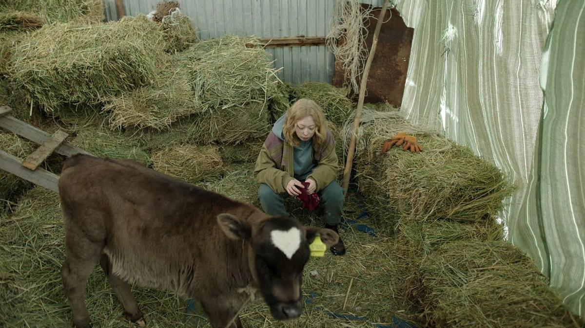

# Настроение — зима. Про мужское, женское и чернуху, которой нет, — по итогам кинофестиваля «Маяк»

- **URL:** https://novayagazeta.ru/articles/2024/10/12/nastroenie-zima
- **Дата:** 2024-10-12
- **Автор:** Лариса Малюкова

## Настроение — зима

## Про мужское, женское и чернуху, которой нет, — по итогам кинофестиваля «Маяк»

Кадр из фильма «Папа умер в субботу». Источник: Кино-Театр.Ру

Подводим фестивальные итоги и размышляем о тенденциях молодого российского кино, обозначенных программой нового и яркого отечественного киносмотра «Маяк», который в этом году проводился во второй раз.

Девять полнометражных дебютов в конкурсе, показанных по гендерному принципу. Сначала было кино про женщин, потом — про мужчин.

И в такой последовательности выяснилось много любопытного.

## Женщина

Чаще всего мы встречаемся с ней на пике внутреннего разлада, в лабиринте проблем. Прямо сейчас она должна принять судьбоносное решение. Героиня одной из лучших картин конкурса «Папа умер в субботу» (приз за лучший дебют) — московская визажистка Айко в первой сцене узнает о смерти отца в родном казахском селе. Решает ехать немедленно, хотя семья (прежде всего, новая семья отца) ее не ждет. Она сталкивается лицом к лицу с архаичным, патриархальным миром. В ее семейке старшие гнобят младших. Все проблемы принято скрывать: главное — не вынести сор из избы. Пусть дома будет что угодно: от распрей до насилия — дурное скрывают: «что люди подумают». Кажется, самое время собирать чемодан. Но Айко медлит. Почему-то ей нужно и важно быть рядом с этими нелепыми деревенскими родственниками и друзьями. Может быть, чтобы что-то понять про себя.

Все эти молодые женщины существуют в активном действии, точнее — противодействии обстоятельствам затхлого старого мира.

В исторической (XVII век) зарисовке «На этой земле» Ренаты Джало (приз оператору и специальное упоминание жюри) юную героиню задавили-замучили поучениями-понуканиями мракобесы. Она замаливает болячки своей сестры, а люди «добрые» шепчут «почто она сестру «кушает». Ее выдают замуж — и совершают унизительный, стыдный обряд раздевания и «положения» на соломенную кровать голых молодоженов. После неудачного полета деревенского чудака — Икара с крыльями из камыша и веток она нацепит на себя его поломанные крылья… И полетит. Ну может, хоть на минуту оторвется от этой окаянной земли, притяжения тьмы. И за этот отчаянный полет готова заплатить жизнью.

Кадр из фильма «На этой земле». Источник: Кино-Театр.Ру

В «Белом пароходе» Марта — руководитель хора в Якутии, решается на жесткое противостояние с назначенным из Москвы директором колледжа. Это больше, чем столкновение характеров. Это столкновение культур. Империи и колонии. Урбанизации и природы. Природа в образе мычащего хора протестует против давления столичного самонадеянного начальника — «дирижера». Но еще это легенда о верности. Женщина с весенним именем Марта и зимней судьбой верна своей любви к давным-давно исчезнувшему капитану, и это дает ей силы оставаться собой.

Кадр из фильма «Белый пароход». Источник: Кино-Театр.Ру

В «Агнии» Печник с огненным именем Агния живет в замерзающем из-за проржавевших труб доме с ребенком, который то дом подожжет, то из окна выпрыгнет. Будто пытается маму от спячки пробудить. Но кажется, сама эта Снежная королева привыкла к своему примерзшему сердцу, которое никак не оттает. И почему-то все тянутся к ней… как к согревающему огню. Она построит печь в доме нового мэра. Но принесет ли эта печь тепло в застывающий в нелюбви мир — большой вопрос.

Кадр из фильма «Агния». Источник: Кино-Театр.Ру

Женщины в новом русском кино не просто страдают от неустроенности и несправедливости распадающейся на глазах реальности, но пытаются соединить обрывки… не получается.

Подавляющее число фильмов — про зиму, которая никогда не заканчивается на этой земле. Таково нынешнее настроение молодых кинематографистов.

Читайте также

Печь и бревно, пепел и доломит

Продолжаем рассказывать о новом авторском кино, представленном на фестивале «МАЯК»

Поддержите нашу работу!

1000 500 300 Нажимая кнопку «Стать соучастником», я принимаю условия и подтверждаю свое гражданство РФ

Если у вас есть вопросы, пишите [email protected] или звоните:+7 (929) 612-03-68

## Мужчина

«Вечная зима» — история о том, как проживать-изживать горе. Про родителей, потерявших сына-подростка. Мама (Юлия Марченко) свернула свою жизнь в один сгусток боли. Бросила работу, лежит на диване калачиком. Отец (Александр Робак) пытается спастись с помощью мести: отыскать отморозков, убивших его ребенка, наказать. Пусть даже сесть лет на десять. Им обоим — хуже. Но кажется, сильным — намного труднее, им не на кого опереться. Тем более в этой новой, чужой для него стране, где люди даже письма друг другу не пишут. Робак прячет эмоции, загоняет за оболочку непроницаемости, точный, запоминающийся образ сломавшегося сильного человека. Жаль, фильм остался без наград.

Кадр из фильма «Вечная зима». Источник: Кино-Театр.Ру

«Джекпот». Игорь Хлебников — герой криминальной комедии Александра Ханта — случайно оказался миллионером: банковский автомат выдал хроническому неудачнику, продающему бургеры, почти три миллиона. И тут рулетка его жизни закрутилась бешеной каруселью, расстреливая его травмами и бедами. Пока он не придет к простой, сегодня совершенно несовременной мысли: «Не в деньгах счастье». Но любопытно, что все женщины в этой черной буффонаде ждут от мужчин одного — денег.

Кадр из фильма «Джекпот». Источник: Кино-Театр.Ру

И наконец, «Кончится лето». Мужской триллер и роуд-муви Владимира Мункуева и Максима Арбугаева. О ломаной судьбе двух братьев, которые после кражи золота бегут, словно затравленные волки, на край земли. И если в балабановской дилогии основной была история Данилы Багрова, то в «Кончится лето» у каждого из братьев своя прописанная линия. В этом побеге от преступления к преступлению они меняются ролями. Младший становится старшим, в какой-то момент решает прервать цепочку зла. Но трагедию, закрученную на отношениях «брат за брата», — не прервать.

Мотив вестернов и триллеров «золото убивает» уходит на второй план, на первом — о природе насилия. О том, как маленький шаг на темную сторону жизни, тянет за собой большую трагедию.

Любопытно, как «Кончится лето», яркая и мощная работа Арбугаева и Мункуева (гран-при «Маяка»), разделила зрителей. Меньшая часть просвещенной публики, нередко феминистски настроенная, упрекают картину в воспевании зла, продолжении балабановской «братвы», любовании мужской брутальностью, и прежде всего — в беспросветной чернушности.

И вот этого я не понимаю. Фильм Арбугаева и Мункуева как раз демонстрирует порочную необратимость чисто мужского мира, порождающего исключительно насилие. (Это как «Айку», выступающую против национализма, упрекать в национализме.) Герои Юры Борисова и Макара Хлебникова воспитаны в основном отцом, и это «мужское воспитание» многое объясняет.

Кадр из фильма «Кончится лето». Источник: Кино-Театр.Ру

Теперь про «чернуху, которая «надоела».

- Во-первых, речь идет не о слепке с реальности — о жанровом кино со своими законами. А жанр обладает способностью отстранения от действительности.
- Во-вторых, хорошее кино сообщает нам нечто существенное о нынешнем времени. И картина о жизни, смирившейся с насилием и насильственным уничтожением жизни, о мутации сознания в атмосфере беззакония, о диктатуре силы, — более чем актуальна.
- В-третьих, про чернушность. Едва ли не самые яркие, оставшиеся в истории культуры произведения были «сказками про темноту». От «Власти тьмы» до Шекспира, безжалостно убивающего своих персонажей (в «Ромео и Джульетте» их шесть, в «Гамлете» — 12). «Груз 200» Балабанова или «Волчок» Сигарева — были диагнозами морального климата в обществе, а их обвиняли в «очернении действительности».
- В-четвертых, художник, снимая свое кино на тему, которая его волнует и не оставляет, не хочет ублажить или напугать/огорчить зрителя, он думает о достоверности внутри жанровой конструкции, о точности и ритме, о жизни в кадре — а не о том, чернуха это или нет.

Лариса Малюкова ведет телеграм-канал о кино и не только. Подписывайтесь тут.

### Этот материал входит в подписки

Смотровая площадкаКино с Ларисой Малюковой

Культурные гидыЧто читать, что смотреть в кино и на сцене, что слушать

### Добавляйте в Конструктор свои источники: сайты, телеграм- и youtube-каналы

Войдите в профиль, чтобы не терять свои подписки на разных устройствах

Поддержите нашу работу!

1000 500 300 Нажимая кнопку «Стать соучастником», я принимаю условия и подтверждаю свое гражданство РФ

Если у вас есть вопросы, пишите [email protected] или звоните:+7 (929) 612-03-68
