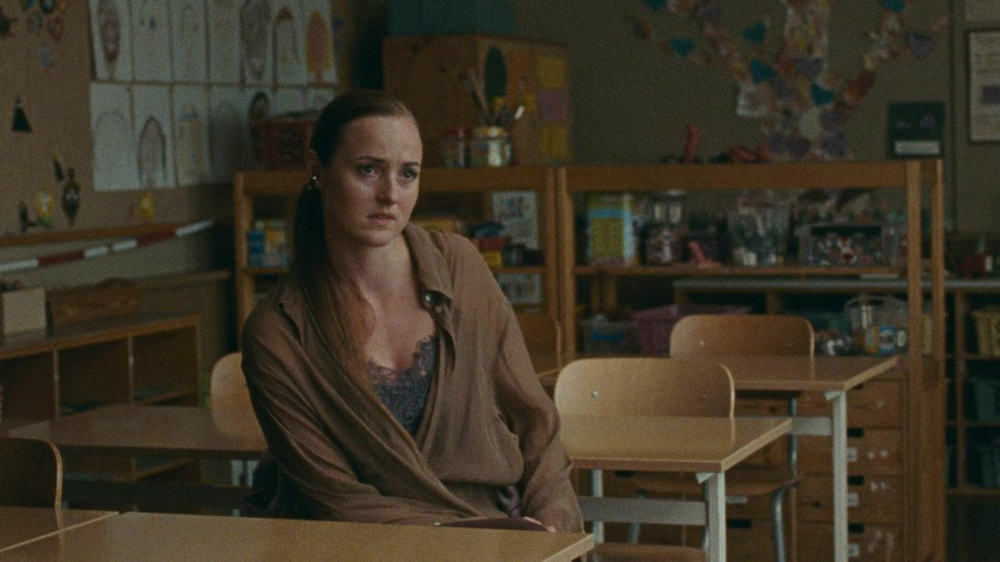

# Следствие в начальной школе. На экранах — драма «Арман»: провокационная картина об инфантильной сущности взрослых и сильный кандидат на «Оскар» от Норвегии

- **URL:** https://novayagazeta.ru/articles/2024/11/30/sledstvie-v-nachalnoi-shkole
- **Дата:** 2024-11-30
- **Автор:** Лариса Малюкова

## Следствие в начальной школе

## На экранах — драма «Арман»: провокационная картина об инфантильной сущности взрослых и сильный кандидат на «Оскар» от Норвегии

Кадр из фильма «Арман»

«Арман» (Armand) — режиссерский дебют Хальвдана Ульмана Тенделя — внука великой актрисы Лив Ульман и режиссера Ингмара Бергмана.

В главной роли — лауреатка Каннского фестиваля Ренате Реинсве (в импрессионистском «Худшем человеке на свете» она сыграла роль девушки в поисках себя, за которую и получила приз).

По пустой дороге мчится авто. В нем молодая актриса Элизабет (Реинсве). Ее сорвали с репетиции и срочно вызвали в школу. На безотлагательную беседу. Выясняется, что между ее сыном Арманом и его другом Йоном в туалете произошел серьезный инцидент. Родители Йона уже здесь, и они страшно обеспокоены. Учителя готовятся к трудному разговору, как битве: «Нужно понять, что именно произошло. Показать, что мы понимаем обе стороны».

Идет детальное выяснение обстоятельств. Не сразу мы понимаем, что сторонам конфликта — Арману и Йону — 6 лет…

Родители друг против друга. Нарастающее напряжение. Сара, мама Йона, напоминает, что это не первый случай и что Элизабет — актриса, поэтому не стоит доверять ее словам и ее слезам.

Все это только похоже на погоню за правдой и расследованием неких происшествий… в начальной школе. Во время разборок и абсурдных выяснений, немного напоминающих суд, все еще больше запутывается. На самом деле — дети здесь инструмент, с помощью которого взрослые выясняют свои отношения, плетут интриги.

Двусмысленность в каждом слове, фразе, забота и защита своего ребенка как обвинение другого. Попробуй отмойся. (Тут и вспомнишь мою любимую «Охоту» Томаса Виттенберга или чудовищные «классные чаты», в которых «стенка на стенку».)

А за учительским столом мудрые педагоги ну с очень европейскими медовыми реверансами: «Мы не хотим никого обвинять… Просто школа должна реагировать». И наконец, универсальной заповедью всех школ мира: «Главное, чтобы все тихо было».

Детей мы почти не увидим. В этой закрученной психологической или темной драме с угадываемыми внутренними вихрями внешне спокойных персонажей авторы сосредоточены на игре взрослых, неясности и противоречивости их отношений, их комплексах. Страхах и ревности, личной уязвимости каждого, попавшего в прицел общественного мнения.

Кадр из фильма «Арман»

Клаустрофобическая, провокационная, тихая и одновременно взрывная картина. Геометрия новенькой с иголочки школы, с острыми углами и лестницами, похожа на клетку, в которую попадает Элизабет — слишком фривольно одетая для посещения «храма знаний». С пустыми классами, арками, гулким стуком каблуков в долгом коридоре, отсутствием гомона детей, душным кабинетом, где ведется «следствие». Напряжение нарастает настолько, что у Аиши — замдиректора по воспитательной работе — идет носом кровь.

Между репликами — пространные паузы. В них — реакции на сказанное, порой совершенно неожиданные. В них — оторопь. Возмущение. Всхлипы и… штормовой хохот.

Поддержите нашу работу!

1000 500 300 Нажимая кнопку «Стать соучастником», я принимаю условия и подтверждаю свое гражданство РФ

Если у вас есть вопросы, пишите [email protected] или звоните:+7 (929) 612-03-68

А на стенах — детские рисунки и фотографии классов. Фотографии детей этих запутавшихся инфантильных родителей.

На первый взгляд — узнаваемое нордическое кино: в пустынном застывшем безмолвии (здесь осень) нечто сдержанное, холодновато-самобытное… Но Тендель выворачивает разговорную психологическую драму наизнанку, незаметно рвет очевидные моральные дилеммы театрализованными жестами, условностью и абсурдом. А в какой-то момент опрокидывает действие в хореографический спектакль: танец Ренсве «на острие ножа». Со шваброй (словно ведьма из норвежской сказки). Танец отчаяния. Или взрыв внутреннего неистовства и гнева.

Тендель в своих поисках стоит на плечах великанов: Томаса Винтерберга, Луиса Бунюэла, Изабеллы Эклоф и Брайана Де Пальмы. Поэтому у него и получается: вроде бы разговоры-разговоры, при этом — кино-кино. Саспенс, круженье и виражи на плотных крупных планах героев.

Читайте также

Свободное плавание

«Жизнь Анатолия Гребнева» — фильм открытия фестиваля «Зимний»

«Арман» — блестящий бенефис Ренаты Реинсве. Отдельное кино внутри фильма — лицо Рейнсве на крупном плане. Смена эмоций, догадок, переживаний — как на море в ноябре: уже штормит, но солнце изредка пробивает тучи.

Элизабет, напуганной, изумленной высосанной из пальца проблемой, эмоционально обнаженной, беззащитной, безкожной — веришь абсолютно. И в то же время вспоминаешь о ее профессии. Неужели притворство?

И она действительно, как убеждает всех Сара, опытный манипулятор? Да нет… ей необходимо докопаться до правды. Или?

Фильм — кандидат Норвегии на «Оскар». И я бы поддержала этот выбор.

## P.S.

В прокате с 5 декабря. 30 ноября в Москве и 1 декабря в Санкт-Петербурге состоятся специальные показы.

Лариса Малюкова ведет телеграм-канал о кино и не только. Подписывайтесь тут.

### Этот материал входит в подписки

Смотровая площадкаКино с Ларисой Малюковой

Культурные гидыЧто читать, что смотреть в кино и на сцене, что слушать

### Добавляйте в Конструктор свои источники: сайты, телеграм- и youtube-каналы

Войдите в профиль, чтобы не терять свои подписки на разных устройствах

Поддержите нашу работу!

1000 500 300 Нажимая кнопку «Стать соучастником», я принимаю условия и подтверждаю свое гражданство РФ

Если у вас есть вопросы, пишите [email protected] или звоните:+7 (929) 612-03-68
