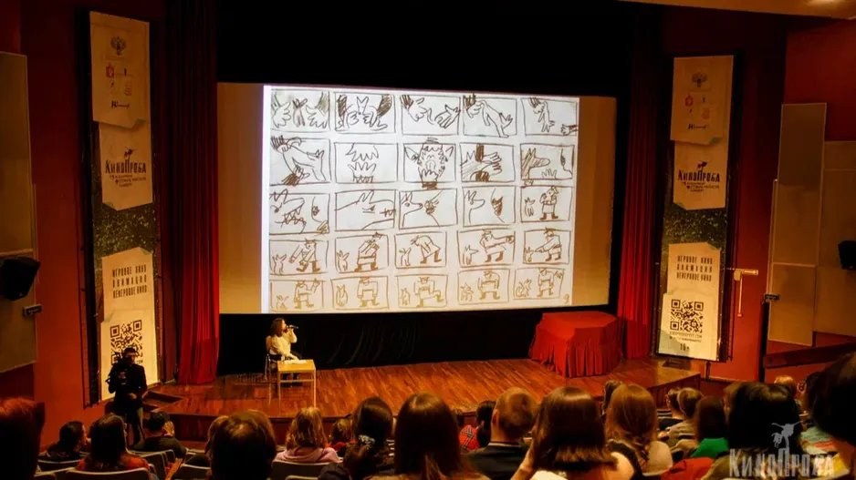

# Молодое кино — снег в нашем дворе. Фестиваль «Кинопроба» завершился, награды раздали. И, пожалуй, это был самый сложный за 21 год фестиваль для устроителей. Да и для зрителей тоже

- **URL:** https://novayagazeta.ru/articles/2024/12/06/molodoe-kino-sneg-v-nashem-dvore
- **Дата:** 2024-12-06
- **Автор:** Лариса Малюкова

## Молодое кино — снег в нашем дворе

## Фестиваль «Кинопроба» завершился, награды раздали. И, пожалуй, это был самый сложный за 21 год фестиваль для устроителей. Да и для зрителей тоже

Фото: kinoprobafest.com

По самым разным причинам фильмы «вычеркивались» из конкурсов (игрового, документального, анимационного) в последний момент. Устроители пытались перепечатывать программы показов и даже фестивальные «программки», но не успевали.

Все началось с фильма Открытия. Задолго была объявлена трагикомедия «Яша и Леонид Брежнев» Эдгара Багдасаряна. Притча о пожилом человеке, который после выхода на пенсию (всю жизнь трудился на заводе по переработке «комбинированных отходов», проще говоря — фекалий) попадает в воображаемый мир советского прошлого. В этом счастливом и вожделенном видении он на короткой ноге с Леонидом Ильичом, приятельствует с бывшими руководителями соцстран и легендарными революционерами Латинской Америки, участвует в ХХV съезде. Там ему хорошо. Здесь — плохо.

Фильм совместного производства России и Армении, создан при поддержке Министерства культуры, выдвинут от Армении на «Оскар» в номинации «Лучший иностранный фильм». Но в России, судя по всему, прокатного удостоверения не получит. Во-первых, тема не совпадает с генеральной линией на возвеличивание прошлого. И потому юмор совершенно не уместен. Во-вторых, в роли Брежнева — друга пенсионера Яши — Максим Виторган. Какие тут могут быть вопросы?

Но устроители вышли из положения и успели договориться с продюсерами картины «Снег в моем дворе» режиссера Бакура Бакурадзе («Шультес», «Охотник», «Брат Дэян»). Это действительно замечательный фильм. А для молодой студенческой аудитории показ во всех отношениях авторской работы со своей интонацией, с чуткой камерой Алишера Хамидходжаева, с атмосферой старого исчезающего Тбилиси, с печальным юмором — весьма поучителен. Минувшим летом Бакурадзе получил приз за лучшую режиссуру на фестивале в Шанхае.

Кадр из фильма «Снег в моем дворе»

После изъятия из конкурсов довольно внушительного числа фильмов программа не только «похудела», но превратилась в показ милых, но по большому счету безличных работ, порой вполне профессионально снятых.

Бесконфликтных, безобидных. В общем, приставки «без–бес» здесь, пожалуй, самые уместные.

Главный приз — тому свидетельство. Его получил обаятельный детский анимационный фильм «Носки для звезды» Ольги Титовой. Некий кружевной многорукий паук-демиург сидит на холодной скале «мироздания» и вывязывает, не жалея ниток, небосвод, отправляет макраме-созвездия в небо: Рыбу, Деву, Быка, Большую Медведицу, пока клубок не закончится. И вскоре «вывяжется» у него розово-белая Звездочка — тоненькая балерина. Танцует она, прыгая с одной ледяной скалы на другую. Холодно в пуантах — во вселенских заморозках. И тогда он свяжет для нее теплые носки. В мультфильме есть еще и немного «конфликта»: образуется черный дракон, но тоже из кружева. И наш рукоделец спасет Звездочку и согреет теплом и лаской.

Кадр из анимационного фильма «Носки для звезды»

Доброе, светлое, рукодельное. Но чтобы из всех конкурсов — игрового, документального, анимационного выбрать этот детский фильм? Так за год мы проделали большой путь в сторону сказочного, бесконфликтного кино.

В 2023 году главный приз получила картина Асмик Мовсисян «250 км» о 13-летнем мальчишке из Арцаха. Когда началась бомбежка, он взял из гаража старенькую отцовскую машину и вывез из-под обстрела маму, брата с сестрой, соседку с младенцем, двух незнакомых женщин и мальчишку-сироту из монастыря. И эта набитая под завязку легковушка, осторожно движущаяся навстречу огромным грузовикам с солдатами стала образом времени.

Будучи членом прошлогоднего жюри, могу сказать, что и выбирать лучший фильм было трудно, настолько разнообразным и сильным был конкурс. Ничего подобного в нынешнем показе не было.

Лучшим игровым дебютом назван «Разъезд» Марии Меленевской — обаятельный короткометражный хит нынешнего сезона. На «Горький-fest» фильм получил приз зрительских симпатий. Сказка про то, как оставаться людьми. О встрече на узкой дороге люмпена и интеллигентки, которые нашли общий язык. Так бывает. Во всяком случае в кино. С отличными работами Марии Смольниковой и Максима Стоянова.

Среди неигровых дебютов победил фильм «Свой среди детей» пермского режиссера Олеси Епишиной. Действительно вдумчивая психологическая зарисовка. О молодом человеке с необычной профессией. Константин — воспитатель в детском саду, но друзьям, которые над ним подтрунивают, он говорит, что работает «педагогом дошкольного образования».

Поддержите нашу работу!

1000 500 300 Нажимая кнопку «Стать соучастником», я принимаю условия и подтверждаю свое гражданство РФ

Если у вас есть вопросы, пишите [email protected] или звоните:+7 (929) 612-03-68

Он же не нянька. Ему нравится профессия, и у него есть горизонт в планах: стать начальником, чтобы изменить систему образования, очеловечить. Он готов вкладываться в будущее. А пока — надувает шарики, ведет занятия, устраивает праздники и надевает костюм Деда Мороза. Постепенно романтический пыл парня угасает, и он начинает понимать, что система сильнее его энтузиазма и наивных планов.

Лучший учебный игровой фильм «Мальчик из деревни» режиссера Пу Ци Жун из Малайзии. Это наивное кино про дружбу двух мальчишек. Один — бедняк, который из газет и скотча наверчивает себе футбольный мяч. Тот, что побогаче, — покупает ему мороженое, но страдает от гнета дедушки — домашнего тирана. Когда внук «тирана» с вывихнутой ногой оказывается на дороге, его бедный друг доволакивает до дома — детская дружба чище и справедливей взрослых комплексов и социальных препон.

Читайте также

Следствие в начальной школе

На экранах — драма «Арман»: провокационная картина об инфантильной сущности взрослых и сильный кандидат на «Оскар» от Норвегии

Лучший учебный неигровой фильм — «За живое» Екатерины Черепановой. Добро пожаловать в «костюмерку» Пермского театра оперы и балета. Здесь среди густых зарослей вешалок с платьями и работает гример Андрей Волосатик. Подрабатывает он и на «нарядных» костюмированных корпоративах. А несколько раз в месяц Андрей дежурит в морге. Там он преображает умерших, придавая им облик живых. И свое предназначение видит в том, чтобы помочь родным и близким проститься.

Андрей очень жизнелюбив:

праздники, городские и домашние, мамины треугольники из теста, шумный день рождения контрастируют с тишиной ритуальной конторы, в которой он остается наедине со смертью. Но парадокс в том, что к умершим людям Андрей относится, как к живым.

Отметила бы я и анимационную картину «Ограниченный» Елизаветы Елькиной. Абсурдистское эссе о человеке, вокруг которого начинает разрушаться привычный мир. Он сам — словно вышел из белого листа. И пытается руками задержать это разрушение. Однако выясняется, что причина всего — черная кошка, живущая у него внутри. Игра с кубизмом, геометрическими фигурами, белым квадратом в цветном мире.

Кадр из анимационного фильма «Ограниченный»

Среди лучших фильмов конкурса «Условные рефлексы» Анны Фрадкиной (спецприз жюри). Героиня фильма работает с белыми крысами. Кормит их, разговаривает. С Тамерланом, Теодором, Толей, но чаще всего со своенравным Пашей, который требует особого подхода. Вместе с мужем они 10 лет выплачивали ипотеку. Вот только вчера освободились. А сегодня он заявил, что разводится с ней, остается в квартире, а она пусть подыщет что-нибудь поблизости. Хорошо, что она так хорошо изучила не только безусловные, но и условные рефлексы — в человеческих взаимоотношениях это вещь совсем не бесполезная.

## P.S.

Я думаю о молодых авторах, фильмы которых «вычеркнули», и хочу пожелать им сил и веры в себя, это важные составные части профессии.

Лариса Малюкова ведет телеграм-канал о кино и не только. Подписывайтесь тут.

### Этот материал входит в подписку

Смотровая площадкаКино с Ларисой Малюковой

### Добавляйте в Конструктор свои источники: сайты, телеграм- и youtube-каналы

Войдите в профиль, чтобы не терять свои подписки на разных устройствах

Поддержите нашу работу!

1000 500 300 Нажимая кнопку «Стать соучастником», я принимаю условия и подтверждаю свое гражданство РФ

Если у вас есть вопросы, пишите [email protected] или звоните:+7 (929) 612-03-68
