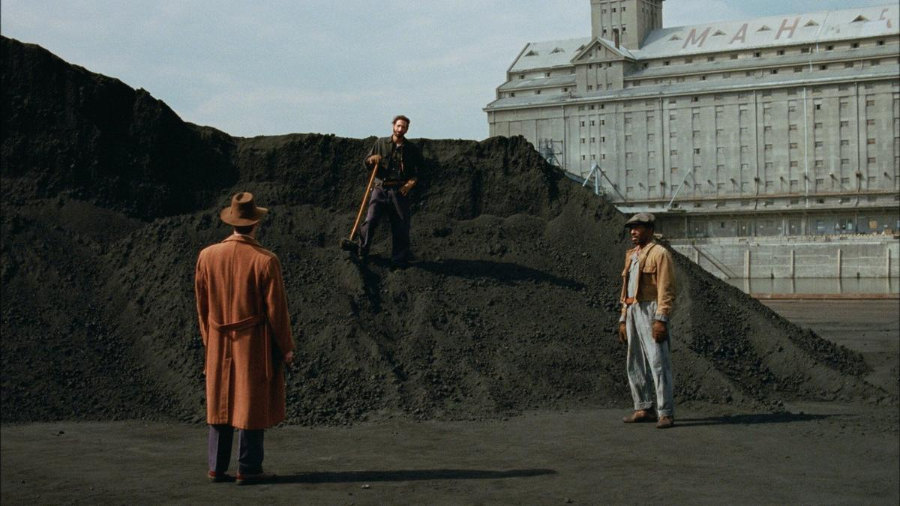

# Все, что нам кажется светом. Лучшие фильмы 2024 года. Выбор Ларисы Малюковой

- **URL:** https://novayagazeta.ru/articles/2024/12/24/vse-chto-nam-kazhetsia-svetom
- **Дата:** 2024-12-24
- **Автор:** Лариса Малюкова

## Все, что нам кажется светом

## Лучшие фильмы 2024 года. Выбор Ларисы Малюковой

Кадр из фильма «Бруталист»

## «Бруталист». Брейди Корбет

Захватывающая киноэпопея, действие которой разворачивается в сороковые–пятидесятые, но с подключением к току сегодняшнего дня. О венгерском еврейском архитекторе, пережившем Холокост и после эмиграции в Америке словившем уникальный шанс — мегазаказ.

О людях, пострадавших от войны, утрат, от ксенофобии и нетерпимости. И о том, как эта черная тень будет преследовать их всю жизнь.

О вечных эмигрантах — чужих в своих странах: старых и новых.

О неистребимой боли европейской культуры

И об американской мечте, стремление к которой может обернуться новым кошмаром. Или брутализмом — грубыми, срезанными формами из железобетона.

Наэлектризованное повествование о будущих разрушениях, физических и ментальных, которые заложены в фундаменте человеческой цивилизации.

## «Эмилия Перес». Жак Одиар

Кадр из фильма «Эмилия Перес»

Сногсшибательный, дерзкий (если не сказать, наглый), причудливый, провокационный фильм-мюзикл — музыкальная криминальная трагикомедия. Превращение Золушки в принцессу. Правда, «превращается» златозубый уродливый мафиози в… обворожительную богачку Эмилию Перес, которая, искупая бесчисленные чудовищные грехи, открывает неправительственную организацию по поиску тел пропавших (похищенных) людей.

В пересказе — безвкусная мыльная опера. Но при всей броской декоративности кино наэлектризовано энергией запутанных связей героев, врагов и друзей, музыкой и совершенно неожиданной хореографией. Сражают наповал безоглядная режиссерская отвага, энергия и… меланхолия. При этом в фильме много юмора: сентиментального и черного. А еще привкус горечи и смерти, круговорот взаимных обид, любви и неожиданных признаний.

## «Субстанция». Корали Фаржа

В бодром боди-хорроре Фаржа разрывает в куски, выворачивает наизнанку male gaze, объективизм, процветающий эйджизм. Демонстрирует, как женское увядание воспринимается в позолоченном глянцем патриархальном мире. «Субстанция» — и феминистский фильм об ужасах старения, и шокирующий галлюциногенный боди-триллер, и физическая комедия.

Именно поэтому центром бешеной пляски красоты, крови и кишок становится не обворожительная героиня Куэлли, а буквально рожающая ее Мур, невероятно храбрая, честная, к тому же готовая обнажиться в свои 60+. Отчасти играет себя.

Это ее звезда на Аллее славы потускнела, запылилась, треснула от шпилек и колес тележек с мороженым. Это о ней забыли.

Это она вслед за Фондой снимается в спортивном шоу на утреннем телевидении — «аэробика сохранит нашу молодость» — с девизом «Сияй своей жизнью». Это ее продюсер честит за старое тело… Деми Мур в этой разухабистой и залитой кровью фантастике бесстрашна и великолепна. Жаль, в Каннах не ей досталась награда.

## «Комната по соседству». Педро Альмодовар

Кадр из фильма «Комната по соседству»

Альмодовар во власти тьмы и света смерти. Не случайно на пресс-конференции в Венеции (фильм вызвал 17-минутную овацию) режиссер призвал легализовать эвтаназию во всем мире.

Смертельно больная военная журналистка Марта Тильды Суинтон решает уйти из жизни и просит о помощи свою старую подругу Ингрид (Джулианна Мур). Начинается ее последний бой с неистребимой болезнью, ломающей ей кости и сжимающей легкие. Это ее важнейший выбор. И короткую жизнь перед «затемнением» они с Ингрид проживают вместе, одну на двоих. Разделяя не только боль, но и вкус мгновения, пение птиц, воспоминания и шорох падающего снега.

## «Птица». Андреа Арнольд

Кадр из фильма «Птица»

Вслед за Лоучем Арнольд воспевает шершавую стилистику «британских кухонь», правда, в отличие от классика, ее кино наполнено романтикой, поэзией, сюрреалистическими (увы, порой навязчивыми) всплесками: чайка приходит к мечтательной тинейджерке Бэйли, лиса является на свадьбу ее папаши, ворона ворует у девочки ее письмо. Единственная привязанность городской девочки — птицы. Словно в сказке, она встречается в полях… нет, не с принцем: с эксцентричным и беспокойным Бердом (Франц Роговский), причудливо скачущим по траве в килте. Берд, словно Карлсон, замирает на краю крыши, его «юбочка» раздувается на ветру, словно крылья. И Бэйли, как взрослая, начинает беспокоиться за судьбу инфантильного Карлсона, аутсайдера и поэта, потерявшего семью. Но именно ощущение свободы сдвинутого с колеи Берда позволяет ей набраться храбрости, чтобы взять ответственность за свою собственную жизнь.

## «Все, что нам кажется светом». Паял Кападиа

Кадр из фильма «Все, что нам кажется светом»

Шероховатая и оттого еще более живая, нежная, меланхолическая история о трех современницах. Удивительно, но в патриархальной мумбайской среде эти женщины сами определяют свою судьбу, мужчины лишь пытаются к ним прислушиваться. Кападия не отворачивается от картин бедности, тяжкости жизни, но обнаруживает свет в «трудных судьбах» своих героинь.

Гран-при Каннского кинофестиваля. И это большое событие для Индии, впервые за 30 лет оказавшейся в основном конкурсе — после «Судьбы» Шаджи Н. Каруна. Но главное — не другое. Фильм, снятый в «городе грез и иллюзий» Мумбаи в разгар сезона муссонов и на побережье, обезоруживает экранной магией, созерцательной поэзией. И прежде всего — внутренней свободой, которой автор щедро делится со своими героинями.

## «Настоящая боль». Джесси Айзенберг

Кадр из фильма «Настоящая боль»

Поддержите нашу работу!

1000 500 300 Нажимая кнопку «Стать соучастником», я принимаю условия и подтверждаю свое гражданство РФ

Если у вас есть вопросы, пишите [email protected] или звоните:+7 (929) 612-03-68

Одна из лучших картин последнего Санденса. Двоюродные братья летят из Америки, выполняя предсмертную просьбу бабушки, навещают ее дом в Польше и решают с туристической группой посетить места «великой трагедии»: еврейское гетто и Майданек.

Надо погрузиться (или избавиться) от гнетущего чувства вины — последствий исторической травмы.

Это эмоциональное и философское исследование того, как прочувствовать без ложного пафоса и с учетом личных проблем ту бездонную боль и кошмар, которые пришлось пережить (или не пережить) их предкам.

Калкин и Айзенберг существуют на контрастных температурах. Дэвид Айзенберга старается соответствовать приличиям, норме. Бенджи совершенно потрясающего Калкина — вспыльчив, раздерган, хаотичен, непредсказуем в каждом жесте. Но именно он — неудобный, истерзанный комплексами, приступами паники — становится камертоном честного отношения с памятью. Именно ему представляется диким ехать в вагоне первого класса… до станции Майданек. В этих братских отношениях столько недосказанного, запутанного. И возможно, эта поездка в ад как-то примирит их с действительностью и друг с другом.

## «Мегалополис». Фрэнсис Форд Коппола

Кадр из фильма «Мегалополис»

Да, путанный, да, несовершенный. «Грандиозный и чудовищный» пеплум. Фильм-миф из мегалона — синтетического материала из недостижимой утопии. Как кино будущего, которое 85-летний создатель «Апокалипсиса сегодня» и «Крестного отца» рискнул снять. За попытку спасибо.

Не припомню столь радикального разрыва реакций и оценок. От семиминутной овации на премьере до «Бу!» и аплодисментов критиков. И провал в прокате.

400-страничный сценарий проекта он написал еще 1983 году. 40 лет размышлений. Первые кадры сняты в 90-х. Сколько раз запускался. Срывались контракты с уже снимающимися актерами, перепланировались объекты.

Снимал фильм на собственные немалые средства — 120 миллионов долларов.

Создал размашистое кино для Imax как муралист. Замешав на холсте цитаты и отсылки к Марку Аврелию, Сафо, Петрарке, Гете, Уэллсу и Ральфу Уолдо Эмерсону. Личную боль, связанную с потерей жены, которой посвятил картину.

«Мегалополис» — неровное кино с вагнеровским замахом, с неловкой компьютерной графикой, зашкаливающей романтикой.

Нет, Коппола не изобрел новое кино, лишь попытался разворошить старые формы — как неукротимый романтик, он все же верит в способность художника задавать сущностные вопросы. Хотя бы задавать.

## «Семя священного инжира». Мохаммад Расулоф

Кадр из фильма «Семя священного инжира»

Разумеется, есть картины тоньше, полифоничней, изящней сделанные. Есть эксперименты в пространстве киноязыка, неожиданные сплавы видов и жанров кинематографа. Но режиссер в ограниченном пространстве притчи и скромных средств рассказал о главной боли Ирана и современного мира: авторитаризме и теократии, беспощадной мизогинии, жесточайшей борьбе с инакомыслием и инакомыслящими.

Да, «кино прямого действия», но такой силы и страсти, что способно не только описывать, но вмешиваться и даже воздействовать на реальность.

А само описание жестокой реальности автор превращает в миф о семье как сколе общества. Глава семейства, олицетворяющий старшее поколение, оказывается Кроносом, пожирающим своих детей… по законам шариата.

## «Виды доброты». Йоргос Лантимос

Кадр из фильма «Виды доброты»

Только что осыпанный всеми возможными оскаровскими наградами и за «Бедных и несчастных» режиссер предъявил в каннском конкурсе спорную черную-пречерную макабрическую комедию о непреложной зависимости, насилии, о тотальном духовном господстве.

Триптих, в котором жизни различных людей переплетены, взаимозависимы, несамостоятельны. А чтобы мы острей почувствовали нашу схожесть и всеобщую зависимость друг от друга, Лантимос дает одним и тем же актерам разные роли. Готов ли совершить убийство зависимый маленький человек новой формации? Какой ценой можно доказать спятившему мужу, что ты его жена? Почему люди с промытыми мозгами готовы отказаться от всего в жизни, в том числе от себя?

«Виды доброты» — очевидный кэп. Или шаг назад в сравнении с «Лобстером» или «Бедными и несчастными». Но и в этой не слишком замысловатой абсурдистской пародии на современный социум почему-то не вызывают сочувствия «бедные и несчастные», представители общества, безропотно и охотно отдающие и право решать за них, и право на собственную жизнь другим — вроде бы облаченным высшим знанием и волей — «богатым и счастливым».

Лариса Малюкова ведет телеграм-канал о кино и не только. Подписывайтесь тут.

### Этот материал входит в подписки

Смотровая площадкаКино с Ларисой Малюковой

Культурные гидыЧто читать, что смотреть в кино и на сцене, что слушать

### Добавляйте в Конструктор свои источники: сайты, телеграм- и youtube-каналы

Войдите в профиль, чтобы не терять свои подписки на разных устройствах

Поддержите нашу работу!

1000 500 300 Нажимая кнопку «Стать соучастником», я принимаю условия и подтверждаю свое гражданство РФ

Если у вас есть вопросы, пишите [email protected] или звоните:+7 (929) 612-03-68
