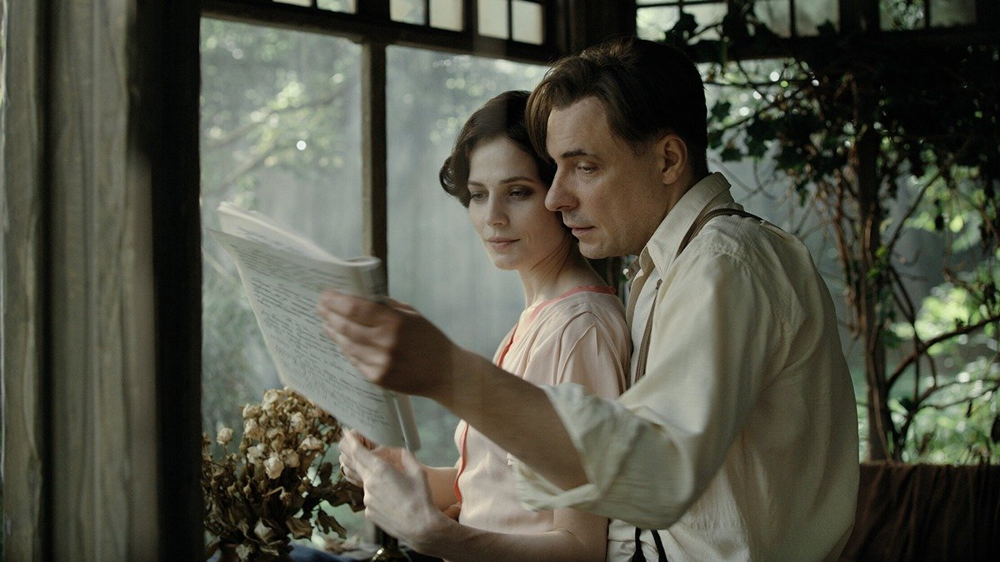

# С надеждой о любви среди зимы и беды. Десять лучших российских фильмов 2024 года. Выбор Ларисы Малюковой

- **URL:** https://novayagazeta.ru/articles/2024/12/28/s-nadezhdoi-o-liubvi-sredi-zimy-i-bedy
- **Дата:** 2024-12-28
- **Автор:** Лариса Малюкова

## С надеждой о любви среди зимы и беды

## Десять лучших российских фильмов 2024 года. Выбор Ларисы Малюковой

Кадр из фильма «Мастер и Маргарита». Источник: kino-teatr.ru

- «Мастер и Маргарита» Михаила Локшина
- «Снег в моем дворе» Бакура Бакурадзе
- «Кончится лето» Владимира Мункуева и Максима Арбугаева
- «Кукушка» Евгения Николаева
- «Папа умер в субботу» Заки Абдрахмановой
- «Воздух» Алексея Германа
- «Вечная зима» Николая Ларионова
- «На этой земле» Ренаты Джало
- «Надо снимать фильмы о любви» Романа Михайлова
- «Ровесник» Федора Кудрявцева

## «Мастер и Маргарита». Режиссер Михаил Локшин

Кино мирового уровня, вольная, вдохновенная, пышная фантазия по мотивам несгорающего в пекле жестокосердных времен романа.

Своей волей авторы некоторые линии урезали (прежде всего, библейскую), обездолив знаковых персонажей, свиту Воланда превратили в яркие шаржи. Из десятков памятных героев выбрали и укрупнили главных — Мастера и его музу. Их роман — история бесконечной непоказной любви и самопожертвования.

Фильм устроен как монтаж аттракционов. Здесь и знаменитый сеанс черной магии, и дождь из купюр, и неведомо куда отлетающие головы. Метафизические и философские мотивы романа легко сшиваются с сатирическими фресками, шекспировская трагедия — с бытовым фарсом, бурлеск — с макабром. Но главный аттракцион — само пространство: футуристическая альтернативная Москва, которая перестраивается, засучив рукава, стучит молотками… щепки летят.

Мы летим вместе с камерой Максима Жукова по заколдованной темными силами Москве, гуляем между строк романа, между реальными исковерканными судьбами современников Булгакова и их литературными воплощениями, остро сочувствуя таланту любить, неуместным на грешной земле идеалам, продолжающим существовать вопреки — даже после смерти… в другом измерении.

## «Снег в моем дворе». Режиссер Бакур Бакурадзе

Кадр из фильма «Снег в моем дворе». Источник: kino-teatr.ru

Очень иоселианиевский фильм по атмосфере и при этом передающий нынешнее состояние — замершей в воздухе тревоги, невозможность выбора.

Кино как «срезки» с пленки реальности — в которой дышишь в унисон с героями, с их неприкаянностью, одиночеством и неоправданными надеждами. Грустно и смешно, стопроцентная достоверность и поэзия. Почти незаметная, беззвучная смерть и токи новых упований.

В этом кино — неспешный поток жизни в ее красках, горестях, нелепостях на грани абсурда. Как разговор главного несуразного героя с деревом, за которым совсем не видно его приятеля. Как сцена похищения автомобильных покрышек — привет «Похитителям велосипедов». Как цветы в кашпо под снегом, которые упорно поливает сосед по дому.

Фильм сам похож на вишневые гранаты под снегом, вдруг укрывшим Тбилиси, которые надо есть медленно: зернышко за зернышком. Зернышко за зернышком.

Приз за режиссуру на кинофестивале в Шанхае.

## «Кончится лето». Владимир Мункуев и Максим Арбугаев

Кадр из фильма «Кончится лето». Источник: kino-teatr.ru

Классический мотив вестернов и триллеров «золото убивает» — здесь есть, но скорее на задворках. О том, как маленький шаг на темную сторону, тянет за собой телегу трагедии. Жизни героев на наших глазах ломаются, хрустят, рвутся необратимо. Криминальная история разрастается до ветхозаветного сюжета о Каине и Авеле, причем в неожиданном ракурсе.

Мужской триллер и роуд-муви о приговоренных самой природой идти плечо к плечу. Отдельных и в то же время в какой-то мере части целого. Что значит быть братом? Позволить лишить тебя твоей судьбы и предначертания? Или остаться собой, вопреки голосу крови.

Любопытно, как яркая и мощная работа Арбугаева и Мункуева разделила первых зрителей. Многие упрекают картину в воспевании зла, наследовании балабановской «братве», любовании мужской брутальностью, в чернушности. Но авторы фильма как раз демонстрируют порочную необратимость сугубо мужского мира, порождающего насилие. Герои Юры Борисова и Макара Хлебникова, оставшись без матери, воспитаны отцом, и это «мужское воспитание» многое объясняет.

Гран-при фестиваля «Маяк».

## «Кукушка». Режиссер Евгений Николаев

Кадр из фильма «Кукушка». Источник: kino-teatr.ru

Уже не удивительная для якутского кино магия киноязыка, мистики, настоянной на мифологии. И вечная тема — возвращения в родной дом… который тебя не принимает.

Евгений Николаев — дебютант, работал с Дмитрием Давыдовым («Пугало», «Молодость», «Нет бога, кроме меня»), который и спродюсировал фильм младшего товарища.

В черно-белом мире «Кукушки» с ее уволакивающим в небытие изображением и странным плачущим звуком, созданным варганом, изображение словно выбирается из темноты, из темного вековечного мифа — в свет.

Вернувшийся в свой деревенский пустой дом хозяин пытается в нем прижиться. Ему нравится девушка с длинной косой, периодически превращающейся в смертоносную веревку. Местная ли она или пришелица из иного мира? Его соседи по дому — духи бывших жильцов, на стене их фотографии. Шаман — отец девушки, пытается отвратить героя от этого заколдованного места.

Впрочем, мерцающий сюжет на втором плане, на первом — визуальные метафоры, игра светотени. Картина не лишена изъянов, в частности оригинальности — в ней очевидно влияние давыдовского кино, его идей и стиля. Но невозможно не отметить кинематографическую культуру, поиск кинозяыка.

Спецприз кинофестиваля «Зеркало».

## «Воздух». Режиссер Алексей Герман

Кадр из фильма «Воздух». Источник: kino-teatr.ru

Самое захватывающее головокружительное в этом фильме — воздушные бои, высший с кинематографической точки зрения пилотаж.

Герман снимает кино поэтическое. И «воздух» здесь больше, чем место боя. Или команда, связанная с атакой врага.

Девочки-летчицы живут и умирают между небом и землей, их кружит-затягивает небесная воронка. На них, словно колдун, охотится опытный немецкий ас люфтваффе. Воздух сжимается до крошечной кабины, в которой трудно дышать, масло брызгает в глаза, летные очки впиваются в кожу до кровоподтеков, но руки держатся за гашетку. Чтобы не умереть, надо убивать или соединиться с воздухом, со ставшей родной стихией: авось вынесет. Не к своим… так к партизанам: вытащат тебя полуживую.

Кино строится на антитезе: земля — воздух, женщина — война. Героини — бабочки-однодневки, которым в небе страшно, но они снова и снова на сильно уступающих мессерам самолетах поднимаются в «электрические облака», в бой. Чтобы там, внизу, не порвалась нитка «Дороги жизни».

Война, по Герману, — нечеловеческая катастрофа и хаос, в котором обесценивается уникальная человеческая жизнь.

Киноистория подсвечена романтикой. Местами чрезмерной. Это касается прежде всего диалогов, в которых сквозит декламация, сбивчивые умствования. Однако в своем романтическом кино о самоотверженности авторы хотя и весьма осторожно, но касаются важной темы — человеческого в нечеловеческих условиях.

## «Вечная зима». Режиссер Николай Ларионов

Кадр из фильма «Вечная зима». Источник: kino-teatr.ru

Маленький фильм о большом несчастье, напоминающий фильмы Кесьлевского, и в то же время это очень наша история. Наша уральская зима, которая коркой примораживает и беду, и надежду.

Про родителей, потерявших сына, а с ним и смысл жизни. Почти потерявших друг друга. Но в одиночку эту зиму не пережить, тем более зарядившись местью или ненавистью. И как трудно собрать силы для любви. В сугробе спать тепло… но в душевной мерзлоте не проснуться. «Сильным быть легко, — говорит Александр Робак, — любить сложно».

Большие актеры Робак и Юлия Марченко до болезненного точно сосуществуют в мучительном состоянии родителей, оторванных друг от друга бедой, в трагедии, то проглоченной, то вырывающейся огнем наружу. Вопрос — можно ли разделить горе — к чести авторов, остается открытым.

«Когда уже эта зима закончится?» — спрашивает отец Александра Робака. Кто бы знал.

## «Папа умер в субботу». Режиссер Зака Абдрахманова

Поддержите нашу работу!

1000 500 300 Нажимая кнопку «Стать соучастником», я принимаю условия и подтверждаю свое гражданство РФ

Если у вас есть вопросы, пишите [email protected] или звоните:+7 (929) 612-03-68

Кадр из фильма «Папа умер в субботу». Источник: kino-teatr.ru

Обрусевшая тридцатилетняя казашка Айка давно живет в Москве. Работает визажистом на студии, должна принять судьбоносное решение. Узнав о смерти отца, решает отправиться в родное казахское село.

Там она сталкивается с почти забытым в столице патриархальным миром, от которого бежала, в котором главное — не выносить сор из избы (от распрей до насилия). Но в трудных разговорах с новой семьей отца выясняется: не такие уж чужие ей эти люди. Здесь другая архаичная шкала ценностей, в ее новом миропорядке — перечеркнутая. Но она не спешит уезжать. Ей зачем-то нужно быть рядом с этими смешными деревенскими родственниками, одноклассниками, друзьями. Может быть, чтобы что-то понять про себя — настоящую.

Дебютная трагикомедия Заки Абдрахмановой («Жаным», «Мандарины», «Пингвины моей мамы») — история взросления и вариация на тему возвращения «блудной дочери». Кино про недолюбленность и прощение. Про боль, которую можно испытывать по-разному. Концентрированный кадр Михаила Хурсевича 3/4 словно впитывает спрятанные эмоции геров.

Приз за лучший дебют фестиваля «Маяк».

## «На этой земле». Режиссер Рената Джало

Кадр из фильма «На этой земле». Источник: kino-teatr.ru

Шероховатая, несовершенная завораживающая психоделика. Предание о полете любой ценой, мечте вырваться из темной, тяжкой земной обыденности, узаконенной вековечными традициями. И о небе… как притяжении воздуха и свободы.

Скупой в художественных средствах, черно-белый игровой дебют Ренаты Джало с первых кадров цепляет киногенией, радикальностью молодого автора, бросающегося сломя голову в другую, далекую эпоху — как в омут, как прыжок с крыши. С первых кадров гадаешь: взлетит или грохнется?

Сама картина напоминает крылья доморощенных икаров, наследников древнего мифа о полете свободной мысли, противостоящей внешней грубой силе. Любому диктату: от идеологии до денег.

В самом деле: историческое кино, XVIII век: костюмы, декорации, бюджет, доступный лишь мейджорам вроде Эрнста или Михалкова. А тут на три копейки кино с ветерком иной эпохи. С потерявшимися в складках времени и суевериях сестричками-близняшками, с шепотом, плачем, верованиями, мнимыми и истинными страстями. Это время надо было перепридумать. И Рената вместе с художниками (Рузанна Оганесян, Анастасия Токарева), с талантливым оператором Екатериной Смолиной написали на экране, пусть с ошибками — свою историю «кому живется весело, но плохо на Руси».

Приз за лучшую операторскую работу и специальное упоминание жюри фестиваля «Маяк». Фильм — участник Роттердамского кинофестиваля.

## «Надо снимать фильмы о любви». Режиссер Роман Михайлов

Кадр из фильма «Надо снимать фильмы о любви». Источник: kino-teatr.ru

Сочинитель сказок про людей и «последних ангелов», Роман Михайлов задумал фильм как притчу «о рассыпании мира и о любви — единственной силе, способной исцелять мир».

Получилась смесь мокьюментари, подстроенных и внезапных случайностей, bad trip. Экспедиция в неизвестное и лаборатория. В общем, все и сразу, как он любит. С поисками контрового света в ночных съемках Варанаси, чередования крупностей и ритма в кадре.

По сюжету, съемочная группа приезжает в Варанаси для съемок артхаусного кино. А еще слушать лекции шального гуру Михайлова.

Атмосфера древнего города, как кажется режиссеру, сама настроит на размышления о сути кино, о ценностях жизни. Совершенно «случайно» главный актер Марк Эйдельштейн срывается со съемок в роман со «случайно» встреченной красавицей, оказавшейся веб-моделью. Что важнее — любовь или кино?

Важнее Индия. Рынки, запруженные улицы, нищета, краски индиго, сурьмы, шафрана, толпы ликующей детворы на шоу актеров «труппы», волшебные ритуалы кремации на набережной.

Самодеятельность в объятиях с профессией танцует индийский танец живота. Учитель учится у учеников… неправильным решениям, которые и есть жизнь. Поиски себя или свободы (по-михайловски — «благодати») в густом тумане чужой культуры, к которой так хочется прислониться.

Если хотите на короткое время эмигрировать из реальности и оказаться внутри сна Романа Михайлова — добро пожаловать.

## «Ровесник». Режиссер Федор Кудрявцев

Кадр из фильма «Ровесник». Источник: kino-teatr.ru

Стерео-мокьюментари, сочиненное дебютантами. Посвящение тем, кто не пережил девяностые. Отчисленный из вуза самочинный режиссер Гриша решает снять несданную курсовую работу. Рассказать историю взлета и гибели основателей яркой команды одного из первых стартапов в российском интернете.

Собрать из обрывков старых видосов, псевдорепортажей ТВ-6 и Дарьял-ТВ жизнь таких же оболтусов из 90-х, замутивших свое медиабаинговое агентство, шумную рекламную компанию с новым алгоритмом: взлететь с помощью революционных идей и бабками Березовского — в поднебесье.

Именно там, на осыпающихся пленках про угар 90-х, и случится главная встреча. С отцом, которого он не видел. И если отец хуциевского Сергея из «Заставы Ильича» был младше сына на два года, то отец Гриши — ровесник. И значит, есть надежда услышать друг друга.

Читайте также

Все, что нам кажется светом

Лучшие фильмы 2024 года. Выбор Ларисы Малюковой

Неровный фильм одних очаровывает, других — бесит. Авторы используют всю палитру возможностей цифрового визуала: шортсы и Stories, ИИ, дипфейки, скринлайф. И все это упаковывают в будто бы хроники времени на старых VHS. Снятые на «голую цифру» нынешние мытарства героя заметно уступают «пристаренным» видео, ярким флэшбекам, сделанным с драйвом, с любовью. Целостности композиции мешают темпоритмические провисы, уязвимые моменты в сценарии. Но бьющая с экрана молодая авторская энергия на фоне нашего уставшего кино — вещь заразительная.

Лариса Малюкова ведет телеграм-канал о кино и не только. Подписывайтесь тут.

### Этот материал входит в подписки

Смотровая площадкаКино с Ларисой Малюковой

Культурные гидыЧто читать, что смотреть в кино и на сцене, что слушать

### Добавляйте в Конструктор свои источники: сайты, телеграм- и youtube-каналы

Войдите в профиль, чтобы не терять свои подписки на разных устройствах

Поддержите нашу работу!

1000 500 300 Нажимая кнопку «Стать соучастником», я принимаю условия и подтверждаю свое гражданство РФ

Если у вас есть вопросы, пишите [email protected] или звоните:+7 (929) 612-03-68
