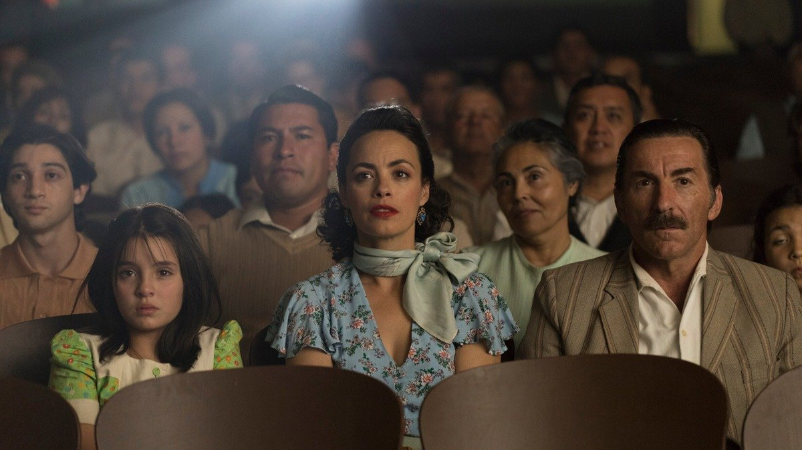

# «Расскажи мне кино» Лоне Шерфиг — еще на экранах. Ламповая экранизация ностальгического романа чилийского писателя Эрнана Ривера Летельера

- **URL:** https://novayagazeta.ru/articles/2025/01/15/rasskazhi-mne-kino-lone-sherfig-eshche-na-ekranakh
- **Дата:** 2025-01-15
- **Автор:** Лариса Малюкова

## «Расскажи мне кино» Лоне Шерфиг — еще на экранах

## Ламповая экранизация ностальгического романа чилийского писателя Эрнана Ривера Летельера

Кадр из фильма «Расскажи мне кино»

Кино про кино нередко сентиментально и слезоточиво, как «Новый кинотеатр Парадизо» Торнаторе. Лоне Шерфиг соединяет романтический выдуманный экранный мир с картинами неприглаженной реальности.

Роман взрослении Марии-Маргариты разворачивается на рубеже 1960–1970-х в сердце чилийской пустыни Атакама, где назло природе вырос маленький шахтерский городок. С кинотеатром и публичным домом — главными развлечениями жителей. Пока работает шахта, в городе теплится жизнь. Но шахта приносит и многие беды. После одной из аварий теряет возможность двигаться отец большой семьи папа Медардо (Антонио де ла Торре). С помощью соседей ему из подручных материалов конструируют инвалидное кресло. В безденежье и разочаровании (никаких компенсаций) кино — последняя отдушина.

Кино самозабвенно и бескорыстно любит вся семья: родители, три сына и дочь Мария-Маргарита (Алондра Валенсуэла — в детстве, Сара Беккер — во взрослом возрасте, обе превосходны) — прилежные зрители. Мама Мария-Магнолия (единственная звезда, Беренис Бежо, не выпячивает себя, точно вписывается в общий испаноязычный актерский ансамбль) еще до прихода кино обожала радиосериалы. Замерев с ножом над разделочной доской на кухне, она готова рыдать, если некий Хуан Пабло все-таки уходит от Эсмеральды, но вдруг передумывает… Детям на ночь она рассказывает не сказки, а события очередной серии.

И если публичный дом — темное и притягательное место греха, то открывшийся кинотеатр — почти храм, и собираясь туда, семья Медардо надевает лучшие воскресные наряды. В кинотеатре экран укрыт занавесом, открытия которого зрители ждут с волнением. Они переживают проблемы киногероев как собственные. Денег на посещение кинотеатра всей семьей больше не хватает. И тогда у Марии-Маргариты обнаруживается редкий дар: пересказывать и разыгрывать голливудские фильмы, которые она видела в местном кинотеатре, перед близкими и соседями. Повествование ведется от лица главной героини. Мария-Маргарита разыгрывает целые спектакли перед публикой с подручными материалами (от мяча до простыней). Она рыдает над умирающим Спартаком, который в последние минуты жизни слышит, что он свободен. Она любит — как Ширли Маклейн и Катрин Денев.

Кадр из фильма «Расскажи мне кино»

Ее глазами мы видим легендарные вестерны. Например, «Человек, который застрелил Либерти Вэланса» с кумиром поколений Джоном Уэйном. Или классическую комедию «Квартира» с Джеком Леманом и Ширли Маклейн. Или приключенческое драмеди «Марселино, хлеб и вино». Мюзикл «Шербурские зонтики».

С какого-то момента соседи так полюбили ее «пересказы», что готовы платить за эти «сеансы связи» с кино, а девочка становится звездой городка. У Марии с экраном свои, интимные отношения. Порой она домысливает, досочиняет фильмы по велению сердца. И в хрестоматийной «Квартире» вместо лифтерши Ширли Маклейн она уже видит свою мать, сбежавшую из дома тоже в поисках мечты. Мария и сама отчасти путается между пространствами экрана и жизни, как Сесилия из «Пурпурной розы Каира» Вуди Аллена: бежит от реальности, прячется в темном кинозале. Пропускает свой шанс обрести семью.

Читайте также

Жил да был черный кот…

«Поток» — латвийская сенсация «Золотого глобуса»

Поддержите нашу работу!

1000 500 300 Нажимая кнопку «Стать соучастником», я принимаю условия и подтверждаю свое гражданство РФ

Если у вас есть вопросы, пишите [email protected] или звоните:+7 (929) 612-03-68

Шерфиг вписывает в этот полуфантастический сюжет социальные проблемы, показывая не только тяжкие условия труда на шахте, но и страну, приближающуюся к краху. И даже провал революции, приход к власти хунты. Но все это — лишь фон. Причем необязательный.

Лучшее в фильме — история про фантазии на тему кино, история страсти и безраздельной любви к кинематографу, ведь синефилия Марии хотя бы на время киносеансов делала ее счастливой.

Камера Даниэля Араньо показывает нам, как оживает пустыня Атакама и как постепенно умирает городок с кинотеатром на главной площади, который тоже пустеет и ветшает.

Кино про наши перевоплощения и сны наяву, про побег из некрасивой реальности в параллельный мир, освещенный лучом кинопроектора.

Лариса Малюкова ведет телеграм-канал о кино и не только. Подписывайтесь тут.

### Этот материал входит в подписки

Смотровая площадкаКино с Ларисой Малюковой

Культурные гидыЧто читать, что смотреть в кино и на сцене, что слушать

### Добавляйте в Конструктор свои источники: сайты, телеграм- и youtube-каналы

Войдите в профиль, чтобы не терять свои подписки на разных устройствах

Поддержите нашу работу!

1000 500 300 Нажимая кнопку «Стать соучастником», я принимаю условия и подтверждаю свое гражданство РФ

Если у вас есть вопросы, пишите [email protected] или звоните:+7 (929) 612-03-68
